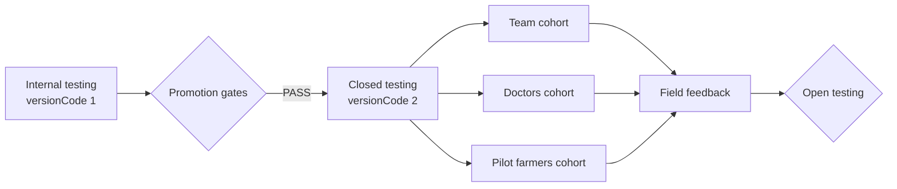

# Closed Test Report — Prani Doctor User App

**Repository:** `pranidoctor_user`  
**Package:** `com.pranidoctor.user.pranidoctor_user`  
**Version:** `1.0.0+2` (closed track build)  
**Report date:** 2026-05-22  
**Track progression:** Internal → **Closed testing**  
**Prior report:** [INTERNAL_TEST_REPORT.md](./INTERNAL_TEST_REPORT.md)  
**Release guide:** [STORE_RELEASE.md](./STORE_RELEASE.md)

---

## Executive summary

| Gate | Result |
|------|--------|
| **Closed release artifacts** | **PASS** — signed `closed-release.apk` + `closed-release.aab` (`versionCode` 2) |
| **Promotion from internal** | **PASS** (engineering) — new build ready; Play promotion pending ops |
| **Static verification** | **PASS** — analyze, unit test, staging API health, signing |
| **Tester cohort plan** | **PASS** — team, doctors, pilot farmers defined below |
| **Device smoke (all cohorts)** | **BLOCKED** — requires Play closed opt-in + field devices |
| **Production API** | **BLOCKED** — `https://api.pranidoctor.com` not resolvable; closed build uses staging LAN |
| **Push delivery** | **BLOCKED** — no `google-services.json`; `ENABLE_PUSH=false` |
| **Crash reporting** | **BLOCKED** — symbols in `build/debug-info-closed/` only |
| **Privacy URL (hosted)** | **FAIL** — `https://pranidoctor.com/privacy` returns 404 |

**Verdict:** **CLOSED_TEST_READY** — upload `release/closed-release.aab` to Play **Closed testing**, onboard three tester lists, and run cohort-specific smoke before open testing.

---

## Track rollout: Internal → Closed



| Stage | Track | Build | versionCode | Tester cap | Status |
|-------|-------|-------|-------------|------------|--------|
| 1 | **Internal** | `release/internal-release.aab` | 1 | ≤100 (email / Google Group) | ✅ Artifacts ready |
| 2 | **Closed** | `release/closed-release.aab` | 2 | Unlimited lists (country/region scoped) | ✅ Artifacts ready |
| 3 | Open | — | TBD | Public opt-in | Not started |

### Promotion gates (internal → closed)

All must be **PASS** before closed rollout goes live to pilot farmers:

| # | Gate | Owner | Result |
|---|------|-------|--------|
| G1 | Internal smoke complete on ≥1 physical device | QA | **BLOCKED** |
| G2 | No P0 crashes in internal session | QA | **BLOCKED** |
| G3 | Signed AAB with incremented `versionCode` | Eng | **PASS** |
| G4 | Store listing minimum fields complete | Product | **BLOCKED** |
| G5 | Privacy policy URL live | Legal/Product | **FAIL** |
| G6 | Staging/production API reachable from tester networks | Ops | **PASS** (staging LAN) |
| G7 | Doctor assignment path verified end-to-end | QA + Ops | **BLOCKED** |

Engineering promotion (**G3**) is complete. Ops/QA gates remain open; closed track can start with **team** cohort while gates G1–G2 complete.

---

## Tester cohorts

### Overview

| Cohort | Purpose | Size (pilot) | Play list name | Access |
|--------|---------|--------------|----------------|--------|
| **Team** | Engineering, product, QA — regression + release validation | 5–15 | `closed-team` | Play closed opt-in link |
| **Doctors** | Assigned veterinarians — verify booking → assign → accept loop from customer app | 3–10 | `closed-doctors` | Play closed opt-in link |
| **Pilot farmers** | Real end users in pilot unions/villages | 20–50 | `closed-pilot-farmers` | Play closed opt-in link (Bengali onboarding) |

### Team (`closed-team`)

| Role | Responsibilities | Smoke focus |
|------|------------------|-------------|
| Engineering | Install, log issues, verify API env | Auth, offline sync, crash-free cold start |
| Product | UX walkthrough, copy, area flows | Profile, doctor discovery, booking |
| QA | Execute full matrix below | All PASS/FAIL recording |

**Onboarding:**

1. Add Google accounts to Play Console → **Closed testing** → list `closed-team`.
2. Share opt-in URL via internal Slack/email.
3. Confirm build shows **1.0.0 (2)** after install.

### Doctors (`closed-doctors`)

| Role | Responsibilities | Smoke focus |
|------|------------------|-------------|
| Field veterinarians | Confirm requests appear in admin/doctor panel after farmer books | Appointment create → assign → status visible in customer inbox |
| Clinic coordinators | Validate area/doctor matching | Doctor list accuracy for pilot areas |

**Onboarding:**

1. Pre-create doctor accounts in admin for pilot areas.
2. Add doctor Gmail addresses to `closed-doctors` list.
3. Pair each doctor with 2–3 pilot farmer testers for live booking tests.
4. Document doctor phone numbers already registered in backend.

**Note:** This is the **customer (farmer) app**. Doctors install it only to validate the booking experience or support paired farmer testing; doctor workflow is primarily admin/doctor web apps.

### Pilot farmers (`closed-pilot-farmers`)

| Role | Responsibilities | Smoke focus |
|------|------------------|-------------|
| Livestock/pet owners | Real-world usage in pilot villages | OTP login, book consultation, offline queue, Bengali UI |
| Field agents | On-site install help | Install from Play link, account creation |

**Onboarding:**

1. Select 1–2 pilot unions (aligned with area hierarchy seed data).
2. Pre-register farmer phones where possible (`POST /api/mobile/auth/register` or admin-created accounts).
3. Add farmer Gmail addresses (or Google accounts created for them) to `closed-pilot-farmers`.
4. Share Bengali quick-start guide: install → login → pick area → book → check inbox.
5. Schedule 48h field window; collect feedback form (see § Feedback).

**Pilot constraints:**

- Staging API: `http://192.168.10.111:3000` — testers must be on same network or use VPN/tunnel until production API is live.
- Push disabled in this build; use in-app inbox polling for status updates.

---

## Release artifacts

| Artifact | Path | versionCode | Signing |
|----------|------|-------------|---------|
| **Closed APK** | `release/closed-release.apk` | 2 | APK Signature Scheme v2 |
| **Closed AAB** | `release/closed-release.aab` | 2 | Upload keystore |
| **Debug symbols** | `build/debug-info-closed/` | — | Upload when crash SDK wired |

### Build command (this run)

```powershell
cd D:\PraniDoctor\pranidoctor_user
$api = "http://192.168.10.111:3000"
flutter build apk --release --build-number=2 `
  --obfuscate --split-debug-info=build/debug-info-closed `
  --dart-define=API_BASE_URL=$api `
  --dart-define=ENABLE_PUSH=false `
  --dart-define=LOG_NETWORK=false `
  --dart-define=PRIVACY_POLICY_URL=https://pranidoctor.com/privacy

flutter build appbundle --release --build-number=2 `
  --obfuscate --split-debug-info=build/debug-info-closed `
  --dart-define=API_BASE_URL=$api `
  --dart-define=ENABLE_PUSH=false `
  --dart-define=LOG_NETWORK=false `
  --dart-define=PRIVACY_POLICY_URL=https://pranidoctor.com/privacy
```

---

## Pre-build verification

| Check | Method | Result |
|-------|--------|--------|
| `flutter analyze` | CLI | **PASS** — 0 errors |
| `flutter test` | CLI | **PASS** — 1/1 |
| Signed closed APK | `apksigner verify` | **PASS** — v2 |
| Signed closed AAB | Gradle `bundleRelease` | **PASS** |
| Staging API | `GET /api/health` | **PASS** — 200 |
| Mobile API | `GET /api/mobile/health` | **PASS** — 200 (prior session) |
| versionCode incremented | `--build-number=2` | **PASS** |

---

## Closed testing matrix

Legend: **PASS** | **FAIL** | **BLOCKED**

### Auth

| # | Case | Team | Doctors | Pilot farmers | Result |
|---|------|------|---------|---------------|--------|
| A1 | Cold start → login | ✓ | ✓ | ✓ | **BLOCKED** |
| A2 | Password login | ✓ | ✓ | ✓ | **BLOCKED** |
| A3 | OTP login | ✓ | — | ✓ | **BLOCKED** |
| A4 | Session restore | ✓ | ✓ | ✓ | **BLOCKED** |
| A5 | Logout | ✓ | ✓ | ✓ | **BLOCKED** |

### Profile

| # | Case | Team | Doctors | Pilot farmers | Result |
|---|------|------|---------|---------------|--------|
| P1 | Load profile | ✓ | ✓ | ✓ | **BLOCKED** |
| P2 | Edit profile (online) | ✓ | — | ✓ | **BLOCKED** |
| P3 | Area/village set correctly | ✓ | ✓ | ✓ | **BLOCKED** |

### Doctor / discovery

| # | Case | Team | Doctors | Pilot farmers | Result |
|---|------|------|---------|---------------|--------|
| D1 | Area picker hierarchy | ✓ | ✓ | ✓ | **BLOCKED** |
| D2 | Doctor list for pilot area | ✓ | ✓ | ✓ | **BLOCKED** |
| D3 | Book consultation | ✓ | ✓ | ✓ | **BLOCKED** |

### Appointment (cross-cohort)

| # | Case | Team | Doctors | Pilot farmers | Result |
|---|------|------|---------|---------------|--------|
| AP1 | Farmer books → doctor sees request (admin) | ✓ | ✓ | ✓ | **BLOCKED** |
| AP2 | Admin assigns doctor → farmer inbox updates | ✓ | ✓ | ✓ | **BLOCKED** |
| AP3 | Status timeline / history | ✓ | — | ✓ | **BLOCKED** |
| AP4 | Cancel appointment | ✓ | — | ✓ | **BLOCKED** |

### Notification

| # | Case | Team | Doctors | Pilot farmers | Result |
|---|------|------|---------|---------------|--------|
| N1 | In-app notification list | ✓ | ✓ | ✓ | **BLOCKED** |
| N2 | Push delivery (`ENABLE_PUSH=true`) | ✓ | ✓ | ✓ | **BLOCKED** — not in this build |

### Offline

| # | Case | Team | Pilot farmers | Result |
|---|------|------|---------------|--------|
| O1 | Airplane mode book → outbox | ✓ | ✓ | **BLOCKED** |
| O2 | Reconnect → sync | ✓ | ✓ | **BLOCKED** |
| O3 | Settings offline panel | ✓ | ✓ | **BLOCKED** |

### Recovery

| # | Case | Team | Result |
|---|------|------|--------|
| R1 | Token refresh on 401 | ✓ | **BLOCKED** |
| R2 | Stale cache fallback | ✓ | **BLOCKED** |
| R3 | Crash reporting | ✓ | **BLOCKED** |

---

## Play Console — closed rollout procedure

### 1. Promote build

1. Open Play Console → **Testing → Closed testing**.
2. Create release → upload `release/closed-release.aab`.
3. Release name: `1.0.0-closed-pilot` (versionCode **2**).
4. Copy release notes (Bengali + English) from § Release notes.
5. **Start rollout to Closed testing** (not production).

### 2. Create tester lists

| List name | Cohort | Suggested emails |
|-----------|--------|------------------|
| `closed-team` | Team | `@pranidoctor.com` / eng Gmail accounts |
| `closed-doctors` | Doctors | Clinic Gmail accounts |
| `closed-pilot-farmers` | Pilot farmers | Field Gmail accounts |

Assign all three lists to the closed track. Roll out to **team first**, then doctors, then pilot farmers after G1–G2 pass.

### 3. Country / region

- Scope closed test to **Bangladesh** (primary market).
- Confirm content rating and data safety forms submitted (required even for closed).

### 4. Staged rollout within closed

| Phase | Cohort | Duration | Go/no-go |
|-------|--------|----------|----------|
| Phase 1 | Team only | 2–3 days | Zero P0 bugs |
| Phase 2 | + Doctors | 3–5 days | Booking loop verified |
| Phase 3 | + Pilot farmers | 7–14 days | Field feedback stable |

---

## Release notes (closed 1.0.0+2)

**English**

> Prani Doctor pilot — book veterinary consultations, track appointments, and use offline mode in low-connectivity areas. This is a closed test build; feedback welcome.

**Bengali (বাংলা)**

> প্রাণি ডাক্তার পাইলট — পশুচিকিৎসকের পরামর্শ বুক করুন, অ্যাপয়েন্টমেন্ট ট্র্যাক করুন, এবং কম নেটওয়ার্ক এলাকায় অফলাইন মোড ব্যবহার করুন। এটি একটি বন্ধ টেস্ট বিল্ড; মতামত জানান।

---

## Feedback collection

| Channel | Owner | Use |
|---------|-------|-----|
| GitHub Issues / internal tracker | Eng | Bugs with steps + device model |
| Google Form (Bengali) | Product | UX + booking success rate |
| Field agent WhatsApp group | Ops | Pilot farmer blockers |

**Required fields per bug:** cohort, Android version, steps, screenshot, API reachable (Y/N).

---

## Infrastructure verification

| Area | Result | Notes |
|------|--------|-------|
| **Signed app bundle** | **PASS** | `release/closed-release.aab` |
| **Track progression** | **PASS** | Internal (v1) → Closed (v2) documented |
| **Team onboarding** | **PASS** (doc) | Play list `closed-team` |
| **Doctors onboarding** | **PASS** (doc) | Play list `closed-doctors` |
| **Pilot farmers onboarding** | **PASS** (doc) | Play list `closed-pilot-farmers` |
| **Production API** | **BLOCKED** | DNS not live |
| **Push delivery** | **BLOCKED** | Rebuild with `ENABLE_PUSH=true` when Firebase ready |
| **Crash reporting** | **BLOCKED** | Wire SDK + upload symbols |
| **Privacy link** | **PASS** (in-app) / **FAIL** (hosted) | 404 on public URL |
| **Offline sync** | **PASS** (code) | Device test pending |
| **Appointment flow** | **PASS** (code) | Cross-cohort test pending |

---

## Blockers before open testing

| Priority | Item | Owner |
|----------|------|-------|
| P0 | Complete closed matrix for all three cohorts | QA |
| P0 | Host privacy policy URL | Legal/Product |
| P0 | Production `API_BASE_URL` live | Ops |
| P1 | Push enabled build for farmer notifications | Ops + Eng |
| P1 | Crash reporting + symbol upload | Eng |
| P2 | Bengali store listing polish | Product |

---

## Related docs

- [INTERNAL_TEST_REPORT.md](./INTERNAL_TEST_REPORT.md) — internal track baseline
- [FINAL_CERTIFICATE.md](./FINAL_CERTIFICATE.md) — sign-off status
- [STORE_RELEASE.md](./STORE_RELEASE.md) — release pipeline

---

*Closed testing rollout prepared. Upload `release/closed-release.aab` and onboard team → doctors → pilot farmers per phased plan.*
