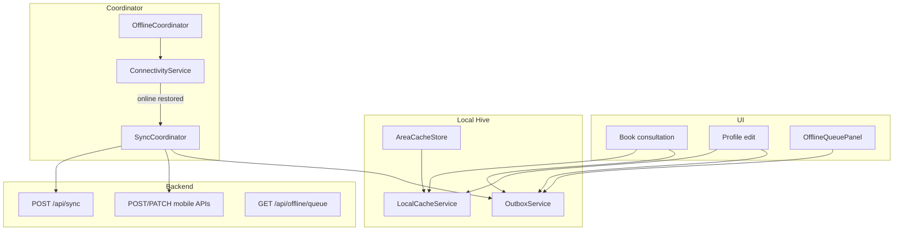

# Offline Architecture Audit — Prani Doctor User App

**Project:** Prani Doctor User App (`pranidoctor_user`)  
**Audited:** 2026-05-22  
**Backend partner:** `pranidoctor-backend` — `src/modules/offline-architecture/`  
**Storage:** Hive via `CacheStore` (not SQLite/Drift/Isar)

---

## Requested concerns

```
Cache → Retry → Sync → Offline queue → Reconnect → Conflict resolution
```

| Concern | Primary mobile files | Backend |
|---------|---------------------|---------|
| Cache | `local_cache_service.dart`, `area_cache_store.dart` | `local-cache.service.ts` (server session cache metadata) |
| Retry | `network_errors.dart`, `outbox_item.dart`, `sync_coordinator.dart` | `retry-engine.ts` |
| Sync | `sync_coordinator.dart`, `offline_repository.dart` | `sync-engine.service.ts`, `/api/sync` |
| Offline queue | `outbox_service.dart`, `offline_queue_panel.dart` | `offline.repository.ts`, `/api/offline/queue` |
| Reconnect | `offline_coordinator.dart`, `connectivity_service.dart` | Connectivity mode in sync body |
| Conflict resolution | `offline_dto.dart` (types only) | `conflict-resolver.ts` |

**Prior doc:** [PHASE_OFFLINE_COMPLETE.md](./PHASE_OFFLINE_COMPLETE.md) (2026-05-22) — foundation marked complete; this audit verifies gaps.

---

## Architecture overview



**Two queues:**

1. **Local outbox** (Hive `_outbox_items`) — drained by `SyncCoordinator._drainLocalOutbox()`.
2. **Server queue** (Postgres via backend) — drained by `POST /api/sync` with `items: []` (pull server pending work).

---

## Per-concern findings

### 1. Cache

| Capability | Status | Details |
|------------|--------|---------|
| Profile read cache | **Implemented** | `ProfileRepository.getMe()` — TTL 24h (`LocalCacheContract.profileTtl`) |
| Appointment list cache | **Implemented** | `ServiceRequestRepository.listRequests()` — stale read on failure |
| Appointment detail cache | **Missing** | `getRequest()` — no cache write/fallback |
| Area hierarchy cache | **Implemented** | `AreaCacheStore` + `AreaRepository` — 7-day TTL, cache-first |
| Auth snapshot cache | **Missing** | Key `auth_snapshot` in contract; never written |
| Case / voice draft cache | **Missing** | Keys + TTL defined; no feature wiring |
| LRU / quota eviction | **Deferred** | `evictLru()` empty; `evictExpired()` no-op (expire-on-read only) |
| Doctors / categories / animals | **Missing** | No offline read fallback |

**Files:**

- `lib/features/offline/data/local_cache_service.dart`
- `lib/core/offline/local_cache_contract.dart`
- `lib/features/area/data/area_cache_store.dart`
- `lib/core/cache/cache_store.dart`, `hive_bootstrap.dart`

---

### 2. Retry

| Layer | Status | Details |
|-------|--------|---------|
| Local outbox backoff | **Implemented** | `offlineRetryDelay()` — 30s base, exponential, cap 1h; `offlineMaxAttempts = 5` |
| Dead letter (local) | **Implemented** | `OutboxItem.isDead` when `attemptCount >= 5`; UI chip “Failed” |
| Server retry API | **Implemented** | `POST /api/sync/retry` via `OfflineRepository.retrySync()`; `SyncCoordinator.retryDead()` |
| Dio request retry | **Partial** | 401 → refresh token → single retry only (`dio_provider.dart`) |
| Per-item retry UI | **Missing** | Only “Retry failed” bulk action |
| Transient detection | **Implemented** | `isTransientNetworkError()` — timeouts, connection errors, 502/503/504 |

**Mismatch:** Local outbox marks dead at 5 attempts but does not remove item — stays in Hive until user clears or manual handling.

---

### 3. Sync

| Capability | Status | Details |
|------------|--------|---------|
| Background interval | **Implemented** | 60s `Timer.periodic` in `SyncCoordinator.initialize()` |
| Startup sync | **Implemented** | `AppStartup` + `OfflineCoordinator` on auth |
| Drain local outbox | **Implemented** | Sequential `listReady(limit: 25)` |
| Server queue pull | **Implemented** | `_syncServerQueue()` — `POST /api/sync` with empty `items` |
| Pause / resume | **Implemented** | `setPaused()` → server `retrySync(pause/resume)` |
| Entity: service request | **Implemented** | Direct `POST /api/mobile/service-requests` from outbox |
| Entity: profile patch | **Implemented** | Direct `PATCH /api/mobile/me` — **not** `/api/sync` PROFILE |
| Entity: offline lead | **Partial** | Coordinator handles `OutboxKind.offlineLead` → `/api/sync`; **nothing enqueues this kind** |
| Entity: auth / area / case / voice | **Missing** | DTOs exist; no mobile producers |
| Idempotency on wire | **Weak** | Local keys generated (`sr-{seq}-{ts}`) but **not sent** as HTTP `Idempotency-Key` header |
| clientVersion / serverVersion | **Missing** | Never set on `SyncItemInput` or outbox payloads |

**Files:**

- `lib/features/offline/data/sync_coordinator.dart`
- `lib/features/offline/data/offline_repository.dart`
- `lib/core/offline/offline_repository_contract.dart`

---

### 4. Offline queue

| Capability | Status | Details |
|------------|--------|---------|
| Local persistence | **Implemented** | `OutboxService` on shared `CacheStore` box |
| Enqueue on write failure | **Implemented** | `createRequest`, `patchMe` when transient error |
| Settings UI (local) | **Implemented** | `OfflineQueuePanel` — list, sync now, retry failed |
| Server queue UI | **Missing** | `getOfflineQueue()` exists; **never called** in presentation layer |
| Combined pending count | **Partial** | `offlineSyncStatusProvider` sums local + `getSyncStatus().pendingCount` |
| Conflict count display | **Missing** | `SyncStatusDto.conflictCount` parsed, not shown |
| Offline lead UX | **Missing** | No screen enqueues `offline_lead` |

**Outbox kinds today:**

| Kind | Enqueued by | Sync target |
|------|-------------|-------------|
| `service_request` | `ServiceRequestRepository._enqueueCreate` | Direct POST |
| `profile_patch` | `ProfileRepository._enqueuePatch` | Direct PATCH |
| `offline_lead` | _none_ | POST `/api/sync` (if ever enqueued) |

---

### 5. Reconnect

| Trigger | Status | Action |
|---------|--------|--------|
| Connectivity offline → online | **Implemented** | `OfflineCoordinator` → `onConnectivityRestored()` |
| Connectivity degraded | **Treated as online** | `isOnlineMode()` includes `degraded` |
| Login / session restore | **Implemented** | `syncNow(background: true)` |
| Manual offline mode | **API only** | `ConnectivityService.setManualOverride()` — **no Settings toggle** |
| App resume / lifecycle | **Missing** | No `WidgetsBindingObserver` resume hook (relies on timer + connectivity) |

**Files:**

- `lib/features/offline/offline_coordinator.dart`
- `lib/features/offline/data/connectivity_service.dart` (`connectivity_plus`)

---

### 6. Conflict resolution

| Capability | Status | Details |
|------------|--------|---------|
| Backend strategies | **Implemented** | `AUTH_SNAPSHOT`/`AREA_DATA` → SERVER_WINS; `PROFILE` → MERGE_REQUIRED; `CASE_DRAFT`/`VOICE_DRAFT`/`OFFLINE_LEAD` → LOCAL_WINS |
| Mobile DTO parsing | **Implemented** | `OfflineSyncItemStatus.conflict`, `SyncItemResultDto.conflict`, `conflictCount` |
| Mobile handling | **Minimal** | `_syncOfflineLeadItem` throws on conflict; no user-facing resolution |
| Version vectors | **Missing** | `clientVersion` / `serverVersion` never sent from app |
| Profile merge UI | **Missing** | Profile bypasses sync engine |
| Server queue conflicts in UI | **Missing** | No list of CONFLICT items from `GET /api/offline/queue` |

**Backend reference:**

- `pranidoctor-backend/src/modules/offline-architecture/conflict/conflict-resolver.ts`
- `sync-engine.service.ts` — marks `CONFLICT`, `SERVER_WINS_CONFLICT`, merge required

---

## Backend API inventory (mobile consumer)

| Method | Path | Used by mobile |
|--------|------|----------------|
| GET | `/api/sync/status` | `offlineSyncStatusProvider` (pending count only) |
| POST | `/api/sync` | `SyncCoordinator` (leads + server drain) |
| POST | `/api/sync/retry` | `retryDead`, `setPaused` |
| GET | `/api/offline/queue` | **Not used in UI** |

Auth: `authMobile` on all sync/offline routes.

---

## Integration map (repositories)

| Repository | Cache fallback | Outbox enqueue | Notes |
|------------|----------------|----------------|-------|
| `ProfileRepository` | getMe | patchMe | Offline snackbar via `offlineQueuedCode` |
| `ServiceRequestRepository` | list only | createRequest | Detail/history/timeline/cancel — online only |
| `AreaRepository` | yes (separate store) | no | Independent of SyncCoordinator |
| `DoctorRepository` | no | no | |
| `NotificationRepository` | no | no | 30s poll only |

---

## Gap matrix

| Concern | Implemented | Gap |
|---------|-------------|-----|
| **Cache** | Profile, list, area | Detail, drafts, discovery data; LRU |
| **Retry** | Local backoff + server retry API | No per-item retry; dead items linger |
| **Sync** | Coordinator, dual queue drain | offline_lead never enqueued; PROFILE not via sync API; no versions |
| **Offline queue** | Local Hive + settings panel | Server queue + conflicts invisible |
| **Reconnect** | Connectivity + login + 60s timer | Manual offline toggle; app resume |
| **Conflict resolution** | Backend + DTO types | No mobile UX; no version headers |

---

## Verdict

**~75% complete** for offline architecture foundation. Core path works: **book offline → outbox → reconnect → sync → inbox refresh**. Remaining work is **visibility** (server queue, conflicts), **completeness** (detail cache, entity types, version vectors), and **UX** (merge/conflict resolution, manual offline).

*Audit complete — see `OFFLINE_COMPLETE.md` for gap-only implementation command.*
