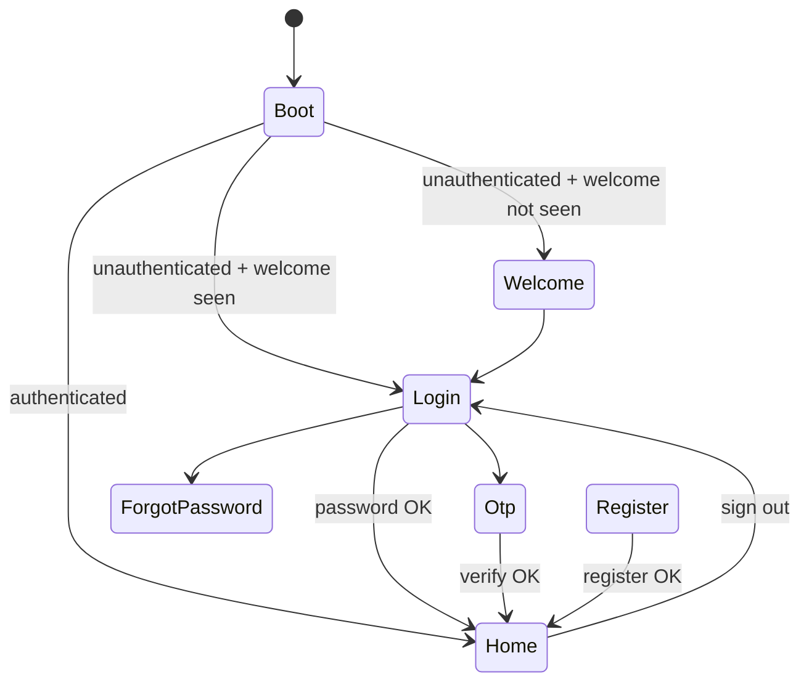

# USER_APP_02 — Auth System Report

**Project:** PraniDoctor User App (`pranidoctor_user`)  
**Phase:** Auth System (Welcome, Login, Register, OTP, Forgot Password)  
**Status:** COMPLETE  
**Date:** 2026-05-22

---

## 1. Pre-implementation analysis

### Existing (PARTIAL)

| Area | Before |
|------|--------|
| Login | Single page with embedded OTP + password tabs |
| Register | Basic form, no push token, no remember-session |
| OTP | Inline on login — no resend timer |
| Welcome | Missing |
| Forgot password | Missing |
| Repository | Concrete class only, no contract |
| Social login | Removed from pubspec; no hook surface |
| Remember session | Implicit token persistence only |
| Duplicate refresh | Already consolidated in USER_APP_01 |

---

## 2. Endpoint mapping

Task spec uses shorthand paths. **Production compat paths** (via `API_BASE_URL`):

| Task API | Production path | Method | Auth | Repository method |
|----------|-----------------|--------|------|-------------------|
| `auth/otp` (request) | `/api/mobile/auth/otp/request` | POST | None | `requestOtp` |
| `auth/otp` (verify) | `/api/mobile/auth/otp/verify` | POST | None | `verifyOtp` |
| `auth/login` | `/api/mobile/auth/login` | POST | None | `loginWithPassword` |
| `auth/register` | `/api/mobile/auth/register` | POST | None | `register` |
| `auth/refresh` | `/api/mobile/auth/refresh` | POST | None (body token) | `refreshSession` |

**Aliases (backend, not used by app):** `/api/mobile/auth/send-otp`, `/verify-otp`.

**Session profile (“me”):** `GET /api/mobile/me` — used post-auth via `navigateAfterAuth`.

### Request bodies (app → backend)

**OTP request:** `{ "phone": "016…" }`

**OTP verify:** `{ "phone", "code", "deviceKey", "platform", "appVersion", "pushToken?" }`

**Login:** `{ "identifier", "password", "deviceKey", "platform", "appVersion", "pushToken?" }`

**Register:** `{ "name", "mobile", "password", "email?" }`

**Refresh:** `{ "refreshToken" }`

### Response envelope

```json
{ "ok": true, "data": { ... } }
{ "ok": false, "error": { "code", "message" } }
```

---

## 3. Implementation summary

### New files

```
lib/features/auth/data/auth_repository_contract.dart
lib/features/auth/data/auth_platform.dart
lib/features/auth/data/auth_preferences.dart
lib/features/auth/data/social_auth_provider.dart
lib/features/auth/presentation/auth_providers.dart
lib/features/auth/presentation/auth_navigation.dart
lib/features/auth/presentation/welcome_page.dart
lib/features/auth/presentation/otp_page.dart
lib/features/auth/presentation/forgot_password_page.dart
lib/features/auth/presentation/widgets/auth_feedback.dart
lib/features/auth/presentation/widgets/social_login_buttons.dart
test/auth/auth_integration_test.dart
```

### Modified files

| File | Change |
|------|--------|
| `auth_repository.dart` | Implements contract; offline OTP cache; auth snapshot; platform detection |
| `auth_dto.dart` | OTP resend cooldown field |
| `login_page.dart` | Password login + OTP route + forgot link + remember session |
| `register_page.dart` | Push token, remember session, social hooks, error banner |
| `app_routes.dart` | `/welcome`, `/otp`, `/forgot-password` |
| `app_router.dart` | Auth route guards; welcome-first for new users |
| `boot_controller.dart` | Respects remember-session preference on cold start |
| `boot_page.dart` | Routes to welcome or login after boot |
| `local_cache_contract.dart` | `auth_otp_pending:` prefix |
| `app_en.arb` | Auth UX strings |

### Screen map

| Screen | Route | Notes |
|--------|-------|-------|
| Welcome | `/welcome` | First launch only; sets `welcomeSeen` |
| Login | `/login` | Password + link to OTP |
| OTP | `/otp` | Dedicated flow with resend countdown |
| Register | `/register` | Full registration |
| Forgot Password | `/forgot-password` | Support-call fallback (no API) |

### Requirements checklist

| # | Requirement | Status |
|---|-------------|--------|
| 1 | Preserve architecture | Riverpod + feature folders unchanged |
| 2 | Existing modules | Reused session, dio, push, profile |
| 3 | Reuse auth components | `AuthLoadingButton`, shared navigation |
| 4 | Production API | `/api/mobile/auth/*` compat paths |
| 5 | Loading / error / empty | All auth screens |
| 6 | Repository abstraction | `AuthRepositoryContract` |
| 7 | Social hooks, remember session, OTP retry, refresh | Implemented |
| 8 | Auth state transitions | Router guards + boot remember check |
| 9 | Remove duplicate auth logic | Single repository + shared refresh |
| 10 | Integration verification | `test/auth/auth_integration_test.dart` |

---

## 4. Feature details

### Remember session

- Checkbox on login, OTP, register (default: on).
- Preference stored in Hive (`auth.rememberSession`).
- When **off**, tokens still work for current session; **next cold start** boot clears session.

### OTP retry

- `OtpFlowNotifier` tracks resend cooldown from `otpTtlSeconds` / default 60s.
- Resend button enabled when countdown reaches 0.
- Pending OTP cached in Hive for offline countdown restore.

### Social login hooks

- `SocialAuthProvider` interface + `StubSocialAuthProvider` (`NOT_IMPLEMENTED`).
- `SocialLoginButtons` widget on login/register — shows “coming soon”.

### Post-auth navigation

- `navigateAfterAuth` loads `/api/mobile/me`.
- If `profileComplete == false` → `/settings/profile`.
- Else → `/home`.

### Refresh handling

- Unchanged from USER_APP_01: `token_refresh.dart` + boot + Dio 401 retry.

---

## 5. Migration notes

```bash
flutter pub get
flutter gen-l10n
flutter test test/auth/auth_integration_test.dart
dart analyze lib
```

### Router behavior

- New users: boot → welcome → login/otp/register.
- Returning unauthenticated: boot → login.
- Authenticated users hitting auth routes → redirected to home.

### Cache keys

| Key | Purpose |
|-----|---------|
| `auth.welcomeSeen` | Skip welcome screen |
| `auth.rememberSession` | Cold-start session restore |
| `auth.lastPhone` | OTP phone prefill |
| `local_cache:auth_otp_pending:{phone}` | OTP TTL / resend state |
| `local_cache:auth_snapshot` | Non-sensitive session metadata |

---

## 6. Unresolved issues

| Issue | Impact | Workaround |
|-------|--------|------------|
| No backend forgot-password API | Reset flow is support-call only | `ForgotPasswordPage` uses app-config support phone |
| Social OAuth not implemented | Buttons show coming soon | `StubSocialAuthProvider` ready for SDK wiring |
| Server logout / token revoke | Local sign-out only | `signOut()` clears secure storage |
| Bengali auth strings | English only | Add `app_bn.arb` in future l10n pass |
| Register endpoint ignores device fields | Push registered post-auth via coordinator | `NotificationCoordinator` on auth state |

---

## 7. Verification

```bash
cd pranidoctor_user
dart analyze lib          # exit 0
flutter test test/auth/auth_integration_test.dart
```

Manual test plan:

1. First install → Welcome → Login.
2. OTP flow → send, wait, resend, verify.
3. Password login with wrong password → error banner.
4. Register → lands on home or profile setup.
5. Uncheck “Stay signed in” → kill app → boot → login (not home).
6. Forgot password → support call or offline message.
7. Social buttons → “coming soon” snackbar.

---

## 8. Auth state transition diagram



No duplicate auth providers introduced. `authRepositoryProvider` typed as `AuthRepositoryContract`.
