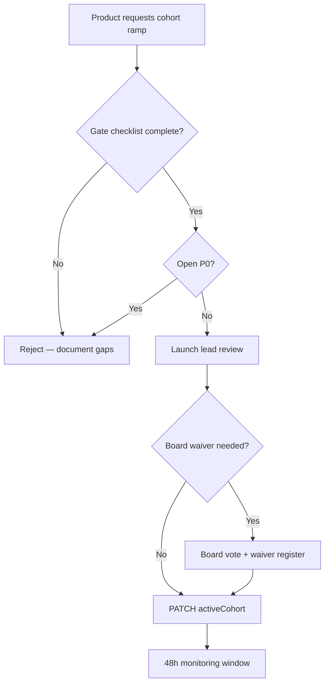

# Launch Governance Assessment — Closed Beta

**Document ID:** `LAUNCH_GOVERNANCE_ASSESSMENT`  
**Assessment date:** 2026-06-01  
**Assessor:** Launch Governance Architect  
**Framework:** [closed-beta-operational-audit-plan.md](../launch/closed-beta-operational-audit-plan.md) Domain D8  
**Scorecard:** [operational-readiness-scorecard.md](./operational-readiness-scorecard.md)

---

## Executive summary

Launch governance **controls are implemented in software** (cohort config, caps, invite gates, admin dashboard, feedback pipeline) but **organizational gates are not yet executed**. No Gate 0/1 checklist sign-offs, waiver register, or board approval exist. **Governance score: 53% (1.6 / 3.0).**

**Governance verdict:** **NOT READY** for C1 admission until Gate 1 checklist signed and P0 remediations owned.

---

## 1. Go / No-Go process

### 1.1 Defined process

| Element | Status | Evidence |
|---------|--------|----------|
| Cohort definitions C0–C4 | ✅ Defined | [closed-beta-launch-plan.md](../launch/closed-beta-launch-plan.md) §B |
| Max cap (~80 users) | ✅ Enforced in config | `DEFAULT_CLOSED_BETA_CONFIG.maxUsers = 80` |
| Gate 0 / 1 / 2 checklists | ✅ Documented | [closed-beta-operational-audit-plan.md](../launch/closed-beta-operational-audit-plan.md) §9 |
| Go/No-Go summary checklist | ✅ Documented | [closed-beta-checklist.md](../launch/closed-beta-checklist.md) §H |
| NO-GO triggers | ✅ Documented | `/ready` down, OTP fail, doctor loop broken, prohibited ETA |
| **Executed Gate 0 review** | ❌ Not done | No signed record |
| **Executed Gate 1 review** | ❌ Not done | All checklist items open |

### 1.2 Verdict matrix (current state)

| Scenario | Policy verdict | Actual readiness |
|----------|----------------|------------------|
| C0 internal (5–10 engineers) | GO WITH CONDITIONS after G0 | **NO GO** — HS-01, HS-03, HS-08 open |
| C1 friendly (≤ 25 users) | GO WITH CONDITIONS after G1 + all P0 | **NO GO** |
| C2 expansion (≤ 50) | Board approval after day-7 | **NO GO** |
| Public production | NO GO | **NO GO** |

---

## 2. Launch ownership

| Role | Responsibility | Assigned? | Evidence |
|------|----------------|-----------|----------|
| Launch lead | Cohort ramp, war-room, on-call coordination | ⚠️ Template | Playbook §5 empty |
| Launch Governance Board | Cohort admission, waivers | ⚠️ Defined in plan | No roster |
| DevOps | Host, deploy, backup, monitoring | ⚠️ By function | REM-P0-01..04 |
| Product | Doctors, support contacts, cohort list | ⚠️ By function | REM-P0-08 |
| Legal | Counsel sign-off, copy incidents | ⚠️ By function | REM-P0-10 |
| AI safety owner | Kill switch, escalation queue | ⚠️ By function | REM-P0-09 |
| QA | E2E smoke, gate tests | ⚠️ By function | REM-P0-06 |

**Gap:** Named individuals not recorded in repo (correct per security policy); **must exist on wiki before C1**.

---

## 3. Approval workflow

### 3.1 Config change authority

| Action | API / surface | Auth | Audit trail |
|--------|---------------|------|-------------|
| Enable closed beta | `PATCH /api/admin/launch/beta-config` | Admin JWT + RBAC | ⚠️ DB setting only |
| Change cohort / caps | Same | Admin | ⚠️ No dedicated change log |
| Tag beta user | `POST …/beta-users/:id/tag` | Admin | Config JSON mutation |
| Tag beta doctor | `POST …/beta-doctors/:id/tag` | Admin | Config JSON mutation |
| AI kill switch | `POST /api/admin/ai-ops/governance` | Admin | `AiGovernanceStateHistory` ✅ |
| Env override | `CLOSED_BETA_ENABLED` | DevOps | Deploy log |

**Recommendation:** Record beta config PATCH events in war-room until dedicated audit log ships (P2).

### 3.2 Cohort ramp approval chain

**Current state:** Step B fails — Gate 0 incomplete.

---

## 4. Change control process

| Control | Status | Notes |
|---------|--------|-------|
| Deploy via CI (GHCR) | ✅ | `deploy-staging.yml`, `deploy-production.yml` |
| Pre-deploy env validation | ✅ | `validate:production-env` |
| Pre-deploy backup hook | ✅ In script | `postgres-backup.sh \|\| true` on remote deploy |
| Rollback tag recorded | ❌ | REM-P0-11 |
| Forward-only migrations | ✅ | Documented in rollback plan |
| Feature flags / beta toggle | ✅ | DB config + env override |
| Pause triggers (§A.6 plan) | ✅ Documented | Not wired to automated alert |

### 4.1 Rollback governance

| Item | Status |
|------|--------|
| Rollback plan documented | ✅ [ROLLBACK_PLAN.md](../launch/ROLLBACK_PLAN.md) |
| SEV-1/2 triggers rollback | ✅ Incident guide + rollback matrix |
| Rollback authority named | ❌ Launch lead slot empty |
| Rollback exercised | ❌ REM-P1-05 |

---

## 5. Waiver governance

| Waiver ID | Purpose | Board approved | In register |
|-----------|---------|:--------------:|:-----------:|
| W-01 | FCM push off | ☐ | ☐ |
| W-02 | Golden test failures | ☐ | ☐ |
| W-03 | Partial BN l10n | ☐ | ☐ |
| W-04 | Phase-0 monitoring only | ☐ | ☐ |
| W-05 | Payment SOP draft | ☐ | ☐ |

**Rule:** No waiver is active until Launch Governance Board records approval in wiki register ([remediation-register.md](./remediation-register.md) §Waivers).

---

## 6. Metrics governance

| Metric | Owner | Review cadence | Tool |
|--------|-------|----------------|------|
| Beta user/doctor caps | Product | Each ramp | `/admin/launch-ops` |
| Consultation completion | Product | Daily during C1 | Beta dashboard |
| Emergency SR count | Product | Daily | Beta dashboard |
| AI sessions / escalations | AI ops | Daily | Dashboard + `/admin/ai-ops` |
| Support SLA | Support lead | Weekly | Ticket export |
| Day-7 stabilization | Launch lead | T+7 | [beta-success-metrics.md](../launch/beta-success-metrics.md) §9 |

**Day-7 review:** Not scheduled (no launch date set).

---

## 7. Sign-off matrix

| Role | Gate 0 | Gate 1 | Date | Decision |
|------|:------:|:------:|------|----------|
| Launch lead | ☐ | ☐ | | |
| Engineering | ☐ | ☐ | | |
| Product | ☐ | ☐ | | |
| Legal | ☐ | ☐ | | |
| DevOps | ☐ | ☐ | | |
| Launch Governance Board | ☐ | ☐ | | |

---

## 8. Governance strengths

1. **Safe defaults** — closed beta disabled; `maxUsers: 80`; invite enforcement opt-in.
2. **Single admin surface** — `/admin/launch-ops` consolidates health, beta KPIs, compliance panel.
3. **Documented cohort ladder** — C0→C4 with explicit gates and pause triggers.
4. **AI governance audit trail** — PostgreSQL history for kill switch (stronger than beta config).
5. **Remediation register** — P0 backlog tracked with owners and exit criteria.

---

## 9. Governance gaps

| ID | Gap | Risk | Remediation |
|----|-----|------|-------------|
| GOV-01 | No signed Gate 0/1 | Uncontrolled admission | Complete checklist §H |
| GOV-02 | Waiver register empty | Silent policy drift | Board approval session |
| GOV-03 | Beta config change log | Forensics gap | War-room logging (P2) |
| GOV-04 | Launch owners unnamed | Escalation delay | Wiki roster REM-P0-07 |
| GOV-05 | Day-7 review not scheduled | Cap creep | Calendar before C1 |

---

## 10. Governance recommendation

**Do not admit C1 external users** until:

1. Gate 1 checklist signed by all roles (§7).
2. All REM-P0-* items closed or board-waived with evidence.
3. Waiver register populated for any P1 exceptions.
4. Re-audit composite score ≥ **70%** with no domain below **50%**.

**Permitted next step:** Schedule Gate 0 dry-run on staging host after REM-P0-01, REM-P0-07 (draft), REM-P0-11.

---

## Related documents

- [closed-beta-operational-audit.md](./closed-beta-operational-audit.md)
- [operational-readiness-scorecard.md](./operational-readiness-scorecard.md)
- [remediation-register.md](./remediation-register.md)
