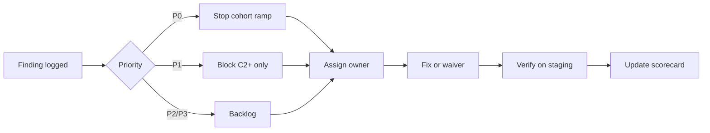

# Remediation Register — Closed Beta Operational Audit

**Document ID:** `REMEDIATION_REGISTER`  
**Audit date:** 2026-06-01  
**Source audit:** [closed-beta-operational-audit.md](./closed-beta-operational-audit.md)  
**Workflow:** [closed-beta-operational-audit-plan.md](../launch/closed-beta-operational-audit-plan.md) §8

**Status legend:** `OPEN` · `IN PROGRESS` · `CLOSED` · `WAIVED`

---

## Summary

| Priority | Open | Blocks C0 | Blocks C1 | Blocks C2+ |
|----------|-----:|:---------:|:---------:|:----------:|
| **P0** | 11 | 5 | 11 | 11 |
| **P1** | 6 | 0 | 0 | 6 |
| **P2** | 4 | 0 | 0 | 0 |
| **P3** | 3 | 0 | 0 | 0 |

---

## P0 — Critical (blocks all real-user beta)

| ID | Finding | Domain | Owner | ETA | Status | Exit criteria | Re-test |
|----|---------|--------|-------|-----|--------|---------------|---------|
| REM-P0-01 | No live VPS/TLS for API + admin | D1 | DevOps | T+3d | OPEN | `curl -fsS https://api.<host>/ready` → 200 | Gate G0-01 |
| REM-P0-02 | DB backup cron not installed on host | D1 | DevOps | T+1d | OPEN | Backup file < 24h old | G1-02 |
| REM-P0-03 | External uptime monitors not configured | D2 | Ops | T+0.5d | OPEN | UptimeRobot/Better Stack green | G1-03 |
| REM-P0-04 | Sentry/webhook not receiving on host | D2 | Ops | T+0.5d | OPEN | Test exception visible | G1-03 |
| REM-P0-05 | Live SMS OTP not verified (3+ carriers) | D1 | Backend/Ops | T+2d | OPEN | Provider delivery log | G1-04 |
| REM-P0-06 | E2E smoke not executed (2 devices) | D1 | QA | T+1d | OPEN | Signed smoke report | G1-05 |
| REM-P0-07 | On-call roster not published | D7 | Launch lead | T+0.5d | OPEN | Wiki link (outside git) | G0-07 |
| REM-P0-08 | 3–5 pilot doctors not onboarded on host | D3 | Product | T+1d | OPEN | Admin list + beta tags | G1-06 |
| REM-P0-09 | AI kill switch M1/M3 drill not executed | D6 | AI owner | T+1d | OPEN | Drill log in war-room | G0-05 |
| REM-P0-10 | Legal counsel sign-off + live privacy URL | D5 | Legal | T+3d | OPEN | External record + HTTP 200 | G1-09 |
| REM-P0-11 | Rollback image tag not recorded pre-traffic | D7 | DevOps | T+0.5d | OPEN | Tag in deploy notes | G0-06 |

---

## P1 — High (blocks C2+ expansion)

| ID | Finding | Domain | Owner | ETA | Status | Exit criteria | Waiver |
|----|---------|--------|-------|-----|--------|---------------|--------|
| REM-P1-01 | Prometheus/Grafana not deployed on VPS | D2 | DevOps | T+7d | OPEN | Scraping live OR W-04 signed | W-04 |
| REM-P1-02 | Play closed testing track + AAB not uploaded | D8 | Mobile | T+2d | OPEN | Play link + policy URLs | — |
| REM-P1-03 | Payment manual reconciliation SOP unpublished | D4 | Product | T+1d | OPEN | Ops wiki PDF | W-05 |
| REM-P1-04 | Kill switch M4–M10 drills incomplete | D6 | AI owner | T+7d | OPEN | Drill matrix complete | — |
| REM-P1-05 | Rollback drill not executed on staging | D7 | DevOps | T+3d | OPEN | Staging rollback log | G2-06 |
| REM-P1-06 | Backend AI usage verify test failures (5) | D1 | Backend | T+7d | OPEN | Full suite green | — |

---

## P2 — Medium

| ID | Finding | Domain | Owner | ETA | Status | Exit criteria |
|----|---------|--------|-------|-----|--------|---------------|
| REM-P2-01 | Flutter golden test failures (10) | D4 | Mobile | T+14d | OPEN | QA visual waiver or fix | W-02 |
| REM-P2-02 | BN localization partial (~430 keys) | D5 | Mobile | T+14d | OPEN | Critical paths BN reviewed | W-03 |
| REM-P2-03 | Admin support desk UI absent | D4 | Web | T+30d | OPEN | Ticket triage in admin |
| REM-P2-04 | Restore drill not executed | D1 | DevOps | T+14d | OPEN | Non-prod restore log |

---

## P3 — Low

| ID | Finding | Domain | Owner | ETA | Status | Exit criteria |
|----|---------|--------|-------|-----|--------|---------------|
| REM-P3-01 | API contract §12 aspirational ETA examples | D5 | Docs | Backlog | OPEN | Contract updated |
| REM-P3-02 | Post-mortem template not in repo | D7 | Launch lead | T+14d | OPEN | Template in wiki |
| REM-P3-03 | Dependency CVE scan waiver undocumented | D6 | Security | T+14d | OPEN | Waiver in register |

---

## Approved waivers (pending board sign-off)

| Waiver | Item | Max cohort | Expiry | Status |
|--------|------|------------|--------|--------|
| W-01 | FCM push disabled | C2 | Day 30 | **PENDING** |
| W-02 | Flutter golden failures | C1 | QA sign-off | **PENDING** |
| W-03 | Partial BN localization | C2 | Critical EN OK | **PENDING** |
| W-04 | Prometheus deferred (Phase-0 uptime only) | C1 | Day 14 | **PENDING** |
| W-05 | Payment SOP draft | C1 | Before C2 | **PENDING** |

---

## Remediation workflow



---

## Ticket template

```markdown
## [P0] REM-P0-01 — Live VPS/TLS
- **Audit ID:** OP-AUD-2026-06-01-001
- **Domain:** D1
- **Finding:** No public HTTPS host verified
- **Evidence gap:** No curl output for api.<host>/ready
- **Owner:** DevOps
- **ETA:** YYYY-MM-DD
- **Exit criteria:** HTTPS /ready 200 + admin BFF ready
- **Re-test:** Gate G0-01
- **Waiver:** none
```

---

## Closure log

| ID | Closed date | Evidence | Verified by |
|----|-------------|----------|-------------|
| — | — | — | — |

---

*Update this register when P0 items close. Re-run operational audit when all P0 reach CLOSED or WAIVED with board approval.*
