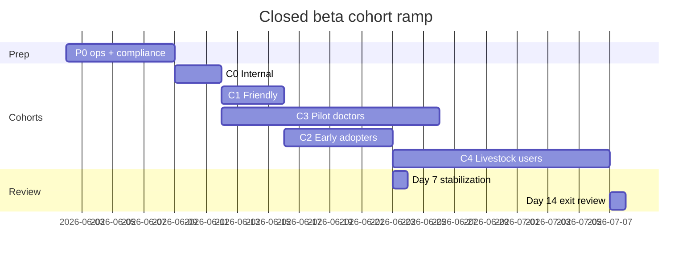

# Closed Beta Launch Plan — Prani Doctor

**Document ID:** `CLOSED_BETA_LAUNCH_PLAN`  
**Version:** 1.0  
**Date:** 2026-05-30  
**Mode:** Plan only — no implementation in this document  
**Scope:** Controlled closed beta introducing real farmers, real doctors, and limited pilot geography (Bangladesh, Android-first)  
**Repositories:** `pranidoctor_user` · `pranidoctor-backend` · `pranidoctor-web`

**Related documents**

| Area | Document |
|------|----------|
| Production readiness score | [PRODUCTION_READINESS_REPORT.md](./PRODUCTION_READINESS_REPORT.md) |
| Go-live checklist | [GO_LIVE_CHECKLIST.md](./GO_LIVE_CHECKLIST.md) |
| Launch day runbook | [LAUNCH_DAY_RUNBOOK.md](./LAUNCH_DAY_RUNBOOK.md) |
| Rollback | [ROLLBACK_PLAN.md](./ROLLBACK_PLAN.md) |
| Known limitations | [KNOWN_LIMITATIONS.md](./KNOWN_LIMITATIONS.md) |
| Monitoring ops plan | [production-monitoring-plan.md](./production-monitoring-plan.md) |
| Legal-safe messaging | [legal-safe-messaging-plan.md](./legal-safe-messaging-plan.md) |
| AI compliance framework | [ai-compliance-plan.md](../../pranidoctor-web/docs/launch/ai-compliance-plan.md) |
| AI kill switch verification | [ai-kill-switch-verification-report.md](../../pranidoctor-web/docs/launch/ai-kill-switch-verification-report.md) |
| Beta feedback pipeline | [beta-support-playbook.md](./beta-support-playbook.md) |
| Implementation (2026-05-30) | [closed-beta-checklist.md](./closed-beta-checklist.md) · [beta-operations-runbook.md](./beta-operations-runbook.md) · [beta-success-metrics.md](./beta-success-metrics.md) |

---

## Launch readiness assessment

### Executive verdict

| Metric | Value |
|--------|------:|
| **Composite launch score** | **78 / 100** |
| **Closed beta readiness** | **CONDITIONAL GO** |
| **Public production readiness** | **NOT READY** |
| **Recommended path** | Staging-hosted closed beta after P0 blockers closed (estimated **3–7 days** ops + **7-day** burn-in) |

Prani Doctor is **feature-complete for a controlled pilot**: farmer mobile app, doctor web workflow, admin operations, livestock/feed ecosystem, offline outbox, AI assistance with governance, and analytics. **Engineering readiness is strong.** **Operational perimeter gaps** — live VPS/TLS, backup cron, external monitoring, live SMS, and executed E2E smoke — are the primary gates between “ready to code” and “ready for real users.”

### Domain readiness summary

| Domain | Score | Closed beta verdict | Primary gap |
|--------|------:|---------------------|-------------|
| Flutter app | 74 | Conditional | FCM absent; 11 test failures (goldens); ~430 BN keys English |
| Backend API | 83 | Ready | Live host not proven; SMS not verified |
| Admin / doctor web | 85 | Ready | Doctor E2E on staging not executed |
| Database | 73 | Conditional | Prod snapshot migrate not run; restore drill missing |
| Infrastructure | 55 | **Blocker** | No live VPS/TLS/deploy E2E |
| Security | 79 | Conditional | No AV scan; secrets file-only; WAF absent |
| Monitoring | 63 | **Blocker** | Instrumentation shipped; ops wiring incomplete |
| Legal / compliance | 48–72 | **Blocker (P0 copy)** | ETA conflict; AI triage U1 gaps; counsel sign-off pending |
| AI compliance | ~72 | Conditional | P0 surfaces (triage, voice, knowledge); kill switch drills open |
| Emergency workflow | 71 | Conditional | Code paths exist; AI emergency U1 not wired on all surfaces |
| Doctor onboarding | 58 | Conditional | Admin CRUD ready; no published SOP |
| Support | 60 | Conditional | In-app tickets exist; SLA/channel undefined |
| Rollback | 75 | Ready (documented) | Not exercised on live host |
| Beta feedback | 45 | **Gap** | No formal intake taxonomy or triage SLA |

### What changed since Phase 7 (2026-05-29)

Improvements documented in May 2026 plans (not yet fully ops-validated):

- Production monitoring instrumentation (metrics, health probes, webhook alerts v2, AI usage metrics)
- AI governance kill switch with PostgreSQL persistence (12/12 unit tests pass)
- Legal-safe messaging plan and compliance CMS tracks (emergency, vet, AI, escalation)
- Backend monitoring docs, Prometheus alert rules, Grafana dashboard JSON
- Admin BFF API guard (Phase 7 P1-02) and rate limits on AI/search/export

**Still open:** ops deployment of the above on a live staging host, manual staging drills (M1–M10 kill switch, restore drill, E2E smoke), and P0 legal/compliance copy changes.

---

## Remaining blockers

### P0 — Must close before closed beta launch

| ID | Blocker | Owner | ETA | Exit evidence |
|----|---------|-------|-----|---------------|
| CB-P0-01 | Staging/production VPS with TLS and public DNS (`api.*`, `admin.*`) | DevOps | 2–3 days | `curl https://api.<host>/ready` → 200 |
| CB-P0-02 | DB backup cron installed + first backup file verified | DevOps | 1 day | Cron log + file on disk |
| CB-P0-03 | Deploy workflow executed with `DEPLOY_*` secrets; rollback tag recorded | DevOps | 1 day | GHCR image tag + `/ready` gate pass |
| CB-P0-04 | `OTP_MODE=live` + Bangladesh SMS tested on 3+ real numbers | Backend/Ops | 1–2 days | OTP delivery log |
| CB-P0-05 | Play Console **closed testing** track: AAB uploaded, policy URLs live | Mobile/Product | 2 days | Play link + privacy URL 200 |
| CB-P0-06 | E2E smoke: OTP → animal → service request → admin assign → doctor complete | QA | 1 day | Signed smoke report (2 devices) |
| CB-P0-07 | External uptime monitors on `/ready` + BFF ready + SSL | Ops | 0.5 day | UptimeRobot/Better Stack green |
| CB-P0-08 | `MONITORING_ALERT_WEBHOOK_URL` + Sentry DSN live; test exception received | All | 0.5 day | Screenshot in war-room |
| CB-P0-09 | On-call roster (primary + backup) documented outside git | Launch lead | 0.5 day | Wiki link |
| CB-P0-10 | Legal-safe messaging P0: remove `homeCare*Eta` / instant care SLA copy | Mobile/Legal | 1–2 days | QA screenshots EN+BN |
| CB-P0-11 | AI compliance P0: U1 on AI triage/chat emergency; voice consent middleware | Mobile/Backend | 1–2 days | QA matrix §ai-compliance G.1 |
| CB-P0-12 | Payment manual reconciliation SOP published | Product/Ops | 0.5 day | Ops wiki PDF |
| CB-P0-13 | Pilot geography seeded; 3–5 verified doctors onboarded | Product | 1 day | Admin doctor list |
| CB-P0-14 | AI governance migrations applied; kill switch M1/M3/M4 staging drill | Backend/Ops | 1 day | Drill log |

### P1 — Accept with written waiver for closed beta only

| ID | Item | Waiver condition |
|----|------|------------------|
| CB-P1-01 | FCM push disabled (`ENABLE_PUSH=false`) | Document in tester comms; in-app notifications only |
| CB-P1-02 | 11 Flutter golden test failures | QA visual sign-off on auth/home/service request |
| CB-P1-03 | ~430 Bengali keys still English | Critical flows BN-complete; defer secondary screens |
| CB-P1-04 | No virus scan on uploads | Pilot size cap; manual admin review of flagged uploads |
| CB-P1-05 | Manual doctor assignment (no auto-routing) | Ops trained; admin on-call during beta hours |
| CB-P1-06 | No real-time doctor monitoring grid | WhatsApp group for pilot doctors |
| CB-P1-07 | Prometheus/Grafana not deployed | Phase 0 monitoring only (uptime + webhook + Sentry) |
| CB-P1-08 | Kill switch M5–M10 drills incomplete | Complete within launch week |
| CB-P1-09 | Migrate dry-run on production DB snapshot | Run before scaling beyond 50 users |

### P2 — Post-beta (first 30 days)

| ID | Item |
|----|------|
| CB-P2-01 | Firebase + FCM or permanent push-off product decision |
| CB-P2-02 | Payment gateway or permanent manual-process approval |
| CB-P2-03 | Prometheus + Grafana + Alertmanager on VPS |
| CB-P2-04 | Log aggregation (Loki) or daily log review SOP |
| CB-P2-05 | Admin support ticket desk linked to OPS-SUP alerts |
| CB-P2-06 | Doctor self-service onboarding portal |
| CB-P2-07 | iOS scaffold / TestFlight |
| CB-P2-08 | Restore drill quarterly log |
| CB-P2-09 | Public production Play track |

---

## A. Launch scope

### A.1 Closed beta objectives

1. **Validate core marketplace loop** — farmer discovers service → creates request → admin assigns → doctor accepts/completes → farmer sees outcome.
2. **Prove operational survivability** — monitoring, on-call, incident response, and rollback work on real infrastructure with real traffic.
3. **Exercise compliance surfaces** — emergency limitation, vet disclaimer, AI disclaimer/consent, and legal-safe messaging under real user behavior.
4. **Collect structured feedback** — crashes, UX friction, doctor workflow gaps, and AI misuse reports before public launch.
5. **Constrain blast radius** — single pilot geography, capped cohort sizes, manual payments, Android-only, no national marketing.

### A.2 In scope

| Surface | Scope |
|---------|-------|
| Farmer app | Android closed testing track; staging/production API; pilot areas only |
| Doctor web | `/doctor` panel; manually onboarded pilot doctors |
| Admin | Assignment, doctor verify, analytics, launch-ops, AI governance |
| Livestock | Animals, feed entries, inventory (as configured in pilot) |
| AI | Chat, triage, symptom checker, smart recommendations (with compliance gates) |
| Emergency | Manual emergency service requests + limitation banners (not dispatch) |
| Payments | Manual reconciliation only — no in-app gateway |
| Support | In-app support tickets + defined escalation channel |

### A.3 Out of scope

- iOS App Store
- Public Play production track / paid user acquisition
- In-app payment (bKash/Nagad/card)
- Enterprise panel marketing launch
- Automated smart routing / assignment rules
- Real-time admin doctor status grid
- National-scale AI technician marketplace
- 24/7 guaranteed emergency response SLA

### A.4 Success criteria (closed beta)

| # | Criterion | Target | Measurement window |
|---|-----------|--------|-------------------|
| SC-01 | Core loop completion rate | ≥ 60% of submitted requests reach `COMPLETED` | Days 1–14 |
| SC-02 | OTP success rate | ≥ 95% on live SMS | Launch week |
| SC-03 | API availability (synthetic `/ready`) | ≥ 99.5% | Launch week |
| SC-04 | Mobile crash-free sessions | ≥ 99.0% | 7-day rolling |
| SC-05 | Doctor accept rate (assigned requests) | ≥ 70% within 4 hours | Days 1–14 |
| SC-06 | Zero SEV-1 unresolved > 2 hours | 100% | Launch week |
| SC-07 | Compliance P0 checklist | 100% pass | Pre-launch gate |
| SC-08 | Pilot doctor retention | ≥ 80% active at day 14 | Day 14 |
| SC-09 | Actionable beta feedback items triaged | 100% within 72h | Ongoing |
| SC-10 | AI escalation backlog reviewed | 100% CRITICAL within 30 min | Launch week |

### A.5 Exit criteria (graduate to open beta / production prep)

Closed beta **graduates** when **all** of the following hold for **7 consecutive days**:

1. All P0 blockers closed; P1 waivers documented with expiry dates.
2. SC-01 through SC-06 met or exceeded with documented remediation for misses.
3. No open SEV-1/SEV-2 without post-mortem.
4. Restore drill executed once on staging (logged).
5. Product + legal sign-off on messaging/compliance QA matrix.
6. Leadership approves expanded cohort or public track scope.

### A.6 Rollback criteria (pause or revert beta)

Execute pause (halt new tester invites + Play rollout) or full rollback when **any**:

| Trigger | Threshold | Action |
|---------|-----------|--------|
| API 5xx rate | > 1% for 15 min sustained | Investigate; rollback image if not recovered in 15 min |
| `/ready` failure | Non-200 > 5 min | Page on-call; rollback if not recovered in 15 min |
| Mobile crash rate | > 2% sessions / 10 min | Halt Play rollout; hotfix or prior AAB |
| OTP failure rate | > 10% attempts | Pause new users; fix SMS provider |
| Auth compromise suspected | Any confirmed leak | Rotate JWT; flush Redis; force re-login |
| Data corruption confirmed | Any | Stop writes; restore from backup per [ROLLBACK_PLAN.md](./ROLLBACK_PLAN.md) |
| AI safety incident | Harmful guidance confirmed + reproducible | Kill switch LLM; incident review before re-enable |
| Legal/compliance breach | Prohibited ETA or diagnosis copy live | Hotfix copy; pause marketing |
| Doctor workflow broken | Cannot assign/accept/complete | NO-GO; rollback web/API as needed |

---

## B. Beta cohorts

Cohorts roll out in **sequence**. Do not skip gates. Maximum **~80 total users** until day 7 stabilization review passes.

### B.1 Cohort definitions

| Cohort | Size | Entry gate | Purpose |
|--------|-----:|------------|---------|
| **C0 — Internal testers** | 5–10 | CB-P0-01..08 on staging | Break-glass validation; engineering + product |
| **C1 — Friendly users** | 10–15 | C0 smoke pass + CB-P0-10..11 | Trusted farmers; high-touch support |
| **C2 — Early adopters** | 20–30 | C1 stable 48h; crash-free ≥ 99% | Broader farmer UX signal |
| **C3 — Pilot doctors** | 3–5 | C0 doctor web smoke | Real clinical workflow |
| **C4 — Pilot livestock users** | 15–25 | C2 stable; feed/inventory in scope | Livestock + feed ecosystem validation |

### B.2 Cohort details

#### C0 — Internal testers

- **Who:** Engineering, product, QA, ops; company-affiliated farmers if available.
- **Access:** Play internal testing link or sideload APK; staging API URL.
- **Expectations:** Report all bugs in war-room; tolerate rough edges.
- **Duration:** 2–3 days minimum before C1.

#### C1 — Friendly users

- **Who:** Known farmers in pilot geography (1–2 upazilas); Bengali-primary; Android devices.
- **Access:** Play closed testing; WhatsApp support group.
- **Expectations:** Signed beta agreement (informal); manual payment instructions; no SLA promises.
- **Support:** Named product contact; 4-hour response target business hours.

#### C2 — Early adopters

- **Who:** Referrals from C1; local ag co-op contacts; limited social invite (no paid ads).
- **Access:** Play closed testing list (email collection).
- **Expectations:** In-app support ticket as primary channel.
- **Support:** 24-hour response target; escalate SEV issues to on-call.

#### C3 — Pilot doctors

- **Who:** 3–5 licensed veterinarians pre-verified in admin; familiar with web login.
- **Access:** `https://admin.<host>/doctor` (or dedicated doctor hostname).
- **Onboarding:** Manual credential issuance; 30-min onboarding call; WhatsApp ops group.
- **Expectations:** Accept/complete requests within agreed pilot hours; manual billing fields.
- **KPI:** Accept rate, time-to-accept, completion quality.

#### C4 — Pilot livestock users

- **Who:** Subset of C2 with active cattle/goat/buffalo operations.
- **Focus:** Animal profiles, feed catalog, inventory, offline sync, AI recommendations.
- **Expectations:** Feed disclaimers understood; no payment for feed features in beta unless scoped.

### B.3 Cohort ramp timeline

---

## C. Operational readiness

### C.1 Monitoring

| Layer | Status | Closed beta requirement |
|-------|--------|-------------------------|
| Health probes (`/live`, `/ready`, `/health/*`) | Shipped | External 60s checks on API + BFF |
| Prometheus `/metrics` | Shipped | Optional P1; token set on host |
| Structured JSON logs | Shipped | Docker logs + daily review (P1: Loki) |
| Sentry (api, web, mobile) | Hooks shipped | DSN live; test exception pre-launch |
| Webhook alerts v2 | Shipped | `MONITORING_ALERT_WEBHOOK_URL` set |
| Firebase Crashlytics | Composite reporter | Configure or webhook-only path |
| Admin launch-ops UI | Shipped | T-1h manual probe matrix |
| AI `/health/ai` + governance | Shipped | Review during launch week |
| Grafana dashboards | JSON in repo | P1 — import post-launch week |

**Reference:** [production-monitoring-plan.md](./production-monitoring-plan.md) Phase 0 checklist (P0-1 through P0-10).

### C.2 Alerting

Minimum alert set before T-0:

| ID | Alert | Source | Severity |
|----|-------|--------|----------|
| ALT-DOWN-02 | API `/ready` down | UptimeRobot | SEV-1 |
| ALT-DOWN-04 | BFF `/api/admin/health/ready` down | UptimeRobot | SEV-1 |
| ALT-SEC-07 | SSL cert < 7 days | UptimeRobot | SEV-1 |
| ALT-ERR-02 | Uncaught process error | Webhook | SEV-1 |
| ALT-DB-04 | Backup cron failed | Cron notify | SEV-2 |
| ALT-DB-05 | Backup stale > 26h | File age check | SEV-2 |
| ALT-ERR-05 | Sentry new prod issue | Sentry | SEV-2 |
| OPS-REQ-* | Pending request backlog | Escalation monitor | SEV-2/3 |
| OPS-ESC-* | AI escalation backlog | Escalation monitor | SEV-2 |

### C.3 Support

| Element | Status | Closed beta standard |
|---------|--------|----------------------|
| In-app support tickets | Shipped (`/api/mobile/support/tickets`) | Primary farmer channel |
| Help content API | Shipped | Link from app settings |
| Public support email/phone | **Not in repo** | Define in ops wiki before C1 |
| SLA | **Undefined** | C1: 4h BH; C2: 24h; emergency: immediate phone escalation |
| Admin support desk UI | **Not built** | SQL/manual triage; OPS-SUP alerts to Slack |
| WhatsApp pilot groups | Ops-owned | C1 farmers + C3 doctors separate groups |
| BN support templates | **Gap** | Prepare 5 macros: OTP fail, request pending, payment, crash, AI concern |

### C.4 Escalation

| Path | Trigger | Route |
|------|---------|-------|
| Technical SEV-1/2 | Monitoring alert | On-call → launch lead → rollback authority |
| AI safety | Harmful output / emergency symptom | Kill switch → AI safety owner → legal if media risk |
| Clinical urgency | User reports animal crisis | Script: contact local vet; platform does not dispatch |
| Doctor no-response | OPS-REQ SLA breach | Admin manual assign + phone doctor |
| Payment dispute | Manual reconciliation | Product + admin billing status update |
| Legal/compliance | Prohibited copy reported | Hotfix + pause cohort expansion |

**Reference:** [incident-response-guide.md](../incident-response-guide.md), [ai-emergency-runbook.md](../../pranidoctor-backend/docs/operations/ai-emergency-runbook.md)

### C.5 Incident management

| Phase | Owner | SLA |
|-------|-------|-----|
| Detect | Monitoring / user report | — |
| Acknowledge SEV-1 | On-call | ≤ 15 min |
| Acknowledge SEV-2 | On-call | ≤ 1 hour |
| Mitigate | On-call + DevOps | Rollback ≤ 15 min if deploy-related |
| Communicate | Launch lead | Internal ≤ 30 min; users if outage > 15 min |
| Post-mortem | Incident lead | ≤ 72 hours |

**War-room:** Slack/WhatsApp channel — fill before launch (not in git).  
**Status page:** Manual updates until Statuspage configured ([KNOWN_LIMITATIONS.md](./KNOWN_LIMITATIONS.md) L-42).

---

## D. Risk assessment

### D.1 P0 — Critical (launch blockers or immediate reputational harm)

| ID | Risk | Likelihood | Impact | Mitigation |
|----|------|------------|--------|------------|
| R-P0-01 | No live TLS/host — users cannot authenticate | High | Critical | CB-P0-01 |
| R-P0-02 | Data loss — no backup cron | Medium | Critical | CB-P0-02 |
| R-P0-03 | OTP fails on real carriers | Medium | Critical | CB-P0-04; OTP dev mode guard |
| R-P0-04 | Misleading ETA copy on instant care | Certain | Critical | CB-P0-10; legal sign-off |
| R-P0-05 | AI emergency without U1 banner | Medium | Critical | CB-P0-11 |
| R-P0-06 | Outage undetected | High | Critical | CB-P0-07, CB-P0-08 |
| R-P0-07 | E2E doctor loop broken on staging | Medium | Critical | CB-P0-06 |
| R-P0-08 | Unauthenticated admin API access | Low | Critical | BFF guard verified; T-1h curl test |

### D.2 P1 — High

| ID | Risk | Likelihood | Impact | Mitigation |
|----|------|------------|--------|------------|
| R-P1-01 | No push — missed doctor alerts | High | High | In-app + SMS for SR lifecycle; doctor WhatsApp |
| R-P1-02 | Manual assign bottleneck | High | High | Admin on-call; pilot hours |
| R-P1-03 | Mobile crash on schema drift | Medium | High | Crash webhook; staged rollout |
| R-P1-04 | AI harmful guidance | Low | High | Kill switch; safety audit; escalation queue |
| R-P1-05 | Payment confusion (manual) | High | Medium | CB-P0-12 SOP; in-app copy |
| R-P1-06 | Kill switch replica lag (≤45s) | Medium | Medium | M4 drill; env break-glass |
| R-P1-07 | Redis down → 503 on rate limit | Low | High | Redis monitor; fix before traffic |
| R-P1-08 | Upload malware | Low | High | MIME validation; pilot size cap; P2 AV |

### D.3 P2 — Medium

| ID | Risk | Likelihood | Impact | Mitigation |
|----|------|------------|--------|------------|
| R-P2-01 | Mixed BN/EN UI | High | Medium | Prioritize critical flow copy |
| R-P2-02 | Offline sync conflicts | Medium | Medium | QA matrix; support macros |
| R-P2-03 | Analytics load on primary DB | Low | Medium | Pilot traffic low; defer snapshots |
| R-P2-04 | Single VPS — no HA | Medium | Medium | Document RTO; rollback plan |
| R-P2-05 | Doctor churn | Medium | Medium | High-touch onboarding |
| R-P2-06 | Beta feedback overload | Medium | Low | Triage taxonomy §G |

### D.4 P3 — Low

| ID | Risk | Likelihood | Impact | Mitigation |
|----|------|------------|--------|------------|
| R-P3-01 | Golden test CI noise | High | Low | Waive with QA sign-off |
| R-P3-02 | No certificate pinning | Medium | Low | Pilot threat model |
| R-P3-03 | Hive cache growth | Low | Low | Support FAQ |
| R-P3-04 | PDF analytics export missing | Certain | Low | CSV sufficient for beta |

---

## E. Go/No-Go checklist

Complete **48 hours before T-0**. Launch lead records GO / NO-GO / GO-with-waivers.

### E.1 Infrastructure

| # | Item | Required | Status |
|---|------|----------|--------|
| I-01 | VPS provisioned; nginx TLS valid | Yes | ☐ |
| I-02 | `docker compose` prod stack running | Yes | ☐ |
| I-03 | DB backup cron + file < 24h old | Yes | ☐ |
| I-04 | Redis + Postgres + MinIO healthy | Yes | ☐ |
| I-05 | Rollback image tags documented | Yes | ☐ |
| I-06 | DNS `api.*` and `admin.*` resolve | Yes | ☐ |

### E.2 Application

| # | Item | Required | Status |
|---|------|----------|--------|
| A-01 | Backend tests green (237+) | Yes | ☐ |
| A-02 | Web tests green (95+) | Yes | ☐ |
| A-03 | Flutter tests: 0 blocking failures or waiver | Yes | ☐ |
| A-04 | E2E smoke 2.1–2.8 pass ([LAUNCH_DAY_RUNBOOK](./LAUNCH_DAY_RUNBOOK.md)) | Yes | ☐ |
| A-05 | Pilot geography + doctors seeded | Yes | ☐ |
| A-06 | `OTP_MODE=live` confirmed on API host | Yes | ☐ |
| A-07 | Mobile AAB on Play closed track | Yes | ☐ |
| A-08 | AI governance migrations applied | Yes | ☐ |

### E.3 Security

| # | Item | Required | Status |
|---|------|----------|--------|
| S-01 | JWT secrets rotated from placeholders | Yes | ☐ |
| S-02 | Admin API unauthenticated → 401/403 | Yes | ☐ |
| S-03 | `validate:production-env` pass on hosts | Yes | ☐ |
| S-04 | Rate limits active (Redis up) | Yes | ☐ |
| S-05 | CORS restricted to app/admin origins | Yes | ☐ |

### E.4 Compliance

| # | Item | Required | Status |
|---|------|----------|--------|
| C-01 | Privacy + terms URLs HTTP 200 | Yes | ☐ |
| C-02 | Legal-safe messaging P0 complete | Yes | ☐ |
| C-03 | AI compliance P0 matrix pass | Yes | ☐ |
| C-04 | Emergency limitation banners on emergency paths | Yes | ☐ |
| C-05 | Counsel sign-off filed (external) | Yes | ☐ |
| C-06 | Play data safety form accurate | Yes | ☐ |

### E.5 Operations

| # | Item | Required | Status |
|---|------|----------|--------|
| O-01 | Uptime monitors green 24h on staging | Yes | ☐ |
| O-02 | Sentry + webhook test alert received | Yes | ☐ |
| O-03 | On-call roster published | Yes | ☐ |
| O-04 | Rollback plan shared to war-room | Yes | ☐ |
| O-05 | Launch day runbook roles filled | Yes | ☐ |
| O-06 | Kill switch M1/M3/M4 drill log | Yes | ☐ |

### E.6 Support

| # | Item | Required | Status |
|---|------|----------|--------|
| U-01 | Support email/phone published | Yes | ☐ |
| U-02 | Payment reconciliation SOP live | Yes | ☐ |
| U-03 | Doctor onboarding SOP live | Yes | ☐ |
| U-04 | Beta feedback form/channel defined | Yes | ☐ |
| U-05 | WhatsApp groups created (farmers + doctors) | Yes | ☐ |

### E.7 Go/No-Go decision rules

**GO (closed beta minimum)**

- All **Yes** items in E.1–E.6 checked **OR** explicit waiver with launch lead + product signature.
- T-1 hour checks in [LAUNCH_DAY_RUNBOOK.md](./LAUNCH_DAY_RUNBOOK.md) pass.
- No open P0 risk without compensating control.

**NO-GO**

- `/ready` failing.
- OTP live SMS failing on 2+ carriers.
- Admin cannot assign doctor.
- Unauthenticated admin API returns 200.
- Prohibited ETA copy still visible on instant care.

**GO with waivers**

- Document waiver ID, owner, expiry (max 14 days), compensating control.
- Store outside git (ops wiki / signed PDF).

---

## F. Launch timeline

### F.1 T-14 days — Foundation

| # | Task | Owner |
|---|------|-------|
| 1 | Provision staging VPS; begin TLS | DevOps |
| 2 | Copy `.env.staging.example` → production-shaped `.env` | DevOps |
| 3 | Product sign-off: closed beta scope + cohort plan | Product |
| 4 | Legal review: messaging replacement table ([legal-safe-messaging-plan](./legal-safe-messaging-plan.md) §4.2) | Legal |
| 5 | Create Sentry projects (api, web, mobile) | Ops |
| 6 | Draft doctor onboarding SOP + payment SOP | Product |
| 7 | Define beta feedback taxonomy (§G) | Product |
| 8 | Recruit C3 pilot doctor candidates | Product |
| 9 | Apply AI governance migrations on staging | Backend |
| 10 | Run backend + web + flutter test suites; record baseline | QA |

### F.2 T-7 days — Hardening

| # | Task | Owner |
|---|------|-------|
| 1 | Complete TLS; deploy staging stack via CI or manual cutover | DevOps |
| 2 | `ALLOW_PRODUCTION_MIGRATE=true npm run db:migrate:deploy` | Backend |
| 3 | Install backup cron; verify first backup | DevOps |
| 4 | Configure uptime monitors + alert webhook | Ops |
| 5 | Set `OTP_MODE=live`; test 3 SMS numbers | Backend |
| 6 | Upload AAB to Play internal → promote to closed when ready | Mobile |
| 7 | Point mobile build to staging `API_BASE_URL` (HTTPS) | Mobile |
| 8 | Execute P0 legal/compliance copy changes | Mobile/Backend |
| 9 | Seed pilot geography + onboard 3–5 doctors in admin | Product |
| 10 | Kill switch drill M1/M3 on staging | Backend/Ops |
| 11 | Configure Crashlytics or crash webhook on release build | Mobile |

### F.3 T-3 days — Verification

| # | Task | Owner |
|---|------|-------|
| 1 | Full E2E smoke on 2 Android devices | QA |
| 2 | Doctor web workflow smoke (accept/complete/prescription) | QA |
| 3 | Offline outbox test (airplane mode → sync) | QA |
| 4 | AI compliance QA matrix (EN + BN) | QA/Legal |
| 5 | Instant care visual QA — no ETA strings | QA |
| 6 | Sentry test exception on all three runtimes | All |
| 7 | Complete Go/No-Go checklist §E | Launch lead |
| 8 | C0 internal tester invites sent | Product |
| 9 | Freeze `main`/`staging` — hotfix only | Launch lead |
| 10 | Record rollback image tags | DevOps |

### F.4 T-1 day — Launch prep

| # | Task | Owner |
|---|------|-------|
| 1 | Run T-1 hour probe matrix ([LAUNCH_DAY_RUNBOOK](./LAUNCH_DAY_RUNBOOK.md)) | Ops |
| 2 | Verify backup from previous night | DevOps |
| 3 | Go/no-go meeting: launch lead + DevOps + Product + Legal | Launch lead |
| 4 | Brief C3 pilot doctors (login URL, support channel) | Product |
| 5 | Print/share rollback plan to war-room | Launch lead |
| 6 | Confirm on-call reachable | Launch lead |
| 7 | Prepare stakeholder comms templates (BN + EN) | Product |

### F.5 Launch day (T-0)

Execute [LAUNCH_DAY_RUNBOOK.md](./LAUNCH_DAY_RUNBOOK.md) in order:

1. **09:00 local (suggested)** — Verify nginx/cert; enable traffic.
2. **T+0–15 min** — C0 smoke on production/staging host.
3. **T+15 min–2 hr** — Monitoring watch (5xx, `/ready`, crashes, OTP).
4. **T+1 hr** — Internal + doctor + tester comms.
5. **T+0** — Open C1 friendly users if C0 pass.

**Launch lead authority:** pause cohort ramp or rollback per §A.6.

### F.6 Post-launch

| When | Tasks |
|------|-------|
| **T+24 hours** | Review Sentry/crash volume; admin analytics (registrations, requests); triage support tickets; backup log check |
| **T+3 days** | Open C2 early adopters if metrics green; doctor accept rate review |
| **T+7 days** | Stabilization review; re-run [GO_LIVE_CHECKLIST.md](./GO_LIVE_CHECKLIST.md); update [PRODUCTION_READINESS_REPORT.md](./PRODUCTION_READINESS_REPORT.md); decide C4 ramp |
| **T+14 days** | Exit criteria review §A.5; post-mortem any SEV-1/2; plan open beta or production prep |

---

## G. Metrics

### G.1 Product activation & engagement

| Metric | Definition | Target (closed beta) | Source |
|--------|------------|----------------------|--------|
| **Activation rate** | Users completing profile + 1 animal profile within 72h of OTP | ≥ 70% | Admin analytics / farmers |
| **Registration completion** | OTP verify → home screen | ≥ 90% | Mobile analytics + admin |
| **First request rate** | Activated users submitting ≥ 1 service request within 14d | ≥ 50% | Admin service requests |
| **D7 retention** | Users opening app on day 7 after first open | ≥ 40% | Crashlytics / admin sessions |
| **D14 retention** | Same at day 14 | ≥ 30% | Admin analytics |

### G.2 Doctor & consultation metrics

| Metric | Definition | Target | Source |
|--------|------------|--------|--------|
| **Doctor response rate** | Assigned requests accepted within 4h | ≥ 70% | Admin analytics / doctors |
| **Time to accept (p50)** | Assign → accept | < 2h (pilot hours) | Admin |
| **Consultation completion rate** | Accepted → completed | ≥ 75% | Admin service requests |
| **Rejection rate** | Rejected / assigned | < 15% | Admin |
| **Doctor active days** | Pilot doctors logging in ≥ 4 days / 14 | ≥ 80% of cohort | Admin audit |

### G.3 Emergency workflow metrics

| Metric | Definition | Target | Source |
|--------|------------|--------|--------|
| **Emergency workflow success rate** | Emergency SR reaching assigned + accepted | ≥ 60% | Admin (manual process) |
| **Emergency limitation acceptance** | First emergency book with recorded U2 consent | 100% | `LegalConsentEvent` |
| **AI emergency U1 render rate** | API `emergency: true` → client audit | 100% | Compliance QA + logs |
| **AI escalation review SLA** | CRITICAL escalations reviewed within 30 min | 100% | Admin AI ops |
| **False urgency reports** | User tickets alleging wrong AI urgency | Track; no target | Support |

*Note:* “Success” means **workflow completed**, not guaranteed clinical outcome. Never report arrival-time SLA publicly.

### G.4 Reliability & quality

| Metric | Definition | Target | Source |
|--------|------------|--------|--------|
| **Crash rate** | Crashes / sessions | < 1% (≥ 99% crash-free) | Crashlytics / Sentry |
| **API 5xx rate** | 5xx / total requests | < 0.5% | Prometheus / logs |
| **API availability** | Synthetic `/ready` uptime | ≥ 99.5% | UptimeRobot |
| **OTP success rate** | Successful verify / request | ≥ 95% | Backend logs |
| **Offline sync success** | Outbox items synced without error | ≥ 95% | Mobile logs / support |

### G.5 AI usage metrics

| Metric | Definition | Target | Source |
|--------|------------|--------|--------|
| **AI adoption rate** | MAU using ≥ 1 AI feature | Track baseline | `AiUsageRecord` / admin |
| **AI chat sessions / user** | Weekly avg | Track | Admin AI ops |
| **AI fallback rate** | Rules-only / total LLM attempts | < 20% unless kill switch | `ai_fallbacks_total` |
| **AI cost per DAU** | USD rollup / daily active | Budget cap TBD | Admin AI ops |
| **Consent acceptance rate** | Users with current `aiAcceptedVersion` | ≥ 99% | `LegalConsentEvent` |
| **Kill switch activations** | Count + duration | 0 unplanned | Governance history |
| **Policy refusal rate** | Guardrail blocks / chat requests | Track | `AiSafetyAuditLog` |

### G.6 Beta feedback metrics

| Metric | Definition | Target | Source |
|--------|------------|--------|--------|
| **Feedback submission rate** | Tickets or form submissions / WAU | Track | Support tickets |
| **Triage SLA** | Feedback categorized within 72h | 100% | Product tracker |
| **P0 bug count open** | Launch-blocking defects | 0 at day 7 | Issue tracker |
| **NPS (optional)** | Post-consultation micro-survey | Track | In-app (if enabled) |

### G.7 Beta feedback readiness

**Current gap:** No unified intake pipeline in repo. Required before C1:

| Element | Action | Owner |
|---------|--------|-------|
| **Intake channels** | In-app ticket (primary) + Google Form backup + WhatsApp for C1 | Product |
| **Taxonomy** | Tag: `crash`, `otp`, `booking`, `doctor`, `payment`, `ai-safety`, `copy/legal`, `livestock`, `other` | Product |
| **Severity** | P0 user blocked / P1 major / P2 minor / P3 cosmetic | Product |
| **Triage owner** | Named product owner daily review | Product |
| **Engineering handoff** | P0/P1 → GitHub issue within 24h | Engineering lead |
| **Doctor feedback** | Weekly 15-min call with C3 cohort | Product |
| **Weekly beta report** | Metrics §G.1–G.6 + top 10 issues | Launch lead |

---

## Launch checklist (condensed)

Use this as the single-page tracker; detail in §E and linked runbooks.

### Pre-launch (all must pass)

- [ ] Staging/production VPS + TLS live
- [ ] Backup cron + first backup verified
- [ ] Deploy executed; rollback tag saved
- [ ] Live SMS OTP on 3+ numbers
- [ ] Play closed testing track + privacy URL 200
- [ ] E2E smoke pass (2 devices)
- [ ] Uptime + webhook + Sentry configured and tested
- [ ] On-call roster published
- [ ] Legal-safe messaging P0 merged
- [ ] AI compliance P0 complete
- [ ] Doctor + payment SOPs published
- [ ] 3–5 doctors onboarded; pilot geography seeded
- [ ] Kill switch M1/M3/M4 drill complete
- [ ] Go/No-Go meeting → **GO** recorded

### Launch day

- [ ] T-1 hour probes green
- [ ] C0 smoke complete
- [ ] 2-hour monitoring watch without rollback trigger
- [ ] Stakeholder comms sent

### Post-launch (day 7)

- [ ] Metrics reviewed against §G targets
- [ ] All beta feedback triaged
- [ ] GO_LIVE_CHECKLIST re-run
- [ ] PRODUCTION_READINESS_REPORT status updated
- [ ] Exit/continue decision documented

---

## Document control

| Version | Date | Summary |
|---------|------|---------|
| 1.0 | 2026-05-30 | Initial closed beta launch plan |

**Next review:** After P0 ops completion or first SEV-1, whichever comes first.

**Official status at authoring:** **CONDITIONAL GO** for closed beta — **NOT READY** for public production.

---

*This document is plan-only. Implementation and ops execution are tracked via CB-P0/CB-P1 IDs, [GO_LIVE_CHECKLIST.md](./GO_LIVE_CHECKLIST.md), and [LAUNCH_DAY_RUNBOOK.md](./LAUNCH_DAY_RUNBOOK.md). Do not expand cohorts beyond §B limits without launch lead approval.*
