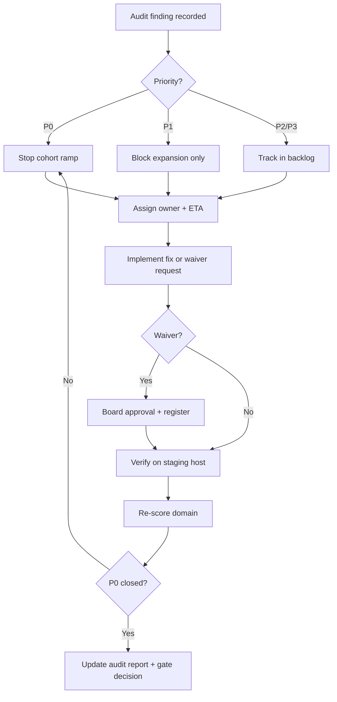

# Closed Beta Operational Readiness Audit Plan — Prani Doctor

**Document ID:** `CLOSED_BETA_OPERATIONAL_AUDIT_PLAN`  
**Version:** 1.0  
**Date:** 2026-06-01  
**Mode:** Plan only — no implementation  
**Audience:** Launch Governance Board, Principal Operations Auditor, Launch Lead, DevOps, Product, Legal, Support  
**Purpose:** Define the **audit framework, scoring model, evidence bar, checklist, and remediation workflow** required before admitting **real farmers and real doctors** to controlled closed beta.

**Related documents**

| Area | Document |
|------|----------|
| Closed beta launch plan | [closed-beta-launch-plan.md](./closed-beta-launch-plan.md) |
| Engineering readiness report | [closed-beta-readiness-report.md](./closed-beta-readiness-report.md) |
| Go/no-go checklist | [closed-beta-checklist.md](./closed-beta-checklist.md) |
| Beta operations runbook | [beta-operations-runbook.md](./beta-operations-runbook.md) |
| Beta support playbook | [beta-support-playbook.md](./beta-support-playbook.md) |
| Launch day runbook | [LAUNCH_DAY_RUNBOOK.md](./LAUNCH_DAY_RUNBOOK.md) |
| Rollback plan | [ROLLBACK_PLAN.md](./ROLLBACK_PLAN.md) |
| Incident response | [incident-response-guide.md](../incident-response-guide.md) |
| Monitoring ops | [production-monitoring-plan.md](./production-monitoring-plan.md) · [monitoring-guide.md](../monitoring-guide.md) |
| Monitoring verification | [production-monitoring-verification-report.md](./production-monitoring-verification-report.md) |
| Legal / compliance | [legal-compliance-plan.md](./legal-compliance-plan.md) · [legal-safe-messaging-plan.md](./legal-safe-messaging-plan.md) |
| AI governance | [ai-compliance-plan.md](../../pranidoctor-web/docs/launch/ai-compliance-plan.md) |
| AI kill switch verification | [ai-kill-switch-verification-report.md](../../pranidoctor-web/docs/launch/ai-kill-switch-verification-report.md) |
| AI emergency ops | [ai-emergency-runbook.md](../../pranidoctor-backend/docs/operations/ai-emergency-runbook.md) |
| Monitoring runbook | [runbook.md](../../pranidoctor-backend/docs/monitoring/runbook.md) |
| Emergency escalation policy | [emergency-escalation-policy.md](../../pranidoctor-web/docs/compliance/emergency-escalation-policy.md) |
| Migration validation | [database-migration-validation-plan.md](./database-migration-validation-plan.md) |
| Beta success metrics | [beta-success-metrics.md](./beta-success-metrics.md) |

---

## 1. Executive summary

This plan establishes **launch governance** for Prani Doctor closed beta. It is distinct from engineering readiness verification ([closed-beta-readiness-report.md](./closed-beta-readiness-report.md)): this audit evaluates whether the **organization can operate, support, escalate, recover, and govern** a live pilot — not whether features compile.

**Assumed current state (2026-06-01 baseline):**

| Layer | Status |
|-------|--------|
| Core platform | Substantially complete |
| Closed Beta Preparation Framework | Implemented (config, access, dashboard, feedback) |
| P0 engineering blockers | Mostly addressed in code (legal ETA, AI compliance shell, governance) |
| P0 ops blockers | Expected available but **must be evidenced on live host** |
| Prior readiness verdict | **GO WITH CONDITIONS** at ≤ 25 users ([readiness report](./closed-beta-readiness-report.md)) |

**Audit output artifacts (executed 2026-06-01):**

| Deliverable | Path |
|-------------|------|
| Operational audit report | [docs/audit/closed-beta-operational-audit.md](../audit/closed-beta-operational-audit.md) |
| Readiness scorecard | [docs/audit/operational-readiness-scorecard.md](../audit/operational-readiness-scorecard.md) |
| Governance assessment | [docs/audit/launch-governance-assessment.md](../audit/launch-governance-assessment.md) |
| Remediation register | [docs/audit/remediation-register.md](../audit/remediation-register.md) |

**Audit cadence:**

| Gate | When | Verdict authority |
|------|------|-------------------|
| **Gate 0 — Internal (C0)** | Before engineers-only smoke on staging host | Launch lead + engineering |
| **Gate 1 — Friendly beta (C1)** | Before first external farmer | Launch Governance Board |
| **Gate 2 — Cohort expansion (C2+)** | Before each cohort ramp | Launch lead + product |
| **Gate 3 — Post day-7 review** | Before > 50 users | Full board |

---

## 2. Audit framework

### 2.1 Scope

**In scope**

- Platform operations on target host (staging → production-shaped)
- Monitoring, alerting, and observability **as deployed**
- Doctor onboarding, availability, assignment, and communication
- Farmer/doctor support channels, SLAs, and triage
- Compliance operations (legal CMS, consent, AI disclosures, emergency limitations)
- Security operations (access, secrets, kill switch, incident containment)
- Incident management and escalation paths
- Launch governance (cohort controls, caps, waivers, sign-off)
- Business continuity (backups, RPO/RTO, single-VPS limitations)
- Rollback and recovery drills

**Out of scope (this audit cycle)**

- Public Play production track
- Multi-region HA architecture
- Automated doctor routing / payments automation
- Full FCM push program (waivable for beta with documented waiver)

### 2.2 Audit roles

| Role | Responsibility |
|------|----------------|
| **Principal Operations Auditor** | Owns audit execution, scoring, report |
| **Launch Governance Architect** | Verifies cohort controls, waivers, sign-off matrix |
| **Production Readiness Director** | Final GO / GO WITH CONDITIONS / NO GO recommendation |
| **Domain owners** | Supply evidence per §6; remediate per §8 |
| **Launch Governance Board** | Approves cohort admission and waivers |

### 2.3 Audit method

For each domain (§3):

1. **Document review** — confirm artifact exists, version, owner, last review date  
2. **Control test** — execute scripted check on **live staging host** (not localhost-only)  
3. **Interview** — 15–30 min with domain owner where evidence is procedural  
4. **Score** — apply 0–3 rubric (§5) with cited evidence  
5. **Record** — pass/fail per checklist item (§7); open remediation ticket if fail  

**Evidence rule:** *If it is not logged, screenshot, or timestamped on the target host, it did not happen.*

---

## 3. Audit domains (A)

Eight domains map to the ten analysis areas in the launch objective.

| Domain | ID | Covers objective areas | Primary owner |
|--------|-----|------------------------|---------------|
| **Platform Operations** | D1 | Operational readiness, business continuity (infra slice) | DevOps |
| **Monitoring & Alerting** | D2 | Monitoring readiness | DevOps / SRE |
| **Doctor Operations** | D3 | Doctor operations readiness | Product / clinical ops |
| **Support Operations** | D4 | Support readiness | Product support |
| **Compliance Operations** | D5 | Compliance readiness | Legal / compliance |
| **Security Operations** | D6 | Incident containment, access | Security / backend |
| **Incident Management** | D7 | Incident response, escalation, rollback | Launch lead |
| **Launch Governance** | D8 | Launch governance, cohort admission | Launch Governance Board |

### D1 — Platform Operations

**Objective:** Confirm the pilot host is stable, deployable, and recoverable within documented limits.

| Control area | Key questions |
|--------------|---------------|
| Host & TLS | Is `api.*` / `admin.*` reachable with valid TLS? |
| Deploy pipeline | Was last deploy automated with recorded image tag? |
| Environment | Does `validate:production-env` pass on host? |
| Database | Are migrations applied; is connection pool healthy? |
| Closed beta env | Are `CLOSED_BETA_*` vars documented and intentional? |
| Capacity | Is single-VPS limitation acknowledged in [KNOWN_LIMITATIONS.md](./KNOWN_LIMITATIONS.md)? |
| SMS / OTP | Is `OTP_MODE=live` verified on 3+ Bangladesh numbers? |
| E2E smoke | Was farmer → doctor loop executed on 2 physical devices? |

**Reference runbooks:** [LAUNCH_DAY_RUNBOOK.md](./LAUNCH_DAY_RUNBOOK.md) · [beta-operations-runbook.md](./beta-operations-runbook.md) §2–3

---

### D2 — Monitoring & Alerting

**Objective:** Confirm failures are **detected**, **alerted**, and **actionable** within SEV targets.

| Control area | Key questions |
|--------------|---------------|
| Health probes | Do `/live`, `/ready`, `/health/*` respond correctly under load? |
| External uptime | Are uptime monitors on API + BFF green with alert routing? |
| Error ingest | Do Sentry and/or webhook receive test exceptions from host? |
| Metrics | Is Prometheus scraping (or Phase-0 minimum met per plan §7.2)? |
| Beta dashboard | Does `/admin/launch-ops` show live KPIs? |
| Alert runbooks | Does on-call know which runbook for `ApiDown`, `DatabaseDown`, `QueueJobFailures`? |
| AI health | Does `/health/ai` reflect governance hydration? |

**Reference:** [production-monitoring-plan.md](./production-monitoring-plan.md) · [runbook.md](../../pranidoctor-backend/docs/monitoring/runbook.md) · [deploy/monitoring/](../../pranidoctor-backend/deploy/monitoring/)

---

### D3 — Doctor Operations

**Objective:** Confirm pilot doctors can participate safely and predictably.

| Control area | Key questions |
|--------------|---------------|
| Onboarding | Are 3–5 verified doctors created, areas set, credentials delivered? |
| Beta tagging | Are doctors tagged via `POST …/beta-doctors/:id/tag`? |
| Availability | Are `acceptsEmergency` and service categories correct per pilot scope? |
| Web panel | Can doctor login, accept, reject, complete on staging host? |
| Assignment | Is manual admin assign documented and staffed during pilot hours? |
| Communication | Is doctor WhatsApp ops group active with escalation owner? |
| No-show / backlog | Is pending SR > 15 min escalation defined? |

**Reference:** [beta-operations-runbook.md](./beta-operations-runbook.md) §4 · [beta-support-playbook.md](./beta-support-playbook.md) §4

---

### D4 — Support Operations

**Objective:** Confirm farmers and doctors receive timely, legally safe support.

| Control area | Key questions |
|--------------|---------------|
| Channels | Are support phone/WhatsApp populated in app config + beta config? |
| Feedback pipeline | Does `POST /api/mobile/feedback/beta` create `[Beta Feedback]` tickets? |
| Triage taxonomy | Is playbook §2 agreed; 72h triage SLA assigned? |
| Macros | Are EN/BN OTP and emergency macros available to support staff? |
| Prohibited language | Is team trained on no-ETA / no-dispatch language? |
| P0 routing | Are `crash`, `otp`, `ai-safety`, `copy/legal` routes to on-call defined? |
| Staffing | Is support coverage defined for C1 pilot hours? |

**Reference:** [beta-support-playbook.md](./beta-support-playbook.md)

---

### D5 — Compliance Operations

**Objective:** Confirm legal, AI, and emergency obligations are operable in production CMS — not just in code.

| Control area | Key questions |
|--------------|---------------|
| Legal pages | Do `/privacy`, `/terms`, `/refund`, `/legal/disclaimer` return 200 on public host? |
| Counsel sign-off | Is external legal approval recorded for beta cohort? |
| Consent tracking | Are AI consent events logged; middleware enforced on AI + voice? |
| AI disclosures | Are T1/T2/T3 and E2 CMS entries published and visible in app? |
| Emergency limitation | Is U1/U2 copy correct EN+BN on Instant Care and AI emergency paths? |
| Messaging governance | Does Launch Ops compliance panel show no P0 validator failures? |
| Play Data Safety | Is Play Console data safety form complete (if Play distribution)? |
| Data retention | Is retention policy published and aligned with ops? |

**Reference:** [legal-compliance-plan.md](./legal-compliance-plan.md) · [legal-safe-messaging-verification-report.md](./legal-safe-messaging-verification-report.md) · [emergency-escalation-policy.md](../../pranidoctor-web/docs/compliance/emergency-escalation-policy.md)

---

### D6 — Security Operations

**Objective:** Confirm security controls support incident containment during beta.

| Control area | Key questions |
|--------------|---------------|
| Secrets | Are production secrets off-repo; rotation path documented? |
| Admin access | Is admin auth + RBAC enforced; break-glass documented? |
| Rate limits | Do AI/search/export rate limits fail closed when Redis down? |
| Beta access gate | Do invite list and user cap return correct errors? |
| AI kill switch | Can global LLM disable within 5 min via admin governance panel? |
| Auth compromise | Is JWT rotation procedure in [incident-response-guide.md](../incident-response-guide.md) understood? |
| Dependency CVE | Is there a waiver or scan record for beta? |

**Reference:** [ai-kill-switch-verification-report.md](../../pranidoctor-web/docs/launch/ai-kill-switch-verification-report.md) · [ai-emergency-runbook.md](../../pranidoctor-backend/docs/operations/ai-emergency-runbook.md)

---

### D7 — Incident Management

**Objective:** Confirm the organization can detect, escalate, resolve, and learn from incidents.

| Control area | Key questions |
|--------------|---------------|
| Severity model | Is SEV-1/2/3 defined with response times? |
| On-call | Is primary + backup roster published (wiki, outside git)? |
| War room | Is channel + incident lead assignment procedure known? |
| Escalation tree | Who is paged for API down vs AI safety vs legal copy? |
| Communication | Is user-facing outage template ready (> 15 min)? |
| Post-mortem | Is 72h blameless post-mortem template assigned? |
| Rollback trigger | Is SEV-1/2 → rollback decision documented? |
| AI emergency | Is ai-emergency runbook linked and owner assigned? |

**Reference:** [incident-response-guide.md](../incident-response-guide.md) · [ROLLBACK_PLAN.md](./ROLLBACK_PLAN.md) · [beta-operations-runbook.md](./beta-operations-runbook.md) §6

---

### D8 — Launch Governance

**Objective:** Confirm cohort admission, caps, waivers, and sign-off are controlled — not ad hoc.

| Control area | Key questions |
|--------------|---------------|
| Cohort plan | Are C0–C4 definitions and max ~80 cap enforced in config? |
| Admission gate | Is Gate 0/1/2 checklist signed before each ramp? |
| Waiver register | Are P1 waivers (FCM, goldens, BN partial) documented with expiry? |
| Config authority | Who may PATCH `launch.closedBeta.config`? |
| Rollback criteria | Are plan §A.6 pause triggers wired to governance review? |
| Metrics review | Is day-7 beta metrics review scheduled? |
| Sign-off matrix | Are engineering, product, legal, DevOps signatures collected? |
| Audit trail | Are config changes and cohort ramps logged? |

**Reference:** [closed-beta-launch-plan.md](./closed-beta-launch-plan.md) · [closed-beta-checklist.md](./closed-beta-checklist.md) · [beta-success-metrics.md](./beta-success-metrics.md)

---

## 4. Operational controls inventory (B)

Review and score each artifact. Mark **Location**, **Owner**, **Last reviewed**, **Score (0–3)**.

### 4.1 Runbooks

| ID | Artifact | Location | Used for |
|----|----------|----------|----------|
| RB-01 | Launch day runbook | [LAUNCH_DAY_RUNBOOK.md](./LAUNCH_DAY_RUNBOOK.md) | T-24h → T+24h launch sequence |
| RB-02 | Beta operations runbook | [beta-operations-runbook.md](./beta-operations-runbook.md) | Daily beta ops, cohort ramp, AI controls |
| RB-03 | Monitoring runbook | [pranidoctor-backend/docs/monitoring/runbook.md](../../pranidoctor-backend/docs/monitoring/runbook.md) | ApiDown, DB, Redis, queue, AI alerts |
| RB-04 | AI emergency runbook | [pranidoctor-backend/docs/operations/ai-emergency-runbook.md](../../pranidoctor-backend/docs/operations/ai-emergency-runbook.md) | Harmful AI output, break-glass |
| RB-05 | AI kill switch ops | [pranidoctor-backend/docs/operations/ai-kill-switch.md](../../pranidoctor-backend/docs/operations/ai-kill-switch.md) | Governance panel operations |
| RB-06 | Backup / recovery | [backup-recovery.md](../backup-recovery.md) | DB restore procedure |
| RB-07 | Rollback plan | [ROLLBACK_PLAN.md](./ROLLBACK_PLAN.md) | Image rollback, mobile pause |
| RB-08 | Database migration validation | [database-migration-validation-plan.md](./database-migration-validation-plan.md) | Pre-deploy schema checks |

### 4.2 Playbooks

| ID | Artifact | Location | Used for |
|----|----------|----------|----------|
| PB-01 | Beta support playbook | [beta-support-playbook.md](./beta-support-playbook.md) | Farmer/doctor support, triage |
| PB-02 | Incident response guide | [incident-response-guide.md](../incident-response-guide.md) | SEV-1/2/3, auth compromise |
| PB-03 | Emergency escalation policy | [emergency-escalation-policy.md](../../pranidoctor-web/docs/compliance/emergency-escalation-policy.md) | AI emergency UX + ops |
| PB-04 | Legal-safe messaging plan | [legal-safe-messaging-plan.md](./legal-safe-messaging-plan.md) | Copy compliance for support |
| PB-05 | Monitoring guide (app team) | [monitoring-guide.md](../monitoring-guide.md) | Dev-facing observability |

### 4.3 Escalation paths

| Trigger | L1 | L2 | L3 | Max response |
|---------|----|----|-----|--------------|
| API `/ready` down | On-call engineer | DevOps lead | Launch lead | 15 min (SEV-1) |
| Auth / OTP mass failure | Backend on-call | DevOps (SMS provider) | Product | 1 h (SEV-2) |
| AI harmful output | AI owner → kill switch | Legal + product | Launch lead | 15 min (SEV-1) |
| Legal copy incident | Legal | Mobile hotfix owner | Launch lead | 4 h |
| Doctor backlog > 15 min | Ops on-call | Product coordinator | Doctor lead | 30 min |
| Farmer P0 support ticket | Support lead | On-call | Product | 4 h (C1 SLA) |
| Data breach suspected | Security / backend | Legal | Executive | Immediate |

**Escalation evidence required:** Wiki page or ops doc with names, phones, backup — **not stored in git**.

### 4.4 On-call procedures

| Item | Requirement |
|------|-------------|
| Roster | Primary + backup for API, mobile, web, AI governance |
| Handoff | Weekly rotation with checklist (runbooks RB-01–RB-04 linked) |
| Access | VPS SSH, admin login, GitHub deploy, SMS provider dashboard |
| Alert routing | Uptime + webhook/Sentry route to on-call phone/Slack |
| Beta hours | Pilot coverage window documented (e.g. 08:00–22:00 BDT C1) |

### 4.5 Emergency contacts

| Contact type | Storage | Must include |
|--------------|---------|--------------|
| On-call engineer | Team wiki | Name, phone, Slack |
| Launch lead | Team wiki | Name, phone |
| Legal counsel | Team wiki | Firm contact, SLA |
| SMS provider | DevOps vault | Account manager / support ticket URL |
| Pilot doctor coordinator | Product wiki | WhatsApp group admin |
| Hosting provider | DevOps vault | VPS support ticket |

### 4.6 Recovery procedures

| Scenario | Procedure | Drill required? |
|----------|-----------|-----------------|
| App regression after deploy | [ROLLBACK_PLAN.md](./ROLLBACK_PLAN.md) §3–4 | **Yes** — record tag + rollback once on staging |
| DB corruption / bad migration | [backup-recovery.md](../backup-recovery.md) | **Yes** — restore to non-prod within 30 days |
| Redis failure | [runbook.md](../../pranidoctor-backend/docs/monitoring/runbook.md) §Cache | No (restart procedure) |
| AI runaway / unsafe output | [ai-emergency-runbook.md](../../pranidoctor-backend/docs/operations/ai-emergency-runbook.md) | **Yes** — M1/M3 kill switch drill |
| Full VPS loss | Backup off-host + redeploy | **Recommended** — tabletop annually |

---

## 5. Audit scoring framework (C)

### 5.1 Score definitions

| Score | Label | Definition |
|------:|-------|------------|
| **0** | Missing | No artifact, no owner, or control untested |
| **1** | Partial | Artifact exists but incomplete, stale, localhost-only, or untested on host |
| **2** | Functional | Control works on staging host; minor gaps documented with waiver |
| **3** | Production ready | Control tested, staffed, monitored, and drill-evidenced for beta scope |

### 5.2 Domain scoring matrix

Each domain receives **sub-scores** (weighted) → **domain score (0–3)** → **domain percentage**.

| Domain | Sub-area | Weight | Score 0 example | Score 3 example |
|--------|----------|-------:|-----------------|-------------------|
| **D1 Platform** | Host/TLS/deploy | 30% | No public host | Deploy + `/ready` 200 on HTTPS |
| | Env/DB/migrations | 25% | Migrations not applied | Validated env + healthy DB |
| | OTP/SMS live | 25% | Dev OTP only | 3+ carrier SMS log |
| | E2E smoke | 20% | Not run | Signed 2-device smoke report |
| **D2 Monitoring** | External uptime | 25% | None | Monitors green + alert test |
| | Error ingest | 25% | DSN unset | Test event in Sentry/webhook |
| | Runbook linkage | 20% | On-call unaware | On-call quiz pass |
| | Beta dashboard | 15% | UI broken | Live KPIs at launch-ops |
| | Prometheus/Grafana | 15% | Not deployed | Scraping OR Phase-0 waiver signed |
| **D3 Doctor ops** | Onboarded pilots | 35% | Zero doctors | 3–5 tagged, verified |
| | Panel E2E | 25% | Not tested on host | Accept/complete on staging |
| | Assignment staffing | 25% | No ops coverage | Manual assign staffed |
| | Comms channel | 15% | No WhatsApp group | Doctor ops group active |
| **D4 Support** | Channels configured | 25% | Placeholder numbers | Real support contacts in config |
| | Feedback pipeline | 25% | API untested | Ticket with `[Beta Feedback]` |
| | Triage + SLA | 30% | No owner | Playbook adopted + roster |
| | Legal-safe macros | 20% | Untrained staff | Training log |
| **D5 Compliance** | Live legal URLs | 25% | 404 on privacy | All pages 200 |
| | Counsel sign-off | 25% | None | Written approval on file |
| | AI/emergency CMS | 25% | Default only | EN+BN reviewed in admin |
| | Consent enforcement | 25% | Bypass possible | Middleware + audit log sample |
| **D6 Security** | Kill switch drill | 30% | Never tested | M1/M3 drill log < 30 days |
| | Beta access gates | 25% | Caps not enforced | 403/ cap errors verified |
| | Secrets / admin RBAC | 25% | Secrets in repo risk | Vault + RBAC confirmed |
| | Auth incident path | 20% | Unknown | Team walkthrough complete |
| **D7 Incident** | On-call roster | 30% | Missing | Wiki published |
| | SEV playbooks | 25% | Untested | Tabletop or real incident handled |
| | Rollback drill | 25% | Document only | Staging rollback executed |
| | Post-mortem process | 20% | None | Template + owner |
| **D8 Governance** | Cohort/cap controls | 30% | Config disabled/unreviewed | Config reviewed + caps set |
| | Gate checklists | 25% | Unsigned | Gate 1 checklist complete |
| | Waiver register | 20% | Ad hoc | P1 waivers documented |
| | Sign-off matrix | 25% | Empty | All roles signed |

### 5.3 Composite operational score

Convert domain scores to percentages: `(domain_score / 3) × 100`.

| Domain | Weight | Rationale |
|--------|-------:|-----------|
| D1 Platform Operations | 18% | Foundation for all workflows |
| D2 Monitoring & Alerting | 14% | Detection before user impact spreads |
| D3 Doctor Operations | 14% | Beta requires working doctor loop |
| D4 Support Operations | 12% | Farmer trust and issue containment |
| D5 Compliance Operations | 14% | Regulatory and safety obligation |
| D6 Security Operations | 10% | Kill switch and access |
| D7 Incident Management | 10% | Response when things fail |
| D8 Launch Governance | 8% | Admission control and accountability |

**Formula:**  
`Operational Readiness % = Σ (domain_pct × weight)`

---

## 6. Readiness thresholds (D)

### 6.1 Verdict definitions

| Verdict | Composite score | Domain rules | Cohort allowed |
|---------|-----------------|--------------|----------------|
| **GO** | ≥ **85%** | No domain < 2.0; zero open **P0** | C0 → C2 per plan (≤ 50 after day-7) |
| **GO WITH CONDITIONS** | **70% – 84%** | No domain < 1.5; all **P0** have owner + ETA ≤ 7 days | **C0 + C1 only**, cap **≤ 25 users** |
| **NO GO** | < **70%** | Any domain = 0; or any **P0** without owner; or D5 < 1.5 | **No external users** |

### 6.2 Hard stops (automatic NO GO)

Regardless of composite score:

| ID | Condition |
|----|-----------|
| HS-01 | No live HTTPS host for API and admin |
| HS-02 | No backup within 24h on target host |
| HS-03 | No on-call roster |
| HS-04 | Live SMS untested for C1 |
| HS-05 | Zero pilot doctors for doctor-dependent cohort |
| HS-06 | AI kill switch not operable by assigned owner |
| HS-07 | Legal counsel withholds sign-off for external users |
| HS-08 | Rollback tag not recorded before first user traffic |

### 6.3 Conditional waivers (GO WITH CONDITIONS only)

Waivers require **Launch Governance Board** approval, documented in waiver register:

| Waiver ID | Item | Max cohort | Expiry |
|-----------|------|------------|--------|
| W-01 | FCM push disabled | C2 | Day-30 review |
| W-02 | Flutter golden test failures | C1 | QA visual sign-off |
| W-03 | Partial BN localization | C2 | Critical paths EN acceptable |
| W-04 | Prometheus not deployed (Phase-0 minimum only) | C1 | Day-14 |
| W-05 | Manual payment reconciliation SOP draft | C1 | Before C2 |

---

## 7. Evidence requirements (E)

Evidence must be **timestamped**, **host-specific**, and **linked in the audit report**.

### 7.1 Evidence by domain

| Domain | Required evidence | Format |
|--------|-------------------|--------|
| **D1** | `curl` output for `https://api.<host>/ready` and admin BFF ready | Screenshot + timestamp |
| | Deploy log with image tag | CI run URL |
| | Env validation output | Terminal log |
| | SMS delivery log (3 numbers) | Provider dashboard export |
| | E2E smoke report | QA signed PDF/markdown |
| **D2** | Uptime monitor status | SaaS screenshot |
| | Test Sentry/webhook event | Event URL |
| | Launch ops dashboard screenshot | PNG + ISO date |
| | On-call acknowledgment of alert test | Slack/message link |
| **D3** | Admin doctor list export (redacted) | Screenshot |
| | Beta doctor tag API response | HTTP log |
| | Doctor accept/complete session | Screen recording or steps log |
| | Doctor WhatsApp group membership | Ops attestation |
| **D4** | Sample `[Beta Feedback]` ticket | Ticket ID |
| | Support contact in app-config JSON | API response |
| | Triage roster assignment | Wiki link |
| **D5** | Legal page HTTP 200 checks | curl output |
| | Counsel sign-off email/PDF | External storage link |
| | AI disclaimer CMS snapshot | Admin screenshot EN+BN |
| | Consent event sample | DB query export (redacted) |
| **D6** | Kill switch drill log (M1/M3) | Markdown in audit report |
| | Invite/cap gate test | HTTP 403 responses |
| | Admin RBAC denial test | Screenshot |
| **D7** | On-call wiki page | URL (access-controlled) |
| | Rollback drill log | Timestamp + previous tag |
| | Tabletop notes OR incident ticket | Link |
| **D8** | Signed Gate 1 checklist | [closed-beta-checklist.md](./closed-beta-checklist.md) copy |
| | Beta config PATCH audit | Admin log or DB snapshot |
| | Waiver register | Wiki/table |
| | Board sign-off row | §16 template in readiness report |

### 7.2 Evidence storage

| Sensitivity | Store in | Retention |
|-------------|----------|-----------|
| Public (URLs, health checks) | Audit report git appendix | Permanent |
| Internal (screenshots, logs) | Launch war-room drive | 12 months |
| PII / secrets | **Never in git** | Per data retention policy |
| Legal sign-off | Legal vault | Permanent |

---

## 8. Remediation process (F)

### 8.1 Severity definitions

| Priority | Label | Definition | Response target | Blocks cohort |
|----------|-------|------------|-----------------|---------------|
| **P0** | Critical | Safety, legal, data loss, total outage risk | 24–72 h | **Yes** |
| **P1** | High | Major workflow broken; incomplete monitoring | 7 days | C2+ |
| **P2** | Medium | Degraded UX; non-critical monitoring gap | 14 days | No |
| **P3** | Low | Documentation polish; nice-to-have | Backlog | No |

### 8.2 Remediation workflow



### 8.3 Remediation ticket template

```markdown
## [P0|P1|P2|P3] <title>
- **Audit ID:** OP-AUD-###
- **Domain:** D1–D8
- **Finding:** ...
- **Evidence gap:** ...
- **Owner:** @name
- **ETA:** YYYY-MM-DD
- **Exit criteria:** ...
- **Re-test command:** ...
- **Waiver:** none | W-0X (expires ...)
```

### 8.4 P0 remediation catalog (expected from baseline)

Map to [closed-beta-readiness-report.md](./closed-beta-readiness-report.md) FC-* and [closed-beta-launch-plan.md](./closed-beta-launch-plan.md) CB-P0-*:

| Rem ID | Finding | Owner | Exit criteria |
|--------|---------|-------|---------------|
| REM-P0-01 | No live VPS/TLS | DevOps | HTTPS `/ready` 200 |
| REM-P0-02 | Backup cron missing | DevOps | File < 24h old |
| REM-P0-03 | External uptime not configured | Ops | Monitor green |
| REM-P0-04 | Sentry/webhook not live | Ops | Test event received |
| REM-P0-05 | Live SMS not verified | Backend/Ops | 3-carrier log |
| REM-P0-06 | E2E smoke not executed | QA | Signed report |
| REM-P0-07 | On-call roster missing | Launch lead | Wiki published |
| REM-P0-08 | Pilot doctors not onboarded | Product | 3–5 tagged |
| REM-P0-09 | Kill switch drill not run | AI owner | M1/M3 log |
| REM-P0-10 | Legal sign-off + live URLs | Legal | External record + HTTP 200 |
| REM-P0-11 | Rollback tag not recorded | DevOps | Tag in runbook |

---

## 9. Audit checklist

Execute in order. Record **Pass / Fail / Waived** + evidence link.

### Gate 0 — Internal (C0)

| # | Check | Domain | Pass criteria |
|---|-------|--------|---------------|
| G0-01 | Staging host reachable | D1 | HTTPS `/ready` 200 |
| G0-02 | Beta config seeded | D8 | GET beta-config returns defaults |
| G0-03 | Launch ops loads | D2 | `/admin/launch-ops` 200 |
| G0-04 | Engineer OTP on staging | D1 | Login success |
| G0-05 | Kill switch M1 on staging | D6 | LLM disabled ≤ 5 min |
| G0-06 | Rollback tag recorded | D7 | Tag in deploy notes |
| G0-07 | On-call roster draft | D7 | Wiki draft exists |

### Gate 1 — Friendly beta (C1, ≤ 25 users)

| # | Check | Domain | Pass criteria |
|---|-------|--------|---------------|
| G1-01 | All G0 checks pass | — | — |
| G1-02 | Backup cron active | D1 | REM-P0-02 closed |
| G1-03 | Uptime + alert test | D2 | REM-P0-03/04 closed |
| G1-04 | Live SMS 3+ numbers | D1 | REM-P0-05 closed |
| G1-05 | E2E smoke 2 devices | D1 | REM-P0-06 closed |
| G1-06 | 3–5 doctors onboarded | D3 | REM-P0-08 closed |
| G1-07 | Support channels live | D4 | Config + playbook |
| G1-08 | Feedback ticket test | D4 | `[Beta Feedback]` ticket |
| G1-09 | Legal pages 200 + sign-off | D5 | REM-P0-10 closed |
| G1-10 | Invite/cap gates tested | D6 | QA HTTP logs |
| G1-11 | Gate 1 checklist signed | D8 | All roles |
| G1-12 | Waiver register complete | D8 | P1 items documented |

### Gate 2 — Expansion (C2, up to 50)

| # | Check | Domain | Pass criteria |
|---|-------|--------|---------------|
| G2-01 | Day-7 metrics review | D8 | [beta-success-metrics.md](./beta-success-metrics.md) §9 |
| G2-02 | Zero open P0 | F | Remediation log |
| G2-03 | Consultation completion ≥ target | D3 | Dashboard metric |
| G2-04 | Support SLA met C1 week | D4 | Ticket report |
| G2-05 | Kill switch M4 drill | D6 | Drill log |
| G2-06 | Rollback drill executed | D7 | Staging evidence |
| G2-07 | Board approval for cap increase | D8 | Sign-off |

---

## 10. Audit execution schedule

| Phase | Duration | Activities |
|-------|----------|------------|
| **T-7** | 2 days | Document inventory (§4); assign owners; gap list |
| **T-5** | 2 days | Staging host tests D1, D2, D6 |
| **T-3** | 1 day | Doctor + support dry run D3, D4 |
| **T-2** | 1 day | Compliance review D5; legal sign-off |
| **T-1** | 4 hours | Incident tabletop D7; Gate 0 sign-off |
| **T-0** | Launch day | [LAUNCH_DAY_RUNBOOK.md](./LAUNCH_DAY_RUNBOOK.md) |
| **T+1** | 4 hours | First 24h metrics review |
| **T+7** | 2 hours | Gate 2 readiness review |

---

## 11. Deliverables

| Deliverable | Location | Owner |
|-------------|----------|-------|
| This audit plan | `docs/launch/closed-beta-operational-audit-plan.md` | Ops auditor |
| Audit report (post-execution) | [docs/audit/closed-beta-operational-audit.md](../audit/closed-beta-operational-audit.md) | Ops auditor |
| Scoring worksheet | [docs/audit/operational-readiness-scorecard.md](../audit/operational-readiness-scorecard.md) | Ops auditor |
| Governance assessment | [docs/audit/launch-governance-assessment.md](../audit/launch-governance-assessment.md) | Launch Governance Architect |
| Remediation register | [docs/audit/remediation-register.md](../audit/remediation-register.md) | Launch lead |
| Evidence bundle | War-room drive | Domain owners |
| Waiver register | Team wiki | Launch Governance Board |
| Gate sign-off | Checklist + board minutes | Launch lead |

---

## 12. Relationship to other audits

| Audit | Focus | When |
|-------|-------|------|
| [closed-beta-readiness-report.md](./closed-beta-readiness-report.md) | Engineering + code verification | Completed 2026-06-01 |
| **This operational audit** | Org + ops + governance on live host | Before C1 |
| [legal-compliance-verification-report.md](./legal-compliance-verification-report.md) | Legal copy + CMS | Input to D5 |
| [production-monitoring-verification-report.md](./production-monitoring-verification-report.md) | Instrumentation | Input to D2 |
| [ai-kill-switch-verification-report.md](../../pranidoctor-web/docs/launch/ai-kill-switch-verification-report.md) | Kill switch code | Input to D6; drills still required |

**Rule:** Engineering PASS does not imply Operational PASS. Both reports must be **GO** or **GO WITH CONDITIONS** for the same cohort level.

---

## 13. Sign-off (audit plan approval)

| Role | Name | Date | Approved |
|------|------|------|----------|
| Principal Operations Auditor | | | ☐ |
| Launch Governance Architect | | | ☐ |
| Production Readiness Director | | | ☐ |
| Launch lead | | | ☐ |
| Legal | | | ☐ |
| DevOps | | | ☐ |

---

*Plan only — no implementation. Execute this audit on the target staging host and produce `closed-beta-operational-audit-report.md` before admitting C1 external users.*
