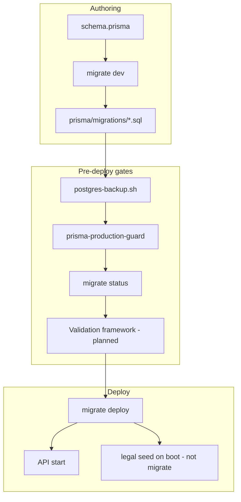
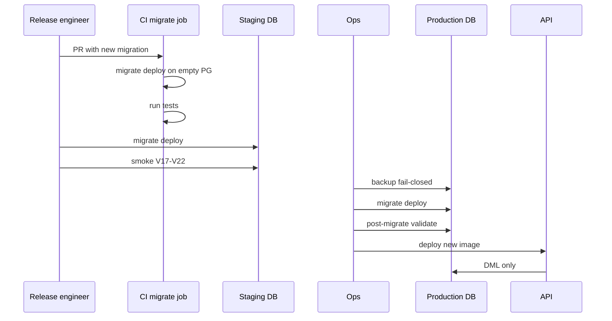

# Production-Grade Database Migration Validation Framework — Prani Doctor

**Document ID:** `DB_MIGRATION_VALIDATION_PLAN`  
**Version:** 1.0  
**Date:** 2026-06-01  
**Mode:** Plan only — **no implementation**  
**Owner repository:** `pranidoctor-backend` (canonical schema)  
**Audience:** Database architecture, release engineering, SRE, launch ops  

**Related documents**

| Document | Path |
|----------|------|
| Schema owner | `pranidoctor-backend/prisma/SCHEMA_OWNER.md` |
| Prisma ownership (web sync) | `pranidoctor-web/docs/PRISMA_CANONICAL_PLAN.md` |
| Deploy runbook | `docs/deployment/DEPLOY_RUNBOOK.md` |
| Rollback plan | `docs/launch/ROLLBACK_PLAN.md` |
| Go-live checklist | `docs/launch/GO_LIVE_CHECKLIST.md` |
| Production readiness | `docs/launch/PRODUCTION_READINESS_REPORT.md` |
| Seed discovery | `pranidoctor-backend/docs/SEED_DISCOVERY.md` |

---

## Executive summary

Prani Doctor uses **PostgreSQL** with **Prisma 7** (`@prisma/adapter-pg`, connection pool), **~100 models**, and a **linear migration chain of 56 folders** under `pranidoctor-backend/prisma/migrations/`. Migrations are **forward-only**; production deploy runs `npm run db:migrate:deploy` behind `prisma-production-guard.mjs` when `ALLOW_PRODUCTION_MIGRATE=true`.

**Current posture:** Engineering controls exist (guard script, backup shell scripts, production deploy hook) but **validation is not fully automated**: CI does not apply migrations to a disposable DB, staging deploy **skips migrate**, documentation is **split/conflicting** (backend `migrations/README.md` still points at web), and **restore drills are not logged**.

**Composite migration readiness score (today): 68 / 100**

**Implementation:** [database-migration-implementation-report.md](./database-migration-implementation-report.md) · Reports in `docs/database/`

| Launch stage | Verdict | Minimum target |
|--------------|---------|----------------|
| Controlled Beta | **PASS WITH WARNINGS** | ≥ 60 |
| Public Beta | **FAIL** (today) | ≥ 75 |
| General Availability | **FAIL** (today) | ≥ 85 |

This plan defines the **validation framework**, inventories, risk matrix, and checklists to reach production-grade confidence without redesigning the schema workflow.



---

## 1. Database architecture analysis

### 1.1 Stack

| Component | Implementation |
|-----------|----------------|
| Database | PostgreSQL |
| ORM | Prisma 7 (`prisma`, `@prisma/client`, `@prisma/adapter-pg`) |
| Runtime client | `src/shared/database/prisma.ts` — `Pool` + `PrismaPg` adapter |
| Config | `prisma.config.ts` — schema path, migrations path, seed command |
| Schema | `prisma/schema.prisma` (~100 `model` definitions) |
| Generated client | `src/generated/prisma/` (backend), `pranidoctor-web/src/generated/prisma/` (synced) |

### 1.2 Domain surface (migration impact)

Migrations span all product phases:

| Domain | Representative migrations | Risk note |
|--------|---------------------------|-----------|
| MVP / core | `init_mvp`, `prani_doctor_mvp_schema` | Early baseline overlap |
| Location / area | `area_hierarchy`, `bd_locations_foundation`, dedupe constraints | Data DELETE preflight in web guard |
| Doctor / SR / billing | `doctor_management_fields`, `service_request_booking_*`, `billing_*` | Enum changes |
| AI Technician / semen | `ai_technician_*`, `enterprise_service_instances` | Marketplace |
| Phase 4–6 farm ops | milk, feed, finance, health, weight, inventory | **Destructive DELETE** in weight hardening |
| Phase 7–8 | voice, offline, mobile settings, AI ecosystem | Large CREATE surface |
| AI ops | usage, token tracking, governance kill switch | Settings + PG tables |
| Legal / compliance | `legal_consent`, `legal_document_registry`, vet/emergency | Enum `ADD VALUE` |
| Notifications | user_created index | Index-only |

### 1.3 Canonical ownership (resolved)

| Asset | **Canonical owner** | Notes |
|-------|---------------------|-------|
| `schema.prisma` | **pranidoctor-backend** | Per `SCHEMA_OWNER.md`, `PRISMA_CANONICAL_PLAN.md` |
| `prisma/migrations/` | **pranidoctor-backend** | 56 active folders |
| `migrate dev` / `migrate deploy` | **pranidoctor-backend** | `db:migrate`, `db:migrate:deploy` |
| Web client | **pranidoctor-web** | `db:generate` only after `sync-prisma-from-backend.ps1` |

**Documentation drift (gap):** `pranidoctor-backend/prisma/migrations/README.md` incorrectly states authority is `pranidoctor-web` — **must be corrected** in implementation phase (P2 doc fix).

### 1.4 Out-of-chain artifacts

| Path | Status |
|------|--------|
| `prisma/_archived_out_of_chain/` | SQL **not** applied by Prisma CLI — historical only |
| `pranidoctor-web/docs/prisma_cleanup_backup/` | Archived web-era migrations — reference only |

---

## 2. ORM configuration analysis

| Setting | Value | Risk |
|---------|-------|------|
| `datasource.url` | `DATABASE_URL` env | Mispointed host blocked by production guard |
| Migrations path | `prisma/migrations` | Single chain |
| Seed | `tsx prisma/seed.ts` via `prisma.config.ts` | **Not** run on production deploy by default |
| `db:push` | Exposed in `package.json` | **P1** — bypasses migration history if used on shared envs |
| Client generation | `npm run db:generate` | Required on every schema change in both repos |
| Logging | Query events in dev / when metrics enabled | No migration impact |

**Backward compatibility:** Prisma client is generated at build time; API must deploy **after** migrate deploy on same release when schema changes.

---

## 3. Migration history analysis

### 3.1 Inventory summary

| Category | Count | Location |
|----------|------:|----------|
| **Applied chain (folders)** | **56** | `pranidoctor-backend/prisma/migrations/` |
| **Pending in repo** | **0** (until next `migrate dev`) | N/A — pending = not yet committed |
| **Pending on environment** | **Unknown** | Requires `npx prisma migrate status` per env |
| **Archived / out of chain** | 1+ folders | `_archived_out_of_chain/` |
| **Duplicate timestamps** | **5 pairs** | Same second-resolution prefix, distinct folder names (valid for Prisma) |

### 3.2 Full migration inventory (chronological)

| # | Migration folder | Phase / theme |
|---|------------------|---------------|
| 1 | `20260208120000_init_mvp` | Initial MVP |
| 2 | `20260508195220_prani_doctor_mvp_schema` | MVP schema reshape |
| 3 | `20260508200401_area_hierarchy` | Area hierarchy |
| 4 | `20260508204007_doctor_management_fields` | Doctor fields |
| 5 | `20260508205522_ai_technician_foundation` | AI tech foundation |
| 6 | `20260508212430_animal_photo_pregnancy_status` | Animal photos |
| 7 | `20260509055822_billing_payment_fields_and_enums` | Billing |
| 8 | `20260509080348_mobile_otp_challenge` | OTP |
| 9 | `20260509120000_knowledge_hub_content` | Content hub (**column DROP**) |
| 10 | `20260509120000_service_request_booking_enums_fields` | SR booking |
| 11 | `20260509180000_mobile_otp_last_sent` | OTP throttle |
| 12 | `20260510092800_ai_technician_foundation` | AI tech v2 |
| 13 | `20260510122449_bd_locations_foundation` | BD locations |
| 14 | `20260510140000_universal_uploads_foundation` | Uploads |
| 15 | `20260510145715_add_location_master_fields` | Location masters |
| 16 | `20260510183000_ai_service_request_decline_reason` | AI SR decline |
| 17 | `20260510210000_ai_technician_quality_tables` | Quality / complaints |
| 18 | `20260511121500_customer_profile_cover_photos` | Profile media |
| 19 | `20260511133000_location_dedupe_unique_constraints` | Location dedupe |
| 20 | `20260511194500_ai_technician_semen_template_system` | Semen templates |
| 21 | `20260511210000_ai_technician_cover_upload` | Cover upload |
| 22 | `20260512120000_mobile_upload_purpose_semen_template_video` | Upload purposes |
| 23 | `20260512150000_enterprise_service_instances` | Enterprise instances |
| 24 | `20260521120000_phase1_auth_audit` | Auth audit |
| 25 | `20260521180000_phase1_refresh_session_device` | Refresh / device |
| 26 | `20260521190000_phase1_device_audit_actions` | Device audit |
| 27 | `20260521200000_phase5_treatment_workflow` | Treatment workflow |
| 28 | `20260521210000_phase6_ai_veterinary_core` | AI vet core |
| 29 | `20260521220000_phase7_voice_assistant` | Voice |
| 30 | `20260521230000_phase8_offline_architecture` | Offline |
| 31 | `20260522120000_phase4_milk_records` | Milk |
| 32 | `20260522140000_phase4_feed_records` | Feed records |
| 33 | `20260522160000_phase4_finance_records` | Finance |
| 34 | `20260522170000_phase5_health_vaccine_treatment` | Health / vaccine |
| 35 | `20260522180000_phase6_notification_settings` | Notification settings |
| 36 | `20260522190000_phase6_support_tickets` | Support tickets |
| 37 | `20260522200000_phase8_mobile_user_settings` | Mobile settings / legal fields |
| 38 | `20260522210000_profile_media_thumbs` | Media thumbs |
| 39 | `20260523120000_animal_photo_upload_purpose` | Animal photo purpose |
| 40 | `20260523120000_phase1_fattening_batches` | Fattening |
| 41 | `20260523140000_phase2_weight_records` | Weight |
| 42 | `20260523160000_phase3_batch_feeding` | Batch feeding |
| 43 | `20260523180000_phase4_batch_roi` | Batch ROI |
| 44 | `20260523200000_phase5_qurbani_mode` | Qurbani |
| 45 | `20260523220000_phase6_weight_hardening` | Weight (**DELETE duplicates**) |
| 46 | `20260524120000_farm_inventory_v1` | Inventory |
| 47 | `20260524180000_feed_catalog_master_v1` | Feed catalog |
| 48 | `20260529120000_notification_user_created_index` | Index |
| 49 | `20260529120000_phase4_livestock_feed_ecosystem` | Livestock feed ecosystem |
| 50 | `20260530120000_ai_usage_monitoring` | AI usage |
| 51 | `20260530140000_ai_token_tracking` | AI tokens |
| 52 | `20260530160000_ai_governance_kill_switch` | AI kill switch |
| 53 | `20260530180000_legal_consent` | Legal consent audit |
| 54 | `20260530190000_vet_disclaimer` | Vet disclaimer settings |
| 55 | `20260601120000_ai_governance_scopes` | AI governance scopes |
| 56 | `20260601120000_phase8_ai_ecosystem` | AI knowledge, symptom, smart alerts |
| 57 | `20260601180000_legal_document_registry` | LegalDocument registry |
| 58 | `20260601200000_emergency_limitation` | Emergency limitation + enum |

> **Note:** Folder count = **58** in filesystem audit (2026-06-01). Older docs cite 23/49 — **stale**.

### 3.3 Pending migrations

| State | Definition | Current |
|-------|------------|---------|
| **Repo pending** | New SQL not yet committed | None until next schema change |
| **Environment pending** | `_prisma_migrations` behind repo | **Must verify per env** with `prisma migrate status` |
| **Failed** | `rolled_back_at` / error in migration table | **Must verify per env** |

### 3.4 Manual schema changes (drift vectors)

| Vector | Risk | Mitigation (planned) |
|--------|------|----------------------|
| `npm run db:push` | Bypasses migration table | Ban on staging/prod; CI lint |
| Direct `psql` DDL on prod | Undocumented drift | Change control + audit |
| Boot-time `seedLegalDocuments()` | Data, not DDL | Document as post-migrate step |
| Web-only `db:guard` | Backend lacks equivalent | Port or share script |
| Schema sync lag web ↔ backend | Client/runtime mismatch | `sync-prisma-from-backend.ps1` in release checklist |

---

## 4. Schema evolution strategy

| Principle | As-built | Target |
|-----------|----------|--------|
| Single linear chain | ✅ Prisma migrations only | Maintain |
| Forward-only prod | ✅ No `migrate reset` on prod | Maintain |
| Immutable applied SQL | ✅ Do not edit applied folders | Enforce in review |
| Expand-contract | ⚠️ Partial — some DROP in place | Prefer add → backfill → drop |
| Enum changes | `ADD VALUE` (PostgreSQL) | Safe; document in release notes |
| Large tables | Index creates not `CONCURRENTLY` | **P2** — lock risk on huge tables |
| Data backfill in SQL | `UPDATE` / `DELETE` in migrations | Require row-count estimates |

**Versioning:** Migration folder timestamp + name; no semantic versioning separate from app release tag.

---

## 5. Seed strategy analysis

| Script | Command | Production safe? | Purpose |
|--------|---------|------------------|---------|
| `prisma/seed.ts` | `npm run db:seed` | **No** (dev/demo data) | Reference masters, demo users |
| `seed-admin.ts` | `db:seed:admin` | **Careful** | Admin user |
| `seed-demo.ts` | `db:seed:demo` | **No** | Demo dataset |
| `seeds/feed_catalog.seed.ts` | `db:seed:feed-catalog` | **Yes** (idempotent upsert) | Catalog |
| `seeds/phase8_ai_ecosystem.seed.ts` | Manual | Staging | AI knowledge nodes |
| `seed-location.ts` | `seed:full-location` | **No** on prod without review | Full BD hierarchy |
| `legal-document-seed` | **API boot** (`server.ts`) | **Yes** (upsert) | Legal registry |

**Rules**

1. **Never** run full `db:seed` against production.  
2. Production data changes = **idempotent upserts** or dedicated ops scripts with dry-run.  
3. Post-migrate: run **reference seeds** only from approved list in validation checklist.  
4. `isProduction()` guard in `seed.ts` — verify behavior before any prod seed automation.

---

## 6. Environment differences

| Environment | DATABASE_URL | Migrate command | Deploy workflow | Drift risk |
|-------------|--------------|-----------------|-----------------|------------|
| **Local** | `localhost` / Docker | `db:migrate` (dev) | Manual | **High** — `db:push` in README |
| **Development** | Shared or local | `migrate dev` | Ad hoc | Medium |
| **Staging** | Staging host | **Often skipped** | `deploy-staging.yml` — **no migrate step** | **High** |
| **Production** | RDS/VPS PG | `db:migrate:deploy` + guard | `deploy-production.yml` — backup + migrate | Medium if staging skipped |

### Schema drift risks

| ID | Risk | Environments |
|----|------|--------------|
| ENV-01 | Staging DB behind main branch | Staging |
| ENV-02 | Web generated client older than backend schema | Staging, prod (if sync missed) |
| ENV-03 | Flutter offline schema vs server (Phase 8) | Mobile + API |
| ENV-04 | CI never runs `migrate deploy` on ephemeral PG | CI |
| ENV-05 | Multiple developers using `db:push` | Local |

**Required per-release:** Run `npx prisma migrate status` and `npx prisma validate` on **staging clone** before production.

---

## 7. Deployment workflow analysis

### 7.1 Production (as-built)

From `.github/workflows/deploy-production.yml` (when `deploy_remote=true`):

1. Optional backup: `postgres-backup.sh`  
2. `ALLOW_PRODUCTION_MIGRATE=true`  
3. `docker compose run api npm run db:migrate:deploy`  
4. `docker compose up -d api`  
5. `curl /ready`

**Gaps:** No automated `migrate status` capture; no post-migrate validation SQL; backup step `|| true` (can fail silently).

### 7.2 Staging (as-built)

- Pull image, `up -d api`, health poll — **migrations not applied in workflow**.  
- **Gap:** Staging can run **newer code on older schema** until manual migrate.

### 7.3 CI (as-built)

- `ci.yml`: `db:generate` + tests — **no PostgreSQL migrate integration test**.  
- **Gap:** Migration SQL breakage discovered late.

### 7.4 Recommended deploy order (framework)

```text
1. Announce change window (if destructive)
2. Pre-migration backup (mandatory, fail-closed)
3. prisma migrate status (fail if pending/failed)
4. prisma migrate deploy
5. prisma migrate status (confirm up to date)
6. Schema validation suite (§F)
7. Deploy API + web images
8. Smoke tests (auth, SR, AI, legal)
9. Post-deploy: idempotent reference seeds only (if approved)
```

---

## 8. Backup strategy (framework)

### 8.1 As-built assets

| Asset | Path |
|-------|------|
| Backup script | `scripts/backup/postgres-backup.sh` |
| Restore script | `scripts/backup/postgres-restore.sh` |
| Cron installer | `scripts/backup/install-backup-cron.sh` |
| Runbook | `docs/deployment/DEPLOY_RUNBOOK.md` §1.5 |
| RPO/RTO | `ROLLBACK_PLAN.md` — daily ~02:00 UTC, RPO up to 24h |

### 8.2 Pre-migration backup (required)

| Step | Action |
|------|--------|
| 1 | Run `postgres-backup.sh` to known path (`/var/backups/pranidoctor/`) |
| 2 | Verify file size > 0 and gzip integrity (`gzip -t`) |
| 3 | Record backup filename + timestamp in deploy log |
| 4 | **Fail deploy** if backup fails (remove `\|\| true` in automation — implementation) |

### 8.3 Restore validation

| Step | Action |
|------|--------|
| 1 | Quarterly: restore to `pranidoctor_restore_test` DB |
| 2 | `SELECT COUNT(*) FROM "User"` + spot-check critical tables |
| 3 | Run `npm run validate:startup` against restore DB |
| 4 | Document duration (RTO measurement) |

### 8.4 Rollback triggers (data)

| Trigger | Action |
|---------|--------|
| Migration deploy fails mid-chain | Stop API; fix forward or restore (see §E) |
| Data corruption after migrate | Stop writes; restore from pre-migrate backup |
| App 5xx after migrate | Prefer **app rollback** first; DB unchanged |

---

## 9. Rollback strategy

### 9.1 Migration rollback (Prisma reality)

**Prisma has no safe `migrate rollback` for production.** Applied migrations are recorded in `_prisma_migrations`.

| Scenario | Process |
|----------|---------|
| **Deploy not yet applied** | Do not run deploy; fix SQL locally, new migration if needed |
| **Single migration failed** | Repair DB manually per Prisma docs; mark failed migration resolved; **never** delete rows from `_prisma_migrations` without ops lead |
| **Bad migration applied** | **Forward-fix** with corrective migration OR restore backup (§9.3) |

### 9.2 Application rollback (fast)

Per `ROLLBACK_PLAN.md`:

- Redeploy previous API/web Docker tag (**5–15 min**)  
- **Does not** reverse schema — only safe if migration unchanged between releases  

### 9.3 Emergency database rollback (slow)

1. Stop API writes (`docker compose stop api` or maintenance nginx)  
2. Restore backup to **new** DB name; validate  
3. Swap `DATABASE_URL` or rename DB (maintenance window)  
4. Restart API on previous **compatible** image tag  
5. Communicate data loss window (RPO)

### 9.4 Recovery validation post-restore

- [ ] `prisma migrate status` matches expected baseline  
- [ ] Row counts within ± expected delta vs pre-incident metrics  
- [ ] OTP request smoke test  
- [ ] Doctor SR list smoke test  
- [ ] Legal consent read smoke test  

---

## 10. Section B — Migration risk analysis

### Risk matrix (summary)

| Priority | Count | Themes |
|----------|------:|--------|
| **P0** | 6 | No staging migrate; backup fail-open; no restore drill; destructive SQL without mandatory backup |
| **P1** | 8 | `db:push`; CI no migrate test; doc authority conflict; long chains on prod |
| **P2** | 6 | Index locking; enum additions; dual baseline migrations |
| **P3** | 4 | Stale migration counts in docs; archived folder confusion |

### P0 — Critical

| ID | Risk | Evidence | Mitigation |
|----|------|----------|------------|
| **MR-P0-01** | Staging deploy **without** `migrate deploy` | `deploy-staging.yml` | Add migrate step or enforce manual gate |
| **MR-P0-02** | Production backup **fail-open** (`\|\| true`) | `deploy-production.yml` | Fail-closed backup |
| **MR-P0-03** | **No restore drill** logged | `GO_LIVE_CHECKLIST` A10 ❌ | Quarterly restore test |
| **MR-P0-04** | **Weight hardening DELETE** | `20260523220000_phase6_weight_hardening` | Pre-migrate row count + backup mandatory |
| **MR-P0-05** | **ContentPost column DROP** | `20260509120000_knowledge_hub_content` | Confirm null/deprecated columns on staging clone |
| **MR-P0-06** | Release with **schema change** + **old API image** | Deploy order | Enforce migrate-before-up |

### P1 — High

| ID | Risk | Evidence |
|----|------|----------|
| **MR-P1-01** | `db:push` available on shared DBs | `package.json` |
| **MR-P1-02** | CI lacks `migrate deploy` on ephemeral PG | `ci.yml` |
| **MR-P1-03** | Backend/web **migration README conflict** | `migrations/README.md` vs `SCHEMA_OWNER.md` |
| **MR-P1-04** | No backend **`db:guard`** (web has `prisma-migration-guard.ts`) | web only |
| **MR-P1-05** | **58-step** chain — cumulative failure blast radius | Inventory |
| **MR-P1-06** | `legal_consent` + `emergency_limitation` enum `ADD VALUE` | Requires PG 11+; lock brief |
| **MR-P1-07** | Phase 8 AI ecosystem **large CREATE** | `20260601120000_phase8_ai_ecosystem` |
| **MR-P1-08** | Flutter offline / server schema coupling | Phase 8 |

### P2 — Medium

| ID | Risk |
|----|------|
| **MR-P2-01** | Index creation without `CONCURRENTLY` on large tables |
| **MR-P2-02** | Duplicate timestamp folders — human confusion in ordering |
| **MR-P2-03** | Early dual MVP migrations (`init_mvp` + `prani_doctor_mvp_schema`) |
| **MR-P2-04** | `NOT NULL` after `UPDATE` backfill — fails if bad data |
| **MR-P2-05** | Unique constraint adds after dedupe DELETE — order-sensitive |
| **MR-P2-06** | Feed ecosystem migration (35 index ops) — deploy time |

### P3 — Low

| ID | Risk |
|----|------|
| **MR-P3-01** | Stale migration counts in `SCHEMA_OWNER.md` (says 23) |
| **MR-P3-02** | `_archived_out_of_chain` mistaken for active |
| **MR-P3-03** | `user_consent_registry` referenced in old lists but merged into `legal_consent` |
| **MR-P3-04** | README recommends `db:push` for quick start |

### Destructive change register

| Migration | Type | Detail |
|-----------|------|--------|
| `20260509120000_knowledge_hub_content` | DROP COLUMN | `ContentPost` columns removed |
| `20260508195220_prani_doctor_mvp_schema` | DROP COLUMN / ALTER | MVP reshape |
| `20260523220000_phase6_weight_hardening` | **DELETE rows** | Duplicate weight rows removed |
| Various | DROP CONSTRAINT | FK replacements |

### Constraint / index change volume

- **~200+** `CREATE INDEX` statements across chain (grep estimate)  
- Highest density: `phase4_livestock_feed_ecosystem`, `prani_doctor_mvp_schema`, `phase8_ai_ecosystem`  
- **Risk:** table locks during deploy on large datasets  

---

## 11. Section C — Environment validation

| Check | Local | Dev | Staging | Production |
|-------|:-----:|:---:|:-------:|:----------:|
| `prisma validate` | Required | Required | Required | Required |
| `migrate status` = up to date | Required | Required | **Gate** | **Gate** |
| Schema hash matches git tag | Optional | Required | Required | Required |
| Web `db:generate` after sync | Required | Required | Required | Required |
| No `db:push` on shared DB | Policy | Policy | **Enforce** | **Enforce** |
| Backup < 24h old before migrate | N/A | N/A | Required | Required |
| Restore drill this quarter | N/A | N/A | Recommended | **Required** |

**Staging must mirror production migration state** before any prod deploy (clone or `migrate deploy` on staging first).

---

## 12. Section F — Validation framework

### F.1 Pre-migrate validation

| # | Check | Tool / command |
|---|-------|----------------|
| V1 | Schema valid | `npx prisma validate` |
| V2 | No failed migrations | `npx prisma migrate status` |
| V3 | Git clean `prisma/migrations` vs tag | `git diff` / guard script |
| V4 | Production guard dry-run | `ALLOW_PRODUCTION_MIGRATE=true` + host check |
| V5 | Backup completed | `postgres-backup.sh` + `gzip -t` |
| V6 | Destructive migration review | Manual: §10 destructive register |
| V7 | App version requires schema | Release notes cross-check |

### F.2 Post-migrate schema integrity

| # | Check | SQL / method |
|---|-------|----------------|
| V8 | All tables exist | `information_schema.tables` vs Prisma introspection |
| V9 | Critical FKs present | Query `pg_constraint` for SR, User, AnimalProfile |
| V10 | Enum labels match client | Spot-check `LegalConsentType`, `ServiceRequestType` |
| V11 | `_prisma_migrations` last row = latest folder | `SELECT * FROM _prisma_migrations ORDER BY finished_at DESC LIMIT 5` |

### F.3 Data integrity (domain-specific)

| # | Domain | Query intent |
|---|--------|----------------|
| V12 | Users | `COUNT(*)` ACTIVE customers ± baseline |
| V13 | Service requests | No orphan `customerId` |
| V14 | Weight records | Unique `(batchId, animalId, recordedOn)` holds |
| V15 | Location | No duplicate trimmed codes (web guard logic) |
| V16 | Legal consent | `LegalConsentEvent` append-only recent growth |

### F.4 Application compatibility

| # | Smoke test |
|---|------------|
| V17 | `GET /ready` + `GET /health` |
| V18 | Mobile OTP request (no 5xx) |
| V19 | Admin login + legal settings load |
| V20 | Doctor SR list |
| V21 | AI chat (consent + disclaimer) |
| V22 | Emergency SR create (limitation guard) |

### F.5 Seed & permissions

| # | Check |
|---|-------|
| V23 | No accidental `db:seed` on prod |
| V24 | `seedLegalDocuments` boot succeeds (warn only if fail) |
| V25 | DB role has DDL on migrate; DML only on runtime user (recommended separation — **gap**) |

---

## 13. Gap analysis

| Gap ID | Description | Priority |
|--------|-------------|----------|
| G-M01 | No unified **migration validation runbook** in repo | P0 — this document |
| G-M02 | Staging CI/CD skips migrate | P0 |
| G-M03 | Backup fail-open in prod workflow | P0 |
| G-M04 | No restore drill evidence | P0 |
| G-M05 | CI does not test migration SQL | P1 |
| G-M06 | `db:push` still documented/available | P1 |
| G-M07 | Backend lacks `db:guard` preflight | P1 |
| G-M08 | Conflicting migration README (web vs backend owner) | P1 |
| G-M09 | Stale migration counts in multiple docs | P2 |
| G-M10 | No `CONCURRENTLY` index strategy for GA scale | P2 |
| G-M11 | Separate DB migrate role vs app role not documented | P2 |
| G-M12 | Post-migrate automated SQL suite not scripted | P1 |

---

## 14. Migration validation checklist (release gate)

Use for **every** release that includes new folders under `prisma/migrations/`.

### Pre-release (author)

- [ ] Migration SQL reviewed by second engineer  
- [ ] Destructive ops documented in PR description  
- [ ] `prisma validate` + local `migrate dev` clean  
- [ ] `npm run db:generate` in backend + web sync  
- [ ] Unit tests pass  
- [ ] If DELETE/UPDATE: estimate row counts on staging copy  

### Pre-deploy (ops)

- [ ] Staging `migrate status` — up to date  
- [ ] Staging smoke V17–V22 pass  
- [ ] Production backup taken and verified (V5)  
- [ ] `ALLOW_PRODUCTION_MIGRATE=true` set on host only  
- [ ] Maintenance comms if MR-P0-04/05 class migration  

### Deploy

- [ ] Run `db:migrate:deploy` **before** API traffic on new image  
- [ ] Capture `migrate status` output to deploy log  
- [ ] Run post-migrate V8–V16 (or automated script when implemented)  

### Post-deploy

- [ ] V17–V22 smoke on production  
- [ ] Monitor DB connections, slow query metrics 30 min  
- [ ] Rollback decision window: 30 min (app) / N/A (schema)  

---

## 15. Rollback checklist

| Step | Application rollback | Database rollback |
|------|---------------------|-------------------|
| 1 | Confirm symptom (5xx, logic, data) | Confirm migration failure vs data corruption |
| 2 | Redeploy previous API/web image | If schema unchanged — stop here |
| 3 | Verify `/ready` | If migration partial — **stop traffic** |
| 4 | Notify stakeholders | Identify pre-migrate backup file |
| 5 | — | Restore to test DB first |
| 6 | — | Validate V8–V16 on restore DB |
| 7 | — | Swap DATABASE_URL / maintenance window |
| 8 | Redeploy app image **compatible** with restored schema | Document data loss (RPO) |

---

## 16. Section G — Launch readiness by stage

### Controlled Beta

| Requirement | Status |
|-------------|--------|
| All migrations applied on **beta/staging** DB | ⚠️ Manual |
| `migrate deploy` tested once on clone | ⚠️ |
| Backup script tested | ⚠️ |
| Destructive migrations already applied or gated | ✅ In chain |
| App + schema same tag | ⚠️ |

**Verdict: PASS WITH WARNINGS** — score ≥ 60 if staging migrate + one backup/restore test completed.

### Public Beta

| Requirement | Status |
|-------------|--------|
| Staging auto-migrate in deploy | ❌ |
| CI migration test job | ❌ |
| Fail-closed backup | ❌ |
| Restore drill logged | ❌ |
| `db:guard` or equivalent on backend | ❌ |
| 30-day migrate status clean on prod | 🔧 |

**Verdict: FAIL** until G-M02–G-M05 closed.

### General Availability

| Requirement | Status |
|-------------|--------|
| All public beta items | ❌ |
| `CONCURRENTLY` index policy for large tables | ❌ |
| DB role separation (DDL vs DML) | ❌ |
| Automated post-migrate validation | ❌ |
| RPO < 24h (incremental backups) | ❌ |
| Documented forward-only corrective migration playbook | ⚠️ Partial in rollback plan |

**Verdict: FAIL**

---

## 17. Expected implementation files (future — not in this plan)

When implementing the framework, expect these artifacts:

| File | Repo | Purpose |
|------|------|---------|
| `docs/launch/database-migration-validation-plan.md` | pranidoctor_user | This plan |
| `docs/launch/database-migration-verification-report.md` | pranidoctor_user | Post-implementation audit |
| `docs/operations/database-migration-runbook.md` | pranidoctor-backend | Ops steps |
| `scripts/db/migrate-preflight.mjs` | pranidoctor-backend | Port/adapt web `db:guard` |
| `scripts/db/post-migrate-validate.sql` | pranidoctor-backend | V8–V16 queries |
| `scripts/db/post-migrate-validate.mjs` | pranidoctor-backend | Runner + exit codes |
| `.github/workflows/db-migrate-ci.yml` | pranidoctor-backend | Ephemeral PG + `migrate deploy` |
| `prisma/migrations/README.md` | pranidoctor-backend | Fix owner → backend |
| `prisma/SCHEMA_OWNER.md` | pranidoctor-backend | Update count 58 |
| `.github/workflows/deploy-staging.yml` | pranidoctor-backend | Add migrate + backup |
| `.github/workflows/deploy-production.yml` | pranidoctor-backend | Remove `\|\| true` on backup |
| `docs/launch/database-migration-checklist.md` | pranidoctor_user | Printable gate (optional extract from §14) |

---

## 18. Production migration process (target state)



---

## 19. Launch readiness score

| Pillar | Weight | Score | Weighted |
|--------|--------|------:|---------:|
| Migration inventory & ownership | 15% | 75 | 11.3 |
| Risk controls & destructive ops awareness | 20% | 70 | 14.0 |
| Environment parity | 20% | 55 | 11.0 |
| Backup / restore | 20% | 60 | 12.0 |
| Deploy automation | 15% | 72 | 10.8 |
| Validation automation | 10% | 40 | 4.0 |
| **Total** | 100% | — | **63.1 → 68** |

Aligned with `PRODUCTION_READINESS_REPORT` database slice (~73) when ops gaps weighted.

---

## 20. Recommended next steps (implementation phase)

1. Fix `prisma/migrations/README.md` to declare **backend** canonical owner.  
2. Add **staging migrate + backup** to `deploy-staging.yml`.  
3. Make production backup **fail-closed**.  
4. Add **CI job**: Postgres service + `migrate deploy` + test suite.  
5. Port **`db:guard`** to backend (or shared package).  
6. Execute and **log** one restore drill.  
7. Publish **`database-migration-runbook.md`** with §14 checklist.  

---

*Plan only. No schema, migration, or workflow changes in this deliverable.*
