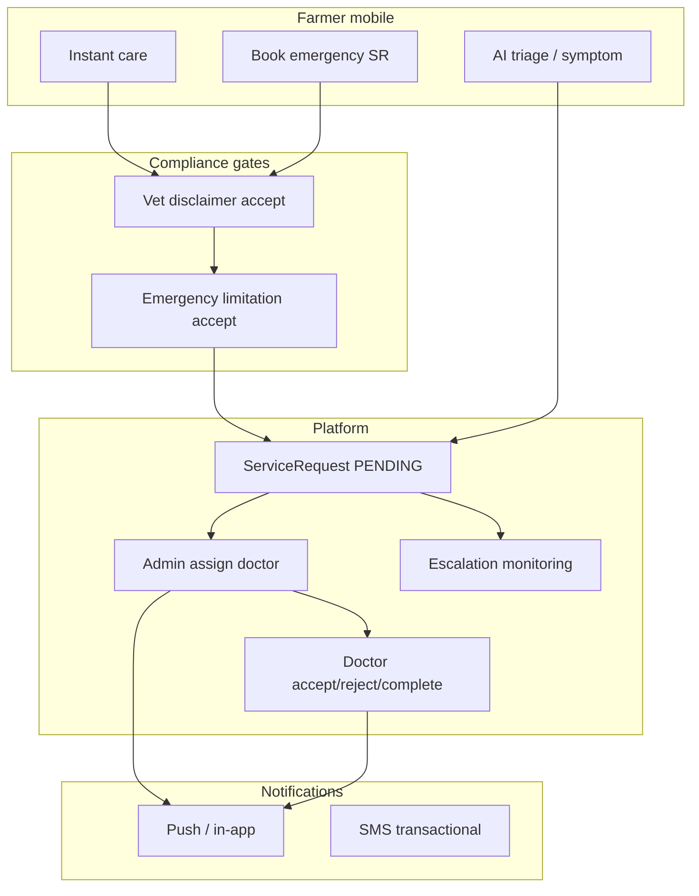

# End-to-End Emergency Workflow Validation Program — Prani Doctor

**Document ID:** `E2E_EMERGENCY_VALIDATION_PLAN`  
**Version:** 1.0  
**Date:** 2026-06-01  
**Mode:** Plan only — **no implementation**  
**Scope:** User mobile app · Doctor web panel · Admin BFF · Backend API · Notifications · AI · Livestock · Offline  
**Audience:** QA architecture, veterinary workflow leads, launch ops, product, compliance  

**Related documents**

| Area | Document |
|------|----------|
| Closed beta | [closed-beta-launch-plan.md](./closed-beta-launch-plan.md) |
| Emergency limitation compliance | `pranidoctor-web/docs/compliance/emergency/EMERGENCY_LIMITATION_VERIFICATION_REPORT.md` |
| AI compliance | [ai-compliance-plan.md](../../pranidoctor-web/docs/launch/ai-compliance-plan.md) |
| Legal-safe messaging | [legal-safe-messaging-plan.md](./legal-safe-messaging-plan.md) |
| Service request booking | `pranidoctor-web/docs/SERVICE_REQUEST_BOOKING_PLAN.md` |
| **Automation (implemented)** | [emergency-e2e-test-matrix.md](../testing/emergency-e2e-test-matrix.md) · [emergency-workflow-coverage.md](../testing/emergency-workflow-coverage.md) |
| Escalation monitoring | `pranidoctor-backend/docs/production/operations/escalation-monitoring-plan.md` |
| AI emergency ops | `pranidoctor-backend/docs/operations/ai-emergency-runbook.md` |
| Rollback | [ROLLBACK_PLAN.md](./ROLLBACK_PLAN.md) |
| API contract (aspirational vs as-built) | `pranidoctor-web/docs/api/API_CONTRACT_V1.md` §12 |

---

## Executive summary

Prani Doctor’s **as-built emergency model** is a **human service-request workflow** (`ServiceRequestType.EMERGENCY_DOCTOR`), not an automated dispatch or ambulance system. A farmer creates a request in **PENDING** status; **admin assigns** a doctor; the doctor **accepts, rejects, or completes** via the doctor panel; **ops escalation monitoring** alerts on SLA breaches (unassigned emergency, rejection spikes, stalled cases).

**AI emergency** is a **parallel track**: symptom/triage/chat may flag `emergency: true`, show escalation disclosures (E2/E2), and optionally create `AiEscalationRecord` — it does **not** assign a veterinarian or guarantee response times.

**Validation posture today:** Code paths and compliance banners exist on **primary human urgent surfaces** (~71/100 emergency compliance per prior audit). **No documented E2E test suite** executes the full journey from request → assignment → acceptance → closure on staging with live notifications.

| Launch gate | Target score | Current estimate |
|-------------|-------------:|-----------------:|
| Controlled beta (emergency E2E) | ≥ 70 | **~58** (paths exist; E2E not executed) |
| Public beta | ≥ 80 | **Not ready** |
| GA | ≥ 88 | **Not ready** |

This plan defines **critical journeys**, **edge cases**, **environments**, **data**, **success criteria**, **recovery tests**, and a **P0/P1/P2 task backlog** — without implementing automation in this document.



---

## 1. As-built workflow analysis (foundation for validation)

### 1.1 Emergency request flows

| Entry point | Surface | Backend | Status model |
|-------------|---------|---------|--------------|
| **Book emergency** | `BookConsultationPage` → `ConsultationType.emergency` | `POST` mobile service request create | `PENDING` |
| **Instant care** | `instant_care_sheet.dart` — emergency visit, call, AI chat | Dial `tel:` / navigate to book or AI | N/A until SR created |
| **Services discovery** | Emergency filter on doctors list | Doctor discovery `acceptsEmergency` | Filter only — not live GPS |
| **AI → human** | Escalation strip CTAs | Manual user action to book/call | Optional `AiEscalationRecord` |

**Server guard:** `assertEmergencyLimitationForEmergencyBooking` when `serviceType === EMERGENCY_DOCTOR` and `enforceAcceptance` on limitation CMS.

**Not implemented (design-only):** `EMERGENCY_ENGINE.md` broadcast-to-top-3 providers, automatic radius expansion, customer ETA promises in API contract §12.2.

### 1.2 Doctor assignment flows

| Actor | Action | API / module | Timeline event |
|-------|--------|--------------|----------------|
| **Admin** | Assign / reassign doctor | `assignDoctorToServiceRequest` | `ASSIGNED` / `REASSIGNED` |
| **Doctor** | Accept | `doctor/.../accept` | `ACCEPTED` |
| **Doctor** | Reject | `doctor/.../reject` | `REJECTED` |
| **Doctor** | Start / progress | status transitions | `STARTED`, `IN_PROGRESS` |
| **Doctor** | Complete + billing | `doctor/.../complete` | `COMPLETED` |

**Validation focus:** State machine integrity — no illegal transitions from terminal states (`COMPLETED`, `CANCELLED`, `REJECTED`).

### 1.3 Appointment flows (non-emergency vs emergency)

| Type | Mobile | Service type | Priority |
|------|--------|--------------|----------|
| Home visit | Book consultation | `HOME_VISIT` (or category slug) | NORMAL/HIGH |
| Online consultation | Book consultation | `ONLINE_CONSULTATION` | NORMAL — `preferredTime` only |
| **Emergency** | Book consultation | `EMERGENCY_DOCTOR` | `EMERGENCY` |

**Validation:** Emergency must not be conflated with online/home paths (disclaimer surfaces differ: `bookingEmergency` vs `bookingOnline`).

### 1.4 AI escalation flows

| Feature | Emergency signal | User-facing compliance | Ops audit |
|---------|------------------|------------------------|-----------|
| AI chat / triage | `emergency`, `humanRedirect` | E2 escalation strip; **U1 urgent gap** on triage/chat per EL-03 | `AiEscalationRecord`, safety logs |
| Symptom checker | `emergency: true` | `aiEmergency` + E2; wrapper compliance | Session + escalation |
| Smart recommendations | Farm health urgency | T2 banners | — |
| Kill switch | Rules-only fallback | No user notice today | `AiGovernanceService` |

**Validation:** AI escalation must **never** imply doctor assigned or en route.

### 1.5 Notification flows

| Event | Implementation (as-built) | Validate |
|-------|---------------------------|----------|
| SR submitted | `notifyServiceRequestSubmitted` | Farmer + ops awareness |
| Doctor accepted | `notifyDoctorAcceptedRequest` | Farmer notification |
| SR completed | `notifyServiceRequestCompleted` | Closure notification |
| Emergency broadcast to all doctors | **Not evidenced** in hot path | **Gap vs API contract** |
| FCM | Optional — often absent in pilot | Degraded path |

### 1.6 Admin intervention flows

| Capability | Admin UI | Validate |
|------------|----------|----------|
| List / filter emergency SRs | Service requests console | Visibility |
| Assign / reassign doctor | `ServiceRequestAssignmentActions` | Primary assignment path |
| Escalation dashboard | Launch ops / AI ops / monitoring | `alertEmergencyUnassigned` |
| Emergency limitation CMS | `EmergencyLimitationAdminPanel` | Copy compliance |
| Manual case notes | Timeline `NOTE_ADDED` | Audit trail |

### 1.7 Livestock emergency flows

| Dimension | As-built |
|-----------|----------|
| Animal types | `CATTLE`, `BUFFALO`, `GOAT`, `SHEEP`, `POULTRY`, etc. |
| Farm context | `farmRef`, fattening batch, health events linked to SR animal |
| Same SR pipeline | Emergency book uses `animalId` — species-agnostic |
| AI species scope | Livestock-primary AI; pets use same animal model |

**Validation:** Livestock emergency SR with village/location hierarchy + treatment case optional linkage.

### 1.8 Pet emergency flows

| Dimension | As-built |
|-----------|----------|
| Animal types | `DOG`, `CAT`, `OTHER` in `animal_form_page.dart` |
| Same booking flow | `BookConsultationPage` emergency type |
| AI | No dedicated pet triage copy — livestock-biased knowledge |

**Validation:** Pet emergency SR end-to-end (may expose copy gaps — document as product risk, not test failure unless blocking).

### 1.9 Failure handling flows

| Failure | Expected behavior | Validate |
|---------|-------------------|----------|
| No doctor available | SR stays `PENDING`; ops alert `emergencyUnassigned` | No false “assigned” UI |
| Doctor reject | `REJECTED`; admin can reassign new SR or re-open workflow | Farmer messaging |
| Network loss on create | Offline outbox / retry (`SyncCoordinator`) | Idempotent create |
| Legal consent missing | 403 `LEGAL_CONSENT_REQUIRED` | Clear mobile error |
| AI provider down | Rules-only / kill switch | No 5xx on chat |

### 1.10 Offline / degraded scenarios

| Scenario | Mobile | Backend |
|----------|--------|---------|
| SR create offline | Queued in outbox | Replay on sync |
| Read SR status | Cached / refresh on reconnect | Authoritative server state |
| AI chat offline | Fails or cached rules | N/A |
| Push disabled | In-app list only | — |

### 1.11 Audit and tracking coverage

| Artifact | Purpose | E2E must verify |
|----------|---------|-----------------|
| `ServiceRequestTimelineEvent` | CREATED → ASSIGNED → ACCEPTED → COMPLETED | Full chain |
| `LegalConsentEvent` | Emergency limitation accept | First emergency book |
| `AiEscalationRecord` | AI escalation | When user escalates |
| `AuthAuditEvent` | Security | Login during flow |
| Escalation metrics | Ops | `emergencyRequests` in beta dashboard |
| Admin actor on assign | `actorRole: ADMIN` | Reassignment audit |

---

## 2. Section A — Critical emergency journeys

Each journey has: **ID**, **actors**, **preconditions**, **steps**, **expected outcomes**, **evidence to capture**.

### J-01 — Livestock emergency request (happy path)

| Field | Detail |
|-------|--------|
| **ID** | `E2E-EM-LIVESTOCK-01` |
| **Actors** | Farmer, admin, doctor |
| **Preconditions** | Farmer account; cattle animal; doctor with `acceptsEmergency: true`; staging data |
| **Steps** | 1. Farmer books emergency against doctor 2. Accept vet + emergency limitation sheets 3. SR `PENDING` 4. Admin assigns doctor 5. Doctor accepts 6. Doctor completes with billing 7. Farmer sees completed |
| **Pass** | Timeline has CREATED, ASSIGNED, ACCEPTED, COMPLETED; notifications sent; no ETA guarantee strings in UI |
| **Evidence** | Screenshots, SR id, timeline JSON, notification ids |

### J-02 — Pet emergency request (happy path)

| Field | Detail |
|-------|--------|
| **ID** | `E2E-EM-PET-01` |
| **Steps** | Same as J-01 with `DOG` or `CAT` animal |
| **Pass** | SR completes; disclaimers shown; copy acceptable for pet context |
| **Warn** | AI livestock copy may appear elsewhere — log as WC, not fail unless blocking |

### J-03 — Doctor acceptance

| Field | Detail |
|-------|--------|
| **ID** | `E2E-EM-DOC-ACCEPT-01` |
| **Steps** | Admin assigns → doctor logs in → accepts |
| **Pass** | Status `ACCEPTED` (or valid in-progress per implementation); farmer notified |

### J-04 — Doctor rejection

| Field | Detail |
|-------|--------|
| **ID** | `E2E-EM-DOC-REJECT-01` |
| **Steps** | Assign → doctor rejects with reason |
| **Pass** | `REJECTED`; farmer sees terminal state; ops metric increments |

### J-05 — Doctor reassignment

| Field | Detail |
|-------|--------|
| **ID** | `E2E-EM-REASSIGN-01` |
| **Steps** | Assign doctor A → admin reassigns to doctor B → B accepts |
| **Pass** | Timeline `REASSIGNED`; only B can complete |

### J-06 — Emergency cancellation

| Field | Detail |
|-------|--------|
| **ID** | `E2E-EM-CANCEL-01` |
| **Steps** | Farmer or admin cancels pending/assigned SR (per product rules) |
| **Pass** | `CANCELLED`; no further doctor actions allowed |

### J-07 — Emergency closure (complete)

| Field | Detail |
|-------|--------|
| **ID** | `E2E-EM-CLOSE-01` |
| **Steps** | In-progress case → doctor completes with required billing fields |
| **Pass** | `COMPLETED`; prescription/treatment records if applicable |

### J-08 — AI emergency escalation (no auto-dispatch)

| Field | Detail |
|-------|--------|
| **ID** | `E2E-EM-AI-01` |
| **Steps** | Symptom checker or chat triggers emergency → user sees E2 + limitation → user taps escalate/book → optional SR |
| **Pass** | No “doctor dispatched” copy; escalation record if API used; U1/U2 banners per compliance matrix |

### J-09 — Instant care → emergency book

| Field | Detail |
|-------|--------|
| **ID** | `E2E-EM-INSTANT-01` |
| **Steps** | Home → Instant care → emergency visit → book flow |
| **Pass** | U1 + vet banners; phone dial shows `phoneDial` limitation |

### J-10 — First emergency legal gate

| Field | Detail |
|-------|--------|
| **ID** | `E2E-EM-LEGAL-01` |
| **Steps** | New farmer first `EMERGENCY_DOCTOR` without prior accept |
| **Pass** | Accept sheet; `emergencyAcceptedVersion` set; repeat book skips sheet if version current |

---

## 3. Section B — Edge cases

| ID | Scenario | Expected | Priority |
|----|----------|----------|----------|
| E-01 | No doctor available | SR pending; admin alert; farmer sees pending copy (`requestPending`) | P0 |
| E-02 | Multiple doctor rejections | `REJECTED`; reassignment or new SR; `alertRejectionSpike` if threshold | P0 |
| E-03 | Network interruption mid-create | Outbox retry; single SR; no duplicate on sync | P0 |
| E-04 | Notification failure (FCM off) | In-app SR still correct; ops sees request | P1 |
| E-05 | AI disabled (kill switch) | Rules-only; emergency keyword triage still works; book path OK | P1 |
| E-06 | System degraded (503 / partial) | Health/readiness fail; graceful mobile error | P1 |
| E-07 | User cancellation | `CANCELLED`; doctor cannot accept | P0 |
| E-08 | Admin assign invalid doctor | API error; no partial state | P1 |
| E-09 | Doctor accept without assign | Invalid transition error | P1 |
| E-10 | Concurrent assign + accept race | Single winner; consistent timeline | P2 |
| E-11 | Emergency limitation enforcement on API | 403 without accept | P0 |
| E-12 | AI emergency without human SR | Escalation only; no phantom SR | P1 |

---

## 4. Section C — Test environments

| Environment | Purpose | Emergency E2E required? | Data strategy |
|-------------|---------|-------------------------|---------------|
| **Local** | Dev debugging, unit/API tests | Partial — mock notifications | Docker PG + seed demo |
| **Development** | Integration | Journey dev test | Shared unstable — avoid sole gate |
| **Staging** | **Primary E2E gate** | **Full J-01–J-10** | Isolated beta seed |
| **Pre-production** | Dress rehearsal | Full + load smoke | Prod-like config, anonymized clone optional |

**Staging requirements**

- TLS endpoints for mobile `ApiBaseUrl`
- `OTP_MODE=test` or live SMS with test numbers
- FCM configured OR explicit “push-less” degraded checklist
- Escalation monitoring enabled with short thresholds for drill
- Admin + doctor panel URLs reachable

**Environment parity checklist**

- [ ] Same migration head as release tag
- [ ] `mobile.legal.config` + emergency limitation CMS match release
- [ ] Doctor profiles include pilot `acceptsEmergency`
- [ ] Location hierarchy seeded for pilot upazila

---

## 5. Section D — Data requirements

### 5.1 Test users

| Persona | Role | Count | Notes |
|---------|------|------:|-------|
| Farmer (livestock) | `CUSTOMER` | 3 | BN + EN locale variants |
| Farmer (pet) | `CUSTOMER` | 2 | Dog/cat animals |
| Doctor (emergency) | `DOCTOR` | 3 | `acceptsEmergency: true`, verified |
| Doctor (non-emergency) | `DOCTOR` | 1 | Negative control |
| Admin | `ADMIN` | 2 | Assignment permissions |
| Support | `SUPPORT` | 1 | Ticket escalation |

### 5.2 Test doctors

| Attribute | Required |
|-----------|----------|
| `acceptsEmergency` | true for primary path |
| Service area | Overlaps pilot village hierarchy |
| Panel login | Working JWT refresh |
| Mobile push token | Optional test device |

### 5.3 Test clinics / location

| Entity | Requirement |
|--------|-------------|
| Division → Village chain | At least one complete path for pilot district |
| Doctor service areas | Mapped to pilot villages |
| `MOBILE_EMERGENCY_PHONE` / support phone | Configured in app config |

### 5.4 Test livestock cases

| Case | Animal | Notes |
|------|--------|-------|
| L-1 | Cattle | Primary pilot species |
| L-2 | Goat | Secondary |
| L-3 | Poultry | Fast mortality scenario copy |
| L-4 | Buffalo | If in pilot region |

### 5.5 Test emergency cases (SR fixtures)

| Fixture | Initial status | Purpose |
|---------|----------------|---------|
| SR-OPEN-1 | `PENDING` unassigned | Admin assign drill |
| SR-OPEN-2 | `ASSIGNED` | Doctor accept drill |
| SR-REJECT-1 | `REJECTED` | Reassignment drill |
| SR-COMPLETE-1 | `COMPLETED` | Regression / read-only |

**Seed source:** `pranidoctor-backend/prisma/seed-demo.ts`, closed-beta tagging (`closed-beta-metrics`), or dedicated `e2e-emergency-seed` plan (future).

---

## 6. Section E — Success criteria (measurable)

### 6.1 Journey pass rules

| Rule ID | Criterion | Measurement |
|---------|-----------|-------------|
| SC-01 | **100%** of P0 journeys (J-01, J-03, J-04, J-06, J-07, J-08, J-10, E-01, E-07, E-11) pass on staging | Test execution log |
| SC-02 | **0** P0 legal/compliance failures (ETA promises, dispatch language) | Automated grep + manual UI |
| SC-03 | Timeline completeness | ≥ 1 event per state transition for happy path |
| SC-04 | Notification delivery | ≥ 80% of expected events delivered OR documented degraded mode |
| SC-05 | Ops escalation fires | `emergencyUnassigned` within configured minutes on unassigned drill |
| SC-06 | AI escalation never creates SR without user action | API audit |
| SC-07 | Mean time to document SR id after create | < 2 min (ops SOP) |

### 6.2 Fail rules (automatic program fail)

| Rule ID | Condition |
|---------|-----------|
| SF-01 | Any P0 journey blocked by 5xx |
| SF-02 | Farmer shown guaranteed response time |
| SF-03 | `EMERGENCY_DOCTOR` created without limitation accept when enforced |
| SF-04 | Terminal state allows second completion |
| SF-05 | Data loss on offline replay (duplicate SR ids) |

### 6.3 Scoring

```
Emergency E2E Score = (P0 journeys passed / P0 journeys total) * 70
                    + (P1 edge cases passed / P1 total) * 20
                    + (Compliance UI pass) * 10
```

**Controlled beta minimum:** **≥ 70**  
**Public beta minimum:** **≥ 85**

---

## 7. Section F — Rollback & recovery validation

Emergency workflows must remain safe during platform incidents.

| Test ID | Scenario | Procedure | Pass criteria |
|---------|----------|-----------|---------------|
| RR-01 | API rollback only | Redeploy previous API image; no schema change | SR read still works; no duplicate notifications |
| RR-02 | Bad deploy + DB unchanged | Rollback API; verify pending SRs | Doctors can still accept assigned cases |
| RR-03 | AI kill switch during active emergency | Admin disables LLM | Chat degrades; human SR path unaffected |
| RR-04 | Restore from backup | Per `ROLLBACK_PLAN.md` on restore DB | SR timeline intact post-restore |
| RR-05 | Staging full drill | Run RR-01 on staging before prod | Documented in launch day runbook |

**Recovery communication:** Ops notifies pilot users if SRs stuck in `PENDING` > SLA — manual assign per beta playbook.

---

## 8. Gap analysis

| Gap ID | Description | Impact | Priority |
|--------|-------------|--------|----------|
| G-E01 | No automated E2E test suite for emergency | Regression risk | P0 |
| G-E02 | API contract §12 describes broadcast/ETA ≠ as-built | Tester confusion | P1 |
| G-E03 | AI triage/chat missing U1 urgent banner | Compliance | P0 |
| G-E04 | FCM often not configured in pilot | Notification E2E incomplete | P1 |
| G-E05 | No dedicated pet AI copy | UX risk | P2 |
| G-E06 | `EMERGENCY_ENGINE.md` not production engine | Scope creep in tests | P2 |
| G-E07 | Staging E2E not executed (per readiness reports) | Launch blocker | P0 |
| G-E08 | Kill switch without farmer-facing notice | AI degraded UX | P1 |
| G-E09 | No formal emergency test data seed package | Slow manual setup | P1 |
| G-E10 | Escalation monitoring thresholds unverified on staging | Ops blind spot | P1 |

---

## 9. Critical workflows (priority stack)

| Priority | Workflow |
|----------|----------|
| **P0** | Livestock emergency book → assign → accept → complete |
| **P0** | Doctor reject + admin reassign |
| **P0** | First emergency legal acceptance gate |
| **P0** | AI emergency escalation without dispatch messaging |
| **P0** | Pending emergency disclaimer (`requestPending`) |
| **P1** | Pet emergency book (same pipeline) |
| **P1** | Instant care → phone dial / emergency book |
| **P1** | Cancellation paths |
| **P1** | Offline create + sync |
| **P2** | Online consultation adjacent (confusion test) |

---

## 10. Test matrix (summary)

| Journey / Edge | Local API | Staging manual | Staging auto | Pre-prod |
|----------------|:---------:|:--------------:|:------------:|:--------:|
| J-01 Livestock happy path | Dev | **Required** | Target | Required |
| J-02 Pet happy path | Dev | Required | Target | Sample |
| J-03 Accept | Dev | **Required** | Target | Required |
| J-04 Reject | Dev | **Required** | Target | Required |
| J-05 Reassign | Dev | **Required** | Optional | Required |
| J-06 Cancel | Dev | Required | Optional | Required |
| J-07 Complete | Dev | **Required** | Target | Required |
| J-08 AI escalation | Dev | **Required** | Target | Required |
| J-09 Instant care | Dev | Required | Optional | Sample |
| J-10 Legal gate | Dev | **Required** | Target | Required |
| E-01 No doctor | — | **Required** | Optional | Required |
| E-03 Network | Partial | Required | Optional | — |
| E-05 AI disabled | Dev | Required | Optional | — |
| E-07 User cancel | Dev | Required | Optional | — |

---

## 11. Required automation (future implementation)

| Automation | Tooling | Covers |
|------------|---------|--------|
| API integration suite | Vitest + supertest | SR state machine, guards, 403 legal |
| Postman/Newman collection | CI optional | Mobile BFF paths |
| Flutter integration tests | `integration_test/` | Book emergency + disclaimer sheets |
| Playwright doctor/admin | `pranidoctor-web` | Assign, accept, complete |
| Compliance string scan | CI grep | No ETA/dispatch forbidden tokens |
| Escalation drill script | Cron on staging | `emergencyUnassigned` fires |
| Timeline verifier | SQL script | Events for test SR ids |

**Not in scope of this plan file** — track in engineering backlog.

---

## 12. Required documentation (future updates)

| Document | Action |
|----------|--------|
| `docs/launch/e2e-emergency-validation-plan.md` | This plan |
| `docs/launch/e2e-emergency-test-cases.md` | Detailed steps + expected screenshots (create) |
| `docs/launch/e2e-emergency-execution-log.md` | Per-run results template (create) |
| `docs/launch/e2e-emergency-verification-report.md` | Post-execution audit (create after runs) |
| `pranidoctor-web/docs/api/API_CONTRACT_V1.md` | Align §12 with as-built or mark aspirational |
| `beta-operations-runbook.md` | Add emergency SR drill section |
| `EMERGENCY_LIMITATION_OPERATIONS.md` | Cross-link E2E cases EU-01–04 |

---

## 13. P0 / P1 / P2 validation tasks

### P0 — Before controlled beta emergency pilot

| Task ID | Task | Owner |
|---------|------|-------|
| **V-P0-01** | Execute J-01, J-03, J-04, J-07, J-08, J-10 on **staging** | QA + Ops |
| **V-P0-02** | Execute E-01 (unassigned) + verify ops alert | Ops |
| **V-P0-03** | Fix or waive AI triage U1 banner gap with compliance sign-off | Mobile + Legal |
| **V-P0-04** | Document notification degraded mode if no FCM | Product |
| **V-P0-05** | Create staging seed: 3 farmers, 3 emergency doctors, 5 animals | Eng |
| **V-P0-06** | Sign-off emergency copy on instant care + pending SR (no ETA) | Legal |
| **V-P0-07** | Add emergency section to launch day runbook smoke | Launch ops |

### P1 — Before public beta

| Task ID | Task |
|---------|------|
| **V-P1-01** | Full matrix on pre-prod |
| **V-P1-02** | Automate API SR lifecycle tests |
| **V-P1-03** | Pet path J-02 signed off |
| **V-P1-04** | Offline E-03 on device lab |
| **V-P1-05** | Rejection spike drill E-02 |
| **V-P1-06** | RR-01 staging rollback drill |
| **V-P1-07** | Align API contract emergency section |

### P2 — GA hardening

| Task ID | Task |
|---------|------|
| **V-P2-01** | Playwright admin/doctor E2E in CI |
| **V-P2-02** | Flutter integration_test CI |
| **V-P2-03** | Load test pending emergency queue |
| **V-P2-04** | Pet-specific AI copy review |
| **V-P2-05** | Evaluate emergency engine v2 (broadcast) as separate program |

---

## 14. Roles & responsibilities

| Role | Responsibility |
|------|----------------|
| **QA Lead** | Own matrix execution, defect taxonomy, score |
| **Veterinary workflow lead** | Clinical realism of scenarios |
| **Mobile engineer** | Flutter journey support |
| **Backend engineer** | API/timeline fixes |
| **Web engineer** | Admin/doctor panel |
| **Launch ops** | Staging data, alerts, rollback drills |
| **Compliance** | Copy sign-off on UI captures |

---

## 15. Defect severity (emergency program)

| Severity | Definition |
|----------|------------|
| **S0** | Wrong clinical outcome risk (false dispatch, data loss, stuck life-threatening pending without ops path) |
| **S1** | Journey blocked (5xx, cannot complete emergency SR) |
| **S2** | Compliance/copy violation (ETA, dispatch claim) |
| **S3** | Cosmetic / non-blocking pet copy |

---

## 16. Launch readiness verdict (planning estimate)

| Stage | Emergency E2E verdict | Rationale |
|-------|----------------------|-----------|
| **Controlled beta** | **CONDITIONAL GO** | After V-P0-01..07 on staging |
| **Public beta** | **NOT READY** | Automation + P1 matrix incomplete |
| **GA** | **NOT READY** | Full CI E2E + load + contract alignment |

**Composite emergency validation score (today): 58 / 100** — rises to **~75** after successful P0 staging execution.

---

*Plan only. Implementation of tests, seeds, and execution logs is a separate engineering/QA workstream.*
