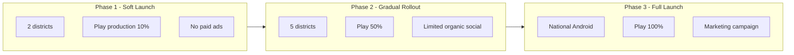

# General Availability (GA) Launch Plan — Prani Doctor

**Document ID:** `GA_LAUNCH_PLAN`  
**Version:** 1.0  
**Date:** 2026-06-01  
**Mode:** Plan only — no implementation  
**Scope:** Public release of Prani Doctor (Bangladesh, Android-first) with scalable operations, governance, monitoring, support, security, and recovery  
**Repositories:** `pranidoctor_user` · `pranidoctor-backend` · `pranidoctor-web`  
**Audience:** Launch Governance Board, SRE, Product Operations, Legal, Engineering, Clinical Ops

---

## Related documents

| Phase | Document |
|-------|----------|
| Closed beta | [closed-beta-launch-plan.md](./closed-beta-launch-plan.md) · [closed-beta-checklist.md](./closed-beta-checklist.md) |
| Beta ops | [beta-operations-runbook.md](./beta-operations-runbook.md) · [beta-support-playbook.md](./beta-support-playbook.md) · [beta-success-metrics.md](./beta-success-metrics.md) |
| Beta exit / ops audit | [closed-beta-operational-readiness-report.md](./closed-beta-operational-readiness-report.md) · [docs/audit/remediation-register.md](../audit/remediation-register.md) |
| Engineering readiness | [PRODUCTION_READINESS_REPORT.md](./PRODUCTION_READINESS_REPORT.md) · [closed-beta-readiness-report.md](./closed-beta-readiness-report.md) |
| Monitoring | [production-monitoring-plan.md](./production-monitoring-plan.md) · [production-monitoring-verification-report.md](./production-monitoring-verification-report.md) |
| Compliance | [legal-compliance-plan.md](./legal-compliance-plan.md) · [legal-safe-messaging-plan.md](./legal-safe-messaging-plan.md) · [ai-compliance-plan.md](../../pranidoctor-web/docs/launch/ai-compliance-plan.md) |
| Emergency | [emergency-escalation-policy.md](../../pranidoctor-web/docs/compliance/emergency-escalation-policy.md) |
| Database | [database-migration-validation-plan.md](./database-migration-validation-plan.md) |
| Operations | [LAUNCH_DAY_RUNBOOK.md](./LAUNCH_DAY_RUNBOOK.md) · [ROLLBACK_PLAN.md](./ROLLBACK_PLAN.md) · [incident-response-guide.md](../incident-response-guide.md) |
| Limitations | [KNOWN_LIMITATIONS.md](./KNOWN_LIMITATIONS.md) |
| **GA implementation (2026-06-01)** | [ga-checklist.md](./ga-checklist.md) · [ga-runbook.md](./ga-runbook.md) · [ga-support-playbook.md](./ga-support-playbook.md) · [ga-war-room-procedures.md](./ga-war-room-procedures.md) · [ga-success-metrics.md](./ga-success-metrics.md) · [ga-launch-readiness-report.md](./ga-launch-readiness-report.md) · [general-availability-readiness-report.md](./general-availability-readiness-report.md) |

---

## Entry assumptions (pre-GA)

This plan assumes the following **closed beta exit criteria are met** before GA planning execution begins:

| Assumption | Exit evidence |
|------------|---------------|
| Closed beta completed (C0→C2, ~50–80 users) | Day-7 / day-14 metrics review signed |
| Operational readiness audit remediated | Composite ≥ **70%**; zero open P0 in [remediation-register.md](../audit/remediation-register.md) |
| Production monitoring Phase 0 live | Uptime, Sentry/webhook, backup cron, `/ready` external probes |
| AI compliance operational | Kill switch M1–M10 drills; consent + disclosures EN+BN |
| Legal package signed | Counsel sign-off; live `/privacy`, `/terms`, Play policy URLs |
| Emergency workflow validated | E2E emergency SR + AI U1/E2 paths on staging |
| Database migration validation | Score ≥ **85**; restore drill logged |
| Major beta blockers resolved | Live VPS/TLS, SMS, on-call, pilot doctors, rollback tag |

If any assumption is false, **do not proceed to GA** — return to closed beta or extended pilot.

---

## Executive summary

| Metric | Beta (baseline) | GA target | Gap |
|--------|----------------:|----------:|-----|
| **Composite launch readiness** | ~70–78 (post-beta) | **≥ 85** | Ops scale, support, payments comms, BN parity |
| **Concurrent users (design)** | ~80 | **500–2,000** | Capacity plan §C |
| **Geography** | 1–2 upazilas | **Multi-district rollout** | Doctor supply + ops staffing |
| **Distribution** | Play closed testing | **Production / open testing track** | Store listing + ASO |
| **Support model** | High-touch WhatsApp | **Tiered SLA + ticket desk** | Support scale §5 |
| **Recommended GA path** | — | **Soft launch → gradual rollout → full launch** | §E |

Prani Doctor is architected for a **controlled GA**: single-VPS Docker Compose with horizontal headroom via worker split and read-replica path. GA does **not** require multi-region HA in v1 but **does** require full observability, 24/7 on-call, formal SLAs, public store release, and ecosystem scale (doctors, livestock modules, AI governance at traffic volume).

**GA is not iOS, national technician marketplace, or in-app payment gateway** in v1 — see [KNOWN_LIMITATIONS.md](./KNOWN_LIMITATIONS.md) §8.

---

# A. GA Launch Objectives

## A.1 Success criteria

GA is successful when **all** of the following hold for **14 consecutive days** after full launch:

| ID | Criterion | Target |
|----|-----------|--------|
| GA-SC-01 | Farmer core loop completion rate | ≥ **65%** SR submitted → `COMPLETED` |
| GA-SC-02 | API availability (synthetic + SLO) | ≥ **99.9%** monthly |
| GA-SC-03 | Crash-free sessions (Android) | ≥ **99.5%** |
| GA-SC-04 | OTP delivery success | ≥ **97%** |
| GA-SC-05 | P0 support tickets unresolved > SLA | **0** |
| GA-SC-06 | SEV-1 incidents unresolved > 1h | **0** |
| GA-SC-07 | CRITICAL AI escalation reviewed | **100%** within **15 min** |
| GA-SC-08 | Legal/compliance P0 checklist | **100%** |
| GA-SC-09 | Doctor accept rate (within 2h of assign) | ≥ **75%** |
| GA-SC-10 | Play Store rating (if ≥ 50 reviews) | ≥ **4.0** |

## A.2 Exit criteria (beta → GA gate)

| Gate | Requirement |
|------|-------------|
| **G-β→GA-1** | All [beta-success-metrics.md](./beta-success-metrics.md) SC-01–SC-10 met or waived with board approval |
| **G-β→GA-2** | Closed beta config `enabled: false` OR cohort widened with documented cap removal plan |
| **G-β→GA-3** | Migration validation score ≥ **85** |
| **G-β→GA-4** | Operational audit re-run ≥ **85%** composite |
| **G-β→GA-5** | GA launch checklist (§Launch checklist) ≥ **95%** pass |
| **G-β→GA-6** | Launch Governance Board **GO** vote recorded |

## A.3 Rollback criteria

Trigger **immediate rollout pause** (Play staged rollout hold + comms) if any:

| ID | Trigger | First action |
|----|---------|--------------|
| GA-RB-01 | API `/ready` down > **5 min** | SEV-1; rollback API/web image |
| GA-RB-02 | OTP success < **85%** for 1h | Pause marketing; SMS provider escalation |
| GA-RB-03 | Crash-free sessions < **98%** for 24h | Pause Play rollout; hotfix or prior AAB |
| GA-RB-04 | Harmful AI output confirmed | Kill switch; legal + product war-room |
| GA-RB-05 | Data breach suspected | Contain; rotate secrets; legal notify |
| GA-RB-06 | Prohibited ETA/SLA copy live | Pause acquisition; CMS hotfix |
| GA-RB-07 | Error rate 5xx > **5%** for 10 min | Rollback deploy |
| GA-RB-08 | Doctor loop broken (assign/complete) | Pause new SR intake; ops manual mode |

Full procedure: [ROLLBACK_PLAN.md](./ROLLBACK_PLAN.md).

## A.4 Launch KPIs (north-star)

| KPI | Definition | GA week 1 target | GA day 30 target |
|-----|------------|-------------------:|-----------------:|
| **DAU** | Daily active farmers | Baseline + 20% | 2× beta peak |
| **Activated farmers** | Profile + ≥1 animal | 500 | 2,000 |
| **Completed consultations** | `COMPLETED` SRs / week | 50 | 300 |
| **Active doctors** | Completed ≥1 SR in 7d | 10 | 40 |
| **AI sessions / day** | Distinct AI sessions | Track baseline | < 30% cost overrun vs budget |
| **Support CSAT** | Post-ticket survey (when shipped) | ≥ 4.0/5 | ≥ 4.2/5 |
| **Infrastructure cost / MAU** | VPS + SMS + LLM | Within budget | ≤ 110% budget |

---

# B. Launch Readiness Assessment

## B.1 Readiness dimensions (post-beta projected)

Scores assume beta exit assumptions met. **GA-specific gaps** remain in scaling, public store, and support tier.

| Dimension | Beta exit (est.) | GA required | GA gap | Primary action |
|-----------|----------------:|------------:|-------:|----------------|
| **Technical readiness** | 83% | ≥ 90% | BN parity, FCM, App Links, test debt | Mobile release hardening |
| **Operational readiness** | 75% | ≥ 88% | 24/7 on-call, log aggregation, status page | SRE Phase 1 |
| **Compliance readiness** | 80% | ≥ 92% | Play Data Safety, DSAR runbook, marketing copy review | Legal GA pack |
| **Security readiness** | 82% | ≥ 90% | WAF/rate-limit review, secrets rotation drill, AV on uploads | Security GA audit |
| **Business readiness** | 60% | ≥ 80% | Doctor supply, support staffing, payment comms, marketing | Product ops |

## B.2 Production readiness analysis (10 domains)

### 1. Production readiness (platform)

| Area | Status @ GA gate | Notes |
|------|------------------|-------|
| HTTPS API + admin | Required | Multi-subdomain TLS |
| CI/CD E2E deploy | Required | Recorded rollback tags |
| Backup + restore drill | Required | Quarterly schedule post-GA |
| Single-VPS documented | Accepted | HA plan at 2k+ concurrent |

### 2. Scaling readiness

| Area | Beta | GA v1 | GA v2 (post-launch) |
|------|------|-------|---------------------|
| API replicas | 1 | 1–2 (compose scale) | Worker split |
| DB connections | Pool default | Tune `DATABASE_POOL_SIZE` | Read replica |
| Redis | 1 | 1 | Sentinel optional |
| CDN | None | Optional | Recommended at 1k+ MAU |
| Auto-scaling | Manual | Manual | K8s or second VPS |

### 3. Operational readiness

| Control | GA requirement |
|---------|----------------|
| On-call | 24/7 primary + backup |
| Runbooks | GA ops runbook (extend beta runbook) |
| Launch ops dashboard | `/admin/launch-ops` → GA metrics mode |
| Cohort controls | Disable closed beta gates OR raise caps to marketing plan |

### 4. Compliance readiness

| Control | GA requirement |
|---------|----------------|
| Legal pages live | 200 on public URLs |
| Counsel sign-off | GA addendum (marketing, AI, emergency) |
| Consent at scale | Audit sampling weekly |
| Play policies | Data Safety + content rating complete |

### 5. Support readiness

| Tier | Channel | SLA |
|------|---------|-----|
| P0 | On-call + ticket | 1h |
| P1 | In-app ticket | 4h BH |
| P2 | Ticket | 24h |
| Doctor | Dedicated line + WhatsApp ops | 2h BH |

### 6. Security readiness

| Control | GA requirement |
|---------|----------------|
| Kill switch | Drill quarterly |
| Rate limits | Load test verified |
| RBAC | Admin audit quarterly |
| Upload AV | P1 unless waived |

### 7. Disaster recovery readiness

| Metric | GA target |
|--------|-----------|
| RPO | ≤ 24h (hourly backups post-GA P1) |
| RTO | ≤ 4h |
| DR tabletop | Annually |
| Offsite backup | Required |

### 8. Doctor ecosystem readiness

| Metric | GA soft launch | GA full |
|--------|---------------:|--------:|
| Verified doctors | 15 | 40+ |
| Districts covered | 2 | 5+ |
| Manual assign staffed | 12h/day | 16h/day |
| Auto-routing | No | Phase 2 |

### 9. Livestock ecosystem readiness

| Module | GA scope |
|--------|----------|
| Animals / profiles | Full |
| Feed catalog + consumption | Full |
| Inventory / offline sync | Full with support macros |
| Fattening batches | Soft launch districts only |

### 10. AI ecosystem readiness

| Control | GA requirement |
|---------|----------------|
| Cost budget + alerts | `ai_cost_usd_total` thresholds |
| Governance | Global + per-feature scopes tested under load |
| Escalation queue staffed | Business hours + on-call for CRITICAL |
| BN AI disclaimers | Parity with EN |

---

# C. Capacity Planning

## C.1 Baseline assumptions

| Parameter | Soft launch | Gradual rollout | Full launch |
|-----------|------------:|----------------:|------------:|
| MAU | 500 | 2,000 | 10,000 |
| Peak RPS (API) | 5 | 20 | 80 |
| Peak concurrent mobile | 50 | 200 | 800 |
| SRs / day | 20 | 80 | 400 |
| AI sessions / day | 100 | 500 | 2,500 |

Architecture: **single VPS** (8 vCPU / 16 GB RAM reference) + managed Postgres optional upgrade path.

## C.2 API capacity

| Resource | Limit (est.) | GA soft headroom | Action if exceeded |
|----------|-------------:|-----------------:|--------------------|
| Express event loop | ~100 RPS single instance | 5 RPS target | Scale API container ×2 |
| JWT auth | Redis-bound | Monitor `auth_failures_total` | Redis scale |
| BFF proxy | +30% latency vs direct | p95 < 800ms | CDN/cache static; direct API for mobile Phase 2 |
| Rate limits | Fail closed | Tune per GA traffic | Redis HA |

**Load test gate (GA-P0):** k6 or equivalent — 20 RPS for 10 min, p95 < 1s, error rate < 0.1%.

## C.3 Database capacity

| Metric | Threshold | Alert |
|--------|-----------|-------|
| Connections | 80% of `max_connections` | ALT-DB-* |
| Slow queries | > 500ms sustained | `pranidoctor_db_slow_queries_total` |
| Disk | 70% full | Infrastructure alert |
| Migration deploy time | < 5 min | Pre-GA rehearsal |

**GA recommendation:** Enable `pg_stat_statements`; plan read replica at **> 1k MAU** or p95 query > 200ms.

## C.4 Queue capacity

| Queue | GA volume | Worker |
|-------|-----------|--------|
| Notifications (in-app) | Medium | API inline |
| AI escalation review | Low–medium | Worker process |
| Export / analytics | Low | Defer heavy jobs |

**GA-P1:** Split `worker` container when `queue_waiting > 100` sustained.

## C.5 Notification capacity

| Channel | Beta | GA |
|---------|------|-----|
| SMS (OTP) | Live | Provider quota ≥ 10k/mo |
| FCM push | Waived | **Required** for GA engagement |
| In-app | Yes | Yes |
| Email | Optional | Transactional provider |

**GA-P0:** Firebase configured; `ENABLE_PUSH=true` in production.

## C.6 AI workload capacity

| Metric | Budget (example) | Alert |
|--------|------------------|-------|
| LLM calls / day | 5,000 | 80% warning |
| Cost USD / day | $50 | ALT-AI-* |
| Tokens / session p95 | Monitor | Kill switch if provider outage |

Rules-based fallback must handle **100% traffic** when LLM disabled (already architected).

---

# D. Risk Assessment

## D.1 Risk register

| ID | Risk | P | L | I | Priority | Mitigation |
|----|------|---|---|---|----------|------------|
| GA-R-01 | Single VPS failure | M | H | H | **P0** | Backups, RTO runbook, status comms |
| GA-R-02 | Doctor supply insufficient | H | H | H | **P0** | Pre-recruit 15+ doctors; geographic caps |
| GA-R-03 | SMS provider outage | M | H | H | **P0** | Secondary route or failover provider |
| GA-R-04 | AI harmful output at scale | L | H | H | **P0** | Kill switch, escalation queue, legal CMS |
| GA-R-05 | OTP abuse / cost spike | M | M | M | **P1** | Rate limits, CAPTCHA path, monitoring |
| GA-R-06 | Manual payment confusion | H | M | M | **P1** | In-app + support macros; reconciliation SOP |
| GA-R-07 | BN localization gaps | M | M | M | **P1** | Critical path BN QA before marketing |
| GA-R-08 | Play policy rejection | M | M | H | **P1** | Pre-review Data Safety + demo account |
| GA-R-09 | DB migration failure on deploy | L | H | H | **P1** | Validation framework ≥ 85; backup before migrate |
| GA-R-10 | Support overload | H | M | M | **P1** | Tiered SLA, FAQ, in-app help |
| GA-R-11 | LLM cost overrun | M | M | M | **P2** | Budget alerts; scope throttling |
| GA-R-12 | No CDN — slow media | M | L | L | **P2** | CDN at 1k MAU |
| GA-R-13 | Manual assign bottleneck | H | M | M | **P2** | Ops staffing; auto-assign Phase 2 |
| GA-R-14 | iOS user demand | M | L | L | **P3** | Communicate Android-only |
| GA-R-15 | Legacy tsx runtime | L | L | M | **P3** | Compile pipeline backlog |

## D.2 Priority definitions (GA)

| Priority | Definition | Response | Blocks GA? |
|----------|------------|----------|:----------:|
| **P0** | Safety, legal, data loss, total outage at launch scale | 24–72h | **Yes** |
| **P1** | Major UX/revenue/ops at scale | 7 days | Soft launch only |
| **P2** | Degraded experience | 14 days | No (waiver ok) |
| **P3** | Backlog | 30+ days | No |

---

# E. Launch Strategy

## E.1 Three-phase rollout

## E.2 Phase 1 — Soft launch (weeks 1–2)

| Element | Policy |
|---------|--------|
| **Geography** | 2 districts max (proven beta districts + 1 adjacent) |
| **Users** | Cap **500** new registrations/week (config or ops monitor) |
| **Doctors** | Minimum **15** active verified |
| **Play** | Production track, **10%** staged rollout |
| **Marketing** | None paid; referral + co-op partners only |
| **Closed beta** | Disabled; remove invite gate |
| **Support** | Extended hours 08:00–22:00 BDT |
| **Exit to Phase 2** | GA-SC-01–06 met for 7 days; no open SEV-1 |

## E.3 Phase 2 — Gradual rollout (weeks 3–6)

| Element | Policy |
|---------|--------|
| **Geography** | Expand to **5 districts** if doctor density OK |
| **Users** | Cap **2,000** new registrations/week |
| **Play** | Increase to **50%** if crash-free ≥ 99.5% |
| **Marketing** | Limited organic + field activations |
| **Monitoring** | Prometheus + Grafana live (Phase 1 ops) |
| **Exit to Phase 3** | Support SLA met 2 weeks; completion rate ≥ 65% |

## E.4 Phase 3 — Full launch (week 7+)

| Element | Policy |
|---------|--------|
| **Geography** | National Android (Bangladesh) |
| **Play** | **100%** rollout |
| **Marketing** | Full campaign per product plan |
| **Support** | 24/7 on-call; business-hour tier-1 desk |
| **Review** | Day-30 GA retrospective + cost review |

## E.5 Launch day sequence

Follow [LAUNCH_DAY_RUNBOOK.md](./LAUNCH_DAY_RUNBOOK.md) with GA extensions:

| Time | Action |
|------|--------|
| T-7d | GA checklist sign-off; doctor recruitment complete |
| T-24h | Freeze deploy except hotfix; record rollback tags |
| T-1h | War room open; synthetic checks green |
| T-0 | Enable Play production 10%; monitor dashboards |
| T+1h | OTP sample; SR smoke; AI health |
| T+24h | Metrics review vs GA-SC-* |
| T+7d | Phase gate decision |

---

# F. Incident Readiness

## F.1 War room procedures

| Item | GA standard |
|------|-------------|
| Channel | `#prani-ga-war-room` (Slack/WhatsApp) |
| Standing members | Launch lead, SRE on-call, backend, mobile, product, legal (on-call for P0 copy/AI) |
| Activation | Any GA-RB-* trigger or SEV-1 |
| Update cadence | Every **15 min** during SEV-1 |
| Status comms | Template for farmers (in-app banner + social if > 30 min) |

## F.2 Escalation procedures

| Severity | Example | L1 | L2 | L3 | Max response |
|----------|---------|----|----|-----|--------------|
| SEV-1 | API down, breach, AI safety | SRE on-call | SRE director | Launch lead + exec | **15 min** |
| SEV-2 | OTP degraded, 5xx spike | Backend on-call | DevOps | Product | **1 h** |
| SEV-3 | Single feature degraded | Feature owner | Product | Backlog | **1 day** |

Cross-reference: [incident-response-guide.md](../incident-response-guide.md) · [beta-support-playbook.md](./beta-support-playbook.md) §5–6.

## F.3 Incident ownership

| Role | Owns |
|------|------|
| **Incident commander** | Timeline, comms, rollback decision |
| **SRE lead** | Infra, deploy, monitoring |
| **Backend lead** | API, DB, queue, SMS |
| **Mobile lead** | App crashes, Play rollout |
| **AI safety owner** | Kill switch, escalation queue |
| **Legal liaison** | Copy, consent, breach notification |
| **Product ops** | Doctor supply, support surge |

Roster stored in team wiki (not git). **GA-P0:** roster published with 24/7 coverage.

## F.4 Recovery expectations

| Scenario | RTO target | RPO target | Procedure |
|----------|------------|------------|-----------|
| Bad deploy | **15 min** | 0 | Image rollback |
| Redis down | **30 min** | 0 | Restart / failover |
| DB corruption | **4 h** | 24h | Restore from backup |
| Full VPS loss | **4 h** | 24h | Redeploy + restore |
| Play bad release | **1 h** | 0 | Pause rollout + prior AAB |
| AI provider outage | **5 min** | 0 | Kill switch → rules fallback |

---

# G. Success Metrics

## G.1 Adoption metrics

| Metric | Source | GA day 30 target |
|--------|--------|-----------------:|
| New registrations / day | Analytics | Track vs plan |
| Activation rate (72h) | Analytics | ≥ **75%** |
| D7 retention | Crashlytics / analytics | ≥ **45%** |
| D30 retention | Analytics | ≥ **25%** |
| Animals per activated user | DB | ≥ **1.5** |

## G.2 Reliability metrics

| Metric | Source | Target |
|--------|--------|--------|
| API availability | Uptime + `/ready` | **99.9%** |
| p95 API latency | Prometheus | < **800 ms** |
| Error rate 5xx | Prometheus | < **0.1%** |
| Crash-free sessions | Crashlytics | **99.5%** |
| MTTR SEV-1 | Incident log | < **1 h** |

## G.3 Doctor metrics

| Metric | Source | Target |
|--------|--------|--------|
| Active doctors (7d) | Admin analytics | ≥ **40** @ day 30 |
| Accept rate (2h) | SR timestamps | ≥ **75%** |
| Completion rate | SR status | ≥ **65%** |
| Doctor NPS (survey) | Ops | ≥ **4.0** |

## G.4 Emergency metrics

| Metric | Source | Target |
|--------|--------|--------|
| Emergency SR volume | Dashboard | Track baseline |
| Time to first human touch | Ops log | < **30 min** BH |
| AI emergency banner display rate | Compliance audit | 100% when triggered |
| CRITICAL escalation review | AI ops | **100%** < 15 min |

## G.5 AI metrics

| Metric | Source | Target |
|--------|--------|--------|
| Sessions / day | `ai_*` metrics | Within budget |
| LLM disabled hours | Governance | Track |
| Fallback rate | `ai_fallbacks_total` | < **20%** |
| Escalations open | Admin AI ops | Trend down |
| Cost USD / MAU | Finance + Prometheus | Within budget |

---

# Launch readiness analysis

## Composite GA readiness score (projected)

| Dimension | Weight | Beta exit | GA target | Gap |
|-----------|-------:|----------:|----------:|----:|
| Technical | 22% | 83 | 90 | 7 |
| Operational | 22% | 75 | 88 | 13 |
| Compliance | 18% | 80 | 92 | 12 |
| Security | 14% | 82 | 90 | 8 |
| Business | 14% | 60 | 80 | 20 |
| Scaling | 10% | 55 | 85 | 30 |
| **Weighted GA readiness (today→target)** | 100% | **~76** | **≥ 85** | **~9 pts** |

**Interpretation:** With beta exit assumptions met, GA is **~76% ready** — **not yet GO for public launch**. Closing P0 gaps (+ operational scale + business readiness) targets **≥ 85%**.

---

# Remaining gaps (GA-specific)

| ID | Gap | Priority | Owner |
|----|-----|----------|-------|
| GA-GAP-01 | FCM / Firebase production config | P0 | Mobile |
| GA-GAP-02 | Play production track + store listing | P0 | Product |
| GA-GAP-03 | 24/7 on-call + status comms template | P0 | SRE |
| GA-GAP-04 | Doctor supply ≥ 15 for soft launch | P0 | Clinical ops |
| GA-GAP-05 | Load test 20 RPS gate | P0 | SRE |
| GA-GAP-06 | BN critical-path localization | P1 | Mobile |
| GA-GAP-07 | Admin support ticket desk | P1 | Web |
| GA-GAP-08 | Prometheus + Grafana deployed | P1 | SRE |
| GA-GAP-09 | Payment reconciliation at scale | P1 | Product ops |
| GA-GAP-10 | CDN for media | P2 | DevOps |
| GA-GAP-11 | Read replica / worker split | P2 | SRE |
| GA-GAP-12 | Auto-assignment | P3 | Product |

---

# GA Launch checklist

## H. Pre-GA platform

| # | Item | Owner | P | Status |
|---|------|-------|---|--------|
| H1 | Production VPS + TLS (api, admin) | DevOps | P0 | ☐ |
| H2 | Backup cron + offsite copy | DevOps | P0 | ☐ |
| H3 | Restore drill logged (< 90 days) | DevOps | P0 | ☐ |
| H4 | Deploy E2E with rollback tag | DevOps | P0 | ☐ |
| H5 | External uptime on `/ready` + BFF | SRE | P0 | ☐ |
| H6 | Sentry + webhook live | SRE | P0 | ☐ |
| H7 | Load test 20 RPS pass | SRE | P0 | ☐ |
| H8 | Migration validation ≥ 85 | DBA | P0 | ☐ |

## I. Mobile & store

| # | Item | Owner | P | Status |
|---|------|-------|---|--------|
| I1 | Firebase + FCM production | Mobile | P0 | ☐ |
| I2 | Play production / open track | Mobile | P0 | ☐ |
| I3 | Data Safety form complete | Legal | P0 | ☐ |
| I4 | App Links / assetlinks.json | Mobile | P1 | ☐ |
| I5 | BN critical screens QA | Mobile | P1 | ☐ |
| I6 | Staged rollout configured | Mobile | P0 | ☐ |

## J. Compliance & legal

| # | Item | Owner | P | Status |
|---|------|-------|---|--------|
| J1 | Counsel GA sign-off | Legal | P0 | ☐ |
| J2 | Live privacy/terms/refund 200 | Legal | P0 | ☐ |
| J3 | AI + emergency CMS EN+BN | Legal | P0 | ☐ |
| J4 | Consent audit sample weekly | Compliance | P1 | ☐ |
| J5 | Marketing copy legal review | Legal | P0 | ☐ |

## K. Ecosystems

| # | Item | Owner | P | Status |
|---|------|-------|---|--------|
| K1 | ≥ 15 doctors soft launch | Clinical ops | P0 | ☐ |
| K2 | Manual assign staffed 12h+ | Ops | P0 | ☐ |
| K3 | Livestock modules smoke @ scale | QA | P1 | ☐ |
| K4 | AI kill switch drill (< 90 days) | AI ops | P0 | ☐ |
| K5 | AI cost budget alerts | SRE | P1 | ☐ |
| K6 | Emergency workflow E2E | QA | P0 | ☐ |

## L. Support & ops

| # | Item | Owner | P | Status |
|---|------|-------|---|--------|
| L1 | 24/7 on-call roster | Launch lead | P0 | ☐ |
| L2 | Tiered SLA published | Support | P0 | ☐ |
| L3 | Payment reconciliation SOP | Product ops | P1 | ☐ |
| L4 | GA war room runbook dry-run | Launch lead | P0 | ☐ |
| L5 | Status / outage comms template | Product | P1 | ☐ |

## M. Closed beta exit

| # | Item | Owner | P | Status |
|---|------|-------|---|--------|
| M1 | Beta metrics SC-01–SC-10 met | Product | P0 | ☐ |
| M2 | Closed beta disabled or cap removed | Product | P0 | ☐ |
| M3 | Operational audit ≥ 85% | Auditor | P0 | ☐ |
| M4 | Board GO vote | Board | P0 | ☐ |

---

# Go / No-Go criteria

## GO (soft launch Phase 1)

All **P0** checklist items (H, I, J, K, L, M) **pass** AND:

| Criterion | Threshold |
|-----------|-----------|
| Composite GA readiness | ≥ **85%** |
| Migration validation | ≥ **85** |
| Zero open GA-P0 risks | Yes |
| Doctor count | ≥ **15** |
| Load test | Pass |
| Board vote | **GO** recorded |

## GO WITH CONDITIONS (extended pilot only)

| Criterion | Allows |
|-----------|--------|
| Composite 78–84% | Phase 1 with **250 user/week cap** + no paid marketing |
| P1 waivers signed | Per-item board approval |
| FCM delayed | In-app only + documented W-GA-01 |

## NO GO

| Trigger |
|---------|
| Any GA-P0 checklist fail without waiver |
| Composite < **78%** |
| Migration validation < **75** |
| Open SEV-1 in last 7 days |
| Legal withholds GA sign-off |
| Doctor supply < **10** |

---

# Timeline (indicative)

| Week | Milestone |
|------|-----------|
| W-4 | GA gap closure sprint (P0) |
| W-3 | Load test, migration rehearsal, doctor recruitment |
| W-2 | Play pre-launch review; legal GA sign-off |
| W-1 | War room dry-run; freeze |
| W0 | **Soft launch** Phase 1 |
| W2 | Phase gate → Phase 2 if metrics OK |
| W6 | Phase gate → Phase 3 |
| W10 | Day-30 GA retrospective |

---

# Sign-off

| Role | Name | Date | GA plan approved | Go/No-Go |
|------|------|------|:----------------:|----------|
| Launch lead | | | ☐ | |
| SRE director | | | ☐ | |
| Product operations | | | ☐ | |
| Engineering | | | ☐ | |
| Legal | | | ☐ | |
| Launch Governance Board | | | ☐ | |

---

*Plan only — no implementation. Execute GA checklist after closed beta exit criteria and operational audit remediation are complete.*
