# Production Launch Legal & Compliance Package — Prani Doctor

**Document ID:** `LEGAL_COMPLIANCE_LAUNCH_PLAN`  
**Version:** 1.0  
**Date:** 2026-05-30  
**Mode:** Plan only — **no implementation in this document**  
**Scope:** Controlled Beta · Public Beta · General Availability (GA)  
**Repositories:** `pranidoctor_user` (Flutter) · `pranidoctor-backend` (API/worker) · `pranidoctor-web` (admin BFF + public legal)  
**Assumed product maturity:** ~85% feature-complete · ~70% production-readiness (engineering/ops)

**Related launch documents**

| Area | Document |
|------|----------|
| Production score | [PRODUCTION_READINESS_REPORT.md](./PRODUCTION_READINESS_REPORT.md) |
| Closed beta | [closed-beta-launch-plan.md](./closed-beta-launch-plan.md) |
| Go-live checklist | [GO_LIVE_CHECKLIST.md](./GO_LIVE_CHECKLIST.md) |
| Legal-safe messaging | [legal-safe-messaging-plan.md](./legal-safe-messaging-plan.md) · [legal-safe-messaging-verification-report.md](./legal-safe-messaging-verification-report.md) |
| AI governance | [ai-compliance-plan.md](../../pranidoctor-web/docs/launch/ai-compliance-plan.md) |
| Compliance corpus (canonical) | `pranidoctor-web/docs/compliance/**` |
| Launch legal package (repo) | `docs/legal/*` · `docs/compliance/compliance-matrix.md` |
| Implementation report | [legal-compliance-implementation-report.md](./legal-compliance-implementation-report.md) |

---

## Executive summary

Prani Doctor has invested heavily in **compliance infrastructure** — not only static legal markdown, but versioned `LegalDocument` registry, `LegalConsentEvent` / `LegalAcceptanceEvent` audit trails, mobile re-consent UX, CMS-managed AI/vet/emergency disclaimers, AI safety guardrails, and a data-processing policy suite. **Legal engineering readiness (~75/100) exceeds operational/legal sign-off readiness (~55/100).**

| Launch stage | Compliance verdict | Minimum score target |
|--------------|-------------------|----------------------|
| **Controlled Beta** | **CONDITIONAL GO** | ≥ 65 |
| **Public Beta** | **NOT READY** (today) | ≥ 78 |
| **General Availability** | **NOT READY** (today) | ≥ 88 |

**Composite compliance score (today): 68 / 100** — suitable to **start closed beta** after P0 legal/ops gates below; not suitable for unconstrained public launch without P1 closure.

```mermaid
flowchart LR
  subgraph docs [Legal documents]
    ToS[Terms family]
    Priv[Privacy]
    AI[AI limits + consent]
    Emer[Emergency limitation]
    Vet[Vet disclaimer]
    Data[Data processing]
  end
  subgraph controls [Enforcement]
    Mobile[Flutter gates]
    API[Backend middleware]
    CMS[Admin CMS]
    Audit[Consent audit]
  end
  subgraph ops [Operations]
    Counsel[Legal sign-off]
    DPA[Vendor DPAs]
    DSAR[DSAR / erasure SOP]
    Ret[Retention jobs]
  end
  docs --> controls
  controls --> ops
```



---

## 1. Current compliance posture (gap analysis)

### 1.1 What is implemented (as-built)

| Domain | Implementation evidence | Maturity |
|--------|-------------------------|----------|
| **Privacy policy** | `PRIVACY_POLICY.md`, `/privacy`, `mobile.legal.config`, accept API | **High** (enforcement env-default off) |
| **Terms of Service** | Customer/provider/admin schedules, `LegalDocument`, panel gates, mobile re-consent | **Medium–High** (registration audit gap) |
| **AI disclaimer** | CMS `mobile.ai.disclaimer.config`, T1/T2/T3, `/api/ai/*` consent middleware | **High** on primary routes |
| **AI escalation** | CMS E1/E2/E3, strips on chat/triage/symptom paths | **Medium–High** |
| **Emergency limitation** | CMS U0–U3, instant care + book + SR pending + `EMERGENCY_DOCTOR` guard | **High** on human urgent paths |
| **Vet disclaimer** | CMS V0–V3, booking + instant care + treatment journal banner | **Medium** (unwired surfaces) |
| **Consent audit** | `LegalConsentEvent`, `LegalAcceptanceEvent`, admin legal-consent API | **High** |
| **Legal-safe messaging** | ETA removal in l10n; `messaging-compliance.ts` on CMS saves | **High** (code); BN subtitle gap |
| **Data processing docs** | Policy, classification, retention mapping, RoPA, ops runbook | **High** (documentation) |
| **AI safety** | Prompt bans, `stripProhibitedEtaPhrases`, kill switch PG-backed | **Medium–High** |
| **Public legal pages** | `/privacy`, `/terms`, `/refund`, `/legal/disclaimer` | **Medium** (live URL not verified) |

### 1.2 Gap analysis (summary)

| Gap ID | Description | Launch impact |
|--------|-------------|---------------|
| G-L01 | `MOBILE_ENFORCE_PRIVACY_CONSENT` defaults **false** | Public beta blocker |
| G-L02 | Privacy/ToS **version drift** across markdown, DB, seeds | All stages risk |
| G-L03 | No automated **data export / erasure** jobs | GA blocker |
| G-L04 | Retention **purge crons** not shipped | GA blocker |
| G-L05 | **LLM vendor DPAs** not evidenced in repo | P0 legal |
| G-L06 | **Play Store Data Safety** / store legal URLs | Public beta blocker |
| G-L07 | **Cookie / analytics** consent for web (Sentry, admin) | GA / EU-ready |
| G-L08 | **AI Technician / marketplace** provider ToS enforcement | Public beta if marketplace live |
| G-L09 | **Complaint handling policy** not published (model exists) | GA recommended |
| G-L10 | **Community Guidelines** not standalone | P2 |
| G-L11 | Registration-time **consent capture** incomplete | P1 |
| G-L12 | Phase 8 AI routes (knowledge, alerts, follow-ups) **low banner coverage** | Controlled beta if routes enabled |
| G-L13 | **Data governance** — ~68 Prisma models under-mapped in retention | GA audit risk |
| G-L14 | **Counsel sign-off** not recorded in `LegalDocument.metadataJson` | All commercial launch |
| G-L15 | Ops: staging TLS, backup drill, live legal URLs | Controlled beta blocker |

### 1.3 Verification report synthesis

| Report | Score | Verdict | Notes |
|--------|------:|---------|-------|
| [TERMS_OF_SERVICE_COMPLIANCE_VERIFICATION_REPORT.md](../../pranidoctor-web/docs/compliance/legal/TERMS_OF_SERVICE_COMPLIANCE_VERIFICATION_REPORT.md) | 72 | Conditional | Panel gates fixed; registration checkbox gap |
| [PRIVACY_PRODUCTION_READINESS_REPORT.md](../../pranidoctor-web/docs/compliance/legal/PRIVACY_PRODUCTION_READINESS_REPORT.md) | 2.9/5 | Conditional beta only | Enforcement off by default |
| [USER_CONSENT_VERIFICATION_REPORT.md](../../pranidoctor-web/docs/compliance/consent/USER_CONSENT_VERIFICATION_REPORT.md) | — | Partial pass | Dual audit systems |
| [EMERGENCY_LIMITATION_VERIFICATION_REPORT.md](../../pranidoctor-web/docs/compliance/emergency/EMERGENCY_LIMITATION_VERIFICATION_REPORT.md) | 71 | Conditional | **EL-02 ETA conflict remediated in code** — refresh report |
| [VET_DISCLAIMER_VERIFICATION_REPORT.md](../../pranidoctor-web/docs/compliance/veterinary/VET_DISCLAIMER_VERIFICATION_REPORT.md) | 74 | Conditional | Prescription/feed ration unwired |
| [DATA_GOVERNANCE_REPORT.md](../../pranidoctor-web/docs/compliance/data/DATA_GOVERNANCE_REPORT.md) | 62 | Conditional | Docs only |
| [legal-safe-messaging-verification-report.md](./legal-safe-messaging-verification-report.md) | 79 | Pass w/ warnings | Symptom checker build error |
| [ai-compliance-plan.md](../../pranidoctor-web/docs/launch/ai-compliance-plan.md) | ~72 | Conditional | Secondary AI routes |

---

## 2. Section A — Required legal documents

### 2.1 Document register

| Document | Required? | Status | Canonical location | Public URL / surface |
|----------|-----------|--------|------------------|----------------------|
| **Terms of Service (Customer)** | **Yes** | Draft + registry | [TERMS_OF_SERVICE_CUSTOMER.md](../../pranidoctor-web/docs/compliance/legal/TERMS_OF_SERVICE_CUSTOMER.md) | `/terms` |
| **Terms of Service (Provider — Doctor)** | **Yes** (if doctors onboard) | Draft + gate | [TERMS_OF_SERVICE_PROVIDER_DOCTOR.md](../../pranidoctor-web/docs/compliance/legal/TERMS_OF_SERVICE_PROVIDER_DOCTOR.md) | Doctor panel accept |
| **Terms of Service (Provider — AI Technician)** | **Yes** (if marketplace live) | Planned in ToS plan | Schedule C in [terms-of-service-plan.md](../../pranidoctor-web/docs/compliance/legal/terms-of-service-plan.md) | Technician onboarding |
| **Terms of Service (Admin / Support)** | **Yes** | Draft | [TERMS_OF_SERVICE_ADMIN.md](../../pranidoctor-web/docs/compliance/legal/TERMS_OF_SERVICE_ADMIN.md) | `AdminLegalGate` |
| **Privacy Policy** | **Yes** | Draft + accept flow | [PRIVACY_POLICY.md](../../pranidoctor-web/docs/compliance/legal/PRIVACY_POLICY.md) | `/privacy` |
| **Cookie Policy** | **Yes** (web admin + analytics) | **Gap** — fold into Privacy § cookies or separate page | Privacy plan G16 | `/privacy#cookies` or `/cookies` |
| **Refund / cancellation policy** | **Yes** (payments partial) | Page exists | Web content | `/refund` |
| **AI Usage Policy** | **Yes** | **Split** | AI consent doc + [ai-disclaimer-plan.md](../../pranidoctor-web/docs/compliance/ai/ai-disclaimer-plan.md) + [ai-disclaimer-policy.md](../../pranidoctor-web/docs/compliance/ai-disclaimer-policy.md) | Settings → AI consent |
| **AI Limitation Notice** | **Yes** | CMS T1/T2/T3 | `mobile.ai.disclaimer.config` | In-app banners |
| **Emergency Disclaimer / Limitation** | **Yes** | CMS U0–U3 | [emergency-service-limitation-plan.md](../../pranidoctor-web/docs/compliance/emergency/emergency-service-limitation-plan.md) | In-app + accept sheet |
| **Veterinary Disclaimer** | **Yes** | CMS V0–V3 | [veterinary-disclaimer-plan.md](../../pranidoctor-web/docs/compliance/veterinary/veterinary-disclaimer-plan.md) | Booking + care flows |
| **Community Guidelines** | **Recommended** | **Gap** | Embed in ToS § conduct or new page | P2 — `/community` |
| **Acceptable Use Policy** | **Yes** (admin) | Covered | `TERMS_OF_SERVICE_ADMIN.md` | Admin gate |
| **Data Retention Policy** | **Yes** | Policy approved | [DATA_RETENTION.md](../../pranidoctor-web/docs/compliance/legal/DATA_RETENTION.md) | Link from Privacy |
| **Data Processing Policy (internal)** | **Yes** (operator) | Complete | [DATA_PROCESSING_POLICY.md](../../pranidoctor-web/docs/compliance/data/DATA_PROCESSING_POLICY.md) | Internal / DPA annex |
| **User Consent Policy** | **Yes** | **Split** | [user-consent-flow-plan.md](../../pranidoctor-web/docs/compliance/consent/user-consent-flow-plan.md) + [ACCEPTANCE_STRATEGY.md](../../pranidoctor-web/docs/compliance/legal/ACCEPTANCE_STRATEGY.md) | Process doc |
| **Complaint Handling Policy** | **Recommended** | **Gap** | ToS references `Complaint` model — needs published SOP | Support + admin |

### 2.2 Document need assessment (by launch stage)

| Document | Controlled Beta | Public Beta | GA |
|----------|:-------------:|:-----------:|:--:|
| Customer ToS + Privacy | Required (soft enforce) | Required (enforce) | Required |
| Provider doctor ToS | If pilot doctors | Required | Required |
| AI consent + limitation notices | Required | Required | Required |
| Emergency + vet disclaimers | Required | Required | Required |
| Cookie policy | Inform if web analytics on | Required if Sentry/cookies | Required |
| Data retention (user-facing summary) | Link from privacy | Published schedule | Automated enforcement |
| Complaint / community | Internal SOP OK | Published summary | Full policy + SLA |
| AI Technician provider agreement | If feature enabled | If feature enabled | Required for marketplace |

### 2.3 Counsel workflow (all stages)

Per [LEGAL_OPERATIONS.md](../../pranidoctor-web/docs/compliance/legal/LEGAL_OPERATIONS.md):

1. Draft BN + EN with counsel.
2. Insert new `LegalDocument` version (immutable history).
3. Bump `mobile.legal.config` versions.
4. Deploy backend → web → mobile.
5. Record sign-off in `LegalDocument.metadataJson` (field planned in ToS plan).

---

## 3. Section B — AI compliance review

### 3.1 AI recommendations

| Control | As-built | Gap |
|---------|----------|-----|
| Educational framing only | System prompts: no diagnose/prescribe | DB prompts may diverge from seed — admin change control |
| Smart recommendations / farm health | T2 banners on main pages | Alerts/follow-ups/knowledge **unlinked** — no banner |
| Feed ration AI | Separate BN footer | Not unified with AI CMS |

### 3.2 AI warnings & limitations

| Tier | Purpose | Status |
|------|---------|--------|
| T1 banner | Persistent AI limitation | Primary AI surfaces |
| T2 contextual | Feature-specific | Chat, advisory, recommendations |
| T3 modal | First-use acceptance | `AiConsentPage` + middleware |
| E2 escalation | Urgency ≠ dispatch | Chat, triage, symptom checker |
| U1 urgent (emergency) | Life-threatening | Instant care, book emergency; **symptom checker via wrapper** |

### 3.3 AI escalation rules

| Rule | Implementation |
|------|----------------|
| Keyword / symptom emergency | `assessSymptomRisk`, triage HIGH |
| Escalation record | `AiEscalationRecord`, admin risk panel |
| Support vs vet | E2 `supportVsVet` copy |
| Human review disclaimer | E2 `humanReview`, `escalationRecorded` |

### 3.4 AI auditability

| Artifact | Storage | Gap |
|----------|---------|-----|
| LLM usage | `AiUsage` metrics + persistence plan | Ops dashboards partial |
| Safety audits | `AiSafetyAuditLog`, escalation records | — |
| Consent | `LegalConsentEvent` AI_PROCESSING | — |
| Prompt changes | `AiPromptTemplate` versions | No farmer-facing changelog |
| Kill switch | `AiGovernanceService` + PG | User notice when disabled — **gap** |

**Reference:** [ai-compliance-plan.md](../../pranidoctor-web/docs/launch/ai-compliance-plan.md) P0 checklist.

---

## 4. Section C — Veterinary compliance review

### 4.1 Consultation flows

| Flow | Disclaimer | Acceptance gate | Messaging |
|------|------------|-----------------|-----------|
| Book home / online | V1 + contextual | Vet + emergency if EMERGENCY | Legal-safe subtitles (post ETA fix) |
| Service request pending | `requestPending` U2 | — | Factual status notifications |
| Doctor accept/complete | Notifications only | — | No outcome guarantees |

### 4.2 Prescription flows

| Surface | Vet disclaimer | Gap |
|---------|----------------|-----|
| Doctor panel prescriptions | Provider ToS + clinical SOP | — |
| Farmer prescription view | `prescriptionView` contextual in CMS | **Flutter view unwired** per vet verification |

### 4.3 Emergency flows

| Control | Status |
|---------|--------|
| Not a clinic / not dispatch | U1/U3 defaults |
| First emergency accept | Server guard on `EMERGENCY_DOCTOR` |
| Phone dial | `phoneDial` contextual |
| AI emergency | `aiEmergency` + E2; U1 on wrapper when `emergency` |

### 4.4 Advice workflows (AI vs human)

| Track | User expectation | Compliance |
|-------|------------------|------------|
| AI chat/triage | Education | AI disclaimers + escalation |
| Human doctor | Clinical relationship with provider | Vet disclaimer + ToS marketplace |
| Livestock management | Farm records | Not clinical diagnosis |

### 4.5 Responsibilities matrix

| Party | Responsibility (messaging) |
|-------|---------------------------|
| **Platform** | Connect users; no clinical decisions; ops review ≠ treatment plan |
| **Doctor** | License, examination, prescriptions, standard of care |
| **User** | Accurate data; seek in-person care when critical; no delay for app |

---

## 5. Section D — Data protection review

### 5.1 Personal data collection

Documented in [privacy-policy-plan.md](../../pranidoctor-web/docs/compliance/legal/privacy-policy-plan.md) and [ROPA_REGISTER.md](../../pranidoctor-web/docs/compliance/data/ROPA_REGISTER.md): identity, farm/animal, clinical, AI transcripts, voice metadata, location, billing.

### 5.2 Storage practices

| Practice | Status |
|----------|--------|
| PostgreSQL primary | ✅ |
| S3/MinIO media | ✅ |
| Redis sessions | ✅ |
| LLM processors (intl.) | ⚠️ DPA required |
| Logs redaction | Partial (Pino redaction) |

### 5.3 Consent collection

| Consent | Capture | Enforce |
|---------|---------|---------|
| Privacy | Settings sync + re-consent | Env-gated |
| Terms | Re-consent / settings | Client gate |
| AI processing | Before `/api/ai/*` | Always |
| Vet advice | Service-request accept | Per-request |
| Emergency limitation | First emergency book | Server guard |
| Push / marketing | Toggle in settings | Soft |

### 5.4 Data deletion support

| Capability | Status |
|------------|--------|
| `User.status = DELETED` | Enum exists |
| Automated anonymization job | **Not verified** (G-L03) |
| Support-led erasure SOP | [DATA_PROCESSING_OPERATIONS.md](../../pranidoctor-web/docs/compliance/data/DATA_PROCESSING_OPERATIONS.md) |

### 5.5 Data export support

| Capability | Status |
|------------|--------|
| Self-serve export API | **Not implemented** (R-01) |
| Manual DSAR via support | Process in ops runbook |

---

## 6. Section E — Legal risk assessment

### P0 — Critical (launch blockers)

| ID | Risk | Domain | Mitigation |
|----|------|--------|------------|
| **LR-P0-01** | No counsel sign-off on published privacy/ToS/AI/emergency text | Legal | Record version + sign-off metadata |
| **LR-P0-02** | LLM / SMS vendor DPAs missing | Privacy / AI | Execute DPAs before AI + live OTP |
| **LR-P0-03** | Live staging/prod legal URLs not verified 200 | Ops | curl `/privacy`, `/terms` on production host |
| **LR-P0-04** | `LegalDocument` seed / migration not on target env | Legal tech | Run migrations + seed per LEGAL_OPERATIONS |
| **LR-P0-05** | Misleading ETA copy (EL-02) | UX | **Remediated in l10n** — verify on device |
| **LR-P0-06** | Play Store Data Safety inaccurate | Mobile store | Map data types to RoPA |
| **LR-P0-07** | Infrastructure not live (TLS, backup) | Ops | Closed beta host checklist |
| **LR-P0-08** | Symptom checker **compile error** (`result.disclaimer`) | Regression | Fix before beta build |

### P1 — High (public beta blockers)

| ID | Risk | Domain | Mitigation |
|----|------|--------|------------|
| **LR-P1-01** | Privacy API enforcement off by default | Backend | `MOBILE_ENFORCE_PRIVACY_CONSENT=true` |
| **LR-P1-02** | Version drift privacy/terms | Config | Single source of truth runbook |
| **LR-P1-03** | Registration without consent audit | Consent | Checkbox + sync at signup |
| **LR-P1-04** | AI secondary routes without banners | AI | Disable routes or wire `AiComplianceShell` |
| **LR-P1-05** | Voice API without AI consent middleware | AI | Middleware parity with `/api/ai/*` |
| **LR-P1-06** | Marketplace / AI technician without provider ToS | Marketplace | Enforce technician schedule |
| **LR-P1-07** | No published complaint SLA | Ops | Support SOP + ToS § disputes |
| **LR-P1-08** | Kill switch without user-facing notice | AI | Banner when `llmDisabled` |
| **LR-P1-09** | BN legal subtitle gaps (`homeInstantCareSubtitle`) | i18n | Curated BN overrides |

### P2 — Medium (GA prep)

| ID | Risk | Domain |
|----|------|--------|
| **LR-P2-01** | No automated erasure/export | Data rights |
| **LR-P2-02** | Retention purge jobs absent | Data |
| **LR-P2-03** | Cookie consent not integrated | Web |
| **LR-P2-04** | Vet disclaimer unwired surfaces | Vet |
| **LR-P2-05** | API contract §12 aspirational ETA fields | Integrators |
| **LR-P2-06** | Under-mapped Prisma models in retention | Governance |
| **LR-P2-07** | Dual consent audit (`LegalConsentEvent` vs `LegalAcceptanceEvent`) | Audit |

### P3 — Low

| ID | Risk | Domain |
|----|------|--------|
| **LR-P3-01** | Community guidelines not standalone | Trust & safety |
| **LR-P3-02** | Pet-specific AI copy not differentiated | Product |
| **LR-P3-03** | Stale compliance verification PDFs in repo | Process |

---

## 7. Section F — Launch readiness matrix

### 7.1 Controlled Beta (closed pilot)

**Purpose:** Real farmers + real doctors in limited geography; validate workflows under legal disclaimers; ops learning.

| Requirement | Level | Required? |
|-------------|-------|-----------|
| Customer Privacy + ToS published (staging URL OK) | Soft accept + re-consent UX | **Yes** |
| `MOBILE_ENFORCE_PRIVACY_CONSENT` | May remain `false` | Optional |
| AI T3 + middleware on `/api/ai/*` | On | **Yes** |
| Emergency + vet banners on urgent paths | On | **Yes** |
| Legal-safe messaging (no ETA SLA) | On | **Yes** |
| AI kill switch drill | Documented | **Yes** |
| Doctor provider ToS gate | If doctors in pilot | **Yes** |
| Counsel review | BN+EN draft accepted for beta addendum | **Yes** |
| DSAR / erasure | Manual via support | **Yes** |
| Infrastructure TLS + backup | Staging | **Yes** |
| Play Store listing | Internal APK / closed track | Flexible |

**Minimum compliance score: 65** — **current estimate: ~72** → **CONDITIONAL GO**

### 7.2 Public Beta (wider audience, store listing)

**Purpose:** Broader rollout; store compliance; stricter enforcement.

| Requirement | Level | Required? |
|-------------|-------|-----------|
| All Controlled Beta items | Met | **Yes** |
| `MOBILE_ENFORCE_PRIVACY_CONSENT=true` | Enforced | **Yes** |
| `LEGAL_ENFORCEMENT_ENABLED` (if used) | Configured | **Yes** |
| Version alignment (DB, web, app) | Strict | **Yes** |
| Play Data Safety + store privacy URL | Accurate | **Yes** |
| LLM + OTP DPAs | Executed | **Yes** |
| Registration consent audit | Captured | **Yes** |
| AI all shipped routes gated | Full or disabled | **Yes** |
| Marketplace provider terms | If semen/AI tech live | **Yes** |
| Incident / breach SOP | Documented | **Yes** |
| Monitoring + on-call | Wired | **Yes** |

**Minimum compliance score: 78** — **current estimate: ~68** → **NOT READY**

### 7.3 General Availability (GA)

**Purpose:** National scale; automated data rights; full governance automation.

| Requirement | Level | Required? |
|-------------|-------|-----------|
| All Public Beta items | Met | **Yes** |
| Automated retention purges per RET-* | Running | **Yes** |
| Self-serve data export | API or portal | **Yes** |
| Automated erasure/anonymization | Job + proof | **Yes** |
| Cookie policy + consent (web) | CMP or custom | **Yes** |
| Complaint handling policy public | Published | **Yes** |
| Full RoPA / model mapping | Complete | **Yes** |
| Annual policy review calendar | Ops | **Yes** |
| Legal ops on-call + audit queries tested | Runbook | **Yes** |
| BN legal completeness (material flows) | ≥ 95% keys | **Yes** |
| Virus scan / payment legal (if payments on) | Per product scope | Conditional |

**Minimum compliance score: 88** — **current estimate: ~55** on data-rights automation → **NOT READY**

---

## 8. Marketplace & livestock compliance (sections 8–9)

### 8.1 Marketplace compliance

**Scope:** Semen templates, `ServiceInstance` enterprise review, AI technician field services — **not** LLM “AI” features.

| Requirement | Status | Launch note |
|-------------|--------|-------------|
| Platform intermediary ToS (customer) | In customer ToS | **Required** |
| Provider agreement (AI Technician) | Planned Schedule C | **P1** if marketplace enabled |
| Listing accuracy / moderation | Admin review console | Ops SOP |
| No guarantee of availability | Messaging + discovery filters | Align with legal-safe messaging |
| Billing / refund | `/refund` + manual billing | L-20 payments |

### 8.2 Livestock workflow compliance

| Workflow | Data sensitivity | Compliance |
|----------|------------------|------------|
| Animal / farm records | DC-3 farm operational | Privacy + accuracy duties in ToS |
| Health / vaccine / treatment journals | Clinical-adjacent | Vet disclaimer on treatment journal |
| Fattening / feed / inventory | Operational | No clinical claims |
| Phase 4 feed ecosystem | Commercial metadata | Provider listings — marketplace rules |
| AI smart tasks (vaccine reminders) | Low risk | “Due soon” ≠ vet SLA — OK with disclaimer |

---

## 9. Operational compliance readiness

| Capability | Document | Implemented | Ops ready? |
|------------|----------|-------------|------------|
| Legal version publish | LEGAL_OPERATIONS.md | ✅ | ⚠️ Needs drill |
| Consent audit queries | COMPLIANCE_NOTES.md | ✅ | ✅ |
| DSAR / erasure | DATA_PROCESSING_OPERATIONS.md | SOP only | ⚠️ Manual |
| Emergency limitation ops | EMERGENCY_LIMITATION_OPERATIONS.md | ✅ | ✅ |
| AI disclaimer ops | AI_DISCLAIMER_OPERATIONS.md | ✅ | ✅ |
| Incident response | incident-response-guide.md | ✅ | ⚠️ |
| Launch ops UI | `/admin/launch-ops` | ✅ | ✅ |
| Messaging CMS validator | messaging-governance.md | ✅ | ✅ |

---

## 10. Required UI acknowledgements

| Surface | Acknowledgement | Stage |
|---------|-----------------|-------|
| First login / version bump | `ReConsentPage` privacy + terms | Controlled beta+ |
| AI first use | `AiConsentPage` (T3) | Controlled beta+ |
| First emergency book | Emergency limitation accept sheet | Controlled beta+ |
| Vet service request | Vet disclaimer accept | Controlled beta+ |
| Instant care sheet | U1 + vet + non-SLA subtitles | Controlled beta+ |
| Admin panel login | `AdminLegalGate` AUP | If admin in beta |
| Doctor panel | `DoctorLegalGate` provider ToS | If doctors in beta |
| Settings | Privacy, Terms, AI consent links | All |
| Optional registration | Privacy + Terms checkbox | Public beta |

---

## 11. Required backend controls

| Control | Endpoint / module | Env / config | Controlled beta | Public beta |
|---------|-------------------|--------------|:-------------:|:-----------:|
| Privacy gate | Legacy mobile middleware | `MOBILE_ENFORCE_PRIVACY_CONSENT` | Off OK | **On** |
| AI consent gate | `/api/ai/*` | Always | **On** | **On** |
| Emergency SR guard | `EMERGENCY_DOCTOR` create | Always | **On** | **On** |
| Legal document registry | `LegalDocument` + seed | Migrations | **On** | **On** |
| Consent audit append-only | `LegalConsentEvent` | — | **On** | **On** |
| CMS messaging validator | Admin PUT legal CMS | — | **On** | **On** |
| AI kill switch | `AiGovernanceService` | — | **On** | **On** |
| AI output sanitization | `sanitizeAssistantOutput` | — | **On** | **On** |
| Terms enforcement API | `LEGAL_ENFORCEMENT_ENABLED` | Optional | Optional | **On** |

---

## 12. Missing compliance controls (prioritized backlog)

| Priority | Control | Owner |
|----------|---------|-------|
| P0 | Counsel sign-off workflow + metadata on `LegalDocument` | Legal + Eng |
| P0 | Environment legal seed + version sync script | Eng |
| P0 | Fix symptom checker build for compliance wrapper | Mobile |
| P1 | Privacy enforcement flag in production | DevOps |
| P1 | Registration consent → `LegalConsentEvent` with method | Mobile + API |
| P1 | Voice route AI consent middleware | Backend |
| P1 | AI route coverage audit (disable or gate) | Mobile |
| P1 | Technician provider ToS enforcement | Backend + web |
| P2 | Data export API | Backend |
| P2 | Erasure + retention cron jobs | Backend |
| P2 | Cookie consent for admin web | Web |
| P2 | Unified consent audit (single ledger) | Backend |
| P3 | Community guidelines page | Legal + Web |

---

## 13. Implementation checklist (documentation & compliance — not product features)

Use this as the **launch legal gate**; product engineering items cross-reference [GO_LIVE_CHECKLIST.md](./GO_LIVE_CHECKLIST.md) and [closed-beta-launch-plan.md](./closed-beta-launch-plan.md).

### Phase 0 — Controlled Beta legal gate

- [ ] **LR-P0-01** Counsel sign-off packet (Privacy, ToS customer, AI consent text, emergency U3, vet V3 summaries)
- [ ] **LR-P0-02** Execute legal migrations + `LegalDocument` seed on staging
- [ ] **LR-P0-03** Verify `https://<host>/privacy` and `/terms` return current version
- [ ] **LR-P0-04** Confirm ETA-free copy on device (Instant Care EN/BN)
- [ ] **LR-P0-05** Fix **LR-P0-08** symptom checker analyze error
- [ ] **LR-P0-06** Play internal/closed-track Data Safety draft (even if not public store)
- [ ] **LR-P0-07** Infrastructure CB-P0-01..03 from closed-beta plan
- [ ] Run admin messaging validator smoke (attempt prohibited CMS text → 422)
- [ ] Pilot NDA / beta terms addendum signed with doctors/farmers (ops)
- [ ] Refresh [EMERGENCY_LIMITATION_VERIFICATION_REPORT.md](../../pranidoctor-web/docs/compliance/emergency/EMERGENCY_LIMITATION_VERIFICATION_REPORT.md) EL-02 status

### Phase 1 — Public Beta legal gate

- [ ] **LR-P1-01** Enable `MOBILE_ENFORCE_PRIVACY_CONSENT=true`
- [ ] **LR-P1-02** Single version matrix published (privacy, terms, AI, emergency, vet)
- [ ] **LR-P1-03** Registration consent audit
- [ ] **LR-P1-04** AI route gating complete or routes hidden
- [ ] **LR-P1-05** Voice API consent parity
- [ ] **LR-P1-06** Marketplace provider ToS if live
- [ ] **LR-P1-07** Publish complaint / support SLA (web or support portal)
- [ ] **LR-P1-08** Kill switch user notice copy
- [ ] **LR-P1-09** BN subtitle completion for legal strings
- [ ] Store listing legal URLs final
- [ ] Re-run ToS + privacy + consent verification reports

### Phase 2 — GA legal gate

- [ ] **LR-P2-01** Data export shipped
- [ ] **LR-P2-02** Retention purge jobs + monitoring
- [ ] **LR-P2-03** Cookie policy + web consent
- [ ] **LR-P2-04** Vet disclaimer full surface wiring
- [ ] **LR-P2-05** API contract legal alignment
- [ ] **LR-P2-06** Complete RETENTION_MAPPING for all production models
- [ ] **LR-P2-07** Consent audit unification
- [ ] Annual compliance review scheduled

---

## 14. Compliance coverage scorecard

| Pillar | Weight | Score (0–100) | Weighted |
|--------|--------|---------------|----------|
| Legal documents (existence) | 15% | 82 | 12.3 |
| User-facing acknowledgements | 20% | 78 | 15.6 |
| AI compliance | 15% | 74 | 11.1 |
| Veterinary / emergency | 15% | 76 | 11.4 |
| Privacy & consent enforcement | 15% | 58 | 8.7 |
| Data rights automation | 10% | 35 | 3.5 |
| Ops / legal operations | 10% | 70 | 7.0 |
| **Total** | 100% | — | **69.6 → 70** |

**Messaging compliance (subset):** ~88% per [legal-safe-messaging-verification-report.md](./legal-safe-messaging-verification-report.md).

---

## 15. Production readiness assessment (legal lens)

| Question | Answer |
|----------|--------|
| Can we run a **closed beta** with real users? | **Yes, conditional** — after P0 legal/ops checklist and build fix |
| Can we open **public beta** on Play Store today? | **No** — enforcement, DPAs, version sync, AI route coverage |
| Can we declare **GA** compliant? | **No** — data automation, cookie, full marketplace legal |
| Biggest legal exposure remaining? | **Misrepresentation of service levels** (mitigated for ETA) + **AI clinical reliance** + **missing DPAs** |
| Single source of truth for policies? | `LegalDocument` + `mobile.legal.config` (must be kept in sync) |

---

## 16. Document map (maintenance)

When updating legal posture, change **plan** first, then implementation docs, then re-run verification reports:

```
docs/launch/legal-compliance-plan.md          ← this package (launch gate)
pranidoctor-web/docs/compliance/legal/          ← ToS, privacy, retention
pranidoctor-web/docs/compliance/consent/        ← user consent
pranidoctor-web/docs/compliance/ai/             ← AI disclaimer, escalation
pranidoctor-web/docs/compliance/emergency/      ← emergency limitation
pranidoctor-web/docs/compliance/veterinary/     ← vet disclaimer
pranidoctor-web/docs/compliance/data/           ← processing, RoPA, retention
pranidoctor-web/docs/compliance/*.md            ← policies (messaging, ai-disclosure)
pranidoctor-web/docs/launch/ai-compliance-plan.md
```

---

## 17. Final launch recommendation

| Stage | Legal verdict | Earliest path |
|-------|---------------|---------------|
| **Controlled Beta** | **CONDITIONAL GO** | Complete Phase 0 checklist (~3–7 days legal/ops + build fix) |
| **Public Beta** | **NOT READY** | Phase 0 + Phase 1 (~2–4 weeks with counsel) |
| **General Availability** | **NOT READY** | Phase 2 + automation (~6–10 weeks) |

**Executive action:** Treat this document as the **master compliance gate** for launch go/no-go. Engineering should not expand marketplace or voice AI to production users until **LR-P1-04** and **LR-P1-05** are closed or features are feature-flagged off.

---

*Plan only. Implementation tracking belongs in phase checklists and verification report updates — not in this file.*
