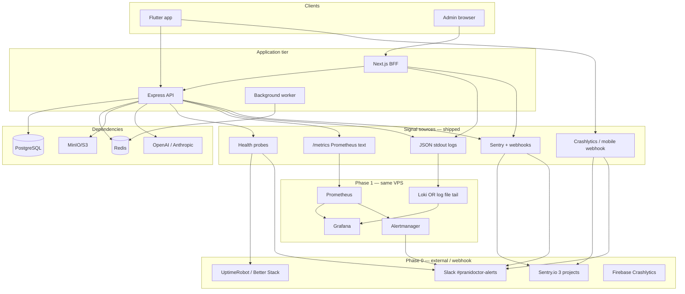
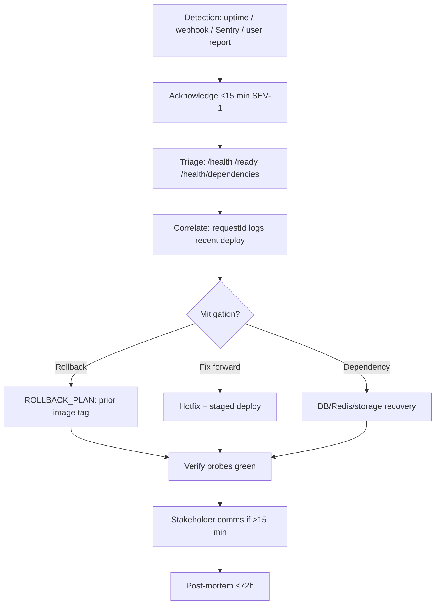
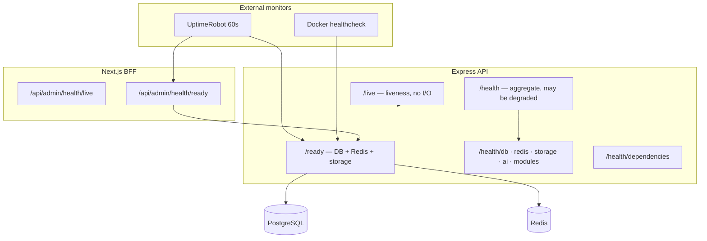

# Production Monitoring & Observability Plan — Prani Doctor

**Document ID:** `PRODUCTION_MONITORING_PLAN`  
**Version:** 1.0  
**Date:** 2026-05-30  
**Mode:** Plan only — no application code changes in this document  
**Scope:** `pranidoctor-backend` · `pranidoctor-web` · `pranidoctor_user` · VPS/Docker infrastructure  
**Status:** **Gap closure plan** — application instrumentation largely shipped; **ops deployment is the primary blocker**

**Related documents:**

| Area | Document |
|------|----------|
| Backend metrics & logs | [backend-monitoring-plan.md](../../pranidoctor-backend/docs/production/monitoring/backend-monitoring-plan.md) |
| Health probes | [health-check-plan.md](../../pranidoctor-backend/docs/production/monitoring/health-check-plan.md) |
| Alert catalog | [alerting-plan.md](../production/monitoring/alerting-plan.md) |
| Sentry | [sentry-integration-plan.md](../production/monitoring/sentry-integration-plan.md) |
| Flutter crashes | [flutter-crash-reporting-plan.md](../production/mobile/flutter-crash-reporting-plan.md) |
| AI usage | [ai-usage-monitoring-plan.md](../production/ai/ai-usage-monitoring-plan.md) |
| Operational escalation | [escalation-monitoring-plan.md](../../pranidoctor-backend/docs/production/operations/escalation-monitoring-plan.md) |
| Admin BFF monitoring | [admin-monitoring-plan.md](../../pranidoctor-web/docs/production/admin/admin-monitoring-plan.md) |
| Incident response | [incident-response-guide.md](../incident-response-guide.md) |
| Launch day | [LAUNCH_DAY_RUNBOOK.md](./LAUNCH_DAY_RUNBOOK.md) · [GO_LIVE_CHECKLIST.md](./GO_LIVE_CHECKLIST.md) |
| Rollback | [ROLLBACK_PLAN.md](./ROLLBACK_PLAN.md) |
| Backup & DR | [backup-recovery.md](../backup-recovery.md) |

---

## Executive summary

Prani Doctor has invested heavily in **in-process observability**: structured JSON logging, layered health probes, Prometheus-compatible metrics, deduplicated webhook alerting, optional Sentry, Flutter composite crash reporting, AI usage persistence, and operational escalation jobs. What remains is predominantly **ops wiring** — external uptime monitors, log aggregation, Prometheus scrape targets, Grafana dashboards, Sentry production projects, backup cron + monitoring, and on-call routing.

| Pillar | Application code | Ops deployment | Production-ready? |
|--------|------------------|----------------|-----------------|
| **Metrics** | ✅ Phase 1 shipped | ❌ Prometheus/Grafana not deployed | Conditional |
| **Logs** | ✅ Pino + web JSON | ❌ No log shipper configured | Conditional |
| **Errors** | ✅ Sentry + webhooks | ⚠️ DSNs not confirmed live | Conditional |
| **Health** | ✅ Full probe suite | ⚠️ External probes not configured | Conditional |
| **Alerting (in-app)** | ✅ v2.0 dedup | ⚠️ Webhook URL unset on prod | Conditional |
| **Alerting (Prometheus)** | ✅ Rules file exists | ❌ Alertmanager not deployed | No |
| **Mobile crashes** | ✅ Composite reporter | ⚠️ Crashlytics + webhook ops-owned | Conditional |
| **Tracing** | ⚠️ Correlation IDs only | ❌ No distributed trace backend | No |
| **Infrastructure** | ⚠️ Docker healthchecks | ❌ No node/postgres exporters | No |
| **Backup monitoring** | ✅ Scripts in repo | ❌ Cron + stale-file alerts not live | No |

**Recommendation:** Execute **Phase 0 (P0 ops)** in 3–5 days with zero architectural change — external probes, Slack webhook, Sentry projects, backup cron, and log tailing. Add **Phase 1 (P1)** Prometheus + Grafana on the same VPS when traffic justifies it. Defer OpenTelemetry/full APM (P2) until post-launch baseline week.

**Launch score impact:** Monitoring domain currently **63/100** in [PRODUCTION_READINESS_REPORT.md](./PRODUCTION_READINESS_REPORT.md). Completing P0 raises estimated score to **~82/100** for monitoring; P1 raises to **~90/100**.

---

## 1. Current state assessment

### 1.1 Existing infrastructure

| Component | Technology | Monitoring hooks today | Gap |
|-----------|------------|------------------------|-----|
| **API** | Express 5 (`server.ts`) | `/live`, `/ready`, `/health/*`, `/metrics`, Pino, Sentry, webhooks | Prometheus scrape not configured |
| **Worker** | `worker.ts` (BullMQ) | Shared logger + Sentry; queue failure hooks | No HTTP server; no dedicated scrape target |
| **Admin BFF** | Next.js (`pranidoctor-web`) | `/api/admin/health/*`, proxy telemetry, instrumentation | Client Sentry incomplete |
| **Mobile** | Flutter | Composite crash reporter, network interceptor | Sentry SDK optional; no product analytics |
| **PostgreSQL** | Prisma + `pg` Pool | App-level probes + query metrics | No `postgres_exporter`; no `pg_stat_statements` |
| **Redis** | ioredis | Health probe + dependency gauge | No redis_exporter |
| **Object storage** | MinIO / S3 | `/health/storage` | No bucket-size / replication monitoring |
| **Queue** | BullMQ on Redis | Job counters in API process metrics | Workers not registered in dev; depth gauge partial |
| **Deploy** | Docker Compose + GHCR | API healthcheck → `/ready` | No Prometheus/Grafana in compose |
| **CI** | GitHub Actions | Gitleaks, CodeQL, env validation | No synthetic post-deploy smoke to prod |

**Docker Compose** (`pranidoctor-backend/docker-compose.yml`): postgres, redis, minio, and api containers have healthchecks. Monitoring stack (Prometheus, Grafana, Loki) is documented in [MONITORING.md](../../pranidoctor-web/docs/devops/MONITORING.md) but **not included in compose profiles**.

### 1.2 Logging implementation

| Runtime | Logger | Format | Correlation | Redaction | Log shipping |
|---------|--------|--------|-------------|-----------|--------------|
| **Backend** | Pino + `pino-http` | JSON in prod (`LOG_FORMAT=json`) | `requestId`, `traceId`, `spanId`, `userId` via ALS | passwords, tokens, OTP, cookies | stdout → Docker; **no aggregator** |
| **Web admin** | `server-logger.ts` | JSON lines | `X-Request-Id`, `X-Correlation-Id` | `redact.ts` | stdout; **no aggregator** |
| **Mobile** | `AppLog` + `LogRedactor` | DevTools/logcat only | `APP_ENV`, release metadata on crashes | tokens, passwords | **No network logs in release** |

**Strengths:** Probe paths excluded from access logs; 5xx elevated to error level; health failures trigger alerts.

**Gaps:**

- No centralized log search (Loki, CloudWatch, or ELK) — incident triage requires SSH + `docker logs`.
- Slow-query SQL text omitted in production logs (metrics only).
- Web client errors log-only unless Sentry browser SDK completed.
- No log-based metric extraction (5xx rate, admin proxy p95) without shipper.

### 1.3 API monitoring coverage

| Signal | Coverage | Source | Notes |
|--------|----------|--------|-------|
| Request volume | ✅ | `pranidoctor_http_requests_total` | By method, normalized route, status class |
| Latency | ✅ | `pranidoctor_http_request_duration_seconds` | Histogram; route cardinality controlled |
| Error rate | ✅ | Counter + `error.handler.ts` alerts | Prometheus rule `High5xxRate` aligned |
| Per-route SLO | ⚠️ | Normalized routes | No per-module dashboards yet |
| Auth endpoints | ⚠️ | Standard HTTP metrics | No dedicated auth failure counter |
| Mobile compat layer | ✅ | Same middleware | `/api/mobile/*` included |
| Admin proxy | ✅ | `admin.proxy` structured events | Latency in web logs, not Prometheus |
| Rate-limit 503 | ⚠️ | Logs | Redis-down fail-closed; alert ALT-SEC-02 shipped on health |

**Verification:** [backend-monitoring-verification-report.md](../../pranidoctor-backend/docs/production/monitoring/backend-monitoring-verification-report.md) — application instrumentation **9/10**; ops deployment **4/10**.

### 1.4 Database monitoring coverage

| Signal | Coverage | Source | Gap |
|--------|----------|--------|-----|
| Connectivity | ✅ | `/health/db`, `/ready`, `pranidoctor_db_up` | — |
| Probe latency | ✅ | Health JSON + `pranidoctor_db_probe_latency_ms` | — |
| Query duration | ✅ | Prisma `$on('query')` histogram | — |
| Slow queries | ✅ | Counter + structured log when > `DB_SLOW_QUERY_MS` | No SQL text in prod logs |
| Connection pool | ❌ | — | Pool exhaustion not exported |
| Postgres host metrics | ❌ | — | Needs `postgres_exporter` |
| Replication lag | N/A | Single-node VPS assumed | — |
| Backup success | ❌ | Cron script only | No automated alert |

### 1.5 Queue / background-job monitoring coverage

| Signal | Coverage | Source | Gap |
|--------|----------|--------|-----|
| Job completed/failed | ✅ | `pranidoctor_queue_jobs_total` | Counters in API process |
| Job duration | ✅ | `pranidoctor_queue_job_duration_seconds` | — |
| Permanent failure → Sentry | ✅ | `queue.service.ts` | Shipped |
| Queue depth | ⚠️ | Partial | No continuous depth gauge on all queues |
| Worker process health | ❌ | — | No HTTP liveness on `worker.ts` |
| Worker metrics scrape | ❌ | — | Metrics live in API process only |
| Backup queue type | ⚠️ | Enum exists (`BACKUP`) | Processor not registered |

**Note:** `createWorker()` is not invoked in current codebase paths — queue metrics reflect infrastructure hooks; production worker registration must be verified at deploy time.

### 1.6 Flutter crash monitoring readiness

| Area | Status | Evidence |
|------|--------|----------|
| Global error handlers | ✅ Shipped | `GlobalErrorHandler`, zone guard, graceful error widget |
| Crash backend | ✅ Shipped | `CompositeCrashReporter` → Crashlytics + webhook |
| Network non-fatals | ✅ Shipped | `CrashReportingNetworkInterceptor` (throttled E07) |
| Boot failures | ✅ Shipped | `BootController` → E10 |
| Riverpod failures | ✅ Shipped | `CrashReportingProviderObserver` |
| FCM background isolate | ✅ Shipped | try/catch → Crashlytics (v2.0) |
| Sentry Flutter SDK | ⚠️ Optional | `sentry_flutter` wired when DSN set |
| Release symbols | ⚠️ CI artifact | `split-debug-info` uploaded; no auto-upload to Crashlytics/Sentry |
| Crash-free session SLO | ❌ Ops | Requires Firebase/Crashlytics dashboard or Sentry mobile project |

**Readiness:** Application **ready**; ops must configure Firebase project, webhook ingest, and release correlation. See [flutter-crash-reporting-verification-report.md](../production/mobile/flutter-crash-reporting-verification-report.md).

### 1.7 AI service monitoring readiness

| Signal | Coverage | Source | Gap |
|--------|----------|--------|-----|
| LLM requests | ✅ | `ai_requests_total`, DB `AiUsageRecord` | — |
| Latency | ✅ | Histogram + per-row `latencyMs` | p95 SLO alerts not in Alertmanager |
| Token/cost | ✅ | `ai_tokens_total`, `ai_cost_usd_total`, daily rollups | Budget alerts ALT-AI-07 ops-owned |
| Fallback rate | ✅ | `ai_fallbacks_total`, rules-based provider tag | Prometheus rule not deployed |
| Kill switch state | ✅ | `ai_llm_disabled` gauge, `/health/ai` | — |
| Governance audit | ✅ | Admin `/admin/ai-ops/governance` | — |
| Escalations | ✅ | DB + admin AI ops; OPS-ESC-* alerts | Manual review during launch week |
| Non-LLM AI features | ⚠️ | Session tables only | Triage, symptom checker not in usage metrics |

**Readiness:** [AI_MONITORING_VERIFICATION_REPORT.md](../production/ai/AI_MONITORING_VERIFICATION_REPORT.md) — instrumentation v1 complete; external alerting Phase 2.

### 1.8 Infrastructure monitoring readiness

| Layer | Status | Notes |
|-------|--------|-------|
| Container healthchecks | ✅ | postgres, redis, minio, api in compose |
| Process memory / heap | ✅ | `pranidoctor_heap_used_bytes`, RSS gauges |
| Event loop lag | ✅ | `pranidoctor_event_loop_lag_ms` |
| CPU utilization | ❌ | Use `node_exporter` |
| Disk usage | ❌ | ALT-SLA / alerting plan references 85% — no exporter |
| Network / TLS cert | ❌ | External SSL monitor required (ALT-SEC-07/08) |
| Nginx / reverse proxy | ❌ | Access logs not structured in repo |
| VPS host | ❌ | No Datadog/agent — document manual `df`, `free` |

### 1.9 Security-event monitoring readiness

| Signal | Coverage | Source | Gap |
|--------|----------|--------|-----|
| Audit log service | ✅ | `audit.service.ts` with `traceId` | No SIEM integration |
| Refresh token reuse | ✅ Shipped | ALT-SEC-03 in alerting plan | Log-based alert ops-owned |
| Rate-limit fail-closed | ✅ Shipped | ALT-SEC-02 on Redis unhealthy | — |
| CI secret scan | ✅ | Gitleaks on `main` | ALT-SEC-04 |
| Auth failure spike | ❌ | — | Log metric needed (ALT-SEC-01) |
| Admin unauthorized access | ❌ | — | Synthetic probe recommended |
| Upload MIME rejection spike | ⚠️ | API logs | ALT-SEC-09 ops-owned |
| Metrics endpoint abuse | ⚠️ | 401 logs | ALT-SEC-10 ops-owned |

### 1.10 Backup monitoring readiness

| Item | Status | Location | Gap |
|------|--------|----------|-----|
| Postgres backup script | ✅ | `scripts/backup/postgres-backup.sh` | — |
| Restore script | ✅ | `scripts/backup/postgres-restore.sh` | — |
| Cron installer | ✅ | `scripts/backup/install-backup-cron.sh` | **Not run on VPS** |
| Backup failure alert | ❌ | ALT-DB-04 defined | No cron exit-code monitor |
| Backup stale alert | ❌ | ALT-DB-05 (>26h) | No file-age check job |
| Restore drill | ❌ | Quarterly target in backup-recovery.md | **No drill log** |
| MinIO/media backup | ⚠️ | Documented in backup-recovery.md | No automated mirror script in repo |
| Offsite copy | ❌ | 3-2-1 documented | Not configured |

**Launch blocker:** [KNOWN_LIMITATIONS.md](./KNOWN_LIMITATIONS.md) L-02 — backup cron not installed on live host.

---

## 2. Gap analysis summary

```mermaid
flowchart LR
  subgraph shipped ["Shipped in application code"]
    M[Prometheus metrics]
    L[Structured logs]
    H[Health probes]
    A[Webhook alerts v2]
    S[Sentry hooks]
    C[Mobile crash reporter]
    AI[AI usage metrics]
    E[Escalation monitor]
  end

  subgraph ops_gap ["Ops gaps blocking production observability"]
    U[External uptime monitors]
    P[Prometheus scrape + Grafana]
    LG[Log aggregation]
    WH[Slack/PagerDuty routing]
    BK[Backup cron + stale alerts]
    OC[On-call roster]
    SN[Sentry/Crashlytics projects live]
  end

  shipped --> ops_gap
  ops_gap --> GO[Production-grade observability]
```



| Priority | Gap | Risk if unaddressed | Effort |
|----------|-----|---------------------|--------|
| **P0** | No external uptime on `/ready` + BFF | Outage undetected until users report | 2h |
| **P0** | `MONITORING_ALERT_WEBHOOK_URL` unset | In-app alerts dropped silently | 1h |
| **P0** | Backup cron not installed | Data loss on DB failure | 2h |
| **P0** | Sentry/Crashlytics not configured | Blind to prod exceptions | 4h |
| **P0** | On-call roster undocumented | Slow incident response | 1h |
| **P1** | Prometheus + Grafana not deployed | No SLO dashboards, no metric alerts | 1–2 days |
| **P1** | Log aggregation absent | Slow root-cause analysis | 1 day |
| **P1** | AI Prometheus rules not loaded | Provider outage undetected | 4h |
| **P1** | Worker health unknown | Silent queue backlog | 4h |
| **P2** | OpenTelemetry / distributed tracing | Cross-service debug harder | 3–5 days |
| **P2** | Postgres/node exporters | Deep infra visibility | 1 day |
| **P2** | Client Sentry browser SDK complete | Admin UI errors invisible in Sentry | 1 day |

---

## 3. Recommended monitoring architecture

Design principle: **reuse existing instrumentation**; add only lightweight ops-side services on the current VPS. Avoid Datadog/New Relic until team size or compliance requires it.



### 3.1 Recommended stack (minimal disruption)

| Layer | Tool | Rationale |
|-------|------|-----------|
| **Uptime / synthetic** | UptimeRobot or Better Stack (free tier) | No code change; probes `/ready`, BFF, SSL |
| **Metrics** | Prometheus (self-hosted on VPS) | `/metrics` already Prometheus-compatible |
| **Dashboards** | Grafana (self-hosted) | Import JSON dashboards; pairs with Prometheus + Loki |
| **Alert routing** | Slack webhook → optional PagerDuty | `MONITORING_ALERT_WEBHOOK_URL` already implemented |
| **Errors** | Sentry (3 projects: api, web, mobile) | SDKs partially wired; dual-path with webhooks |
| **Mobile crashes** | Firebase Crashlytics + webhook | Composite reporter already fans out |
| **Logs** | Loki + Promtail **or** VPS log files + `grep`/manual | Avoid Elasticsearch cost/complexity at launch |
| **Tracing (defer)** | Sentry performance (low sample rate) **or** OTel later | Correlation IDs sufficient for Phase 0 |

**Explicitly not recommended at launch:** Datadog, New Relic, Elastic Cloud, Honeycomb — adds cost and agent complexity before baseline traffic exists.

---

## 4. Metrics strategy

### 4.1 Metric tiers

| Tier | Metrics | Retention | Consumer |
|------|---------|-----------|----------|
| **T0 — Probes** | Blackbox up/down, SSL expiry | 90d | UptimeRobot |
| **T1 — RED (API)** | `http_requests_total`, `http_request_duration_seconds` | 30d | Prometheus + Grafana |
| **T2 — Dependencies** | `db_up`, `redis_up`, `ready`, probe latency | 30d | Prometheus + health alerts |
| **T3 — Resources** | heap, RSS, event loop lag | 14d | Grafana + warning alerts |
| **T4 — Queue** | job totals, duration | 30d | Grafana |
| **T5 — AI** | `ai_requests_total`, tokens, cost, fallbacks | 90d | AI ops dashboard + cost review |
| **T6 — Business ops** | Escalation gauges (`escalation_*`) | 30d | Admin + Prometheus |

### 4.2 Scrape configuration (Phase 1)

```yaml
# Recommended prometheus.yml scrape fragment (ops-owned, not in app repo today)
scrape_configs:
  - job_name: pranidoctor-api
    scrape_interval: 30s
    metrics_path: /metrics
    authorization:
      credentials: REPLACE_METRICS_TOKEN
    static_configs:
      - targets: ['api:3000']
        labels:
          service: pranidoctor-api
          environment: production
```

**Rules file:** [deploy/monitoring/prometheus-alerts.yml](../../pranidoctor-backend/deploy/monitoring/prometheus-alerts.yml) — aligned with exported series per verification report.

### 4.3 Metrics not to add at launch

- Custom business KPIs in Prometheus (use admin analytics DB queries instead)
- High-cardinality labels (user IDs, request IDs) — already prevented by route normalizer
- Per-tenant metrics — defer to Phase 2 multi-tenant growth

---

## 5. Logging strategy

### 5.1 Log standards (already implemented — maintain)

| Field | Backend | Web | Required in prod |
|-------|---------|-----|------------------|
| `service` | ✅ | ✅ | Yes |
| `env` / `APP_ENV` | ✅ | ✅ | Yes |
| `version` | ✅ | ✅ | Yes |
| `requestId` | ✅ | ✅ | Yes |
| `traceId` | ✅ | ✅ | Yes |
| `level` | ✅ | ✅ | Yes |
| `event` | ✅ (typed) | ✅ (`admin.proxy`) | Yes |
| Secret redaction | ✅ | ✅ | Yes |

### 5.2 Log levels by environment

| Environment | Backend `LOG_LEVEL` | Notes |
|-------------|---------------------|-------|
| production | `info` | 5xx → error automatically |
| staging | `info` | May enable debug briefly for triage |
| development | `debug` | Pretty-print optional |

### 5.3 Log aggregation options (pick one at P1)

| Option | Cost | Complexity | Fit |
|--------|------|------------|-----|
| **A — Loki + Promtail on VPS** | ~$0 | Medium | Best fit with Grafana stack |
| **B — CloudWatch Logs** | Low at low volume | Low if on AWS | If VPS migrates to AWS |
| **C — Docker json-file + rotate + SSH grep** | $0 | Low | Acceptable for closed beta only |

**Recommended:** Option A when Prometheus deployed; Option C acceptable for first 2 weeks of closed beta with daily log review.

### 5.4 Log-based alerts (Phase 1)

| Query / pattern | Alert |
|-----------------|-------|
| `statusClass=5xx` rate > 1% | ALT-ERR-01 |
| `event=admin.proxy` p95 `durationMs` > 5000 | ALT-SLOW-01 |
| `msg~"refresh token reuse"` | ALT-SEC-03 |
| `event=http.request` + `statusCode=503` burst | ALT-SEC-02 |

---

## 6. Distributed tracing strategy

### 6.1 Current state

- **Correlation without traces:** Backend ALS propagates `requestId`, `traceId`, `spanId`; web forwards `X-Request-Id` / `X-Correlation-Id` on BFF proxy.
- **Sentry traces:** Optional `tracesSampleRate` in sentry config — low-volume performance spans only.
- **No OpenTelemetry:** Prisma adapter supports OTel parent context internally but application does not export spans.

### 6.2 Phase 0 — log correlation (no new services)

1. Mobile → API: pass `X-Request-Id` on Dio (already supported by backend).
2. Web → API: proxy forwards correlation headers (shipped in `proxy-to-backend.ts`).
3. Incident triage: grep logs by `requestId` across API + web containers.

### 6.3 Phase 2 — tracing options (post-launch)

| Approach | Disruption | Cost | When |
|----------|------------|------|------|
| **Sentry performance monitoring** | Low — env vars only | Sentry plan limits | After DSN live + baseline week |
| **OpenTelemetry → Grafana Tempo** | Medium — SDK + collector | VPS disk | When cross-service latency SLO breached |
| **Full Jaeger** | High | Self-host overhead | Not recommended until scale |

**Recommendation:** Enable Sentry `tracesSampleRate=0.1` on backend + web after launch. Defer OpenTelemetry until p95 SLO breaches persist after DB/query optimization.

---

## 7. Alerting strategy

### 7.1 Alert layers

| Layer | Mechanism | Owner | Status |
|-------|-----------|-------|--------|
| **L1 — Synthetic uptime** | External HTTP checks | Ops | ❌ Configure |
| **L2 — In-app webhooks** | `sendProductionAlert` | Dev shipped / Ops config | ⚠️ URL required |
| **L3 — Sentry rules** | New issue, regression | Ops | ❌ Configure |
| **L4 — Prometheus/Alertmanager** | Metric thresholds | Ops | ❌ Deploy |
| **L5 — Human dashboards** | Admin analytics, Launch Ops | Product/Ops | ✅ By design |

### 7.2 Phase 0 minimum alert set (configure before go-live)

| ID | Alert | Source | Severity |
|----|-------|--------|----------|
| ALT-DOWN-02 | API `/ready` down | UptimeRobot | SEV-1 |
| ALT-DOWN-04 | BFF `/api/admin/health/ready` down | UptimeRobot | SEV-1 |
| ALT-DOWN-05 | Admin login page down | UptimeRobot | SEV-1 |
| ALT-SEC-07 | SSL cert <7d | UptimeRobot SSL | SEV-1 |
| ALT-ERR-02 | Uncaught process error | Webhook (shipped) | SEV-1 |
| ALT-DB-04 | Backup cron failed | Cron exit email/Slack | SEV-2 |
| ALT-DB-05 | Backup stale >26h | Cron script / file check | SEV-2 |
| ALT-ERR-05 | Sentry new prod issue | Sentry | SEV-2 |

Full catalog: [alerting-plan.md](../production/monitoring/alerting-plan.md) (80+ alert definitions).

### 7.3 Alert fatigue controls (shipped — preserve)

- 15-minute dedup window (`ALERT_DEDUP_WINDOW_MS`)
- Storm caps per severity (`ALERT_MAX_CRITICAL_PER_MIN`, etc.)
- Maintenance mode: silence external monitors during deploy
- Dual path: Sentry owns stack traces; webhooks own state/probe alerts

---

## 8. Incident response flow



**Runbooks:**

| Scenario | Document | Key actions |
|----------|----------|-------------|
| SEV-1 outage | [incident-response-guide.md](../incident-response-guide.md) | Ack → `/health` → rollback → comms |
| Launch day | [LAUNCH_DAY_RUNBOOK.md](./LAUNCH_DAY_RUNBOOK.md) | T-24h monitors; T-0 health gates |
| Auth compromise | incident-response § Auth | Revoke tokens, rotate secrets |
| DB corruption | [backup-recovery.md](../backup-recovery.md) | Stop writes → restore → smoke |
| AI safety | Admin kill switch | `/admin/ai-ops/governance` |

---

## 9. Escalation matrix

### 9.1 Severity → response

| Severity | User impact | Response target | Channel | Escalate to |
|----------|-------------|-----------------|---------|-------------|
| **SEV-1** | Full outage, breach suspected | **≤15 min ack** | PagerDuty/phone + `#incidents` | Launch lead → exec if >30 min |
| **SEV-2** | Major degradation | **≤1 hour ack** | `#pranidoctor-alerts` + Sentry | On-call → launch lead if unresolved 2h |
| **SEV-3** | Minor / partial | Business hours | Slack digest | Ops lead |
| **SEV-4** | Informational | Weekly review | Dashboards only | Product |

### 9.2 Role matrix (fill in team wiki — template)

| Role | Primary responsibility | Backup | Hours |
|------|------------------------|--------|-------|
| **On-call engineer** | Ack, triage, mitigate | Secondary on-call | 24/7 launch week |
| **Launch lead** | Rollback authority, comms | CTO/founder | Launch week |
| **Ops lead** | Infra, backups, probes | On-call engineer | Business + launch |
| **AI safety owner** | Kill switch, escalation review | Admin SUPER_ADMIN | Business hours |

### 9.3 Operational escalation (business workflows)

Automated via `startEscalationMonitoring()` on API boot — see [escalation-monitoring-plan.md](../../pranidoctor-backend/docs/production/operations/escalation-monitoring-plan.md):

| Alert prefix | Example | Severity |
|--------------|---------|----------|
| OPS-REQ-* | Pending backlog, doctor accept SLA | SEV-2/3 |
| OPS-CON-* | Consultation stalled, rejection spike | SEV-2 |
| OPS-ESC-* | AI escalation backlog | SEV-2 |
| OPS-SUP-* | Support ticket aging | SEV-3 |

These route through the same webhook pipeline as infrastructure alerts.

---

## 10. SLO / SLA recommendations

### 10.1 Initial SLOs (adjust after baseline week)

| SLO | Target | Measurement window | Error budget (30d) |
|-----|--------|--------------------|--------------------|
| **API availability** | 99.9% | Synthetic `/ready` | ~43 min downtime |
| **Admin BFF availability** | 99.5% | BFF ready probe | ~3.6 hours |
| **API 5xx rate** | <0.5% | Prometheus/logs | — |
| **Admin proxy p95** | <3s | Log metric / proxy duration | — |
| **DB probe latency** | <500ms steady | `/health/db` | — |
| **AI chat success** | ≥99% | `ai_requests_total{status="success"}` | — |
| **Mobile crash-free sessions** | ≥99.0% | Crashlytics 7d rolling | — |
| **Backup RPO** | ≤24h | Daily cron | — |
| **Backup RTO** | ≤4h | Quarterly drill | — |

### 10.2 SLA (customer-facing — conservative at launch)

| Tier | Commitment | Notes |
|------|------------|-------|
| **Pilot / closed beta** | Best-effort; target 99.5% API | Document in KNOWN_LIMITATIONS |
| **Public production v1** | 99.5% monthly API uptime | Exclude planned maintenance |
| **Emergency veterinary** | No uptime SLA on AI triage | AI disclaimer + human escalation path |

### 10.3 SLO review cadence

- **Daily** (launch week): Launch Ops + `/admin/ai-ops`
- **Weekly**: Error budget burn review in Grafana
- **Monthly**: Adjust thresholds; exec summary from SLO dashboard

---

## 11. Dashboard structure

### 11.1 Grafana folders (Phase 1)

| Folder | Panels | Primary metrics |
|--------|--------|-----------------|
| **Overview** | Up/down, error rate, p95, version | RED + `pranidoctor_ready` |
| **API detail** | Route breakdown, 4xx/5xx, latency heatmap | `http_requests_total`, histogram |
| **Dependencies** | DB/Redis/storage up, probe latency | `db_up`, `redis_up`, probe ms |
| **Resources** | Heap, RSS, event loop | resource gauges |
| **Queues** | Job rate, failures, duration | `queue_jobs_total` |
| **AI ops** | Requests, fallbacks, cost, kill switch | `ai_*` series |
| **Escalation** | OPS gauges | `escalation_*` |
| **Mobile** | Crash-free, top issues | Crashlytics/Sentry link-out |

### 11.2 In-app dashboards (already shipped — no duplication)

| Surface | Purpose |
|---------|---------|
| `/admin` | Business KPIs |
| `/admin/analytics/system` | Queue/session visibility (APM placeholder) |
| `/admin/ai-ops` | AI sessions, escalations, governance |
| `/admin/launch-ops` | Manual probe UI pre-launch |

### 11.3 External dashboard links

Embed in team wiki / Launch Ops:

- Grafana → Overview URL
- Sentry → project issues
- UptimeRobot → status page
- Firebase Crashlytics → Android vitals

---

## 12. Health-check architecture

Consolidated from [health-check-plan.md](../../pranidoctor-backend/docs/production/monitoring/health-check-plan.md):



### 12.1 Probe schedule

| Probe | Interval | Timeout | Alert on |
|-------|----------|---------|----------|
| API `/ready` | 60s | 10s | 2 failures |
| API `/live` | 60s | 5s | 3 failures |
| BFF `/api/admin/health/ready` | 60s | 15s | 2 failures |
| SSL certificate | 24h | — | <7 days |
| Backup file age | 6h | — | >26h |
| `/health/db` latency (optional) | 5m | — | >2000ms |

### 12.2 Worker health (P1 gap closure)

Recommended additive pattern (implementation phase — not in scope of this doc):

- Sidecar or supervisor HTTP on worker port `:3001/live` returning process up + last job timestamp
- **Or** Prometheus `pushgateway` / textfile collector for worker metrics
- **Or** alert on rising queue depth + zero completed jobs for 30m

---

## 13. Cost optimization recommendations

| Area | Recommendation | Est. monthly cost |
|------|----------------|-------------------|
| **Uptime** | UptimeRobot/Better Stack free tier (5–10 monitors) | $0 |
| **Metrics + dashboards** | Self-hosted Prometheus + Grafana on existing VPS | $0 marginal |
| **Logs** | Loki with 7–14d retention; drop debug | $0–5 disk |
| **Sentry** | Developer plan; sample traces at 10%; filter 4xx | $0–26 |
| **Crashlytics** | Firebase Spark | $0 |
| **PagerDuty** | Defer; use Slack @channel for launch | $0 |
| **Avoid** | Datadog, full ELK, Honeycomb at launch | Save $100+/mo |

**Cost controls:**

- Keep `SENTRY_TRACES_SAMPLE_RATE` ≤ 0.1
- Scrape interval 30s (not 5s)
- Exclude `/health` from expensive log indexes
- Mobile webhook throttling already shipped (1/min/route)
- AI cost rollups for budget review — not real-time paging unless budget set

---

## 14. Production rollout plan

### Phase 0 — Pre-launch (P0, 3–5 days, no code changes)

| Step | Action | Owner | Verify |
|------|--------|-------|--------|
| 0.1 | Create Slack `#pranidoctor-alerts` + `#incidents` | Ops | Message test |
| 0.2 | Set `MONITORING_ALERT_WEBHOOK_URL` on API + web prod | Ops | Test alert from staging |
| 0.3 | Configure UptimeRobot: `/ready`, BFF ready, admin login, SSL | Ops | Failover test |
| 0.4 | Create Sentry projects (api, web-admin, mobile) + DSNs | Ops | Test exception |
| 0.5 | Configure Firebase Crashlytics for release AAB | Ops | Test crash in internal track |
| 0.6 | Run `install-backup-cron.sh` + manual backup | Ops | File exists in backup dir |
| 0.7 | Document on-call roster in team wiki | Launch lead | — |
| 0.8 | Launch day probe matrix in [LAUNCH_DAY_RUNBOOK.md](./LAUNCH_DAY_RUNBOOK.md) | Ops | T-1h checklist |
| 0.9 | Set production env: `LOG_FORMAT=json`, `METRICS_ENABLED=true`, `METRICS_TOKEN` | Ops | curl `/metrics` 401/200 |
| 0.10 | Mobile release: `CRASH_REPORTING_WEBHOOK_URL`, `APP_ENV=production` | Mobile | Webhook receives test |

### Phase 1 — Launch week (P1, 1–2 days)

| Step | Action | Owner | Verify |
|------|--------|-------|--------|
| 1.1 | Deploy Prometheus + Grafana (docker profile or compose overlay) | Ops | Target UP in Prometheus |
| 1.2 | Import [prometheus-alerts.yml](../../pranidoctor-backend/deploy/monitoring/prometheus-alerts.yml) to Alertmanager | Ops | Test fire `High5xxRate` in staging |
| 1.3 | Deploy Loki + Promtail OR commit to daily log review | Ops | Search by `requestId` |
| 1.4 | Import Grafana dashboards (Overview, API, AI) | Ops | Panels show data |
| 1.5 | Add AI alert rules (ALT-AI-01, ALT-AI-02) | Ops | Staging provider disable test |
| 1.6 | Worker health strategy decided + deployed | Backend/Ops | Queue failure alert test |
| 1.7 | Baseline week: record p95, error rate, crash-free % | On-call | SLO doc update |

### Phase 2 — Post-launch stabilization (P2, 2–4 weeks)

| Step | Action |
|------|--------|
| 2.1 | Postgres exporter + slow query dashboard |
| 2.2 | node_exporter for CPU/disk alerts |
| 2.3 | Complete Next.js client Sentry SDK |
| 2.4 | Sentry performance tracing 10% sample |
| 2.5 | Backup restore drill to staging + log result |
| 2.6 | MinIO mirror script + bucket size alert |
| 2.7 | OpenTelemetry evaluation (only if needed) |

---

## 15. Rollback plan (monitoring-specific)

Monitoring changes are **configuration-first** — rollback never requires DB migration.

| Scenario | Rollback | API impact |
|----------|----------|------------|
| Alert storm | `MONITORING_ENABLED=false`; mute UptimeRobot | None |
| Sentry cost spike | Blank `SENTRY_DSN` | None |
| Prometheus load | Increase scrape interval to 60s; disable scrapes | None |
| Bad metrics deploy | `METRICS_ENABLED=false`; redeploy prior image | None |
| Log disk fill | `LOG_LEVEL=warn`; reduce retention | None |
| Grafana false positives | Disable Alertmanager routes | None |

**Emergency silence procedure:** documented in [backend-monitoring-plan.md §10](../../pranidoctor-backend/docs/production/monitoring/backend-monitoring-plan.md).

Application rollback: [ROLLBACK_PLAN.md](./ROLLBACK_PLAN.md).

---

## 16. Risk assessment

| ID | Risk | Likelihood | Impact | Mitigation |
|----|------|------------|--------|------------|
| R-M01 | Outage undetected (no external probes) | High | Critical | P0 UptimeRobot |
| R-M02 | Alerts fire but nobody receives (webhook unset) | High | Critical | P0 webhook + on-call |
| R-M03 | Data loss (no backup cron) | Medium | Critical | P0 install-backup-cron |
| R-M04 | Blind to mobile regressions | Medium | High | Crashlytics + Sentry mobile |
| R-M05 | Incident triage slow (no log search) | High | Medium | P1 Loki or strict log procedure |
| R-M06 | AI provider outage unnoticed | Medium | Medium | P1 AI Prometheus rules |
| R-M07 | Queue backlog silent | Medium | Medium | P1 worker health |
| R-M08 | Alert fatigue | Medium | Low | Dedup shipped; tune thresholds post-baseline |
| R-M09 | METRICS_TOKEN leak | Low | Medium | Rotate token; IP restrict scrape |
| R-M10 | Over-engineering observability pre-traffic | Medium | Low | Phase 0/1 only at launch |

---

## 17. Task checklist

### P0 — Blockers (complete before public launch)

- [ ] **P0-1** Configure external uptime monitors (API `/ready`, BFF ready, admin login, SSL)
- [ ] **P0-2** Set `MONITORING_ALERT_WEBHOOK_URL` on production API + web
- [ ] **P0-3** Set `SENTRY_DSN` (+ mobile `SENTRY_DSN` dart-define if using Sentry mobile)
- [ ] **P0-4** Configure Firebase Crashlytics + Play internal testing track
- [ ] **P0-5** Install backup cron via `install-backup-cron.sh`; verify first backup file
- [ ] **P0-6** Add backup failure + stale-file monitoring (cron email or script)
- [ ] **P0-7** Document on-call primary + backup in team wiki
- [ ] **P0-8** Run Launch Ops probe matrix on staging production-shaped env
- [ ] **P0-9** Set `METRICS_TOKEN`, `LOG_FORMAT=json`, `APP_VERSION` on prod
- [ ] **P0-10** Mobile prod build: `CRASH_REPORTING_WEBHOOK_URL`, `APP_ENV=production`

### P1 — Launch week

- [ ] **P1-1** Deploy Prometheus; scrape API `/metrics` with bearer token
- [ ] **P1-2** Deploy Grafana + import Overview/API/AI dashboards
- [ ] **P1-3** Load Alertmanager rules from `prometheus-alerts.yml`
- [ ] **P1-4** Deploy log aggregation (Loki) OR document daily log review SOP
- [ ] **P1-5** Configure Sentry alert rules (new issue, regression)
- [ ] **P1-6** Add AI-specific Prometheus alert rules
- [ ] **P1-7** Implement worker health signal (HTTP sidecar or queue depth alert)
- [ ] **P1-8** Record baseline week metrics; tune SLO thresholds
- [ ] **P1-9** Wire admin System Analytics APM placeholder to Grafana link

### P2 — Post-launch

- [ ] **P2-1** postgres_exporter + connection pool metrics
- [ ] **P2-2** node_exporter + disk/CPU alerts
- [ ] **P2-3** Complete Next.js browser Sentry SDK
- [ ] **P2-4** Sentry performance tracing (10% sample)
- [ ] **P2-5** Quarterly backup restore drill with written log
- [ ] **P2-6** MinIO offsite mirror + monitoring
- [ ] **P2-7** Evaluate OpenTelemetry if correlation insufficient
- [ ] **P2-8** Auth failure spike log-based alert (ALT-SEC-01)
- [ ] **P2-9** Source map / debug symbol upload automation in CI

---

## 18. Files expected to change during implementation

**Note:** This plan does not implement changes. Expected touch points when executing P0–P2:

### P0 — Ops / env only (no app code required)

| File / asset | Change |
|--------------|--------|
| Production `.env` (API) | `MONITORING_ALERT_WEBHOOK_URL`, `SENTRY_DSN`, `METRICS_TOKEN`, `LOG_FORMAT=json` |
| Production `.env` (web) | `MONITORING_ALERT_WEBHOOK_URL`, `SENTRY_DSN`, `NEXT_PUBLIC_SENTRY_DSN` |
| Mobile CI / `build_release.ps1` | `CRASH_REPORTING_WEBHOOK_URL`, `SENTRY_DSN`, `APP_ENV` dart-defines |
| VPS cron | `/etc/cron.d/pranidoctor-postgres-backup` via install script |
| UptimeRobot / Better Stack | Monitor definitions (external) |
| Sentry / Firebase consoles | Project config (external) |
| Team wiki | On-call roster, dashboard URLs |

### P1 — Likely repo additions

| File | Repo | Change |
|------|------|--------|
| `deploy/monitoring/docker-compose.monitoring.yml` | backend | **New** — Prometheus, Grafana, Loki, Alertmanager |
| `deploy/monitoring/prometheus.yml` | backend | **New** — scrape configs |
| `deploy/monitoring/grafana/dashboards/*.json` | backend | **New** — dashboard JSON |
| `deploy/monitoring/promtail-config.yml` | backend | **New** — log shipping |
| `deploy/monitoring/prometheus-alerts.yml` | backend | Extend AI + escalation rules |
| `docker-compose.yml` | backend | Optional `monitoring` profile |
| `.env.production.example` | all three | Document monitoring vars (may already exist) |
| `docs/launch/LAUNCH_DAY_RUNBOOK.md` | user | Check off monitoring steps |

### P2 — Application code (minimal, additive)

| File | Repo | Change |
|------|------|--------|
| `src/lib/monitoring/sentry-client.ts` | web | Complete browser SDK init |
| `src/instrumentation-client.ts` | web | Sentry client bundling |
| `worker.ts` | backend | Optional mini health HTTP server |
| `src/shared/database/prisma.ts` | backend | Pool stats metrics (optional) |
| `.github/workflows/release.yml` | user | Symbol upload to Crashlytics/Sentry |
| `.github/workflows/deploy-production.yml` | backend | Post-deploy synthetic smoke curl |

---

## 19. Verification gates

| Gate | Criteria | When |
|------|----------|------|
| **G0 — P0 complete** | 3 uptime greens; test webhook received; backup file <24h old; Sentry test event | Pre-launch |
| **G1 — Launch day** | LAUNCH_DAY_RUNBOOK monitoring section all checked | T-0 |
| **G2 — P1 complete** | Grafana Overview shows 24h data; one test Alertmanager fire | Launch +48h |
| **G3 — SLO baseline** | 7d metrics recorded; thresholds adjusted | Launch +7d |
| **G4 — DR drill** | Restore to staging documented | Launch +90d |

---

## 20. Document maintenance

| Trigger | Action |
|---------|--------|
| Prometheus series added | Update §4 + `prometheus-alerts.yml` |
| New health probe | Update §12 + health-check-plan |
| Alert ID added | Sync with alerting-plan.md |
| SLO breach post-mortem | Adjust §10 thresholds |
| Phase 2 OTel adopted | Replace §6.3 recommendation |

**Next review:** After P0 completion or first production incident, whichever comes first.

---

*This document consolidates platform observability for launch. Implementation work is tracked via §17 checklists; detailed subsystem plans remain in linked docs to avoid duplication.*
