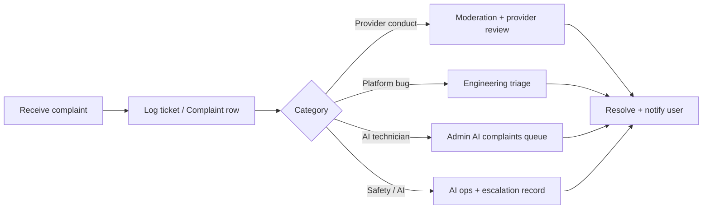

# Complaint Handling Policy

**Version:** 2026-06-01  
**Status:** Operational SOP — platform `Complaint` and `AiTechnicianComplaint` models exist

---

## 1. Purpose

Defines how users and operators handle **complaints** about platform services, providers, or AI technician marketplace quality.

## 2. Scope

| Type | Model | User-facing entry |
|------|-------|-------------------|
| General platform / provider complaint | `Complaint` | Support contact; in-app support where enabled |
| AI Technician service complaint | `AiTechnicianComplaint` | AI services module (when marketplace live) |
| AI safety / harmful output | `AiEscalationRecord` + support | AI escalation flow + support@pranidoctor.com |

Clinical emergencies: users must contact local veterinarians first — see [Emergency Disclaimer](./emergency-disclaimer.md).

## 3. How to submit a complaint

**Farmers / customers:**

1. Email **support@pranidoctor.com** with account phone, case or booking ID, and description  
2. Or use in-app **support / help** when available  
3. For AI technician jobs: use the **complaint** action on the completed service (API: `POST` AI technician complaint — admin triage queue)

Include: date, animal/service reference, screenshots if relevant, desired outcome (refund, review, block provider).

## 4. What we do not promise in timelines

We aim to acknowledge complaints within **3 business days** during beta (internal target — not a contractual SLA until GA policy is counsel-approved).

We **do not** guarantee refunds until billing automation and refund policy fully apply.

## 5. Internal process

| Step | Owner | System |
|------|-------|--------|
| Intake | Support | Email / ticket |
| Triage | Support lead | `Complaint.status` OPEN → IN_PROGRESS |
| Investigation | Ops / clinical lead | Linked `ServiceRequest`, user history |
| Resolution | Admin assignee | CLOSE with notes |
| Escalation | Launch ops | Severe safety → incident runbook |

**Admin:** AI technician complaints at `/admin` AI quality routes; general complaints via support DB tools.

## 6. User communication

- Acknowledgment via email or in-app notification when contact info exists  
- Outcome summary when closed (no clinical advice by support staff)  
- Refer clinical disputes to assigned veterinarian where appropriate  

## 7. Records retention

Complaints retained per [Data Retention Policy](./data-retention-policy.md) and dispute needs.

## 8. Appeals

Users may reply to closure email within **14 days** with new evidence; support reopens if substantive.

## 9. Contact

**support@pranidoctor.com**

---

**Gap:** Publish web `/support` page linking this policy before GA. Automated complaint portal optional.
