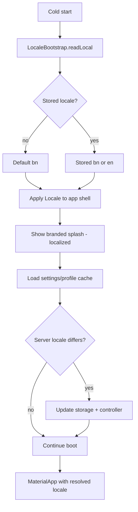

# Prani Doctor User App — Localization Master Plan (V1)

**Document ID:** `PRANI_DOCTOR_LANGUAGE_LOCALIZATION_MASTER_PLAN_V1`  
**App:** Prani Doctor User (Flutter)  
**Status:** Planning only — no implementation in this phase  
**Default language:** Bangla (`bn`)  
**Supported languages:** বাংলা (`bn`), English (`en`)  
**Last updated:** 2026-05-24

---

## 1. Executive summary

The user app already uses Flutter `gen-l10n` with a large English ARB catalog (~1,298 keys) and broad UI adoption (~180 presentation files import `AppLocalizations`). However, **Bangla is not a first-class locale today**: only `app_en.arb` exists, generated delegates support `en` only, and several surfaces still ship hardcoded English or mixed Bangla/English. Locale selection is synced from profile/settings after boot, with `ProfileLocaleController` starting as `null`, which risks **English flash** on devices whose system language is English.

This plan defines a complete multilingual system with **Bangla as default**, **local-first locale persistence**, **meaning-first rural-friendly copy**, and a phased migration to remove hardcoded strings, repository error text, and API leakage into the UI.

---

## 2. Goals and non-goals

### Goals

| # | Goal |
|---|------|
| G1 | Default UX language is Bangla on first install |
| G2 | User-selected language persists across restarts (offline-capable) |
| G3 | No visible English flash during cold start when Bangla is selected |
| G4 | All user-visible strings go through a single localization pipeline |
| G5 | Bangla copy is meaning-first for Bangladesh farmers and livestock owners |
| G6 | English remains available for literate bilingual users and support/debug |
| G7 | Area names, AI speech locale, and backend locale tags stay consistent with UI language |

### Non-goals (V1)

- More than `bn` + `en` (no Hindi, Arabic, etc.)
- Translating developer-only logs, analytics event names, or route names
- Rewriting backend API error catalogs (client maps known codes; server text is fallback only)
- RTL layout (not required for bn/en)
- In-app translation editor or CMS (static ARB + glossary process)

---

## 3. Current state audit (2026-05-24)

### 3.1 Infrastructure snapshot

| Area | Current state | Gap |
|------|---------------|-----|
| ARB files | `lib/l10n/app_en.arb` only | Missing `app_bn.arb`; template is English |
| `l10n.yaml` | `template-arb-file: app_en.arb` | Should use `app_bn.arb` when bn is canonical |
| Generated locales | `supportedLocales: [Locale('en')]` | `bn` not generated; setting `Locale('bn')` will throw |
| `MaterialApp.locale` | `profileLocaleControllerProvider` → `Locale?`, initial `null` | Null → system locale; not bn-first |
| Locale tags (API) | `bn-BD`, `en-US` in settings/profile | Good; map to Flutter `bn` / `en` |
| Language UI | `SettingsLanguagePage`, `ProfileLanguagePage` | Works for signed-in users; no guest/local-only path |
| Persistence | Settings cache + profile PATCH | **No synchronous local locale read before first frame** |
| Mixed bn in EN file | Keys like `homeGreetingMorningBn`, `offlineModeBannerBn` in `app_en.arb` | Anti-pattern; greetings should be locale-specific, not `*Bn` suffix keys |

### 3.2 Coverage metrics (approximate)

| Metric | Value |
|--------|-------|
| Dart files under `lib/` | ~498 |
| ARB string keys | ~1,298 |
| Files importing `app_localizations` | ~180 |
| Files with hardcoded `Text('...')` / `const Text('...')` (Latin)** | ~22 files, ~50+ string instances |
| `AppException(message: '...')` in `lib/` | ~120+ occurrences across repositories |
| Validation modules | 16 files (most messages injected from UI; some return raw English) |

**Latin-only heuristic; excludes dynamic interpolation and Bangla literal strings.

### 3.3 Feature module audit

| Module / area | l10n usage | Hardcoded / mixed issues | Priority |
|---------------|------------|--------------------------|----------|
| **Auth** (login, OTP, register, welcome) | Strong | Social auth “not available”; dev-only | P2 |
| **Boot / splash** | Strong | Splash depends on `AppLocalizations` after first frame; locale may be wrong | P0 |
| **Onboarding** | Partial | `পিছনে`, `পরের ধাপ`, `শুরু করুন` inline; not in ARB | P1 |
| **Branding** (`brand_assets.dart`) | None | Full Bangla marketing copy hardcoded | P1 |
| **Home / dashboard** | Strong | Universal search static entries in English; some `*Bn` keys | P1 |
| **Drawer / nav** | Strong | Drawer “Inventory”, feed/medicine stock labels | P1 |
| **Animals / farm / batches** | Strong | Raw exception `Text('$e')` on deactivate | P2 |
| **Fattening** | Mostly l10n | `fattening_feedback.dart`, snackbars, success messages in English | P1 |
| **Inventory** | **None** (0 l10n imports) | Entire feature English UI + partial Bangla in `inventory_feed_create_page` | **P0** |
| **Feed / milk / finance** | Strong | Repository offline/sync English messages | P1 |
| **Health / vaccine / treatment** | Strong | Validation + repo messages | P1 |
| **Appointments / service requests** | Strong | — | P2 |
| **Notifications** | Strong | — | P2 |
| **AI** | Strong | Separate `AiLocale`; must sync with app locale | P1 |
| **Support** | Strong | — | P2 |
| **Settings / profile** | Strong | Account sub-pages: “Profile appearance”, “Personal information” | P1 |
| **Area picker** | Strong | `warmFromDisk(locale: 'en')` always at startup | P1 |
| **Offline / sync** | Partial | `HttpErrorMapper`, `sync_coordinator` English; banner uses `offlineModeBannerBn` in EN locale | P0 |
| **Upload widgets** | Weak | Camera, Gallery, Retry, Upload complete/cancelled | P1 |
| **Universal search** | Partial | Static shortcuts: AI Assistant, Marketplace, Emergency, etc. | P1 |

### 3.4 Hardcoded string categories

1. **Presentation widgets** — `const Text('Inventory')`, labels in inventory/fattening/upload/profile settings.
2. **Feedback / empty / error components** — `inventory_feedback.dart`, `fattening_feedback.dart` bypass l10n.
3. **Validators** — `fattening_validation.dart`, `feed_validation.dart`, `upload_validation.dart` return English literals.
4. **Repositories / coordinators** — `AppException(message: '...')` shown directly to users in some flows.
5. **HTTP layer** — `HttpErrorMapper` static English titles/messages.
6. **API passthrough** — Server `error.message` shown when 422/unknown (may be English).
7. **Dynamic labels** — Animal gender, species, status enums rendered as API values without label maps.
8. **Bangla literals outside ARB** — onboarding, brand, inventory create (mixed with English screens).
9. **Technical dev strings** — `network_service.dart` health-check messages (should never reach UI).

### 3.5 Mixed-language UX examples (must fix)

| Location | Issue |
|----------|--------|
| Inventory home | English chrome + Bangla errors on create page |
| English locale selected | Bangla greetings still available via `homeGreeting*Bn` keys if used incorrectly |
| `app_localizations_en.dart` | Embeds Bangla for search hint and offline banner |
| Money formatting | `৳` prefix correct; ensure `intl` number formatting per locale |
| Area warm cache | Always loads English division cache at boot regardless of UI language |

---

## 4. Target architecture

### 4.1 High-level flow



### 4.2 ARB and code generation

| Decision | Choice |
|----------|--------|
| Canonical template | `app_bn.arb` (Bangla is source of meaning) |
| Secondary locale | `app_en.arb` (English mirrors keys) |
| `l10n.yaml` | `template-arb-file: app_bn.arb`, `synthetic-package: false` |
| Supported locales | `Locale('bn')`, `Locale('en')` |
| Fallback | `localeResolutionCallback`: unsupported → `bn` |
| Key naming | `feature_context_element` (existing style) |
| Placeholders | `{count}`, `{name}`, `{amount}` with `@` metadata |
| Plurals | Use ARB plural selectors where needed (animals count, days) |

**Remove anti-pattern:** keys suffixed `Bn` / `En` in a single ARB. Each locale file holds only that language’s strings.

### 4.3 Locale storage contract

| Layer | Key / field | Format | When written |
|-------|-------------|--------|--------------|
| Local (Hive or secure prefs) | `app_locale` | `bn` \| `en` | On language change; immediately |
| Settings cache | `settings.locale` | `bn-BD` \| `en-US` | Sync from API |
| Profile (`/me`) | `locale` | `bn-BD` \| `en-US` | PATCH on language save |
| In-memory | `ProfileLocaleController` | `Locale('bn')` \| `Locale('en')` | App lifetime |

**Mapping:**

- `bn-BD` → `Locale('bn')`
- `en-US` → `Locale('en')`

### 4.4 Boot without English flash

1. **`LocaleBootstrap`** runs in `main()` before `runApp`, reads `app_locale`, default `bn`.
2. **`ProviderScope` overrides** `initialLocaleProvider` with resolved `Locale` (never null).
3. **`MaterialApp.locale`** uses override; `localeListResolutionCallback` prefers stored locale over system.
4. **Optional:** `LocaleShell` widget that builds `MaterialApp` only after locale read (sync path &lt; 5ms).
5. **Native splash** stays language-neutral (logo only); status text appears after Flutter locale is set.
6. **Do not** call `AppLocalizations` until `localizationsDelegates` are active with correct locale.

### 4.5 String access patterns (implementation phase)

```dart
// UI
final l10n = AppLocalizations.of(context)!;

// No BuildContext (validators, repos) — pass AppLocalizations or String Function
ValidationResult validateX({required String Function() msg});

// Errors
UserFacingError.from(AppException e, AppLocalizations l10n);
```

**Rules:**

- Repositories throw `AppException` with **`code`** + optional developer `message`; UI maps `code` to l10n.
- Never show `e.toString()`, Dio text, or stack traces to users.
- Logs remain English for developers.

### 4.6 API and backend messages

| Source | Strategy |
|--------|----------|
| Known `error.code` | Map via `errorCodeMessages` in ARB |
| HTTP status only | `HttpErrorMapper` → l10n keys |
| Unknown server message | Generic “সমস্যা হয়েছে” / “Something went wrong” — **do not** show raw English body |
| Offline queue | Dedicated offline strings (already partially exist) |
| Area API | Pass UI `locale` (`bn`/`en`) to `AreaRepository` for `nameBn` vs `nameEn` |

### 4.7 AI and speech

- `AiLocale` follows app locale unless user overrides in AI settings.
- `speechLocaleId`: `bn_BD` / `en_US` (already in `ai_dto.dart`).
- AI request payload `locale` field matches app language.

### 4.8 Date, time, and numbers

- `intl` `DateFormat` / `NumberFormat` with `Localizations.localeOf(context)`.
- Currency: `৳` + Bengali digits optional for bn (product decision: **Latin digits** for V1 — familiar on phones).
- Relative time (“3 days ago”) via l10n placeholders, not `timeago` English defaults.

### 4.9 Language switcher UX

- **Settings → Language** and **Profile → Language** (keep both; same controller).
- On save: write local storage **first**, update `ProfileLocaleController`, then async PATCH.
- Snackbar confirms in **new** language.
- No app restart required; `MaterialApp` rebuilds via Riverpod.

### 4.10 Quality gates

- CI: `flutter gen-l10n` + check for missing keys between `app_bn.arb` and `app_en.arb`.
- CI: custom lint / script fails on `Text('` with ASCII literals in `lib/features/**/presentation/**`.
- Manual: device system language English + app Bangla → no English flash.
- Manual: offline boot with cached bn.

---

## 5. Translation workflow

1. **Author** writes/updates meaning in Bangla (`app_bn.arb`) using [BN_LANGUAGE_STYLE_GUIDE.md](./BN_LANGUAGE_STYLE_GUIDE.md) and [TRANSLATION_GLOSSARY.md](./TRANSLATION_GLOSSARY.md).
2. **Translator** produces English in `app_en.arb` (meaning-first, not word-for-word).
3. **Reviewer** (native speaker, rural UX familiarity) approves Bangla.
4. **Engineering** runs `flutter gen-l10n`, fixes compile errors, wires keys.
5. **QA** executes [MIGRATION_CHECKLIST.md](./MIGRATION_CHECKLIST.md) language scenarios.

---

## 6. Phased delivery roadmap

| Phase | Scope | Outcome |
|-------|--------|---------|
| **0 — Foundation** | `app_bn.arb`, gen-l10n bn+en, `LocaleBootstrap`, local persistence, boot fix | Bangla works end-to-end; no flash |
| **1 — P0 surfaces** | Inventory module, offline banner, error mapper, remove `*Bn` keys | No English-only inventory |
| **2 — P1 surfaces** | Fattening feedback, upload widgets, universal search, settings account, onboarding/branding to ARB | Mixed UI eliminated |
| **3 — P2 / depth** | Repository exception codes, all validators, enum label maps, area warm cache by locale | No raw technical English |
| **4 — Polish** | Plurals, screenshot QA, Play Store listing locale, release notes | Production-ready bn default |

Estimated engineering effort: **3–5 weeks** (1 developer) after copy is ready; copywriting for ~1,300 keys in parallel.

---

## 7. Risks and mitigations

| Risk | Mitigation |
|------|------------|
| Large ARB diff noise | Migrate by feature branch; key freeze windows |
| Bangla string length breaks layouts | UI test on small phones; allow 2-line buttons |
| Backend returns English errors | Code-first mapping; hide raw message |
| Translators use formal Bangla | Style guide + glossary enforcement |
| `gen-l10n` merge conflicts | Single owner per feature for ARB |
| Locale null during tests | Test helper wraps `MaterialApp` with `locale: bn` |

---

## 8. Related documents

| Document | Purpose |
|----------|---------|
| [BN_LANGUAGE_STYLE_GUIDE.md](./BN_LANGUAGE_STYLE_GUIDE.md) | Tone, technical transliteration, avoid/prefer |
| [TRANSLATION_GLOSSARY.md](./TRANSLATION_GLOSSARY.md) | Canonical term table |
| [MIGRATION_CHECKLIST.md](./MIGRATION_CHECKLIST.md) | File-by-file execution checklist |

---

## 9. Acceptance criteria (V1 complete)

- [ ] First install displays Bangla UI with no English flash on splash/home.
- [ ] Language change persists after kill and relaunch (airplane mode OK).
- [ ] `app_bn.arb` and `app_en.arb` have 100% key parity.
- [ ] Inventory and fattening feedback fully localized.
- [ ] No user-visible `AppException` English literals without mapping.
- [ ] Style guide and glossary reviewed by native speaker.
- [ ] Audit items in §3 marked resolved or explicitly deferred with ticket.

---

## 10. Open decisions (resolve before Phase 0 coding)

1. **Hive box vs `shared_preferences`** for `app_locale` — recommend Hive `settings` box (already used for settings cache).
2. **Bengali digits** for currency/counts — default Latin for V1?
3. **Guest users** (pre-login): language picker on welcome screen or settings-only?
4. **Qurbani / fattening** domain terms — keep “কুরবানি” vs transliteration (see glossary).

---

*End of master plan — implementation tracked in [MIGRATION_CHECKLIST.md](./MIGRATION_CHECKLIST.md).*
