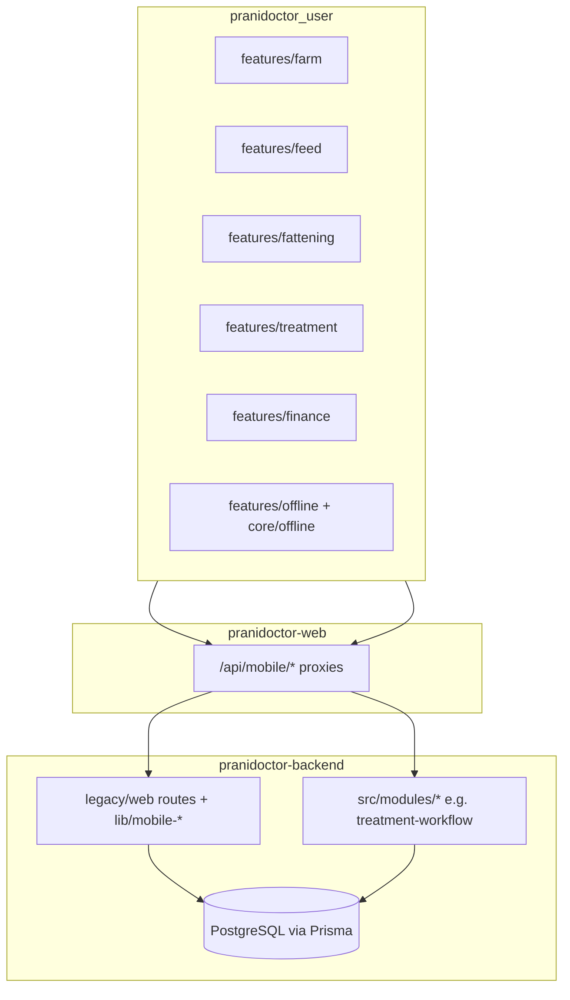
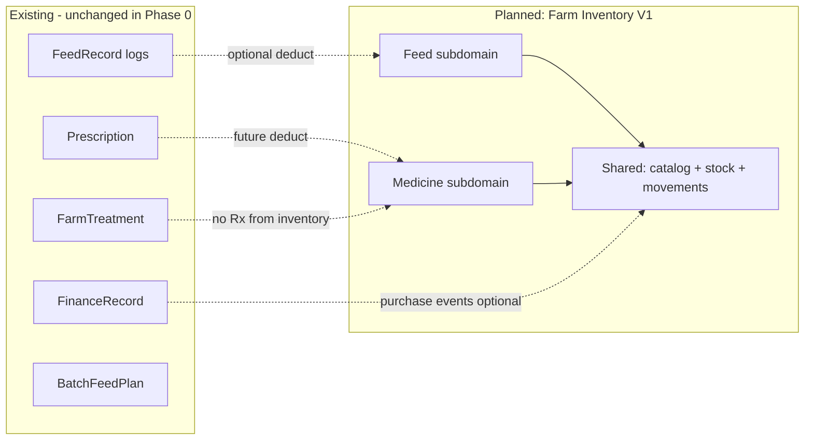

# Farm Inventory System V1 — Current State Audit

**Plan ID:** `FARM_INVENTORY_SYSTEM_V1`  
**Date:** 2026-05-24  
**Scope:** `pranidoctor_user` (Flutter), `pranidoctor-backend` (Express + Prisma), `pranidoctor-web` (Next.js proxies)  
**Mode:** Read-only analysis — no implementation in this phase

---

## Executive Summary

PraniDoctor today implements **farm operations logging** (feed consumption, treatments, finance, fattening analytics) but **not on-hand inventory**. The only production stock ledger is **`TechnicianSemenInventory`** (AI technician domain). Introducing farm feed and medicine inventory is a **greenfield data layer** that must integrate with existing **`FeedRecord`** logs and clinical **`Prescription`** / **`FarmTreatment`** flows without breaking current APIs or UX.

| Capability | Today | V1 target |
|------------|-------|-----------|
| Feed consumption logging | `FeedRecord` + Flutter `feed` feature | Unchanged; optional stock deduction |
| Feed on-hand balance | None | Farmer-managed catalog + quantity |
| Medicine on-hand balance | None | Farmer-managed catalog + quantity |
| Treatment decisions | Farmer (`FarmTreatment`) + Doctor (`TreatmentCase` / `Prescription`) | Inventory does **not** prescribe |
| Stock consumption from treatment | None | Doctor/AI-authorized paths only (future) |

---

## A. Current Architecture Map

### A.1 System context

### A.2 Backend — data models (Prisma)

**Source:** `pranidoctor-backend/prisma/schema.prisma`

| Model | Purpose | Inventory relevance |
|-------|---------|---------------------|
| `CustomerProfile` | Farmer account hub | Owns all mobile farm records |
| `AnimalProfile` | Animal registry | Target for feed logs & treatments |
| `FeedRecord` | Daily feed **consumption** log | **Primary feed event**; no stock FK |
| `FeedType`, `FeedUnit` | Global enums | Fixed taxonomy; not per-farm catalog |
| `FatteningBatch`, `BatchFeedPlan` | Fattening batch + planned kg/day | Planning/analytics; not warehouse stock |
| `FarmTreatment` | Farmer treatment log + `medicinesJson` | Clinical log; **not** stock |
| `FinanceRecord` | Expense/income; categories `FEED`, `MEDICINE` | Accounting; **not** stock ledger |
| `HealthEvent`, `VaccineRecord` | Health timeline | Adjacent; no stock |
| `Prescription`, `PrescriptionItem` | Doctor service-request Rx | Platform clinical; **not** farm cabinet |
| `TreatmentCase` (+ workflow tables) | Doctor case on `ServiceRequest` | Authoritative clinical path |
| `TechnicianSemenInventory` | Semen lot stock | **Reference pattern** for quantity fields |
| `BillingRecord.medicineCost` | Invoice line | Billing only |

**Not present:** `FarmProfile` table, `FeedStock`, `MedicineStock`, `InventoryMovement`, `Farm` entity (farms are client-side composite + `farmRef` string).

### A.3 Backend — API surface

**Mobile farmer APIs** (`/api/mobile/*`, `src/legacy/web/routes/mobile/`, registered via `src/modules/compat-web/route-registry.ts`):

| Domain | Paths | Service layer |
|--------|-------|---------------|
| Feeds | `GET/POST /feeds`, `GET/PATCH/DELETE /feeds/:id`, `/cost`, `/analytics` | `lib/mobile-feeds/` |
| Fattening | `/fattening/batches/*`, feed-plan, feed-dashboard, weight, roi, qurbani | `lib/mobile-fattening/` |
| Treatments | `/treatments/*` | `lib/mobile-treatments/` → `FarmTreatment` |
| Finance | `/finance/expenses`, `/income`, `/profit`, … | `lib/mobile-finance/` |
| Animals, milk, health, vaccines | respective `mobile-*` libs | — |

**Doctor / platform APIs:**

| Domain | Paths | Notes |
|--------|-------|-------|
| Treatment workflow | `/api/cases/:id/treatment`, `.../prescription`, … | `src/modules/treatment-workflow/` |
| Doctor prescriptions | `routes/doctor/service-requests/[id]/prescriptions/` | Creates `Prescription` rows |

**Stock APIs today:** only AI technician semen (`semen-inventory-service.ts`), not farmer-facing.

### A.4 Flutter — feature modules

| Feature | Path | State pattern |
|---------|------|---------------|
| Farm | `lib/features/farm/` | Riverpod: `farmListProvider`, `activeFarmIdProvider` |
| Feed | `lib/features/feed/` | `feedListProvider`, offline cache keys `feedsListKey`, outbox on mutations |
| Fattening | `lib/features/fattening/` (nested under farm routes) | `fatteningBatchListProvider(farmId)`; **log feed** calls `feedRepository.createRecord()` |
| Treatment | `lib/features/treatment/` | `MedicineItem` in DTO; medicine plan / prescription **view** screens |
| Finance | `lib/features/finance/` | `ExpenseCategory` includes feed/medicine expenses |
| Offline | `lib/features/offline/` + `lib/core/offline/` | `OutboxService`, `SyncCoordinator`, `LocalCacheContract` |

**Not present:** `lib/features/inventory/`, stock widgets, inventory routes.

### A.5 Navigation & entry points

**Routes:** `lib/routing/app_routes.dart`, `lib/routing/app_router.dart`

| Area | Route prefix | Drawer (`drawer_menu.dart`) |
|------|--------------|------------------------------|
| Farms | `/farms`, `/farms/:id/fattening/...` | Farm section → Farm list, Feed entry, Fattening |
| Feeds | `/feeds`, `/feeds/create`, cost, analytics | Farm section → **Feed entry** |
| Treatments | `/treatments`, medicine-plan, prescription | Top-level **Treatments** |

### A.6 Farm identity model (critical for inventory scoping)

| Concept | Implementation |
|---------|----------------|
| Farm list/detail | Client composite (`FarmRepository` + dashboard context); `Farm.id` used in app |
| Server `farmRef` | Optional string on `FeedRecord`, `FarmTreatment`, `FinanceRecord`, etc. |
| Fattening `farmId` | String on `FatteningBatch`; **no FK** to a `Farm` table |
| Active farm | `activeFarmIdProvider` + `LocalCacheContract.activeFarmIdKey` |

**Implication:** V1 inventory must key off **`farmRef` aligned with app `Farm.id`** (same convention as feed/finance), not introduce a new farm PK without migration.

### A.7 Existing feed flow (consumption only)

1. Farmer opens **Feed entry** (`/feeds/create` or fattening **Log feed**).
2. Selects `FeedType` enum, amount, unit, optional cost, target (animal / legacy batch / fattening batch).
3. `POST /api/mobile/feeds` creates `FeedRecord`.
4. Fattening dashboard/ROI aggregates `FeedRecord.costBdt` where `fatteningBatchId` is set.

**No step** reads or updates on-hand quantity.

### A.8 Existing medicine / treatment flow

| Path | Who decides treatment | Data shape |
|------|----------------------|------------|
| **FarmTreatment** (mobile) | Farmer creates title, diagnosis, `medicinesJson` | `MedicineItem`-like JSON (name, dosage, frequency, duration) |
| **Prescription** (doctor) | Doctor on `ServiceRequest` | Normalized `PrescriptionItem` (medicineName, dosage, quantity) |
| **TreatmentCase workflow** | Doctor | Structured workflow + prescription step |

**No path** decrements a medicine cabinet today.

### A.9 Reference stock pattern — semen inventory

`TechnicianSemenInventory` + `semen-inventory-service.ts`:

- `currentQuantity`, `reservedQuantity`, `usedQuantity`, `minStockAlert`
- Lot metadata: `batchNumber`, `expiryDate`
- Validation: non-negative quantities; reserved ≤ current

Use as **engineering reference**, not as a shared table with farm inventory.

### A.10 Offline-first conventions (must extend for V1)

| Mechanism | Location |
|-----------|----------|
| Cache keys | `lib/core/offline/local_cache_contract.dart` |
| Outbox ops | `lib/features/offline/data/outbox_item.dart`, `sync_coordinator.dart` |
| Repository pattern | Dio + cache write + outbox enqueue on failure |

Feed and treatment modules already follow this; inventory V1 should mirror it.

### A.11 Related planning / audit docs

| Document | Relevance |
|----------|-----------|
| `docs/user_app/USER_APP_10_FEED.md` | Feed module complete; consumption-only |
| `docs/USER_APP_14_TREATMENT_PLAN.md` | Farm treatment CRUD |
| `docs/USER_APP_11_FINANCE_PLAN.md` | FEED/MEDICINE expense categories |
| `pranidoctor-web/docs/audit/CATTLE_FATTENING_IMPLEMENTATION_AUDIT.md` | Fattening now exists in backend (doc partially stale) |

---

## B. Gap Analysis vs V1 Goals

| V1 requirement | Current state | Gap |
|----------------|---------------|-----|
| Farmer selects available feeds | Fixed `FeedType` enum only | Per-farm **catalog items** needed |
| Store feed stock quantity | None | New stock entity + movements |
| Feeding logs reduce stock | Logs only | Link `FeedRecord` → stock **movement** (optional/auto) |
| Ration engine consumes inventory | `BatchFeedPlan` is kg/day plan only | Future engine; needs catalog + stock API |
| Feed purchase recommendation | None | Derived from low stock + plan (future) |
| Farmer stores medicine quantity | None | Medicine catalog + stock |
| AI/doctor treatment consumes stock | None | Consumption adapter from `Prescription` / workflow (later phase) |
| Medicine inventory never prescribes | N/A | **Policy** + API guards |

---

## C. Architecture Map Diagram (domain boundaries)

---

## D. Key File Index (implementation touchpoints later)

### Backend

| Area | Path |
|------|------|
| Schema | `prisma/schema.prisma` |
| Feed API | `src/legacy/web/lib/mobile-feeds/feed-service.ts` |
| Treatment API | `src/legacy/web/lib/mobile-treatments/treatment-service.ts` |
| Fattening feed dashboard | `src/legacy/web/lib/mobile-fattening/feed-plan-service.ts` |
| Semen stock reference | `src/legacy/web/lib/mobile-ai-technician/semen-inventory-service.ts` |
| Route registry | `src/modules/compat-web/route-registry.ts` |

### Flutter

| Area | Path |
|------|------|
| Feed feature | `lib/features/feed/` |
| Treatment feature | `lib/features/treatment/` |
| Farm / active farm | `lib/features/farm/` |
| Routing | `lib/routing/app_routes.dart`, `app_router.dart` |
| Drawer | `lib/features/home/presentation/widgets/drawer_menu.dart` |
| Offline contracts | `lib/core/offline/local_cache_contract.dart` |

### Web

| Area | Path |
|------|------|
| Mobile proxies | `src/app/api/mobile/**/route.ts` |

---

## E. Audit Conclusion

The platform is **ready for additive inventory modeling** because:

1. Feed and treatment mobile stacks are mature and offline-capable.
2. No conflicting stock tables exist.
3. Semen inventory proves quantity ledger patterns in-repo.

Primary risks are **semantic overlap** (feed logs vs stock, finance vs purchases, farmer treatment vs medicine cabinet) and **farm identity** (`farmRef` vs `Farm.id` vs `FatteningBatch.farmId`). V1 planning must treat inventory as a **new bounded context** that references existing logs via optional FKs, not replaces them.
