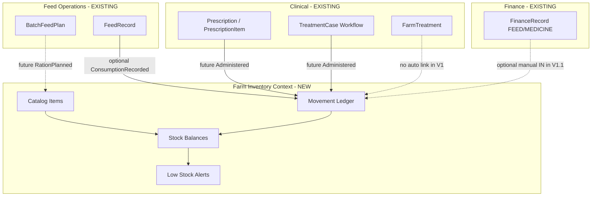

# Farm Inventory System V1 — Domain Design

**Plan ID:** `FARM_INVENTORY_SYSTEM_V1`  
**Date:** 2026-05-24  
**Status:** Planning only

---

## 1. Vision

Introduce a **single Farm Inventory bounded context** with two **subdomains**:

| Subdomain | Owner actions | System actions |
|-----------|---------------|----------------|
| **Feed Inventory** | Select feeds carried on farm; record purchases/adjustments; view on-hand | Feeding logs may **deduct** stock; ration engine (future) **reserves/consumes**; low-stock may **suggest purchase** |
| **Medicine Inventory** | Record medicine names and on-hand quantity only | Authorized treatments (doctor / AI workflow) may **deduct** stock; inventory **never** creates prescriptions |

---

## 2. Ubiquitous Language

| Term | Definition |
|------|------------|
| **Inventory catalog item** | A farmer-defined SKU-like row (feed or medicine) enabled for a farm |
| **Stock balance** | Current on-hand quantity for one catalog item at one farm |
| **Stock movement** | Immutable ledger row: IN, OUT, ADJUST; changes balance |
| **Consumption** | OUT movement linked to an operational event (feed log, treatment administration) |
| **Purchase / receipt** | IN movement (manual entry or future finance link) |
| **Low stock** | Balance ≤ configurable threshold → recommendation signal only |
| **Prescription** | Clinical directive from doctor/AI — **outside** inventory write model |

---

## 3. Bounded Context Map



---

## 4. Aggregate Design

### 4.1 Shared kernel (both subdomains)

**Aggregate: `FarmInventoryItem`** (catalog)

- Scoped by: `customerId`, `farmRef`, `domain` (`FEED` | `MEDICINE`)
- Attributes: `displayName`, `unit`, optional `feedType` (feed only), optional `skuNotes`, `isActive`, `lowStockThreshold`
- Invariants:
  - `displayName` unique per (`customerId`, `farmRef`, `domain`) when active
  - Medicine items have **no** dosage/prescription fields

**Aggregate: `FarmInventoryBalance`** (derived state)

- One row per `inventoryItemId`
- `quantityOnHand` (decimal), `unit` (copied from item)
- Updated **only** via movements (no direct PATCH of quantity in V1)

**Aggregate: `FarmInventoryMovement`** (ledger)

- `type`: `RECEIPT` | `CONSUMPTION` | `ADJUSTMENT` | `VOID` (reversal)
- `quantityDelta` (signed)
- `sourceType` + `sourceId` (polymorphic reference)
- `idempotencyKey` for offline sync
- Invariants:
  - Consumption cannot exceed on-hand unless `allowNegativeStock` flag on item (default **false**)
  - VOID only by system against prior movement

### 4.2 Feed subdomain rules

| Rule ID | Rule |
|---------|------|
| F-01 | Farmer **chooses** which feed catalog items are active for the farm |
| F-02 | Farmer may record **RECEIPT** (purchase/stock-in) and **ADJUSTMENT** |
| F-03 | Creating/updating **`FeedRecord`** may trigger **CONSUMPTION** when `inventoryItemId` + `deductStock=true` |
| F-04 | If stock insufficient, API returns **409 INSUFFICIENT_STOCK**; feed log creation policy: **configurable** (block vs log-without-deduct) — default **block** when deduct requested |
| F-05 | **`BatchFeedPlan`** does not mutate stock in V1; future ration engine reads balances |
| F-06 | Low stock generates **recommendation** (in-app banner/list), not auto-purchase |
| F-07 | Global `FeedType` enum remains on `FeedRecord` for analytics; catalog may **map** to enum |

### 4.3 Medicine subdomain rules

| Rule ID | Rule |
|---------|------|
| M-01 | Farmer **only** maintains catalog + quantity; **no** diagnosis, dosage schedule, or Rx text on inventory screens |
| M-02 | **`FarmTreatment` form must not** become the medicine cabinet UI (separate nav: Inventory → Medicine) |
| M-03 | Inventory **never** exposes `POST .../prescription` or creates `Prescription` / `PrescriptionItem` |
| M-04 | Stock **CONSUMPTION** only via `MedicineAdministration` events authorized by:
  - Doctor `Prescription` fulfillment (V1.2+), or
  - Internal `TreatmentCase` workflow step (V1.2+), or
  - Explicit farmer **“used from stock”** adjustment with audit reason (V1 optional, gated) |
| M-05 | AI-generated treatment plans (future) call **inventory consumption API** with `authorizedBy: AI_SERVICE` + case id |
| M-06 | Low stock alerts are informational; **no** treatment suggestions from inventory module |

---

## 5. Subdomain Comparison

| Dimension | Feed Inventory | Medicine Inventory |
|-----------|----------------|-------------------|
| Catalog source | Farmer-selected feeds | Farmer-entered medicine names |
| Typical unit | kg, bag, bundle (align `FeedUnit`) | tablet, ml, vial (new `MedicineUnit` enum) |
| Primary consumption driver | `FeedRecord` | Prescription / workflow (later) |
| Farmer treatment module | Independent | **Must not** merge Rx UI with stock |
| Finance link | Optional `FinanceRecord` FEED → RECEIPT | Optional MEDICINE → RECEIPT |
| Recommendation output | “Buy more {feed}” | “Restock {medicine}” only |

---

## 6. Context Integration Contracts (logical)

### 6.1 FeedRecord integration (V1.1)

```
On FeedRecordCreated:
  IF body.inventoryItemId IS NOT NULL AND body.deductStock == true:
    POST internal StockConsumption(feedMovement)
    LINK feedRecord.stockMovementId
```

Backward compatible: `inventoryItemId` and `deductStock` are **optional**; legacy clients omit them.

### 6.2 Prescription integration (V1.2+)

```
On PrescriptionDispensed(item):
  MATCH medicine catalog by normalized name OR explicit catalogItemId
  IF match AND farmer opted into stock tracking:
    CONSUMPTION movement linked to prescriptionItemId
```

No reverse flow (inventory → prescription).

### 6.3 FarmTreatment boundary

- `FarmTreatment.medicinesJson` remains a **clinical note** for farmer self-logging.
- V1: **no automatic** stock deduction from `medicinesJson`.
- Product copy: “Treatment log is not your medicine cabinet.”

---

## 7. Modular Architecture (code layout — future)

### Backend (`pranidoctor-backend`)

```
src/legacy/web/lib/mobile-inventory/
  shared/          # mappers, movement service, balance projector
  feed/            # feed catalog validators
  medicine/        # medicine catalog validators
src/legacy/web/routes/mobile/inventory/
  feed/...
  medicine/...
  movements/...
```

Alternative (if promoted to module): `src/modules/farm-inventory/` — prefer **legacy mobile path** for consistency with feed/treatment.

### Flutter (`pranidoctor_user`)

```
lib/features/inventory/
  core/            # shared DTOs, repository contract, unit enums
  feed/            # feed catalog + stock screens
  medicine/        # medicine catalog + stock screens
  presentation/    # shared widgets: stock_chip, movement_list
```

**Do not** fold into `lib/features/feed/` — avoids conflating consumption analytics with warehouse UI.

---

## 8. Policy Enforcement Matrix

| Action | Feed | Medicine |
|--------|------|----------|
| Farmer CRUD catalog | ✅ | ✅ |
| Farmer set quantity (RECEIPT/ADJUST) | ✅ | ✅ |
| Farmer create prescription | ❌ | ❌ |
| Farmer log treatment with medicines | ✅ (existing `FarmTreatment`) | ✅ (existing, no stock) |
| System deduct on feed log | ✅ (optional) | — |
| System deduct on doctor Rx | — | ✅ (future) |
| Inventory suggests clinical action | ❌ (purchase only) | ❌ (restock only) |

---

## 9. D. Final Recommended Design (summary)

| Layer | Recommendation |
|-------|----------------|
| **Domain** | Single `Farm Inventory` context; subdomains differ by rules and enums, share movement ledger |
| **Catalog** | Per-farm items with `domain` discriminator |
| **Stock** | Event-sourced movements → projected balance (semen inventory pattern) |
| **Feed logs** | Extend `FeedRecord` with optional `inventoryItemId`; deduct in same transaction |
| **Medicine** | Catalog-only for V1; consumption wired in V1.2 to doctor/AI paths |
| **UX** | New drawer section “Inventory” → Feed stock \| Medicine stock |
| **Compatibility** | All existing APIs unchanged; new routes under `/api/mobile/inventory/*` |

See `04-db-design.md`, `05-api-contract.md`, `06-ui-flow.md`, `07-execution-roadmap.md` for physical design and phasing.
