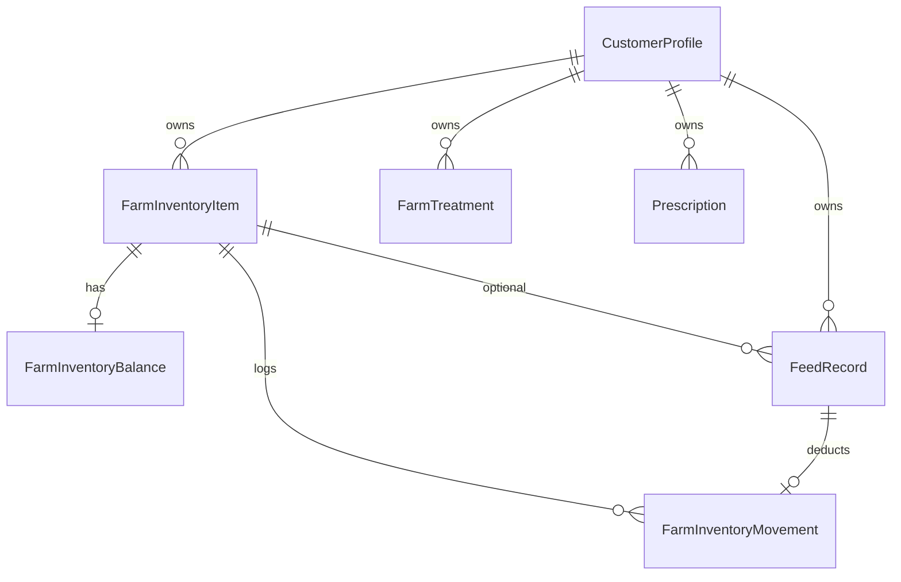

# Farm Inventory System V1 — Database Design

**Plan ID:** `FARM_INVENTORY_SYSTEM_V1`  
**Date:** 2026-05-24  
**Target:** `pranidoctor-backend/prisma/schema.prisma` (future migration — **not applied in planning phase**)

---

## 1. Design Principles

1. **Additive only** — no drops or renames of `FeedRecord`, `FarmTreatment`, `Prescription`.
2. **farmRef scoping** — align with `FeedRecord.farmRef` / `FinanceRecord.farmRef`.
3. **Ledger-first** — balances derived from movements (match `TechnicianSemenInventory` discipline).
4. **Domain discriminator** — one catalog table with `InventoryDomain` enum.
5. **Polymorphic source** — movements link to feed logs, prescription items, adjustments.

---

## 2. New Enums

```prisma
enum InventoryDomain {
  FEED
  MEDICINE
}

enum InventoryMovementType {
  RECEIPT      // stock in (purchase, opening balance)
  CONSUMPTION  // stock out (feeding, administration)
  ADJUSTMENT   // manual correction (+/-)
  VOID         // reverses a prior movement
}

enum MedicineUnit {
  TABLET
  CAPSULE
  ML
  LITER
  VIAL
  SACHET
  TUBE
  OTHER
}

enum InventoryMovementSourceType {
  MANUAL
  FEED_RECORD
  PRESCRIPTION_ITEM
  TREATMENT_CASE
  AI_PLAN
  FINANCE_RECORD
}
```

---

## 3. New Models

### 3.1 `FarmInventoryItem` (catalog)

```prisma
model FarmInventoryItem {
  id                String           @id @default(cuid())
  customerId        String
  farmRef           String
  domain            InventoryDomain
  displayName       String
  /// Feed subdomain: optional link to analytics enum
  feedType          FeedType?
  /// Feed subdomain
  feedUnit          FeedUnit?
  /// Medicine subdomain
  medicineUnit      MedicineUnit?
  lowStockThreshold Decimal?         @db.Decimal(10, 3)
  allowNegativeStock Boolean         @default(false)
  isActive          Boolean          @default(true)
  notes             String?
  createdAt         DateTime         @default(now())
  updatedAt         DateTime         @updatedAt

  customer          CustomerProfile  @relation(fields: [customerId], references: [id], onDelete: Cascade)
  balance           FarmInventoryBalance?
  movements         FarmInventoryMovement[]
  feedRecords       FeedRecord[]     // optional FK from extended FeedRecord

  @@unique([customerId, farmRef, domain, displayName])
  @@index([customerId, farmRef, domain, isActive])
}
```

### 3.2 `FarmInventoryBalance` (projection)

```prisma
model FarmInventoryBalance {
  id              String            @id @default(cuid())
  inventoryItemId String            @unique
  quantityOnHand  Decimal           @db.Decimal(12, 3)
  updatedAt       DateTime          @updatedAt

  item            FarmInventoryItem @relation(fields: [inventoryItemId], references: [id], onDelete: Cascade)
}
```

Updated in the same transaction as movement insert (application-level projector; optional DB trigger later).

### 3.3 `FarmInventoryMovement` (ledger)

```prisma
model FarmInventoryMovement {
  id              String                      @id @default(cuid())
  customerId      String
  inventoryItemId String
  farmRef         String
  domain          InventoryDomain
  type            InventoryMovementType
  quantityDelta   Decimal                     @db.Decimal(12, 3) // signed; OUT negative
  unitSnapshot    String                      // denormalized unit label at time of move
  sourceType      InventoryMovementSourceType
  sourceId        String?                     // e.g. feedRecordId, prescriptionItemId
  idempotencyKey  String?
  reason          String?                     // required for ADJUSTMENT on medicine
  authorizedBy    String?                     // role/service id for CONSUMPTION
  voidsMovementId String?                     // when type = VOID
  recordedAt      DateTime                    @default(now())
  createdAt       DateTime                    @default(now())

  customer        CustomerProfile             @relation(fields: [customerId], references: [id], onDelete: Cascade)
  item            FarmInventoryItem           @relation(fields: [inventoryItemId], references: [id], onDelete: Cascade)

  @@unique([customerId, idempotencyKey])
  @@index([inventoryItemId, recordedAt])
  @@index([customerId, farmRef, domain])
  @@index([sourceType, sourceId])
}
```

---

## 4. Extensions to Existing Models

### 4.1 `FeedRecord` (additive columns)

```prisma
model FeedRecord {
  // ... existing fields ...
  inventoryItemId   String?
  stockMovementId   String?   @unique
  deductStock       Boolean   @default(false)

  inventoryItem     FarmInventoryItem?      @relation(fields: [inventoryItemId], references: [id], onDelete: SetNull)
  stockMovement     FarmInventoryMovement?  @relation(fields: [stockMovementId], references: [id], onDelete: SetNull)
}
```

**Note:** Prisma may require explicit relation name if `FarmInventoryMovement` has multiple relations to `FeedRecord` — use `@relation("FeedStockMovement")` in implementation.

### 4.2 `CustomerProfile` relation

Add to `CustomerProfile`:

```prisma
farmInventoryItems     FarmInventoryItem[]
farmInventoryMovements FarmInventoryMovement[]
```

### 4.3 No changes to `FarmTreatment`, `Prescription` in V1

V1.2 optional:

```prisma
// PrescriptionItem.inventoryItemId String?  — future
```

---

## 5. Entity Relationship Diagram



---

## 6. Indexing & Query Patterns

| Query | Index used |
|-------|------------|
| List catalog for farm + domain | `(customerId, farmRef, domain, isActive)` |
| Current stock for item | `FarmInventoryBalance.inventoryItemId` |
| Movement history | `(inventoryItemId, recordedAt)` |
| Low stock scan | Application: `quantityOnHand <= lowStockThreshold` |
| Idempotent replay | `(customerId, idempotencyKey)` unique |

---

## 7. Transaction Boundaries

### Create feed with deduct

```
BEGIN;
  INSERT FarmInventoryMovement (CONSUMPTION, negative delta);
  UPDATE FarmInventoryBalance SET quantityOnHand = quantityOnHand + delta;
  IF quantityOnHand < 0 AND NOT allowNegativeStock → ROLLBACK;
  INSERT FeedRecord (... inventoryItemId, stockMovementId, deductStock=true);
COMMIT;
```

### Create catalog item

```
BEGIN;
  INSERT FarmInventoryItem;
  INSERT FarmInventoryBalance (quantityOnHand = 0);
  OPTIONAL: INSERT Movement RECEIPT (opening balance) if initialQty > 0;
COMMIT;
```

---

## 8. D. Migration Strategy (database)

| Migration | Contents | Rollback |
|-----------|----------|----------|
| `YYYYMMDD_farm_inventory_phase1` | Enums + 3 new tables | Drop tables if empty |
| `YYYYMMDD_feed_record_inventory_fk` | Nullable FKs on `FeedRecord` | Drop columns |
| Seed (dev) | Sample catalog for test farms | Optional |

**Production rules:**
- Deploy schema before enabling mobile feature flag.
- Backfill **not required** — existing feed rows remain without `inventoryItemId`.
- Opening balances: one-time farmer action per item (RECEIPT movement), not automated from history.

---

## 9. Data Volume & Retention

| Table | Growth | Retention |
|-------|--------|-----------|
| `FarmInventoryItem` | Low (tens per farm) | Soft-delete via `isActive` |
| `FarmInventoryBalance` | 1:1 with items | Permanent |
| `FarmInventoryMovement` | Medium (each feed deduct) | Keep full history V1; archive policy later |

---

## 10. Comparison to `TechnicianSemenInventory`

| Aspect | Semen inventory | Farm inventory |
|--------|-----------------|----------------|
| Scope | Per AI service | Per farm + customer |
| Quantities | int doses | decimal kg/ml/etc |
| Ledger | Implicit in lot row | Explicit `FarmInventoryMovement` |
| Reserved qty | Yes | Defer to ration engine (V2) |
| Min alert | `minStockAlert` | `lowStockThreshold` on item |

Farm inventory is **more rigorous** (full ledger) because multiple event types attach to one SKU.

---

## 11. Open Questions (resolve before implementation)

1. **Unique displayName** — case-insensitive collation for Bangla/Latin names?
2. **Multi-farm transfer** — V1 out of scope; ADJUSTMENT out + ADJUSTMENT in?
3. **Unit conversions** — e.g. bag → kg: not in V1; one unit per item only.
4. **Expiry dates** — medicine batches: optional `expiryDate` on movement RECEIPT (V1.1)?
