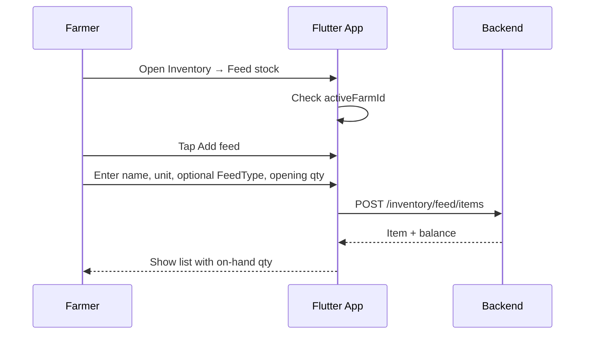
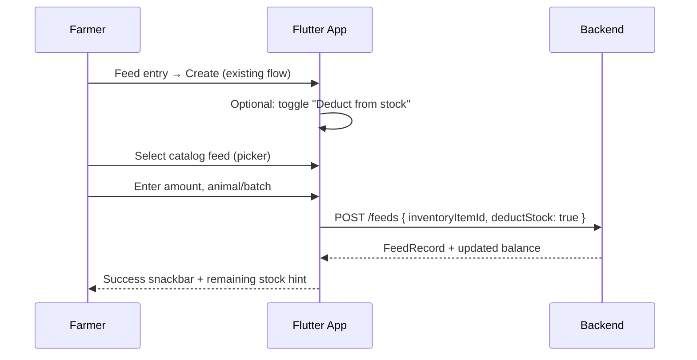
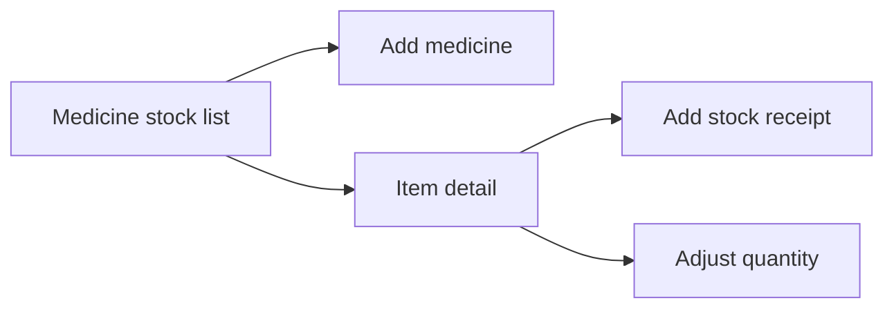

# Farm Inventory System V1 — UI Flow

**Plan ID:** `FARM_INVENTORY_SYSTEM_V1`  
**Date:** 2026-05-24  
**Target:** `pranidoctor_user` Flutter app

---

## 1. Information Architecture

### 1.1 Drawer structure (proposed)

```
Treatments                    → /treatments (unchanged — clinical log)
Farm ▼
  Farm list                   → /farms
  Feed entry                  → /feeds (consumption log — unchanged label)
  Milk entry                  → /milk
  ...
Inventory ▼                   → NEW section
  Feed stock                  → /inventory/feed?farmRef={activeFarm}
  Medicine stock              → /inventory/medicine?farmRef={activeFarm}
```

**Rationale (conflict C-14):** Keep **Feed entry** for daily logging; **Feed stock** for warehouse. Distinct verbs in labels.

### 1.2 Route table (new)

| Route constant | Path | Screen |
|----------------|------|--------|
| `inventoryFeed` | `/inventory/feed` | Feed stock list |
| `inventoryFeedCreate` | `/inventory/feed/create` | Add feed to catalog |
| `inventoryFeedDetail` | `/inventory/feed/:id` | Item detail + movements |
| `inventoryFeedReceipt` | `/inventory/feed/:id/receipt` | Stock in form |
| `inventoryMedicine` | `/inventory/medicine` | Medicine stock list |
| `inventoryMedicineCreate` | `/inventory/medicine/create` | Add medicine |
| `inventoryMedicineDetail` | `/inventory/medicine/:id` | Detail + movements |
| `inventoryRecommendations` | `/inventory/recommendations` | Low stock (optional hub) |

All farm-scoped routes require `activeFarmId`; if null → prompt to select farm (same pattern as fattening).

---

## 2. User Journeys

### 2.1 Feed — first-time setup



### 2.2 Feed — daily feeding with stock deduct (V1.1)



**Insufficient stock:** Show `INSUFFICIENT_STOCK` dialog with actions:
- Adjust amount
- Log without deduct (clears `deductStock`)
- Go to stock receipt

### 2.3 Feed — purchase / stock in

From **Feed stock detail** → **Add stock**:
- Quantity, date, optional note
- `POST .../items/:id/movements` type `RECEIPT`
- No finance screen in V1 (link later)

### 2.4 Medicine — cabinet only (V1)



**Explicitly absent from medicine flows:**
- Dosage / frequency / duration fields
- "Create prescription" button
- Diagnosis or treatment plan steps

Copy on medicine create screen:

> *Store what you have on hand. Treatment plans come from your vet or PraniDoctor — not from this screen.*

### 2.5 Low stock recommendations

| Trigger | UI |
|---------|-----|
| Item below threshold | Orange chip on list row |
| Summary API | Banner on farm home / inventory hub: "2 feeds running low" |
| Tap | `/inventory/recommendations` filtered list |

Recommendation card CTA: **"Record purchase"** → receipt form (not finance, not prescription).

---

## 3. Screen Specifications

### 3.1 Feed stock list (`InventoryFeedListPage`)

| Element | Behavior |
|---------|----------|
| App bar | Title: "Feed stock"; farm name subtitle |
| FAB | Add feed to catalog |
| List row | `displayName`, `quantityOnHand` + unit, low-stock chip |
| Tap row | Detail |
| Pull refresh | Invalidate `inventoryFeedListProvider` |
| Offline | Cached list + pending sync badge (reuse `feed_feedback` pattern) |

### 3.2 Feed catalog form (`InventoryFeedCreatePage`)

| Field | Required |
|-------|----------|
| Name | yes |
| Unit (`FeedUnit`) | yes |
| Feed type | no (maps to analytics) |
| Opening quantity | no (default 0) |
| Low stock alert | no |

### 3.3 Feed stock detail (`InventoryFeedDetailPage`)

| Section | Content |
|---------|---------|
| Header | Name, on-hand, threshold |
| Actions | Add stock, Adjust, Deactivate |
| Movement history | Paginated list (type icon + delta + date) |
| Link | "Log feeding" → `/feeds/create` with query `?inventoryItemId=` |

### 3.4 Medicine stock list / detail

Same layout as feed with `MedicineUnit` picker instead of `FeedType`.

**No** link to `/treatments/create` from medicine detail.

### 3.5 Feed entry form changes (`FeedEntryFormPage` — minimal)

| Addition | Phase |
|----------|-------|
| Toggle "Deduct from my feed stock" | V1.1 |
| Catalog dropdown (filtered by active farm) | V1.1 |
| Show remaining qty after selection | V1.1 |

Existing fields unchanged for users who never enable toggle.

### 3.6 Fattening log feed (`fattening_log_feed_page.dart`)

| Addition | Phase |
|----------|-------|
| Same optional deduct + catalog picker | V1.1 |
| Pre-fill `fatteningBatchId` as today | unchanged |

---

## 4. Reusable Widgets (planned)

| Widget | Location | Reuse from |
|--------|----------|------------|
| `InventoryItemCard` | `inventory/presentation/widgets/` | Pattern from `feed_entry_card.dart` |
| `StockQuantityChip` | shared | New |
| `MovementTimelineTile` | shared | Pattern from treatment timeline |
| `LowStockBanner` | shared | Pattern from `offline_status_banner` |
| `InventoryFeedback` | shared | Clone `feed_feedback.dart` / `farm_feedback.dart` |

---

## 5. State Management (Riverpod)

| Provider | Type | Notes |
|----------|------|-------|
| `inventoryFeedListProvider` | `AsyncNotifier` family `(farmRef)` | Cache-first |
| `inventoryFeedDetailProvider` | `FutureProvider.family` | |
| `inventoryMedicineListProvider` | same | |
| `inventoryRecommendationsProvider` | `FutureProvider.family` | |
| `inventoryNavigation` | static invalidation helper | Mirror `FeedNavigation` |

Register in `lib/features/inventory/presentation/inventory_providers.dart`.

**Do not** merge into `feed_providers.dart` — keeps bounded context separation.

---

## 6. Offline Behavior

| Action | Offline support |
|--------|-----------------|
| View stock list | Cache snapshot |
| Create catalog item | Outbox `inventory_feed_item_create` |
| Record receipt | Outbox `inventory_movement_create` |
| Feed log + deduct | **Requires online V1.1** OR queue feed without deduct until sync (recommended: block deduct offline with message) |

**Rationale:** Stock deduct needs server-side balance check to prevent oversell.

---

## 7. Localization Keys (planned)

Add to `lib/l10n/app_en.arb`:

| Key | English |
|-----|---------|
| `drawerInventorySection` | Inventory |
| `drawerFeedStock` | Feed stock |
| `drawerMedicineStock` | Medicine stock |
| `inventoryFeedStockTitle` | Feed stock |
| `inventoryMedicineStockTitle` | Medicine stock |
| `inventoryDeductFromStock` | Deduct from my feed stock |
| `inventoryLowStock` | Low stock |
| `inventoryPurchaseSuggestion` | Consider buying more |
| `inventoryMedicineDisclaimer` | Store quantities only. Treatment plans come from your vet. |

---

## 8. Integration Points (existing screens)

| Screen | Change |
|--------|--------|
| `farm_detail_page.dart` | Optional card: "Feed stock: 3 items, 1 low" → inventory |
| `batch_feed_dashboard_page.dart` | Future: compare plan vs on-hand (V2) |
| `drawer_menu.dart` | Add Inventory section |
| `treatment_form_page.dart` | **No change** V1 |
| `treatment_medicine_plan_page.dart` | **No change** V1 |

---

## 9. Accessibility & UX Guardrails

1. **Color coding:** Feed = green accent; Medicine = blue accent (distinct from treatment red).
2. **Confirm destructive:** Deactivate catalog item (soft delete).
3. **Unit display:** Always show unit next to quantity (kg, ml).
4. **Error clarity:** `INSUFFICIENT_STOCK` shows current on-hand in dialog.

---

## 10. Manual QA Checklist (for implementation phase)

- [ ] Active farm required on all inventory routes
- [ ] Feed entry works with deduct off (regression)
- [ ] Fattening log feed with deduct on reduces correct farm stock
- [ ] Medicine screens have no dosage/prescription fields
- [ ] Treatment module unchanged
- [ ] Offline: list loads from cache; receipt queues
- [ ] Low stock banner matches API recommendations
