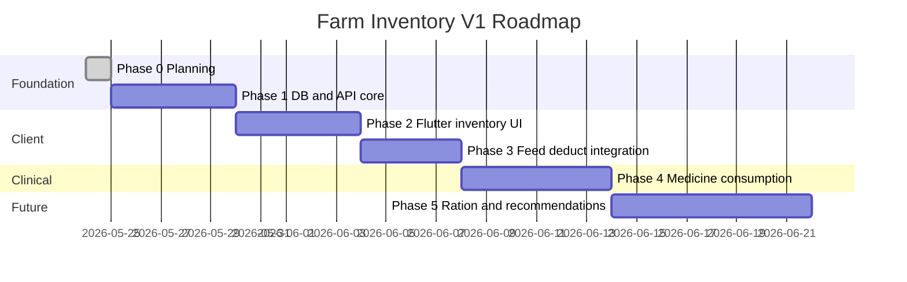

# Farm Inventory System V1 — Execution Roadmap

**Plan ID:** `FARM_INVENTORY_SYSTEM_V1`  
**Date:** 2026-05-24  
**Status:** Planning complete — implementation not started

---

## 1. Goals & Success Criteria

| Goal | Success metric |
|------|----------------|
| Farmer manages feed on-hand per farm | CRUD catalog + view balance |
| Farmer manages medicine on-hand per farm | CRUD catalog + view balance (no Rx) |
| Feed logs can reduce stock | Optional deduct; 409 on insufficient |
| Backward compatible | Legacy app versions work without inventory fields |
| Modular delivery | Ship phases independently behind flags |

---

## 2. Phase Overview

*Durations are estimates for a single full-stack developer; adjust per team capacity.*

---

## 3. Phase Details

### Phase 0 — Planning ✅

**Deliverables:**
- `docs/plans/farm_inventory/01` through `07` (this folder)

**Exit criteria:** Stakeholder sign-off on conflict mitigations C-03, C-14, C-15.

---

### Phase 1 — Database & API core

**Repos:** `pranidoctor-backend`, `pranidoctor-web` (proxies only)

| Task | Owner | Details |
|------|-------|---------|
| Prisma migration | Backend | Models in `04-db-design.md` |
| `mobile-inventory` lib | Backend | services, mappers, Zod schemas |
| Routes | Backend | `/api/mobile/inventory/feed/*`, `/medicine/*`, `/recommendations`, `/summary` |
| Feature flag | Backend | `INVENTORY_V1_ENABLED` env |
| Web proxies | Web | Mirror routes under `src/app/api/mobile/inventory/` |
| Unit tests | Backend | Movement ledger, idempotency, balance projection |
| Seed data | Backend | 2–3 feed + medicine items per demo farm |

**Out of scope:** Feed deduct, medicine consumption, Flutter UI.

**Exit criteria:**
- Postman/HTTP tests pass for catalog CRUD + RECEIPT movement
- No changes to existing feed/treatment response shapes

---

### Phase 2 — Flutter inventory UI

**Repo:** `pranidoctor_user`

| Task | Details |
|------|---------|
| Feature module | `lib/features/inventory/` per `02-domain-design.md` |
| Routes | `app_routes.dart`, `app_router.dart` |
| Drawer | Inventory section |
| Providers + repository | Cache keys + outbox for catalog/receipt |
| Screens | Feed stock + Medicine stock (list, create, detail, receipt) |
| l10n | Keys in `06-ui-flow.md` |

**Feature flag:** `inventoryV1Enabled` in app config / remote config.

**Exit criteria:** E2E against Phase 1 API on staging; offline list + queued receipt.

---

### Phase 3 — Feed log stock integration

**Repos:** backend + Flutter

| Task | Details |
|------|---------|
| `FeedRecord` migration | Nullable FKs |
| `feed-service` transaction | Deduct on `deductStock` |
| `FeedEntryFormPage` | Toggle + catalog picker |
| `fattening_log_feed_page` | Same optional fields |
| Error handling | `INSUFFICIENT_STOCK` UX |
| Integration test | Log feed → balance decreases |

**Exit criteria:** Regression suite for feeds without inventory fields; fattening log feed tested.

---

### Phase 4 — Medicine consumption (clinical)

**Repos:** backend + doctor workflow + Flutter (read-only stock for vet app future)

| Task | Details |
|------|---------|
| Consumption API | RBAC per `05-api-contract.md` §4.1 |
| Prescription matcher | Map `PrescriptionItem.medicineName` → catalog (fuzzy + manual link) |
| Treatment workflow hook | Optional step: mark administered → consume |
| Farmer UI | **No** consume button; view stock only |

**Exit criteria:** Doctor path deducts stock in test env; farmer token receives 403 on consume.

---

### Phase 5 — Ration engine & purchase recommendations (future)

| Task | Details |
|------|---------|
| `BatchFeedPlan` vs on-hand | Dashboard widget on `batch_feed_dashboard_page` |
| Ration engine service | Reads catalog + balance; suggests daily allocation |
| Finance link | Optional RECEIPT from `FinanceRecord` FEED/MEDICINE |
| Push notification | Low stock (if notification module ready) |

---

## 4. D. Migration Strategy (full stack)

### 4.1 Schema rollout

1. Deploy migration to staging → production **before** app release.
2. No backfill from `FeedRecord` history (farmer sets opening balances).
3. Monitor table size on `FarmInventoryMovement`.

### 4.2 API rollout

1. Deploy backend with flag **off**.
2. Enable flag for internal QA accounts.
3. Enable for % rollout (if supported) or full release with app 2.x.

### 4.3 Client rollout

| App version | Behavior |
|-------------|----------|
| &lt; 2.x (no inventory) | Feed/treatment unchanged |
| ≥ 2.x flag off | Inventory routes hidden |
| ≥ 2.x flag on | Full inventory UX |

### 4.4 Rollback

| Layer | Action |
|-------|--------|
| Backend flag off | Inventory APIs return 404 |
| App flag off | Hide drawer section |
| Schema | Keep tables; no data loss |

### 4.5 Data migration (optional V1.1)

| Source | Target | Automation |
|--------|--------|------------|
| None required | — | — |
| User finance FEED expenses | RECEIPT movement | Manual only V1 |
| Distinct `FeedRecord.feedType` counts | Suggest catalog names | Admin script optional |

---

## 5. Testing Strategy

| Layer | Tests |
|-------|-------|
| Backend unit | Movement projector, insufficient stock, idempotency |
| Backend integration | Feed create + deduct transaction |
| Flutter widget | List/detail/offline banner |
| Flutter integration | `test/integration/inventory/` (new) |
| Manual QA | `06-ui-flow.md` checklist |

---

## 6. Dependencies & Risks

| Dependency | Risk | Mitigation |
|------------|------|------------|
| Active farm id | Wrong farm stock | Enforce `farmRef` on all APIs |
| Offline outbox | Ordering bugs | Dependency chain in outbox |
| Product policy on FarmTreatment | User confusion | Copy + separate nav |
| Doctor app for Phase 4 | Consumption UI not in farmer app | Server-side only first |

---

## 7. Team Ownership (suggested)

| Area | Primary repo |
|------|--------------|
| Prisma + inventory services | `pranidoctor-backend` |
| Mobile proxies | `pranidoctor-web` |
| Farmer UI | `pranidoctor_user` |
| Doctor consumption hook | `pranidoctor-backend` + doctor client (future) |

---

## 8. Documentation Maintenance

| When | Update |
|------|--------|
| Phase 1 complete | `USER_APP_10_FEED.md` add inventory cross-link |
| Phase 3 complete | Feed plan report + API changelog |
| Phase 4 complete | `USER_APP_14_TREATMENT.md` policy note |
| Stale audit | Mark `CATTLE_FATTENING_IMPLEMENTATION_AUDIT.md` fattening section as implemented |

---

## 9. Definition of Done (V1 minimum)

- [ ] Farmer can add feed and medicine items per farm with on-hand quantity
- [ ] Farmer can record stock-in and adjustments
- [ ] Farmer can see low-stock recommendations (feed + medicine)
- [ ] Farmer can optionally deduct feed stock when logging feed
- [ ] Medicine inventory does not expose prescription or treatment UI
- [ ] Existing feed/treatment/finance APIs behave as before without new fields
- [ ] Planning docs in `docs/plans/farm_inventory/` reflect as-built deltas

---

## 10. Quick Reference — Deliverables Map

| User request | Document |
|--------------|----------|
| A. Current architecture map | `01-current-state-audit.md` §A |
| B. Conflict report SAFE/WARNING/BLOCKER | `03-conflict-analysis.md` |
| C. Final recommended design | `02-domain-design.md` §9, `04-db-design.md`, `05-api-contract.md` |
| D. Migration strategy | `03-conflict-analysis.md` §D, `04-db-design.md` §8, this doc §4 |

---

## 11. Next Action (human)

1. Review **BLOCKER** policy on medicine consumption (C-15) for V1 scope: stock-only vs wait for doctor integration.
2. Approve drawer IA (**Feed entry** vs **Feed stock**).
3. Prioritize Phase 1 sprint in backend backlog.

**No source code changes until Phase 1 kickoff.**
