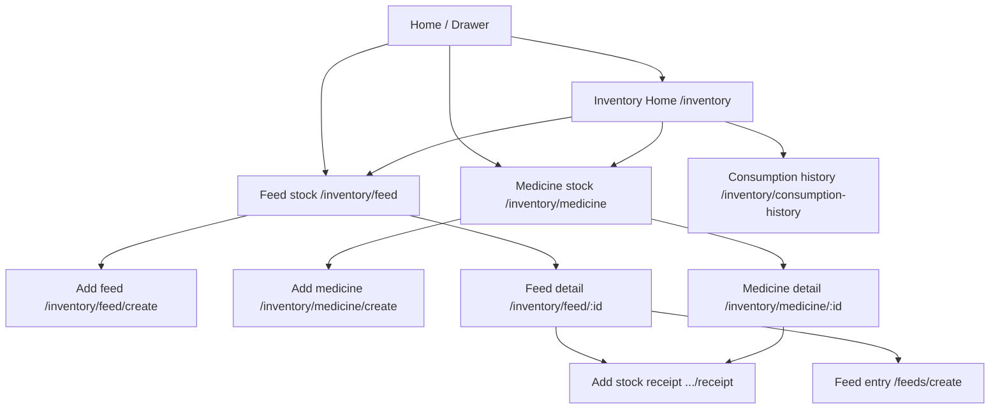

# Farm Inventory V1 — Flutter Integration Notes

**Date:** 2026-05-24  
**App:** `pranidoctor_user`

---

## Overview

New feature module: `lib/features/inventory/` wired to backend `/api/mobile/inventory/*` (same paths as web proxy).

---

## Navigation map



### Drawer entry points

| Label | Route |
|-------|-------|
| Inventory | `AppRoutes.inventory` |
| Feed stock (farm section) | `AppRoutes.inventoryFeed` |
| Medicine stock (farm section) | `AppRoutes.inventoryMedicine` |
| Feed entry (unchanged) | `AppRoutes.feeds` — daily log |

---

## API usage (no duplicate clients)

| Action | Repository method | HTTP |
|--------|-----------------|------|
| Dashboard summary | `getSummary(farmRef)` | `GET /inventory?farmRef=` |
| Feed list | `listFeed(farmRef)` | `GET /inventory/feed` |
| Medicine list | `listMedicine(farmRef)` | `GET /inventory/medicine` |
| Create / receipt | `addStock(InventoryAddInput)` | `POST /inventory/add` |
| Consume | `consumeStock(InventoryConsumeInput)` | `POST /inventory/consume` |
| Feed log + deduct | `FeedRepository.createRecord` | `POST /feeds` with `inventoryItemId`, `deductStock` |

---

## Offline cache keys

Added to `LocalCacheContract`:

- `inventory_summary:{farmRef}`
- `inventory_feed_list:{farmRef}`
- `inventory_medicine_list:{farmRef}`

Outbox kinds:

- `inventory_add` → `POST /inventory/add`
- `inventory_consume` → `POST /inventory/consume`

**Policy:** Catalog create can queue offline; stock **deduct** on feed/treatment requires online.

---

## Automation

### Feeding → feed stock

1. User enables **Deduct from my feed stock** on `FeedEntryFormPage`.
2. Selects catalog item from `inventoryFeedListProvider`.
3. `FeedInput` sends `inventoryItemId` + `deductStock: true`.
4. Backend reduces stock in same request as feed log.
5. `InventoryNavigation.afterStockChange` refreshes lists.

Deep link: `/feeds/create?inventoryItemId={id}&deductStock=1` from feed detail.

### Treatment → medicine stock

1. Optional switch **Update medicine stock** on `TreatmentFormPage` (create only).
2. After successful `createRecord`, `syncMedicineStockFromTreatment` matches `MedicineItem.name` to catalog `displayName` (case-insensitive).
3. Calls `consumeStock` with `sourceType: FARM_TREATMENT`, `sourceId: treatmentId`.
4. Quantity: `durationDays` if set, else `1`.

**Note:** Medicine screens do not create treatments — only the existing treatment form triggers stock.

---

## UI components reused

| Pattern from | Used in |
|--------------|---------|
| `FeedFeedback` | `InventoryFeedback` |
| `FeedRepository` cache-first | `InventoryRepository` |
| `FinanceDashboardPage` cards | `InventoryDashboardCards` |
| `FeedEntryCard` style | `InventoryItemCard` |
| Riverpod family + farmRef | All inventory providers |

---

## Days remaining (feed)

Client estimate in `inventory_days_remaining.dart`:

- Uses last 14 days of `feedListProvider` records for same `farmRef` + `feedType`.
- `days ≈ quantityAvailable / avgDailyConsumption`.
- Shows helper text when insufficient feeding history.

---

## Screenshots (manual QA)

Capture on device/emulator after seeding inventory:

1. **Inventory home** — dashboard cards + Feed/Medicine sections  
2. **Feed stock list** — quantity chips + low stock banner  
3. **Feed detail** — days remaining + Log feeding CTA  
4. **Medicine list** — disclaimer, no prescription UI  
5. **Feed form** — deduct toggle + catalog dropdown  
6. **Treatment form** — update medicine stock switch  

Save under `docs/plans/farm_inventory/screenshots/` (not committed unless team adds assets).

---

## Files added

```
lib/features/inventory/
  data/
    inventory_api_paths.dart
    inventory_dto.dart
    inventory_repository.dart
    inventory_repository_contract.dart
  presentation/
    inventory_home_page.dart
    inventory_feed_list_page.dart
    inventory_medicine_list_page.dart
    inventory_feed_create_page.dart
    inventory_medicine_create_page.dart
    inventory_feed_detail_page.dart  (+ InventoryMedicineDetailPage)
    inventory_stock_receipt_page.dart
    inventory_consumption_history_page.dart
    inventory_providers.dart
    inventory_navigation.dart
    inventory_medicine_sync.dart
    utils/inventory_days_remaining.dart
    widgets/
```

## Files modified

- `lib/routing/app_routes.dart`, `app_router.dart`
- `lib/features/home/presentation/widgets/drawer_menu.dart`
- `lib/core/offline/local_cache_contract.dart`
- `lib/features/offline/data/outbox_item.dart`, `sync_coordinator.dart`, `sync_invalidation.dart`
- `lib/features/feed/data/feed_dto.dart`, `presentation/feed_entry_form_page.dart`

---

## Known limitations (V1)

- No dedicated movement history API in UI (consumption history uses feed logs).
- Medicine consume on treatment uses name matching only.
- Reserve/release reserve UI not exposed (API supports via `add` operation).
- `intl` package used on consumption history — already in project via other features.
