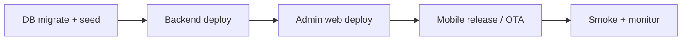

# Phase 4 — Production Deployment Checklist

**Plan:** `PHASE_4_FINAL_STABILIZATION_AND_QA_V1`  
**Date:** 2026-05-29  
**Target:** Staged production rollout (BD livestock/feed ecosystem)

---

## Pre-deploy (all environments)

### Database
- [ ] Run pending Prisma migrations on production DB (backup first):
  - `20260524120000_farm_inventory_v1`
  - `20260524180000_feed_catalog_master_v1`
  - Livestock / Phase 4 feed models (batch migrations through Phase 4)
- [ ] Execute seed: `feed_catalog.seed.ts` + Phase 4 feed items if empty
- [ ] Verify `FeedItem` row count ≥ expected BD master set
- [ ] Confirm `Setting` key for recommendation rules exists or will be created on first admin save

### Backend (`pranidoctor-backend`)
- [ ] Deploy build with Phase 4 modules + legacy mobile routes registered
- [ ] Smoke: `GET /api/mobile/feed-catalog?limit=5` (auth)
- [ ] Smoke: `GET /api/mobile/livestock` (auth + farmRef)
- [ ] Smoke: `GET /api/mobile/livestock/:id/weight` (auth)
- [ ] Smoke: `GET /api/mobile/feed-recommendations/daily?livestockId=` (auth)
- [ ] Smoke: admin `GET /api/admin/feed-ecosystem/inventory?lowStockOnly=true`
- [ ] Set env: database URL, JWT secrets, CORS for mobile + admin origins
- [ ] Enable structured logging; redact health/disease fields in recommendation debug logs

### Admin web (`pranidoctor-web`)
- [ ] Deploy with `BACKEND_URL` / proxy config for `proxyRouteToBackend`
- [ ] Verify nav: **Feed Ecosystem** sections load (analytics, inventory, recommendations, items)
- [ ] Admin login + save recommendation rules → confirm cache invalidation (rules version bump in response)
- [ ] Responsive check: inventory list + rules editor on 375px width

### Mobile (`pranidoctor_user`)
- [ ] Build release APK/IPA with Phase 4 routes enabled
- [ ] Verify `activeFarmRefProvider` resolves after farm selection
- [ ] Test offline queue drain for livestock create + phase4 purchase
- [ ] Confirm BN strings for analytics no-farm + recommendation intelligence
- [ ] Point app to production API base URL

---

## Deploy sequence (recommended)

1. **Database** — migrations off-peak; keep rollback SQL snapshot  
2. **Backend** — blue/green or rolling; health check `/health`  
3. **Admin** — after backend healthy  
4. **Mobile** — phased rollout (internal → beta → production)  
5. **Monitor** — 24h elevated logging on recommendation + inventory errors  

---

## Post-deploy smoke tests

| # | Test | Expected |
|---|------|----------|
| 1 | Create livestock (online) | 201, appears in list |
| 2 | Create livestock (offline → online) | Outbox drains; appears in list |
| 3 | Phase 4 feed purchase | Inventory quantity increases |
| 4 | Phase 4 consumption | Quantity decreases; optional finance link |
| 5 | Daily recommendation | Items + intelligence scores |
| 6 | Accept recommendation | Log persisted |
| 7 | Analytics dashboard | Metrics load with farm selected |
| 8 | Admin low-stock filter | Pagination totals stable |
| 9 | Record weight POST | `weightKg` + `lastWeightAt` updated |

---

## Rollback plan

| Layer | Rollback |
|-------|----------|
| Mobile | Previous store build; API backward compatible |
| Admin | Previous Vercel/hosting deployment |
| Backend | Previous container revision; **do not** rollback DB if migrations added columns in use |
| DB | Restore snapshot only if migration failed mid-flight; forward-fix preferred |

---

## Monitoring & alerts

- [ ] Error rate on `/api/mobile/feed-recommendations/*` < 1%  
- [ ] Inventory `INSUFFICIENT_STOCK` rate baseline documented  
- [ ] p95 latency `/api/mobile/livestock` < 500ms  
- [ ] Admin inventory list p95 < 2s  
- [ ] Offline outbox dead-letter count (attemptCount ≥ 5) alerted  

---

## Sign-off

| Role | Name | Date | OK |
|------|------|------|-----|
| Backend | | | |
| Mobile | | | |
| Admin / Web | | | |
| QA | | | |
| Product | | | |
