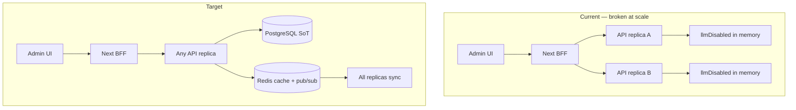
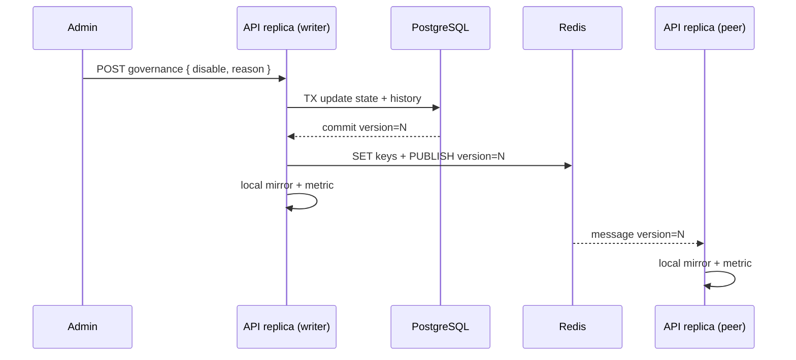

# AI Kill Switch — Persistence & Multi-Server Design Plan

**Document type:** Production architecture & rollout plan (documentation only)  
**Date:** 2026-05-30  
**Status:** Implemented (v1.0 — 2026-05-30)  
**Related:** [ai-usage-monitoring-plan.md](./ai-usage-monitoring-plan.md), [AI_MONITORING_VERIFICATION_REPORT.md](./AI_MONITORING_VERIFICATION_REPORT.md), `pranidoctor-backend/docs/production/monitoring/health-check-plan.md`, `pranidoctor-backend/docs/production/monitoring/alerting-plan.md`

**Principle:** The LLM kill switch is a **global safety control**. It must be **durable**, **consistent across API replicas**, and **auditable**. When engaged, all LLM providers are bypassed and `RulesBasedProvider` serves responses only.

---

## 1. Executive summary

Today the kill switch is an **in-process boolean** on a process-wide singleton (`AiOrchestratorService`). It is toggled from Admin (`POST /api/admin/ai-ops/governance`) or an internal Express route (`POST …/kill-switch`), updates a **process-local** Prometheus gauge (`ai_llm_disabled`), and is **lost on restart**, **not shared across servers**, and **not audited**.

This plan defines a production-grade design: **PostgreSQL as source of truth**, **Redis as runtime cache and propagation bus**, **startup hydration**, **fail-safe fallbacks**, Admin visibility, audit trail, and safe rollout/rollback — without changing runtime code in this document.

---

## 2. Architecture analysis (current state)

### 2.1 AI enable/disable logic today

| Layer | Location | Behavior |
|-------|----------|----------|
| Orchestrator | `pranidoctor-backend/src/modules/ai/orchestrator/ai-orchestrator.service.ts` | `private llmDisabled = false`; `disableLlm()` / `enableLlm()` set flag + `setAiLlmDisabledMetric()` |
| Provider chain | `resolveChain()` | If `llmDisabled`, returns `[RulesBasedProvider]` only; else ordered OpenAI → Anthropic → rules |
| Singleton | `getAiOrchestratorService()` | One instance per Node process |
| Health | `src/api/health/ai-health.service.ts` | Reads `orchestrator.isLlmDisabled()` → `degraded` + message |
| Metrics | `src/modules/ai/usage/ai-usage.metrics.ts` | Module-level `llmDisabled` gauge (not cluster-wide) |

**Consumers of orchestrator:** `AiAssistantService`, veterinary core paths, symptom checker, farm briefing/query — any path calling `getAiOrchestratorService().complete()` or `completeWithPromptKey()`.

**Not governed by kill switch:** Pure rules engines (e.g. some symptom flows), legacy AI technician marketplace routes, non-LLM session tables.

### 2.2 Admin entry points

| Route | Auth | Effect scope |
|-------|------|--------------|
| `POST /api/admin/ai-ops/governance` | Legacy Next route → `requireAdminApiActor`; roles `ADMIN` \| `SUPER_ADMIN` | Mutates **only the backend instance** that handled the request |
| `POST /api/admin/ai-ops/kill-switch` (Express module) | `x-internal-admin-token` = `INTERNAL_ADMIN_AI_OPS_TOKEN` | Same — per instance; disabled when token unset |

BFF: `pranidoctor-web/src/app/api/admin/ai-ops/governance/route.ts` proxies to backend.

**UI:** `AiGovernancePanel.tsx` — toggle via governance POST; **GET loads escalations only** (does not hydrate `llmDisabled` from server — UI defaults to `false` until first toggle).

### 2.3 Feature flags (related, separate)

| Mechanism | Storage | Scope | AI kill switch? |
|-----------|---------|-------|-----------------|
| Env `FEATURE_*` in `.env.example` (web) | Deploy-time env | Product areas | No — not wired to orchestrator |
| `Setting` rows e.g. `mobile.feature.flags` | PostgreSQL `Setting` | Mobile app UX | No |
| `mobile.app.config` feature toggles | `Setting` | Mobile | No |
| Feed recommendation rules | `Setting` + 60s in-process cache | Feed engine | Pattern precedent only |

There is **no** global `ai.llm.enabled` row today.

### 2.4 Redis usage patterns (reusable primitives)

| Use | Implementation | Prefix / key style |
|-----|----------------|----------------------|
| General cache | `createCacheService()` → `{redis.prefix}cache:{key}` | JSON `setex`, fail-open on error |
| Rate limits | `checkRateLimit()` → sorted sets | `{prefix}{keyPrefix}{key}` |
| Security audit | `createAuditLog()` | `{prefix}audit:log:{id}`, indexes by date/actor/action |
| Client | `createRedisClient()`, `getRedis()`, `prefixKey()` | `REDIS_PREFIX` from config |
| Production | `REDIS_ENABLED=true` required; startup fails if Redis down in prod | `server.ts` |

**Not used today:** Redis Pub/Sub, distributed locks for config, or kill-switch keys.

**Infra note:** `docker-compose.yml` Redis uses AOF + `allkeys-lru` (256MB) — hot keys can be evicted under memory pressure; kill-switch keys must be **small, high-priority**, and optionally **non-expiring** or protected from LRU via dedicated Redis DB / key naming policy.

### 2.5 Admin settings architecture

| Pattern | Example | Relevance |
|---------|---------|-----------|
| `Setting` key-value JSON | `platform.commission`, `mobile.feature.flags`, feed rules | **Recommended** store for authoritative `llmDisabled` + metadata version |
| Per-tenant settings | `MobileUserSettings`, enterprise tables | Kill switch is **global** today; tenant-scoped kill switch is out of scope v1 |
| Admin billing settings service | `upsert` + read via Prisma | Transactional update precedent |

### 2.6 Audit log architecture

| System | Store | Retention | Kill switch today |
|--------|-------|-----------|-------------------|
| `AiSafetyAuditLog` | PostgreSQL | Long-term (DB) | Safety refusals / triage — **no** toggle events |
| Foundation `createAuditLog` | Redis (+ optional queue job) | 90 days TTL | Has `SYSTEM_CONFIG_CHANGE` action — **not called** on toggle |
| `AuthAuditEvent` | PostgreSQL | Identity events | N/A |

**Gap:** Toggle has **no** actor, reason, previous/new value, or rollback linkage.

### 2.7 Cache invalidation mechanisms

| Pattern | Where | Lesson for kill switch |
|---------|-------|------------------------|
| In-process TTL | `rules-loader.ts` (`invalidateRulesCache()`) | Insufficient alone for multi-server |
| Redis `del` / `delPattern` | `cache.service.ts` | Use for local cache bust after write |
| Event bus | `event-bus.ts` | **In-process only** — does not cross hosts |
| Prisma read-through | Prompts, settings | Source of truth on miss |

**Required for kill switch:** cross-host **Redis Pub/Sub** (or polling with version key) plus **local in-memory mirror** for hot path (avoid Redis round-trip per `complete()`).

### 2.8 Multi-tenant context

- `AiUsageRecord.customerId` attributes **usage**, not governance.
- Kill switch v1 remains **platform-global** (all tenants/customers).
- Future: per-tenant kill switch would need composite keys `(tenantId, scope)` — not in v1.

### 2.9 Deployment topology

- **API:** Horizontally scaled Node/Express replicas behind load balancer.
- **Worker:** Separate `worker.ts` process (queues) — typically **does not** serve AI HTTP; no orchestrator hydration required unless workers call LLM later.
- **Admin:** Next.js BFF → single backend origin per toggle (sticky sessions **do not** fix multi-replica inconsistency).



---

## 3. Risk assessment

| Risk | Likelihood | Impact | Current mitigation | Residual after design |
|------|------------|--------|--------------------|------------------------|
| Restart re-enables LLM during incident | High | Critical | None | Eliminated by PG + startup hydrate |
| Replica A disabled, B still calling OpenAI | High | Critical | None | Eliminated by Redis + pub/sub |
| Admin thinks switch is on; UI shows off | Medium | High | UI does not load state on GET | Fix GET contract + persist |
| Redis down; split brain | Medium | High | N/A | Fail-safe policy (§5.2) |
| PG down; cannot record toggle | Low | High | N/A | Reject toggle or emergency env override |
| Stale cache serves wrong state | Medium | Medium | N/A | Versioned keys + pub/sub |
| Partial deploy (old code / new schema) | Medium | Medium | N/A | Feature flag + backward-compatible read |
| Audit gap for compliance | High | Medium | None | Append-only audit table |
| LRU evicts kill-switch key | Low | High | N/A | No TTL + monitor key existence |
| Malicious admin toggles without trace | Low | Critical | Role gate only | Audit + optional SUPER_ADMIN for enable |
| Metric `ai_llm_disabled` per-pod drift | High | Medium | Alerts may lie | Export from shared state or aggregate in Prometheus |

---

## 4. Target design

### A. Data architecture

#### A.1 Persistent storage (PostgreSQL — source of truth)

**Option A (recommended):** Dedicated table for governance state and history.

```text
AiGovernanceState (singleton row id = 'global')
  llmDisabled      Boolean   @default(false)
  version          BigInt    // monotonic, increment on every change
  updatedAt        DateTime
  updatedByUserId  String?
  updatedByRole    String?
  reason           String?   // required on disable in production
  source           String    // admin_ui | api | env_override | startup_sync | rollback_job

AiGovernanceStateHistory (append-only)
  id, stateId, llmDisabled, previousLlmDisabled, version, actorId, actorRole,
  reason, source, requestId, correlationId, createdAt
```

**Option B (minimal migration):** `Setting` key `ai.governance.llm_kill_switch`:

```json
{
  "llmDisabled": true,
  "version": 42,
  "updatedAt": "2026-05-30T12:00:00.000Z",
  "updatedBy": { "userId": "...", "role": "ADMIN" },
  "reason": "Provider outage",
  "source": "admin_ui"
}
```

Plus `AiGovernanceStateHistory` or foundation audit entries for each change.

**Recommendation:** Option A for strict querying and FK integrity; Option B for fastest ship if migration freeze prefers additive `Setting` only.

#### A.2 Redis cache strategy

| Key | Type | Value | TTL |
|-----|------|-------|-----|
| `{prefix}ai:governance:llm_disabled` | STRING | `0` \| `1` | **None** (or very long); document as protected |
| `{prefix}ai:governance:version` | STRING | monotonic integer | None |
| `{prefix}ai:governance:meta` | HASH | `updatedAt`, `updatedBy`, `reason` (optional) | None |

**Write path (toggle):**

1. Begin DB transaction: update `AiGovernanceState`, insert history row.
2. On commit: `SET` Redis keys + `PUBLISH {prefix}ai:governance:channel` payload `{ version, llmDisabled, at }`.
3. Update local in-memory mirror + `setAiLlmDisabledMetric()`.

**Read path (hot — per `complete()`):**

1. Read **local mirror** (atomic boolean + version).
2. If mirror age &gt; N seconds (e.g. 30s) or miss: `MGET` Redis disabled + version; update mirror.
3. Do **not** query PostgreSQL on every request.

#### A.3 Fallback strategy

| Condition | Read behavior | Write behavior |
|-----------|---------------|----------------|
| Redis hit | Use cached value | Normal |
| Redis miss | Load from PostgreSQL, repopulate Redis | Normal |
| Redis unavailable | Load from PostgreSQL on interval; local mirror | **Allow toggle only if PG OK**; skip Redis publish; replicas diverge until Redis returns — **alert P1** |
| PostgreSQL unavailable | Use Redis if present; else **last local mirror**; else env `AI_LLM_DISABLED` | **Reject** toggle with 503 |
| Both unavailable | Env `AI_LLM_DISABLED` (default `false` for backward compat) + **alert P0** | Reject |

**Fail-safe policy (recommended):**

- **Disable LLM:** Always honored when successfully persisted anywhere (PG &gt; Redis &gt; env emergency).
- **Enable LLM:** Require PostgreSQL commit success; require `SUPER_ADMIN` in production (configurable).
- **Ambiguous read (split brain):** Prefer **`llmDisabled = true`** (fail closed for LLM spend/safety) if any source says disabled; log `KILL_SWITCH_AMBIGUITY`.

#### A.4 Startup recovery strategy

On each API process `bootstrap()` **after** Redis + Prisma ready:

1. `SELECT` singleton from `AiGovernanceState` (or `Setting`).
2. If row exists: set local mirror + Redis `SET` (repair cache).
3. If row missing: insert default `llmDisabled=false`, `version=1`.
4. `SUBSCRIBE` Redis channel; on message, if `version` &gt; local version, update mirror + metric.
5. Subscribe handler must be **idempotent** and **single-threaded** per process.

**Rolling deploy:** New pods hydrate from PG — **correct state without admin re-toggle**.

---

### B. Multi-server strategy

#### B.1 Cache synchronization

- **Primary:** Redis Pub/Sub (`ai:governance:channel`) — sub-millisecond fan-out.
- **Secondary:** Version key — replicas ignore stale messages (`version` monotonic).
- **Tertiary:** Background poll every 30–60s `MGET` version + disabled (heals missed pub/sub).

#### B.2 Propagation model



#### B.3 Stale cache prevention

- Every change increments `version`; consumers only apply `incoming.version &gt; local.version`.
- Admin GET returns `{ llmDisabled, version, updatedAt, updatedBy, reason }` from **PostgreSQL** (not memory).
- Optional `ETag: W/"ai-gov-{version}"` on governance GET for BFF caching.

#### B.4 Eventual consistency handling

| Window | Behavior |
|--------|----------|
| &lt; 100ms after toggle | Some replicas may still call LLM | Acceptable for kill switch; minimize with pub/sub |
| Redis pub/sub lag | Poll loop repairs within 60s | Monitor `ai_kill_switch_sync_lag_seconds` |
| Split brain (Redis vs PG) | PG wins on admin read; **fail closed** on serve path | Run reconciliation job |

---

### C. Admin UI design

#### C.1 Global AI enable/disable

- Single platform control: **Disable LLM** / **Enable LLM** (rules-only vs full chain).
- **Require reason** (min 10 chars) when disabling in production.
- Show: current state, `version`, last changed by, timestamp, last reason.
- **Confirm modal** for both directions; extra confirmation for **Enable** in prod.

#### C.2 Visibility requirements

| Element | Source |
|---------|--------|
| Status badge | `llmDisabled` |
| Last actor | `updatedByUserId` / display name |
| Last change time | `updatedAt` |
| Active version | `version` |
| Provider health | Existing `/health/ai` (degraded when disabled) |
| Rules-only traffic % | Prometheus `ai_requests_total{provider="rules-based"}` |

Extend **GET** `/api/admin/ai-ops/governance` to return `{ escalations, governance: { llmDisabled, version, ... } }` (backward compatible additive field).

#### C.3 Permission requirements

| Action | Role (v1) | v2 hardening |
|--------|-----------|--------------|
| View governance | `ADMIN`, `SUPER_ADMIN` | + audit read permission |
| Disable LLM | `ADMIN`, `SUPER_ADMIN` | Any authenticated admin on-call |
| Enable LLM | `ADMIN`, `SUPER_ADMIN` | **`SUPER_ADMIN` only** in production |
| View audit history | `ADMIN`, `SUPER_ADMIN` | Compliance role |

Align with `admin-nav.tsx` ai-ops roles and `requireAdminApiActor`.

#### C.4 Audit visibility

- New panel section: **Kill switch history** (last 50 events) from `AiGovernanceStateHistory` or filtered `SYSTEM_CONFIG_CHANGE` audit.
- Link to Prometheus graph `ai_llm_disabled` and alert ALT-AI-06.

---

### D. Audit logging

Each toggle writes **one immutable history row** (and optional foundation audit):

| Field | Required | Notes |
|-------|----------|-------|
| `actorId` | Yes | Admin user id from session |
| `actorRole` | Yes | `ADMIN` / `SUPER_ADMIN` |
| `timestamp` | Yes | Server UTC |
| `previousValue` | Yes | `llmDisabled` boolean |
| `newValue` | Yes | `llmDisabled` boolean |
| `version` | Yes | After increment |
| `source` | Yes | `admin_ui`, `internal_api`, `rollback_job`, `env_bootstrap` |
| `reason` | On disable (prod) | Free text |
| `requestId` / `correlationId` | Yes | From request context |
| `rollbackOf` | Optional | History row id if this change reverts a prior change |
| `ip` / `userAgent` | Recommended | From request context |

**Foundation audit:** `createAuditLog({ action: 'SYSTEM_CONFIG_CHANGE', severity: 'CRITICAL', changes: { field: 'ai.llmDisabled', from, to }, ... })` for SIEM integration.

**Do not** store full prompts or PII in kill-switch audit rows.

---

### E. Failure scenarios

| Scenario | Expected behavior |
|----------|-------------------|
| **Redis unavailable** | Serve from PG-hydrated local mirror; poll PG every 30s; **reject new toggles** if cannot publish sync (or allow PG-only with alert); metric still updated locally |
| **PostgreSQL unavailable** | Read Redis; if Redis empty, use env `AI_LLM_DISABLED`; **reject toggles**; `/health/ai` reports degraded config store |
| **Partial deployment** | Old code ignores new fields but reads `llmDisabled` boolean; new code writes version; deploy **backend before** admin UI |
| **Stale cache** | Version gate + periodic poll; reconciliation compares PG vs Redis |
| **Server restart** | Hydrate from PG → Redis repair → subscribe |
| **Cluster restart** | PG retains state; all pods hydrate correctly |
| **Redis flush / LRU eviction** | PG repopulates on next hydrate; alert on missing key |
| **Admin double-submit** | Idempotent: same `version` if If-Match / `expectedVersion` matches |
| **BFF hits different replicas** | GET from PG (consistent); POST always writes PG first |

---

### F. Security review

#### F.1 RBAC

- Enforce server-side on **both** legacy governance route and Express kill-switch route.
- Map to capability `ai.governance.kill_switch` in `permissions-core.ts` (future).
- Log all denied attempts via `trackAdminAuthDenied`.

#### F.2 Permission boundaries

- Mobile/customer tokens **cannot** toggle.
- `INTERNAL_ADMIN_AI_OPS_TOKEN` route: rotate token; restrict to BFF egress only.
- Separate **read** (GET governance) from **write** (POST).

#### F.3 Abuse prevention

- Rate limit: max 10 toggles / hour / actor (Redis).
- Require `reason` on disable; optional ticket id `incidentId`.
- **Two-person rule** (optional): enable requires second `SUPER_ADMIN` approval queue — phase 2.
- Alert on rapid flip-flop (&gt; 3 changes in 15 min).

---

### G. Rollback plan

#### G.1 Deployment rollback

1. Revert application image to previous release.
2. **Database:** History table is append-only — do not delete rows. State row remains at last version (correct).
3. If revert includes **buggy writer**, set `AI_LLM_DISABLED=true` via env until fix deployed.
4. Verify `ai_llm_disabled` gauge and `/health/ai` on all pods.

#### G.2 Configuration rollback

1. Admin UI: **Enable LLM** with reason referencing history id, OR
2. Runbook SQL: `UPDATE AiGovernanceState SET llmDisabled = false, version = version + 1 WHERE ...` + manual Redis `SET` + publish (ops only).
3. Prefer **forward rollback** via admin API over raw SQL.

#### G.3 Operational rollback (incident)

1. Disable LLM via admin (persists).
2. If admin broken: `kubectl set env AI_LLM_DISABLED=true` (emergency override — document in runbook).
3. After incident: re-enable via admin with `SUPER_ADMIN` + linked postmortem id.

---

### H. Verification plan

#### H.1 Pre-production

- [ ] Migration applies cleanly; singleton seed `llmDisabled=false`.
- [ ] Unit: version monotonicity, idempotent subscribe handler.
- [ ] Integration: toggle on replica A → replica B sees disabled within 1s (pub/sub).
- [ ] Restart test: disable → restart all pods → still disabled.
- [ ] Redis down test: documented fail-safe behavior matches §A.3.
- [ ] PG down test: toggles rejected; reads per policy.

#### H.2 Production smoke (staging)

- [ ] GET governance returns correct `llmDisabled`.
- [ ] Disable → mobile chat returns rules-based; `ai_llm_disabled=1`.
- [ ] Enable → LLM chain resumes (if keys present).
- [ ] History row + foundation audit present.
- [ ] Alert ALT-AI-06 / AI-002 fire and clear appropriately.

#### H.3 Ongoing

- [ ] Quarterly kill-switch drill (documented in ai-usage-monitoring-plan §7.4).
- [ ] Reconciliation job: PG `version` == Redis `version` (daily).
- [ ] Dashboard panel: governance state + 24h toggle count.

---

## 5. Backward compatibility & rollout

| Phase | Change | Risk |
|-------|--------|------|
| **0** | Document + drills with current in-memory switch | None |
| **1** | Add PG table + read on startup; **still accept in-memory toggle** writing through to PG | Low |
| **2** | Toggle writes PG + Redis; pub/sub sync; deprecate memory-only | Medium |
| **3** | Admin GET + UI hydration; audit history | Low |
| **4** | Enforce `SUPER_ADMIN` for enable in prod; alerts | Low |

**Zero-downtime:** Additive schema + hydrate on boot; no breaking API shape (`llmDisabled` field unchanged).

**Feature flag:** `AI_KILL_SWITCH_PERSISTENCE_ENABLED=true` gates new code path; default off until phase 2 verified in staging.

---

## 6. Implementation checklist

### 6.1 Data layer

- [ ] Add `AiGovernanceState` + `AiGovernanceStateHistory` (or `Setting` + history).
- [ ] Seed singleton default `llmDisabled=false`, `version=1`.
- [ ] Migration additive only; no changes to frozen modules outside `modules/ai`.

### 6.2 Backend service

- [ ] `AiGovernanceService` — `getState()`, `setLlmDisabled({ disable, reason, actor, source, expectedVersion? })`.
- [ ] Integrate orchestrator: read from local mirror; subscribe + poll.
- [ ] Wire `killSwitch` controller + legacy governance route to service.
- [ ] Startup hydration in `server.ts` bootstrap (after Redis + Prisma).
- [ ] Redis pub/sub subscriber lifecycle (graceful shutdown).

### 6.3 Observability

- [ ] Metric: `ai_kill_switch_version` gauge (optional).
- [ ] Log structured `ai_governance_change` events.
- [ ] Alert: PG/Redis version mismatch; flip-flop detection.

### 6.4 Admin (pranidoctor-web)

- [ ] Extend governance GET response; fix `AiGovernancePanel` initial state.
- [ ] Reason field + confirmation modals.
- [ ] History table component.

### 6.5 Docs & runbooks

- [ ] Update health-check-plan, alerting-plan ALT-AI-06, ai-usage-monitoring-plan §2.3.
- [ ] Ops runbook: emergency `AI_LLM_DISABLED` env override.

---

## 7. Rollback checklist

- [ ] Disable feature flag `AI_KILL_SWITCH_PERSISTENCE_ENABLED`.
- [ ] Confirm in-memory path still works on reverted binary (if pre-phase-2 revert).
- [ ] Set `AI_LLM_DISABLED=true` if unsafe to re-enable LLM during revert window.
- [ ] Verify Prometheus `ai_llm_disabled` matches intended state per pod.
- [ ] Post-incident: reconcile PG history with actual platform behavior.
- [ ] Do not drop history table on app rollback.

---

## 8. Verification checklist (sign-off)

| # | Check | Owner |
|---|-------|-------|
| V1 | Multi-replica sync within SLO (&lt; 2s p99) | Engineering |
| V2 | Survives full API rolling restart | Engineering |
| V3 | Survives Redis restart (AOF recovery) | Ops |
| V4 | Survives PostgreSQL failover (RTO within hydrate poll) | Ops |
| V5 | Audit row for every toggle | Security |
| V6 | ADMIN cannot enable in prod without policy | Security |
| V7 | `/health/ai` reflects persisted state | SRE |
| V8 | ALT-AI-06 / AI-002 validated in staging | SRE |
| V9 | Admin UI shows true state on page load | Product |
| V10 | Quarterly drill completed | AI ops |

---

## 9. Code reference map (current)

| Concern | Path |
|---------|------|
| Kill switch state | `pranidoctor-backend/src/modules/ai/orchestrator/ai-orchestrator.service.ts` |
| Admin toggle (Express) | `pranidoctor-backend/src/modules/ai/ai.controller.ts` (`killSwitch`) |
| Admin toggle (legacy) | `pranidoctor-backend/src/legacy/web/routes/admin/ai-ops/governance/route.ts` |
| Routes | `pranidoctor-backend/src/modules/ai/ai.routes.ts` |
| Metrics | `pranidoctor-backend/src/modules/ai/usage/ai-usage.metrics.ts` |
| Health | `pranidoctor-backend/src/api/health/ai-health.service.ts` |
| Redis client | `pranidoctor-backend/src/infra/redis/redis.client.ts` |
| Cache service | `pranidoctor-backend/src/infra/cache/cache.service.ts` |
| Foundation audit | `pranidoctor-backend/src/shared/security/audit/audit.service.ts` |
| AI safety audit (PG) | `pranidoctor-backend/src/modules/ai/audit/ai-audit.service.ts` |
| Settings model | `pranidoctor-backend/prisma/schema.prisma` (`Setting`) |
| Admin UI | `pranidoctor-web/src/components/admin/ai-ops/AiGovernancePanel.tsx` |
| BFF proxy | `pranidoctor-web/src/app/api/admin/ai-ops/governance/route.ts` |

---

## 10. Document control

| Version | Date | Author | Notes |
|---------|------|--------|-------|
| 1.0 | 2026-05-30 | AI platform | Initial design from codebase discovery |

**Implementation (v1.0):** See `pranidoctor-backend/docs/production/ai/ai-kill-switch-operations.md` for migration, env vars, and recovery runbooks.

| Component | Path |
|-----------|------|
| Service | `pranidoctor-backend/src/modules/ai/governance/ai-governance.service.ts` |
| Migration | `pranidoctor-backend/prisma/migrations/20260530160000_ai_governance_kill_switch/` |
| Admin UI | `pranidoctor-web/src/components/admin/ai-ops/AiGovernancePanel.tsx` |

---

*Architecture reference — implementation completed 2026-05-30.*
