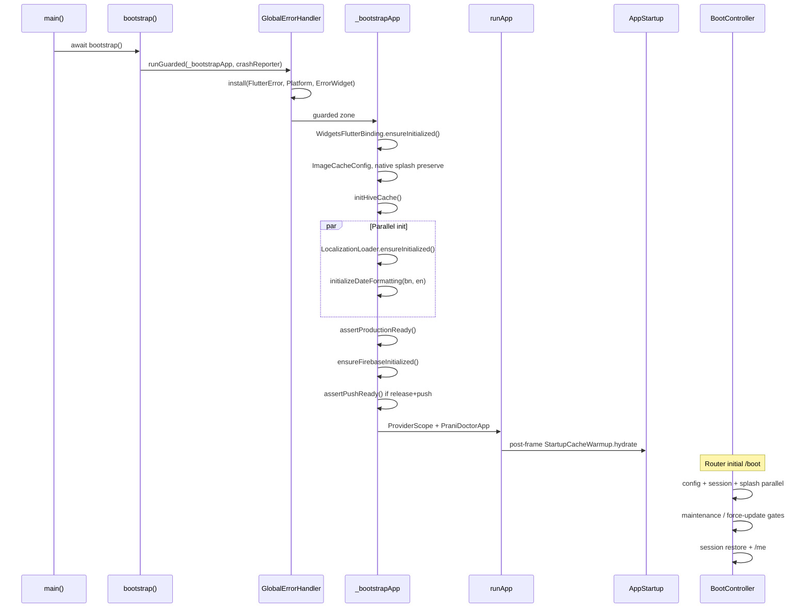
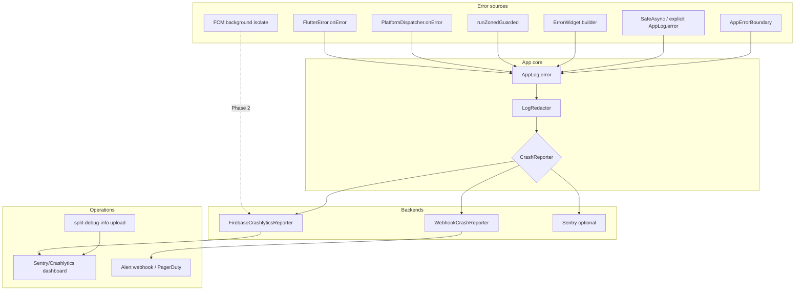

# Flutter Crash Reporting Plan — Prani Doctor User App

**Repo:** `pranidoctor_user`  
**Version:** 2.0  
**Date:** 2026-05-30  
**Status:** **Implemented** — composite webhook + Crashlytics, global handlers, network/boot/background coverage  
**Related:** [monitoring-guide.md](../../monitoring-guide.md) · [flutter_production_readiness_report.md](../../stabilization/flutter_production_readiness_report.md) · [PHASE_7_IMPLEMENTATION_REPORT.md](../../launch/PHASE_7_IMPLEMENTATION_REPORT.md)

---

## Executive summary

The user app ships **global crash reporting** via the existing `CrashReporter` funnel. [`CompositeCrashReporter`](../../../lib/core/logging/composite_crash_reporter.dart) sends to **Firebase Crashlytics** (when Firebase initializes) and/or **webhook** (`CRASH_REPORTING_WEBHOOK_URL`). Startup, async, UI, throttled network, boot, Riverpod, and FCM background failures are captured with environment and release metadata.

| Area | Current state | Notes |
|------|---------------|-------|
| Framework errors | `GlobalErrorHandler` + `AppGracefulErrorWidget` | Category `E01`–`E03` |
| Async / zone errors | `runZonedGuarded` + `PlatformDispatcher.onError` | Category `E02` |
| Isolate errors | FCM handler try/catch → Crashlytics | Category `E11` |
| Startup | Guarded bootstrap + `CrashReportingBootstrap` | Release + env keys set pre-`runApp` |
| Crash backend | Composite: Crashlytics + webhook | Debug collection off by default |
| User identity | `SessionController` → `setUserId` | Opaque backend user id only |
| Network failures | `CrashReportingNetworkInterceptor` | Throttled non-fatal `E07`; skips 401/404/422 |

## Implementation reference (v2.0)

| File | Role |
|------|------|
| [`crash_reporter_factory.dart`](../../../lib/core/logging/crash_reporter_factory.dart) | Builds `CompositeCrashReporter` from env + Firebase |
| [`crash_reporting_context.dart`](../../../lib/core/logging/crash_reporting_context.dart) | `APP_ENV`, release name, version, build |
| [`crash_reporting_bootstrap.dart`](../../../lib/core/logging/crash_reporting_bootstrap.dart) | Applies env/release keys after Firebase + `PackageInfo` |
| [`firebase_crashlytics_reporter.dart`](../../../lib/core/logging/firebase_crashlytics_reporter.dart) | Crashlytics adapter |
| [`composite_crash_reporter.dart`](../../../lib/core/logging/composite_crash_reporter.dart) | Fan-out to multiple backends (non-blocking) |
| [`crash_reporting_network_interceptor.dart`](../../../lib/core/network/interceptors/crash_reporting_network_interceptor.dart) | Throttled network non-fatals |
| [`crash_reporting_provider_observer.dart`](../../../lib/core/logging/crash_reporting_provider_observer.dart) | Riverpod `providerDidFail` |
| [`bootstrap.dart`](../../../lib/app/bootstrap.dart) | Installs reporter, rebinds after Firebase, `ProviderScope` observers |
| [`fcm_background.dart`](../../../lib/features/notifications/fcm_background.dart) | Background isolate Crashlytics |

### Dart-defines

| Define | Default | Purpose |
|--------|---------|---------|
| `CRASH_REPORTING_WEBHOOK_URL` | empty | HTTPS webhook ingest |
| `ENABLE_CRASH_REPORTING` | `false` (debug), active in release | Force collection in debug QA |
| `APP_ENV` | `dev` | `dev` / `staging` / `production` on every event |

### Performance safeguards

- `recordError` is **fire-and-forget** (`unawaited`) — never blocks UI or I/O hot paths.
- Network reports **throttled** (1 per method+path per minute).
- Crashlytics collection **disabled in debug** unless `ENABLE_CRASH_REPORTING=true`.
- Webhook uses 5s send/receive timeout; failures are swallowed.

---


## Current stability audit

### 1. Error handling

#### Global layer

Entry point: [`main.dart`](../../../lib/main.dart) → [`bootstrap()`](../../../lib/app/bootstrap.dart).

[`GlobalErrorHandler`](../../../lib/core/errors/global_error_handler.dart) installs four hooks before `runApp`:

| Hook | Handler | Fatal flag | User impact |
|------|---------|------------|-------------|
| `FlutterError.onError` | Framework/layout errors | `fatal: true` | Debug: red screen; Release: logged + reported |
| `PlatformDispatcher.instance.onError` | Uncaught async errors outside Flutter framework | `fatal: true` | Process may continue; error logged |
| `runZonedGuarded` zone callback | Errors in guarded zone (entire app lifecycle) | `fatal: true` | Same as platform |
| `ErrorWidget.builder` | Build failures in widget subtree | `fatal: false` | [`AppGracefulErrorWidget`](../../../lib/shared/widgets/app_graceful_error.dart) — friendly fallback |

All paths funnel through [`AppLog.error`](../../../lib/core/logging/app_logger.dart), which:

- Emits to `dart:developer` log (DevTools / adb logcat)
- Applies [`LogRedactor`](../../../lib/core/logging/log_redactor.dart) on messages
- Forwards to `CrashReporter.recordError` when `reportToCrashReporter: true`

#### Feature / UI layer

| Mechanism | Purpose | Coverage |
|-----------|---------|----------|
| [`AppException`](../../../lib/core/error/app_exception.dart) + [`ApiResult`](../../../lib/core/error/api_result.dart) | Typed API failures | Repositories — broad adoption |
| [`HttpErrorMapper`](../../../lib/core/error/http_error_mapper.dart) | Dio → user-safe messages | Network layer |
| [`UserErrorMapper`](../../../lib/core/errors/user_error_mapper.dart) | Localized error copy in widgets | Presentation |
| [`AppErrorBoundary`](../../../lib/shared/widgets/app_error_boundary.dart) | Sync build errors in wrapped subtrees | Opt-in; not global |
| [`SafeNavigation`](../../../lib/core/navigation/safe_navigation.dart) | Logs navigation failures | Router edge cases |
| [`GoRouter.errorBuilder`](../../../lib/routing/app_router.dart) | Invalid routes → `AppRouteErrorPage` | Navigation |

#### Parsing layer

[`SafeParse`](../../../lib/core/errors/safe_parse.dart) converts invalid JSON into typed `AppException` or skips bad list items. Adoption is **partial** — many DTOs still use unchecked `as` casts (~244 force-unwraps and cast risks documented in [flutter_production_readiness_report.md](../../stabilization/flutter_production_readiness_report.md)).

#### Gaps

- Riverpod `AsyncError` from providers that `throw` on cache miss is **not** centrally observed (no `ProviderObserver`).
- Expected API failures (`401`, offline) are intentionally **not** reported to crash backend — correct, but no separate “error rate” metric.
- `BootController` uses `debugPrint` only — boot pipeline failures are not structured logs or crash events.
- `WebhookCrashReporter.setUserId` / `setCustomKey` are no-ops — no release correlation.

---

### 2. Async exception handling

| Pattern | Location | Behavior |
|---------|----------|----------|
| `GlobalErrorHandler.runGuarded` | `bootstrap.dart` | Catches unhandled async in main zone |
| `PlatformDispatcher.onError` | `global_error_handler.dart` | Returns `true` — marks error handled |
| [`SafeAsync.run`](../../../lib/core/errors/safe_async.dart) | Warmups, fire-and-forget tasks | Catches, logs, returns fallback — **does not rethrow** |
| [`SafeAsync.fireAndForget`](../../../lib/core/errors/safe_async.dart) | `StartupCacheWarmup` | Same — failures never crash app |
| `unawaited(...)` | Boot sync, cache revalidate, ~56 call sites | Relies on inner try/catch or zone handler |
| Repository `try/on AppException` | Data layer | Returns `ApiResult.failure` — controlled |

**Strengths:** Startup warmups cannot take down first frame. Zone guard covers most `async`/`await` gaps in the main isolate.

**Risks:**

- `SafeAsync` swallows errors with `fatal: false` (default) — useful for stability but may **under-report** recurring warmup failures.
- Forms using `Future.microtask` without `mounted` checks remain in some screens (OTP fixed; others partial).
- `recordError` in `AppLog.error` is **fire-and-forget** (`Future` not awaited) — acceptable for crash reporters but webhook failures are silent in release.

---

### 3. Isolate handling

| Isolate | Entry | Error handling today |
|---------|-------|---------------------|
| **Main** | `main()` | Full `GlobalErrorHandler` stack |
| **FCM background** | [`firebaseMessagingBackgroundHandler`](../../../lib/features/notifications/fcm_background.dart) | `@pragma('vm:entry-point')`; **no try/catch, no CrashReporter** |
| **Worker (`compute`)** | — | **Not used** in codebase |

The FCM handler re-initializes Firebase and shows a local notification. Any exception (plugin init, JSON encode, show) will crash the background isolate silently from the app's perspective — **no report reaches webhook or Crashlytics**.

**Planned hardening (no code in this doc — integration task):**

1. Wrap handler body in try/catch → log via isolate-safe path (Crashlytics `recordError` works from background isolates once Firebase is initialized).
2. Avoid Dio/webhook from background isolate (network stack may be unavailable); prefer Crashlytics native channel.
3. If adding `compute()` for heavy parsing later, use top-level functions with explicit error returns, not thrown exceptions across isolate boundary.

---

### 4. Startup flow



| Stage | Failure mode | Crash reporting |
|-------|--------------|-----------------|
| Pre-`runApp` (`assertProductionReady`, Hive, locale) | `StateError` / uncaught → zone handler | Reported if webhook configured |
| Firebase init failure | Non-fatal in dev; **throws in release** if `ENABLE_PUSH=true` | Fatal before UI |
| Post-`runApp` warmup | `SafeAsync` — logged, non-fatal | Optional non-fatal events |
| Boot pipeline | UI error state + retry | **Not reported** today |

**Env gates ([`AppEnv`](../../../lib/app/app_env.dart)):**

- Release requires `API_BASE_URL`, HTTPS for staging/production API
- `CRASH_REPORTING_WEBHOOK_URL` optional — empty → `NoOpCrashReporter`
- `build_release.ps1` passes webhook + obfuscation flags

---

## Crash reporting architecture

### Design principles

1. **Single funnel:** All fatals flow `Error source → AppLog.error → CrashReporter`.
2. **Pluggable backend:** [`CrashReporter`](../../../lib/core/logging/crash_reporter.dart) interface; swap webhook / Crashlytics / Sentry without touching handlers.
3. **Privacy first:** [`LogRedactor`](../../../lib/core/logging/log_redactor.dart) before any outbound payload; never send tokens, OTP, or phone numbers in crash context.
4. **Deobfuscation required:** Release builds use `--obfuscate --split-debug-info=build/debug-info` — crash backend must receive symbol files per build.
5. **Separate concerns:** Crash reporting ≠ product analytics ([`AnalyticsReporter`](../../../lib/core/logging/analytics_reporter.dart) stub exists).

### Target architecture



### Component responsibilities

| Component | Role |
|-----------|------|
| `GlobalErrorHandler` | Install once; never duplicate handlers |
| `AppLog` | Structured log + optional crash report |
| `WebhookCrashReporter` | Phase 1 — HTTPS POST JSON to ops webhook |
| `FirebaseCrashlyticsReporter` | Phase 2 — native crashes, NDK, background isolate |
| `resolveCrashReporter()` | Select backend from compile-time env |
| `crashReporterProvider` | Riverpod access for feature-level non-fatals |
| `SessionController` (future) | Call `setUserId` on login/logout |
| CI / release script | Upload symbols; tag release version |

### Payload contract (webhook — current)

```json
{
  "service": "pranidoctor-user",
  "fatal": true,
  "reason": "Flutter framework error",
  "message": "Exception description",
  "stack": "StackTrace string",
  "context": { "tag": "optional" },
  "env": "release"
}
```

**Phase 2 additions:** `app_version`, `build_number`, `dart_define_app_env`, `device_model`, `os_version`, `locale`, hashed `user_id`.

### Environment variables

| Define / secret | Required | Purpose |
|-----------------|----------|---------|
| `CRASH_REPORTING_WEBHOOK_URL` | Optional (Phase 1) | Enables `WebhookCrashReporter` |
| `APP_ENV` | Yes (release) | `dev` / `staging` / `production` |
| Firebase / Sentry DSN | Phase 2 | Native SDK |
| CI secret: symbol upload token | Phase 2 | Deobfuscate stacks |

---

## Integration plan

### Phase 0 — Foundation (shipped)

- [x] `GlobalErrorHandler` with zone + framework + platform hooks
- [x] `AppLog` + `LogRedactor` + `CrashReporter` interface
- [x] `AppGracefulErrorWidget`, `AppErrorBoundary`, `SafeAsync`, `SafeParse`
- [x] Release guards in `AppEnv.assertProductionReady()`

### Phase 1 — Webhook + composite (shipped)

- [x] `WebhookCrashReporter` + `CRASH_REPORTING_WEBHOOK_URL` dart-define
- [x] `build_release.ps1` obfuscation + optional webhook
- [x] `CompositeCrashReporter` fan-out
- [x] `CrashReportingContext` — env + release metadata on every event
- [x] CI uploads `build/debug-info/` artifact

### Phase 2 — Firebase Crashlytics (shipped)

- [x] `firebase_crashlytics` dependency
- [x] `FirebaseCrashlyticsReporter` implementation
- [x] Rebind reporter after `ensureFirebaseInitialized()`
- [x] `SessionController` → `setUserId` on auth / clear on sign-out
- [x] FCM background handler try/catch + Crashlytics
- [x] Custom keys: `app_env`, `release`, `api_host`
- [ ] CI: automated symbol upload to Firebase (ops — manual artifact retained)

### Phase 3 — Sentry alternative (optional, not started)

| Step | Action |
|------|--------|
| 3.1 | Add `sentry_flutter`; init in `bootstrap` with DSN dart-define |
| 3.2 | Implement `SentryCrashReporter implements CrashReporter` |
| 3.3 | Upload debug symbols via `sentry-cli upload-dif` in CI |
| 3.4 | Align release naming with backend/web (`pranidoctor-user@1.2.3+45`) |

### Phase 4 — Observability maturity (partial)

- [x] Riverpod `CrashReportingProviderObserver` for provider failures
- [x] Boot pipeline non-fatal reporting via `AppLog`
- [ ] Product analytics (`FirebaseAnalyticsReporter`)
- [ ] Startup health probe to `/api/mobile/health`

---

## Error categories

Use these categories for dashboard filters, alert rules, and `reason` / custom keys.

| ID | Category | Source | Fatal | Report? | User experience | Example |
|----|----------|--------|-------|---------|-----------------|---------|
| **E01** | Framework fatal | `FlutterError.onError` | Yes | Yes | Red screen (debug) / possible white screen | Null check in build |
| **E02** | Uncaught async | Zone / `PlatformDispatcher` | Yes | Yes | Silent failure or broken feature | Missing await on thrown Future |
| **E03** | Widget build fallback | `ErrorWidget.builder` | No | Yes (non-fatal) | Inline error widget | Bad delegate in ListView |
| **E04** | Boundary caught | `AppErrorBoundary` | No | Yes | Localized fallback + retry | Chart render exception |
| **E05** | Navigation | `SafeNavigation` / route error | No | Warn log | Error page | Bad deep link |
| **E06** | API expected | `AppException` in repository | No | **No** | Snackbar / error view | 401, offline, validation |
| **E07** | API unexpected | Unhandled Dio / parse throw | Varies | Yes if uncaught | Crash or AsyncError | Schema change, cast fail |
| **E08** | Parse / DTO | `SafeParse` / unchecked cast | No–Yes | Yes if throws | Empty list or crash | `as String` on null |
| **E09** | Startup config | `assertProductionReady` | Yes | Yes | App won't start | Missing HTTPS API URL |
| **E10** | Boot recoverable | `BootController` error phase | No | **Should** (Phase 4) | Retry screen | Config fetch offline |
| **E11** | Background isolate | FCM handler | No* | **Phase 2** | Missing notification | Plugin init fail |
| **E12** | Warmup / cache | `SafeAsync` / Hive | No | Optional non-fatal | Stale cache | Corrupt Hive box |
| **E13** | Session / auth | Token refresh fail | No | No | Guest fallback | Expired refresh token |

\*Background isolate crash does not kill main app but loses notification delivery.

### Alert severity mapping

| Severity | Categories | Action |
|----------|------------|--------|
| **P0** | E01, E02, E09 — spike > 5/min or new in latest release | Page on-call; consider rollback |
| **P1** | E07, E08 — sustained > 1% sessions | Hotfix within 24h |
| **P2** | E03, E04, E11, E12 — elevated rate | Next sprint fix |
| **P3** | E05, E10 | Backlog |

### Privacy rules for context keys

**Allowed:** `app_version`, `build`, `locale`, `phase` (boot), `feature` (e.g. `fattening`), `error_code` (API code, not message), hashed user id.

**Never attach:** phone number, OTP, access/refresh tokens, request bodies, full API URLs with query tokens, farmer PII, animal identifiers in bulk.

---

## Rollback plan

### A. Disable crash reporting only (safest first step)

| Method | Effect |
|--------|--------|
| Rebuild with empty `CRASH_REPORTING_WEBHOOK_URL` | `NoOpCrashReporter` — zero outbound crash traffic |
| Remove webhook from CI secrets | Same for pipeline builds |
| Crashlytics: set `CRASHLYTICS_COLLECTION_ENABLED=false` in manifest (Phase 2) | Disables SDK collection without app redeploy logic change |

No user-facing behavior change except loss of telemetry.

### B. Roll back mobile release (crash spike in new version)

Follow [ROLLBACK_PLAN.md](../../launch/ROLLBACK_PLAN.md):

1. **Play Console:** Halt staged rollout → promote previous stable track.
2. **Force-update gate:** Set `MINIMUM_APP_VERSION` on backend app-config to last good version (blocks bad build only).
3. **Symbols:** Keep previous release's `split-debug-info` artifact — do not delete when rolling back.
4. **Communicate:** If E01/E02 spike correlates with single version, note in incident channel.

Database migrations are unaffected — mobile rollback is binary-only.

### C. Roll back Crashlytics / Sentry integration (Phase 2 failure)

If SDK causes startup regression (known risk: Firebase init order):

1. Revert to Phase 0/1 reporter selection (webhook-only composite).
2. Ship hotfix build with patch version bump.
3. Keep `GlobalErrorHandler` unchanged — handlers are independent of backend.

### D. Webhook storm / cost containment

If misconfigured client floods webhook:

1. Rate-limit at ingress (nginx / Sentry project quota).
2. Temporarily disable `CRASH_REPORTING_WEBHOOK_URL` in production defines.
3. Fix duplicate-report bug (e.g. ErrorWidget rebuild loop) before re-enabling.

---

## Verification plan

### Pre-launch checklist

| # | Test | Pass criteria |
|---|------|---------------|
| V1 | **Release build with webhook** | AAB built with `-CrashWebhookUrl https://...` |
| V2 | **Debug mode no webhook** | Empty URL → no HTTP POST on error |
| V3 | **Forced framework error** | Debug-only button throws in `build` → webhook receives E03/E01 |
| V4 | **Zone async error** | `Future.microtask(() => throw Exception('test'))` → E02 received |
| V5 | **Redaction** | Log line containing `Bearer xxx` → `[REDACTED]` in payload |
| V6 | **Obfuscation** | Release stack is obfuscated; symbol file exists at `build/debug-info/` |
| V7 | **Offline error** | Airplane mode API call → E06 shown to user; **no** crash report |
| V8 | **Boot retry** | Kill API at boot → error UI; retry succeeds — no crash |
| V9 | **Graceful widget** | Force `ErrorWidget` path → user sees friendly message, app survives |

### Phase 2 additional tests (Crashlytics)

| # | Test | Pass criteria |
|---|------|---------------|
| V10 | Native crash | Android fatal → Crashlytics dashboard within 15 min |
| V11 | Background isolate | Throw in FCM handler test → non-fatal event recorded |
| V12 | Symbol upload | Stack shows readable frames after upload |
| V13 | User attribution | Login → subsequent crash tagged with anonymized id |
| V14 | Sign-out clears id | Logout → `setUserId('')` verified in SDK |

### Manual symbolication (Phase 1 webhook)

When webhook returns obfuscated stacks:

```powershell
# From repo root, with Flutter SDK on PATH
flutter symbolize -i crash_stack.txt -d build/debug-info
```

Store `build/debug-info/` from the **exact** CI job that produced the Play Store version (match `version` + `build_number` from `pubspec.yaml`).

### CI verification (recommended additions)

| Job | Check |
|-----|-------|
| `release.yml` tag build | Upload `build/debug-info/` as artifact |
| Post-deploy | Smoke: trigger test non-fatal via internal QA menu (future) |
| Weekly | Confirm webhook/Crashlytics receiving heartbeat or zero-event health |

### Success metrics (30 days post-launch)

| Metric | Target |
|--------|--------|
| Crash-free sessions | ≥ 99.0% (Crashlytics) |
| Unsymbolicated stacks | < 10% of events |
| E01/E02 new issues triaged | Within 48h |
| P0 crash rollback events | 0 |

---

## Open risks (from stability audit)

| Risk | Mitigation in this plan |
|------|-------------------------|
| ~244 `!` force-unwraps in presentation | Phase 4 lint pass; non-fatal reporting for hot paths |
| Unchecked DTO casts | Expand `SafeParse` adoption; E08 alerting |
| FCM isolate unhandled errors | Phase 2.7 |
| No user id on crashes | Phase 2.6 |
| Webhook without symbols | Phase 1.4–1.5 artifact retention |
| `FirebaseCrashlyticsReporter` stub | Phase 2 implementation |
| Boot errors invisible to ops | Phase 4 structured boot logging |

---

## Document history

| Date | Change |
|------|--------|
| 2026-05-30 | v2.0 — Full implementation: composite reporter, Crashlytics, network throttle, boot/FCM/session |
| 2026-05-30 | Verification report: [flutter-crash-reporting-verification-report.md](./flutter-crash-reporting-verification-report.md) (11/11 automated tests pass) |
| 2026-05-30 | v1.0 — Initial plan — stability audit + architecture + integration/rollback/verification |
