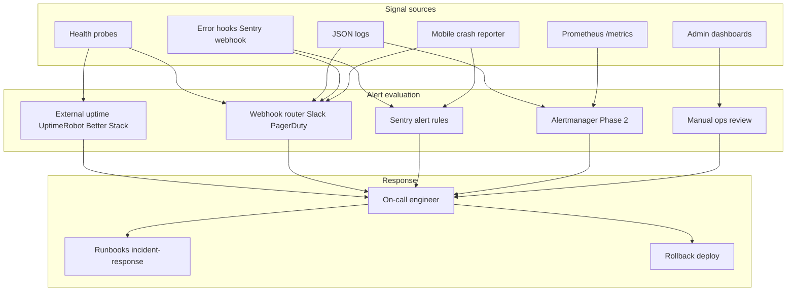
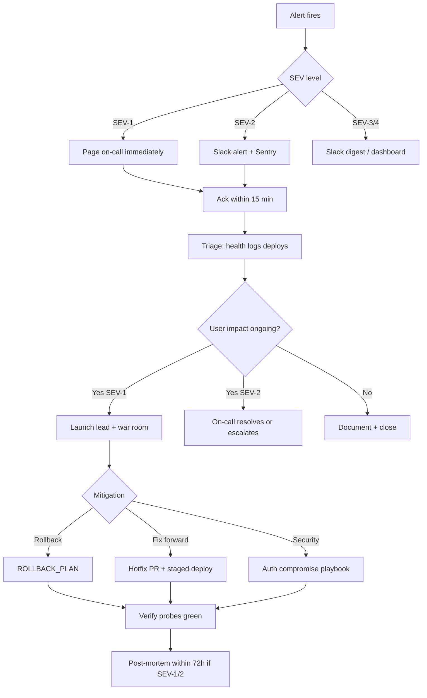

# Alerting Plan — Prani Doctor Platform

**Version:** 2.0  
**Date:** 2026-05-30  
**Scope:** `pranidoctor-backend`, `pranidoctor-web`, `pranidoctor_user`  
**Status:** **Implemented (v2.0)** — deduplicated in-app alerts; external uptime still ops-owned  
**Related:** [monitoring-guide.md](../../monitoring-guide.md) · [incident-response-guide.md](../../incident-response-guide.md) · [admin-monitoring-plan](../../../pranidoctor-web/docs/production/admin/admin-monitoring-plan.md) · [ai-usage-monitoring-plan](../ai/ai-usage-monitoring-plan.md) · [flutter-crash-reporting-plan](../mobile/flutter-crash-reporting-plan.md) · [sentry-integration-plan](./sentry-integration-plan.md)

---

## Executive summary

Prani Doctor ships a **layered observability foundation** across API, admin BFF, and mobile: health probes, structured JSON logs, optional Sentry, webhook alert hooks, Prometheus-compatible metrics (backend), and in-app ops dashboards. **Automated paging is not fully live until ops configures external uptime monitors and webhook/Slack/PagerDuty endpoints.**

| Layer | What exists today | Alert delivery today | Gap |
|-------|-------------------|----------------------|-----|
| **L1 — Synthetic uptime** | `/health`, `/ready`, `/live`, web `/api/admin/health/*` | External monitor (ops-owned) | Not in repo — must configure |
| **L2 — App webhooks** | `MONITORING_ALERT_WEBHOOK_URL`, `ERROR_TRACKING_WEBHOOK_URL`, mobile `CRASH_REPORTING_WEBHOOK_URL` | Code-shipped; fires when env set | Secrets + routing rules |
| **L3 — Error tracking** | Sentry (optional DSN), Pino logs, Crashlytics + composite mobile reporter | Sentry project rules (ops) | Client Sentry incomplete on web |
| **L4 — Metrics / SLO** | Backend `/metrics` + AI counters; Prometheus rules file (not deployed) | Alertmanager (Phase 2) | No HTTP latency histogram yet |
| **L5 — Human dashboards** | `/admin`, `/admin/analytics/*`, `/admin/ai-ops`, Launch Ops | **No auto-page** — manual review | By design for business KPIs |

**Recommendation:** Deploy **Phase 1** immediately: 3 external uptime checks + Slack webhook + Sentry production rules. **In-app alerting (v2.0)** is shipped — see [ALERTING_IMPLEMENTATION.md](./ALERTING_IMPLEMENTATION.md).

---

## Implementation reference (v2.0)

| Component | Location | Role |
|-----------|----------|------|
| Alert service (web) | `pranidoctor-web/src/lib/monitoring/alerting/` | Dedup, storm limit, escalation metadata |
| Alert service (API) | `pranidoctor-backend/src/shared/monitoring/alerting/` | Same contract for Express |
| Web hooks | `alerts.ts`, `error-tracking.ts`, `proxy-to-backend.ts`, admin health route | Critical/warning alerts |
| API hooks | `health.routes.ts`, `error.handler.ts`, `server.ts` | Readiness, DB, 5xx, uncaught |
| Tests | `alert-deduplicator.test.ts` (both repos) | Dedup + escalation + storm |

### Environment variables

| Variable | Default | Purpose |
|----------|---------|---------|
| `MONITORING_ALERT_WEBHOOK_URL` | — | Primary Slack/PagerDuty ingest |
| `ERROR_TRACKING_WEBHOOK_URL` | — | Fallback when alert URL unset (backend) |
| `MONITORING_ENABLED` | `true` | Master switch |
| `ALERT_DEDUP_WINDOW_MS` | `900000` (15 min) | Suppress duplicate alert IDs |
| `ALERT_ESCALATION_THRESHOLD` | `5` | Re-fire after N repeats in window |
| `ALERT_MAX_CRITICAL_PER_MIN` | `10` | Storm cap (critical) |
| `ALERT_MAX_WARNING_PER_MIN` | `30` | Storm cap (warning) |
| `ALERT_MAX_INFO_PER_MIN` | `60` | Storm cap (informational) |

---

## 1. Monitoring architecture review

### 1.1 Monitoring outputs (by runtime)

#### Backend (`pranidoctor-backend`)

| Output | Endpoint / mechanism | Auth | Used for alerts |
|--------|----------------------|------|-----------------|
| Aggregate health | `GET /health` | Public (rate-limit exempt) | Downtime, DB/storage degradation |
| Readiness | `GET /ready` | Public | K8s/Docker, SLA gate |
| Liveness | `GET /live` | Public | Process up |
| Dependency probes | `/health/db`, `/health/redis`, `/health/storage`, `/health/modules` | Public | DB failures, Redis 503 storm |
| Mobile health | `GET /api/mobile/health` | Public | Mobile connectivity smoke |
| Prometheus metrics | `GET /metrics` | Bearer `METRICS_TOKEN` (prod) | Slow API proxy, AI SLOs (partial) |
| Structured logs | Pino JSON → stdout | — | 5xx rate, correlation |
| Error capture | `captureException` → Sentry + `ERROR_TRACKING_WEBHOOK_URL` | — | Errors, unhandled rejections |
| Queue failures | BullMQ worker → `captureException` | — | Background job errors |

**Health semantics:** `healthy` / `degraded` / `unhealthy`. Redis down → rate limits **fail closed (503)** in staging/production — treat as **critical**.

#### Admin web (`pranidoctor-web`)

| Output | Endpoint / mechanism | Used for alerts |
|--------|----------------------|-----------------|
| BFF readiness | `GET /api/admin/health/ready` | Admin downtime |
| BFF liveness | `GET /api/admin/health/live` | Web process up |
| Uptime snapshot | `GET /api/admin/uptime` | Release/version correlation |
| Generic health | `GET /api/health/*` | Launch Ops |
| Proxy telemetry | `admin.proxy` / `admin.proxy.error` logs (`durationMs`, status) | Slow APIs, 5xx spikes |
| Server errors | `instrumentation.ts` → `alertServerError` + Sentry | Critical errors |
| Health failures | `alertHealthCheckFailure()` | Critical |
| Client errors | `clientLog` + `captureClientException` (logs only today) | UI errors |

#### Mobile (`pranidoctor_user`)

| Output | Mechanism | Used for alerts |
|--------|-----------|-----------------|
| Crash / non-fatal events | `CompositeCrashReporter` → Crashlytics + webhook | Error spikes, release regressions |
| Structured logs | `AppLog` + `LogRedactor` (local / DevTools) | Debug only |
| Network non-fatals | `CrashReportingNetworkInterceptor` (throttled E07) | API outage patterns from clients |
| Boot failures | `BootController` → E10 non-fatal | Config/API down at cold start |

### 1.2 Architecture diagram

### 1.3 Operational workflows (existing)

| Workflow | Document | Trigger | Key steps |
|----------|----------|---------|-----------|
| **Incident response** | [incident-response-guide.md](../../incident-response-guide.md) | SEV-1/2/3 | Acknowledge → contain → assess `/health` → rollback → comms → post-mortem (72h) |
| **Launch day** | [LAUNCH_DAY_RUNBOOK.md](../../launch/LAUNCH_DAY_RUNBOOK.md) | Go-live | T-24h uptime monitors; T-1h probe matrix; T-0 health gates |
| **Rollback** | [ROLLBACK_PLAN.md](../../launch/ROLLBACK_PLAN.md) | Alert storm / SEV-1 | Halt rollout; previous image tag; forward-only DB |
| **Backup failure** | [backup-recovery.md](../../backup-recovery.md) | Backup cron miss | Restore drill; 3-2-1 rule |
| **Auth compromise** | incident-response-guide § Auth | Security alert | Revoke refresh tokens; rotate JWT secrets; force mobile re-login |
| **Launch Ops UI** | `/admin/launch-ops` | Pre-launch manual | Probe order: backend `/health` → BFF ready |
| **AI ops review** | `/admin/ai-ops`, `/admin/ai-ops/risk` | Daily (launch week) | Escalations, kill switch, risk farms |

**Workflow gap:** No documented on-call rotation in git (by design — fill in team wiki). Escalation phone tree is **ops-owned**.

---

## 2. Alert philosophy

1. **Alert on user impact** — probe down beats CPU high.
2. **Actionable only** — every alert links to a runbook section.
3. **Severity drives channel** — critical pages immediately; warnings batch to Slack.
4. **Avoid duplicate noise** — Sentry for stack traces; webhooks for ops signals; dedupe by `correlationId` / release.
5. **Expected errors are not pages** — 401/404/422, offline mobile API calls, feed low-stock business alerts.

---

## 3. Alert catalog

Alerts are grouped by **category**. **ID format:** `ALT-{CATEGORY}-{NN}`.

**Legend — implementation status:**

| Tag | Meaning |
|-----|---------|
| 🟢 **Shipped** | Code fires today when env configured |
| 🟡 **Ops** | Requires external monitor / Sentry rule / cron |
| 🔵 **Phase 2** | Needs Prometheus scrape + Alertmanager |

---

### 3.1 Downtime

| ID | Alert name | Condition | Threshold | Source | Severity | Status | Runbook |
|----|------------|-----------|-----------|--------|----------|--------|---------|
| ALT-DOWN-01 | **ApiLiveDown** | `GET /live` non-200 or timeout | 2 consecutive failures (60s interval) | External uptime | **SEV-1** | 🟡 Ops | incident-response § SEV-1; check Docker/process |
| ALT-DOWN-02 | **ApiReadyDown** | `GET /ready` non-200 | 2 min | External uptime | **SEV-1** | 🟡 Ops | LAUNCH_DAY_RUNBOOK T-1h #2; DB/Redis |
| ALT-DOWN-03 | **ApiHealthUnhealthy** | `GET /health` status `unhealthy` or HTTP 503 | 2 min | External uptime | **SEV-1** | 🟡 Ops | Rollback if post-deploy |
| ALT-DOWN-04 | **AdminBffReadyDown** | `GET /api/admin/health/ready` non-200 | 2 min | External uptime | **SEV-1** | 🟡 Ops | Check `BACKEND_URL`, `admin.proxy.error` logs |
| ALT-DOWN-05 | **AdminShellDown** | `GET /admin/login` non-200 | 3 min | External uptime | **SEV-1** | 🟡 Ops | Web container / nginx TLS |
| ALT-DOWN-06 | **ApiProcessDown** | `up{job="pranidoctor-api"} == 0` | 2 min | Prometheus | **SEV-1** | 🔵 Phase 2 | `prometheus-alerts.yml` |
| ALT-DOWN-07 | **HealthCheckFailure** | Programmatic BFF health fail | Immediate | 🟢 Web `alertHealthCheckFailure` | **SEV-1** | 🟢 Shipped | Same as ALT-DOWN-04 |
| ALT-DOWN-08 | **MobileApiUnreachable** | Spike in mobile E07 `noConnection` | >5% sessions / 10 min | Crashlytics/webhook | **SEV-2** | 🟡 Ops | API + CDN edge; correlate with ALT-DOWN-02 |

---

### 3.2 Errors

| ID | Alert name | Condition | Threshold | Source | Severity | Status | Runbook |
|----|------------|-----------|-----------|--------|----------|--------|---------|
| ALT-ERR-01 | **Backend5xxSpike** | 5xx / total requests | >1% for 5 min | Logs / Prometheus `High5xxRate` | **SEV-2** | 🔵 Phase 2 / 🟡 Logs | incident-response; Sentry issue triage |
| ALT-ERR-02 | **BackendUncaughtException** | `uncaughtException` / `unhandledRejection` | Any | 🟢 `server.ts` → Sentry/webhook | **SEV-1** | 🟢 Shipped | Rollback candidate |
| ALT-ERR-03 | **AdminServerError** | Next.js `onRequestError` | Any | 🟢 `alertServerError` | **SEV-1** | 🟢 Shipped | Sentry + `correlationId` |
| ALT-ERR-04 | **AdminProxy5xxSpike** | `admin.proxy` status ≥500 | >5% over 10 min | Log metric | **SEV-2** | 🟡 Ops | Backend health first |
| ALT-ERR-05 | **SentryNewIssueProd** | New unresolved issue in `production` | 1 event | Sentry rule | **SEV-2** | 🟡 Ops | Assign owner; link release |
| ALT-ERR-06 | **SentryRegression** | Issue re-opened in latest release | 1 event | Sentry | **SEV-2** | 🟡 Ops | Rollback consideration |
| ALT-ERR-07 | **MobileFatalSpike** | Flutter E01/E02 fatals | >10/min or new in release | Crashlytics/webhook | **SEV-1** | 🟡 Ops | [flutter-crash-reporting-plan](../mobile/flutter-crash-reporting-plan.md) rollback |
| ALT-ERR-08 | **QueueJobFailure** | BullMQ job failed after retries | ≥3 in 15 min | 🟢 `captureException` in queue | **SEV-2** | 🟢 Shipped | Check worker logs |
| ALT-ERR-09 | **WorkerProcessDown** | Background worker not consuming | Queue depth rising 30 min | Metrics/logs | **SEV-2** | 🟡 Ops | Restart worker container |

---

### 3.3 Slow APIs

| ID | Alert name | Condition | Threshold | Source | Severity | Status | Runbook |
|----|------------|-----------|-----------|--------|----------|--------|---------|
| ALT-SLOW-01 | **AdminProxyP95High** | `admin.proxy` `durationMs` p95 | >5000 ms for 15 min | Log metric (Loki/CW) | **SEV-3** | 🟡 Ops | Reduce analytics date range; check DB |
| ALT-SLOW-02 | **AdminProxyP95Critical** | p95 admin proxy | >10000 ms for 5 min | Log metric | **SEV-2** | 🟡 Ops | DB connection pool; kill heavy exports |
| ALT-SLOW-03 | **ApiHealthDbSlow** | `/health/db` latency | >2000 ms for 5 min | Synthetic `/health` JSON | **SEV-2** | 🟡 Ops | Postgres slow query log |
| ALT-SLOW-04 | **MobileNetworkTimeoutSpike** | E07 `timeout` non-fatals | >3% sessions / 15 min | Mobile webhook | **SEV-3** | 🟡 Ops | API latency + mobile `API_*_TIMEOUT_SEC` |
| ALT-SLOW-05 | **HttpP95High** | API request duration p95 | >3s core routes | 🔵 Prometheus middleware | **SEV-3** | 🔵 Phase 2 | APM integration |

**Initial SLO (from admin monitoring plan):**

- Admin BFF proxy p95: **< 3s** (excludes CSV export)
- Backend `/health/db` latency: **< 500ms** steady state

---

### 3.4 DB failures

| ID | Alert name | Condition | Threshold | Source | Severity | Status | Runbook |
|----|------------|-----------|-----------|--------|----------|--------|---------|
| ALT-DB-01 | **DatabaseUnhealthy** | `/health/db` status `unhealthy` | 1 min | External + `/health` | **SEV-1** | 🟡 Ops | Failover / restore [backup-recovery.md](../../backup-recovery.md) |
| ALT-DB-02 | **ApiReadyDbFail** | `/ready` fails DB check | 2 min | External | **SEV-1** | 🟡 Ops | Same as ALT-DB-01 |
| ALT-DB-03 | **PrismaConnectionExhausted** | 5xx + Prisma errors in logs | Spike 5 min | Logs / Sentry | **SEV-2** | 🟡 Ops | Scale pool; restart API |
| ALT-DB-04 | **BackupJobFailed** | Cron backup exit ≠ 0 | 1 failure | Cron monitor | **SEV-2** | 🟡 Ops | backup-recovery § Database backup |
| ALT-DB-05 | **BackupStale** | No backup file in 26h | 1 | File age check | **SEV-2** | 🟡 Ops | Run manual backup |
| ALT-DB-06 | **MigrationDeployFail** | `db:migrate:deploy` CI fail | Any on tag | GitHub Actions | **SEV-2** | 🟢 CI | Block deploy |

---

### 3.5 AI failures

| ID | Alert name | Condition | Threshold | Source | Severity | Status | Runbook |
|----|------------|-----------|-----------|--------|----------|--------|---------|
| ALT-AI-01 | **AiProviderErrorRateHigh** | `ai_requests_total{status="error"}` / total | >5% for 10 min | `/metrics` 🔵 | **SEV-2** | 🔵 Phase 2 | Check provider status; enable kill switch |
| ALT-AI-02 | **AiFallbackSpike** | `ai_requests_total{provider="rules-based"}` ratio | >30% for 15 min | `/metrics` | **SEV-2** | 🔵 Phase 2 | OpenAI/Anthropic outage; [ai-usage-monitoring-plan](../ai/ai-usage-monitoring-plan.md) |
| ALT-AI-03 | **AiLatencyP95Breached** | `ai_request_duration_seconds` p95 `CHAT` | >8s for 10 min | `/metrics` | **SEV-3** | 🔵 Phase 2 | Model swap; rate limit review |
| ALT-AI-04 | **AiDailyQuotaExhaustion** | HTTP 429 `AI_DAILY_LIMIT` rate | >50/hour | API logs | **SEV-3** | 🟡 Ops | Capacity; quota config |
| ALT-AI-05 | **AiEscalationSpike** | Escalations in admin AI ops | >N in 1h (set N=10 launch) | `/admin/ai-ops` 🟡 manual | **SEV-2** | 🟡 Ops | Review `/admin/ai-ops/risk`; safety audit |
| ALT-AI-06 | **AiKillSwitchOffUnexpected** | `ai_llm_disabled` gauge = 0 after admin enabled LLM | Unexpected | `/metrics` | **SEV-3** | 🔵 Phase 2 | Governance panel |
| ALT-AI-07 | **AiCostBudgetWarning** | Daily `ai_cost_usd` rollup | >80% daily budget | DB rollup / admin | **SEV-3** | 🟡 Ops | COST_OPTIMIZATION doc; throttle |
| ALT-AI-08 | **AiModuleMissing** | `/health/modules` AI module absent | Post-deploy | Smoke script | **SEV-2** | 🟡 Ops | LAUNCH_DAY_RUNBOOK |

---

### 3.6 SLA breaches

Platform SLOs (initial — adjust after baseline week):

| SLO | Target | Measurement | Breach alert |
|-----|--------|-------------|--------------|
| **API availability** | 99.9% monthly | `GET /ready` synthetic | ALT-SLA-01 |
| **Admin availability** | 99.5% monthly | BFF ready probe | ALT-SLA-02 |
| **API error rate** | <0.5% 5xx (excl. health) | Logs / metrics | ALT-SLA-03 |
| **Admin proxy p95** | <3s | Log metric | ALT-SLA-04 |
| **AI chat success** | ≥99% | `ai_requests_total` | ALT-SLA-05 |
| **Mobile crash-free sessions** | ≥99.0% | Crashlytics | ALT-SLA-06 |
| **RTO backup restore** | <4h validated quarterly | Drill | ALT-SLA-07 (process) |

| ID | Alert name | Condition | Severity | Status |
|----|------------|-----------|----------|--------|
| ALT-SLA-01 | **ApiAvailabilitySLOBreach** | Monthly uptime <99.9% | **SEV-2** (exec report) | 🟡 Ops |
| ALT-SLA-02 | **AdminAvailabilitySLOBreach** | Monthly uptime <99.5% | **SEV-2** | 🟡 Ops |
| ALT-SLA-03 | **ErrorRateSLOBreach** | 5xx >0.5% rolling 24h | **SEV-2** | 🟡 Ops |
| ALT-SLA-04 | **LatencySLOBreach** | Admin p95 >3s rolling 1h | **SEV-3** | 🟡 Ops |
| ALT-SLA-05 | **AiSuccessSLOBreach** | AI success <99% rolling 24h | **SEV-2** | 🔵 Phase 2 |
| ALT-SLA-06 | **MobileCrashFreeSLOBreach** | Crash-free <99% rolling 7d | **SEV-2** | 🟡 Ops |
| ALT-SLA-07 | **BackupRestoreDrillOverdue** | No successful drill >90d | **SEV-3** | 🟡 Process |

---

### 3.7 Security incidents

| ID | Alert name | Condition | Threshold | Source | Severity | Status | Runbook |
|----|------------|-----------|-----------|--------|----------|--------|---------|
| ALT-SEC-01 | **AuthFailureSpike** | `admin.auth.*` / mobile 401 burst | >100/min same IP | Logs + WAF | **SEV-2** | 🟡 Ops | Block IP nginx; incident-response |
| ALT-SEC-02 | **RateLimit503Storm** | 503 from rate limiter (Redis down) | >5% requests 5 min | Logs | **SEV-1** | 🟡 Ops | Redis recovery; ALT-DOWN-* |
| ALT-SEC-03 | **TokenReuseDetected** | Refresh token reuse log | Any | 🟢 auth audit logs | **SEV-1** | 🟢 Shipped | Auth compromise playbook |
| ALT-SEC-04 | **GitleaksCIFailure** | Secret scan fail on `main` | Any | 🟢 GitHub Actions | **SEV-2** | 🟢 Shipped | Rotate leaked secret |
| ALT-SEC-05 | **CodeQLCritical** | CodeQL critical finding | Any new | GitHub Advanced Security | **SEV-2** | 🟡 Ops | Triage PR |
| ALT-SEC-06 | **UnauthorizedAdminAccess** | 403/401 pattern on `/api/admin/*` | Automated probe success | Synthetic | **SEV-1** | 🟡 Ops | BFF guard regression |
| ALT-SEC-07 | **SslCertExpiring7d** | TLS cert expiry | <7 days | External SSL monitor | **SEV-1** | 🟡 Ops | Renew cert |
| ALT-SEC-08 | **SslCertExpiring30d** | TLS cert expiry | <30 days | External | **SEV-3** | 🟡 Ops | Plan renewal |
| ALT-SEC-09 | **SuspiciousUploadRejected** | MIME validation failures spike | >50/h | API logs | **SEV-3** | 🟡 Ops | [security-guide.md](../../security-guide.md) |
| ALT-SEC-10 | **MetricsEndpointUnauthorizedBurst** | 401 on `/metrics` | >20/min | API logs | **SEV-3** | 🟡 Ops | Rotate `METRICS_TOKEN` |

---

## 4. Severity matrix

| Severity | User impact | Examples | Response target | Notification channel | Who |
|----------|-------------|----------|-----------------|----------------------|-----|
| **SEV-1 Critical** | Full outage, data breach suspected, auth broken | API down, DB down, token reuse, SSL 7d | **Immediate** (<15 min ack) | PagerDuty / phone + `#incidents` Slack | On-call engineer → Launch lead |
| **SEV-2 Warning** | Major degradation, subset broken | 5xx spike, AI provider down, backup fail, new Sentry prod issue | **<1 hour** ack | Slack `#pranidoctor-alerts` + Sentry | On-call engineer |
| **SEV-3 Info** | Minor degradation, no immediate user block | Slow analytics, cert 30d, KPI threshold, AI cost 80% | **Business hours** | Slack optional / email digest | Ops lead / product |
| **SEV-4 Low** | Informational | Pending doctor count high, zero requests off-peak | Weekly review | Dashboard only | Product |

### Severity ↔ alert tier mapping

| Tier (admin plan) | Maps to | Page on-call? |
|-------------------|---------|---------------|
| P0 Critical | SEV-1 | Yes |
| P1 Warning | SEV-2 | Slack; page if during launch window |
| P2 Info | SEV-3 / SEV-4 | No page |

### Alert fatigue controls

| Control | Application |
|---------|-------------|
| **Dedup window** | 15 min same alert ID + host |
| **Maintenance mode** | Silence external monitors during planned deploy |
| **Rate limit** | Mobile network E07 throttled 1/min/route in-app |
| **Expected errors excluded** | 401/404/422, offline mobile, feed low-stock UI |
| **Dual path dedupe** | Sentry owns stack traces; webhook owns probe/state alerts |

---

## 5. Escalation workflow

### 5.1 Flow

### 5.2 Roles & responsibilities

| Step | Primary | Backup | Tools |
|------|---------|--------|-------|
| Acknowledge | On-call engineer | Launch lead | PagerDuty / Slack |
| Triage | On-call engineer | Backend/web specialist | `/health`, Sentry, logs, `correlationId` |
| Communicate | Launch lead | Product | Status message if outage >15 min |
| Mitigate | On-call + DevOps | — | Rollback, scale, Redis/DB recovery |
| Security escalate | Launch lead | Security contact | JWT rotation, WAF, token revoke |
| Close | On-call | Ops lead | Resolve Sentry; silence monitor |
| Post-mortem | Launch lead | All involved | Blameless doc within 72h (SEV-1/2) |

### 5.3 Escalation timeline

| Elapsed | SEV-1 action | SEV-2 action |
|---------|--------------|--------------|
| **0–15 min** | Ack; check `/ready`, `/health`, last deploy | Ack; check Sentry + logs |
| **15–30 min** | War room; rollback decision | Identify owning service |
| **30–60 min** | Customer comms if not recovered | Fix or rollback plan |
| **>1 h** | Exec notify; extended status page | Launch lead notified if unresolved |
| **Post-incident** | Post-mortem mandatory | Post-mortem if user-visible |

### 5.4 Correlation procedure

1. Capture **`X-Request-Id`** / **`X-Correlation-Id`** from admin UI network tab or mobile logs.  
2. Search web logs: `event="admin.proxy"` + correlation ID.  
3. Search backend Pino logs with same `requestId`.  
4. Cross-check Sentry issue release = `APP_VERSION` / mobile `release` tag.  
5. Check `/admin/launch-ops` probe status for same window.

---

## 6. Alert channels & configuration

### 6.1 Environment variables

| Variable | Repo | Purpose |
|----------|------|---------|
| `MONITORING_ALERT_WEBHOOK_URL` | web | Slack/PagerDuty JSON (`alerts.ts`) |
| `MONITORING_ENABLED` | web | Master switch |
| `ERROR_TRACKING_WEBHOOK_URL` | backend, web | Exception ingest |
| `ERROR_TRACKING_PROVIDER` | web | `noop` \| `console` \| `webhook` \| `sentry` |
| `SENTRY_DSN` | backend, web | Sentry projects |
| `CRASH_REPORTING_WEBHOOK_URL` | mobile (dart-define) | Mobile crash ingest |
| `METRICS_TOKEN` | backend | Protect `/metrics` in production |

### 6.2 Recommended Slack routing

| Channel | Alerts |
|---------|--------|
| `#pranidoctor-incidents` | SEV-1 only (PagerDuty mirror) |
| `#pranidoctor-alerts` | SEV-2 + selected SEV-3 |
| `#pranidoctor-ai-ops` | ALT-AI-* (non-critical) |
| `#pranidoctor-security` | ALT-SEC-* |

### 6.3 Phase 1 deployment checklist (ops)

- [ ] Create Slack incoming webhook → set `MONITORING_ALERT_WEBHOOK_URL` on web host  
- [ ] Set `ERROR_TRACKING_WEBHOOK_URL` on API + web (can be same router)  
- [ ] Configure **3 uptime checks** (60s): `api/ready`, `admin/api/admin/health/ready`, `admin/login`  
- [ ] Create Sentry projects + production alert rules (new issue, regression, spike)  
- [ ] Set `CRASH_REPORTING_WEBHOOK_URL` in mobile release CI  
- [ ] Set `METRICS_TOKEN` on API; optional Prometheus scrape  
- [ ] Document on-call rotation in team wiki (not git)  
- [ ] Run fire drill: staging probe fail → webhook received  

---

## 7. Phase roadmap

| Phase | Timeline | Deliverables |
|-------|----------|--------------|
| **Phase 1 — Launch** | Now | External uptime (3 probes); webhooks live; Sentry rules; mobile crash webhook; incident channel |
| **Phase 2 — Hardening** | +2–4 weeks | Log-based 5xx/latency alerts; Prometheus scrape; deploy `prometheus-alerts.yml`; AI Alertmanager rules |
| **Phase 3 — Scale** | Growth | Full Grafana stack; synthetic admin login; fill System Analytics APM gap; PagerDuty on-call schedule |

---

## 8. Related documents

| Document | Purpose |
|----------|---------|
| [monitoring-guide.md](../../monitoring-guide.md) | Health endpoints, metrics entry point |
| [incident-response-guide.md](../../incident-response-guide.md) | SEV playbooks |
| [LAUNCH_DAY_RUNBOOK.md](../../launch/LAUNCH_DAY_RUNBOOK.md) | Pre-launch probe matrix |
| [admin-monitoring-plan.md](../../../pranidoctor-web/docs/production/admin/admin-monitoring-plan.md) | Admin dashboard ↔ probe mapping |
| [ai-usage-monitoring-plan.md](../ai/ai-usage-monitoring-plan.md) | AI metrics & SLO targets |
| [flutter-crash-reporting-verification-report.md](../mobile/flutter-crash-reporting-verification-report.md) | Mobile crash alert inputs |
| [sentry-integration-plan.md](./sentry-integration-plan.md) | Unified error tracking rollout |
| [deploy/monitoring/prometheus-alerts.yml](../../../pranidoctor-backend/deploy/monitoring/prometheus-alerts.yml) | Reference Alertmanager rules |

---

## Document history

| Date | Change |
|------|--------|
| 2026-05-30 | v1.0 — Platform alerting plan: catalog, severity matrix, escalation workflow |
