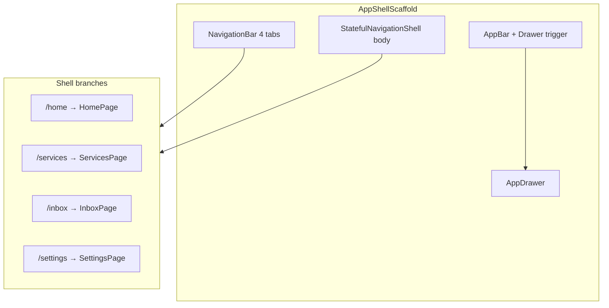

# Home Page UI Redesign Plan

**Project:** PraniDoctor User App (`pranidoctor_user`)  
**Scope:** Home tab UI only — visual/layout redesign to match Home UI concept  
**Status:** Planning only (no implementation in this phase)  
**Date:** 2026-05-23

---

## Executive summary

The home experience is implemented under `lib/features/home/` and rendered inside the authenticated shell (`AppShellScaffold`). Data flows through existing Riverpod dashboard providers and cross-feature repositories. **No backend contract changes are required** for most sections; several design-target blocks (Marketplace, Community, Orders, Payments, Reports hub, Upload Report) have **no dedicated feature module or route today** and must be handled as deferred navigation, embedded promos, or reuse of adjacent modules without new APIs.

This plan preserves:

- Riverpod state management and repository pattern
- go_router shell routing (`StatefulShellRoute.indexedStack`)
- Auth flow, session gating, and offline/cache behavior
- Localization (`AppLocalizations`) and theme system
- Responsive layout conventions (padding, `ListView`, section shells)

---

## 1. Existing structure audit

### 1.1 Top-level `lib/` layout

There is **no** standalone `lib/routes/`, `lib/providers/`, or `lib/services/` folder. Routing lives in `lib/routing/`; providers and services are **colocated per feature**.

```
lib/
├── app/                    # App root, startup cache hydration
├── core/                   # Session, network, navigation, branding, offline, cache
├── features/               # Feature modules (home, auth, animals, …)
├── l10n/                   # ARB + generated localizations
├── routing/                # go_router, nav guards, shell scaffold
└── theme/                  # Theme controllers
```

### 1.2 Feature modules relevant to Home

| Module | Path | Role relative to Home |
|--------|------|------------------------|
| **home** | `lib/features/home/` | Primary dashboard page, providers, section widgets |
| **navigation** | `lib/features/navigation/widgets/app_drawer.dart` | Side drawer (shell-level) |
| **auth** | `lib/features/auth/` | Session, logout (`performAuthLogout`) — **unchanged** |
| **animals** | `lib/features/animals/` | Animal list/detail/create — “My Animals” section |
| **doctors / services** | `lib/features/doctors/`, `services/services_page.dart` | Find Doctor, Book Doctor |
| **service_requests / inbox** | `lib/features/service_requests/`, `inbox/` | Appointments, inbox tab |
| **vaccine** | `lib/features/vaccine/` | Vaccine due, reminders |
| **treatment** | `lib/features/treatment/` | Active treatments |
| **health** | `lib/features/health/` | Health history, health dashboard |
| **ai** | `lib/features/ai/` | AI assistant entry |
| **area** | `lib/features/area/` | Location picker (used on Services tab) |
| **profile** | `lib/features/profile/` | Profile photo, address, `mobileMeProvider` |
| **notifications** | `lib/features/notifications/` | Unread count, notification center |
| **support** | `lib/features/support/` | Support hub |
| **finance** | `lib/features/finance/` | Closest to “Payments” (expenses/income, not wallet) |
| **shared/upload** | `lib/features/shared/upload/` | Generic upload service (profile/support only today) |
| **farm, feed, milk, batches** | respective folders | Farm ops — drawer expansions, not home concept sections |

**Note:** There is **no** `features/dashboard/` module. Dashboard logic is entirely under `features/home/`. Separate “dashboard” pages exist inside domain modules (e.g. `health_dashboard_page.dart`, `vaccine_dashboard_page.dart`).

### 1.3 Current Home file tree

```
lib/features/home/
├── home_page.dart                          # Orchestrator: providers + ListView sections
├── data/
│   ├── dashboard_api_paths.dart            # GET dashboard-context path
│   ├── dashboard_context_dto.dart          # DashboardType, user, farmSummary, AI tech
│   ├── dashboard_repository.dart           # API + disk cache
│   └── dashboard_repository_contract.dart
└── presentation/
    ├── home_navigation.dart                # Pull-to-refresh, deep-link refresh
    ├── home_providers.dart                 # All dashboard Riverpod providers
    └── widgets/
        ├── home_greeting_header.dart
        ├── home_hero_banner.dart
        ├── home_emergency_card.dart
        ├── home_promo_card.dart
        ├── home_summary_section.dart
        ├── home_appointments_section.dart
        ├── home_health_alerts_section.dart
        ├── home_activity_section.dart
        ├── home_quick_actions.dart
        ├── home_support_entry.dart
        ├── home_section_shell.dart         # Async section wrapper + retry
        ├── home_skeleton.dart
        └── (HomeAiTechnicianSection in home_support_entry.dart)
```

### 1.4 Shell vs Home responsibilities (today)

| Layer | File | Responsibility |
|-------|------|----------------|
| Shell | `lib/routing/shell/app_shell_scaffold.dart` | `Scaffold` with generic `AppBar` (menu + `appTitle`), drawer, 4-tab bottom nav |
| Home body | `lib/features/home/home_page.dart` | Scrollable content only — **no** own `Scaffold` |
| Drawer | `lib/features/navigation/widgets/app_drawer.dart` | Profile header + hierarchical menu |

**Gap vs design target:** Concept shows a rich top bar (logo, location, notification, profile). Today those controls are split between shell `AppBar` (menu + title) and `HomeGreetingHeader` (avatar, greeting, notification, profile edit).

### 1.5 Auth integration (must remain unchanged)

- `protectedApisEnabledProvider` gates all dashboard API calls
- 401/403 on dashboard → sign-out affordance in `_HomeErrorView`
- Deep link: `/home?refresh=true` → `HomePage(refreshOnOpen: true)`
- Boot warm-cache: `AppStartup` preloads `readCachedDashboard()`

### 1.6 Role variants

`DashboardType` (`general`, `doctor`, `aiTechnician`) branches UI:

- **Customer** (`general` / `doctor`): hero, emergency card, promo, appointments, health alerts
- **AI technician**: `HomeAiTechnicianSection`; skips customer promo/health blocks

Redesign must preserve role branching; layout can change, behavior cannot.

---

## 2. Current Home dependencies

### 2.1 Direct imports (`home_page.dart`)

| Dependency | Purpose |
|------------|---------|
| `auth_logout.dart` | Unauthorized error → sign out |
| `dashboard_context_dto.dart` | `DashboardType`, `isCustomerDashboard()` |
| `home_navigation.dart` | Refresh + deep-link entry |
| `home_providers.dart` | All watched providers |
| Section widgets | Greeting, summary, appointments, alerts, activity, quick actions, support |
| `app_localizations.dart` | All user-visible strings (except a few hardcoded promo/emergency strings) |

### 2.2 Riverpod providers watched on Home

| Provider | Type | Data |
|----------|------|------|
| `dashboardProvider` | `AsyncNotifierProvider` | User, type, farm summary, AI tech stats |
| `dashboardMetricsProvider` | `FutureProvider` | Farms, animals, appointments, unread count |
| `dashboardAppointmentsProvider` | `FutureProvider` | Top 5 active service requests |
| `dashboardActivityProvider` | `FutureProvider` | Last 5 notifications |
| `dashboardHealthAlertsProvider` | `FutureProvider` | Vaccine overdue/upcoming |
| `unreadNotificationCountProvider` | (notifications) | Badge in greeting header |
| `appConfigProvider` | (app_config) | Emergency phone, support contacts |

**Defined but not wired in UI:** `dashboardPollProvider` (60s silent refresh) — exists in `home_providers.dart`, not subscribed from `HomePage` or shell.

### 2.3 Repository dependency graph

```
dashboardProvider
  └── DashboardRepository → GET /api/mobile/profile/dashboard-context

dashboardMetricsProvider
  ├── FarmRepository.listFarms(pageSize: 1)     → farm total
  ├── dashboard context farmSummary           → animal count
  ├── ServiceRequestRepository.listRequests   → active appointment count
  └── NotificationRepository.getUnreadCount

dashboardAppointmentsProvider
  └── ServiceRequestRepository.listRequests(limit: 30)

dashboardActivityProvider
  └── NotificationRepository.listNotifications(limit: 5)

dashboardHealthAlertsProvider
  └── VaccineRepository.getReminders()
```

### 2.4 Cross-feature providers for **new** sections (not on home today)

| Proposed section | Existing provider | Repository / API |
|------------------|-------------------|------------------|
| My Animals (preview) | `animalListProvider` or `animalsProvider` | `AnimalRepository.listAnimals` |
| Active treatment metric | `treatmentSummaryProvider` (in treatment_providers) | Treatment list with `status: active` |
| Health tasks (combined) | Compose from `dashboardHealthAlertsProvider` + treatment follow-ups | Vaccine reminders + treatment module |
| Find Doctor teaser | `doctorListProvider` + `doctorDiscoveryFiltersProvider` | Doctor discovery API (same as Services tab) |
| AI Assistant teaser | `aiChatProvider` | AI session state |
| Location in app bar | `mobileMeProvider` or `dashboardProvider` farmSummary | Profile address API / `primaryVillageLabelBn` |
| Health Dashboard embed | Navigate only → `HealthDashboardPage` | Existing health module |

### 2.5 Localization & theme

- Primary strings: `l10n.dashboard*`, `l10n.nav*`, feature-specific keys in `app_en.arb`
- **Technical debt:** `HomeHeroBanner`, `HomeEmergencyCard`, `HomePromoCard` contain hardcoded English — redesign should migrate to l10n keys
- Theme: `Theme.of(context)`, `colorScheme`, `BrandAssets` for illustrations
- Responsive: fixed `padding: 16`, `GridView` with `shrinkWrap`, `Wrap` for chips — preserve pattern for new grids

### 2.6 Offline & cache

- Dashboard context: disk key `dashboard_snapshot`, 7-day TTL
- Sections fail-safe to empty on error; show `dashboardOfflineHint` when `fromCache`
- Pull-to-refresh → `HomeNavigation.refreshDashboard` → invalidates all section providers

---

## 3. Navigation dependency map

### 3.1 Authenticated shell topology



### 3.2 Home section → route mapping (design target)

| Design section | Navigation target | Route / action | Module status |
|----------------|-------------------|----------------|---------------|
| Drawer icon | Open drawer | Shell drawer | Exists |
| App logo | Home scroll top / brand | `/home` | Exists |
| Location | Area picker or profile address | `/settings/profile/address` or inline `AreaPicker` | Exists (area module) |
| Notification | Notification center / inbox | `/inbox` or `/notifications` | Exists |
| Profile | Profile settings | `/settings/profile` | Exists |
| Add Animal | Create animal | `/animals/create` | Exists |
| Book Doctor | Services tab + book flow | `/services` → doctor detail → book | Exists |
| Treatments | Treatment dashboard | `/treatments` | Exists |
| Vaccination | Vaccine dashboard | `/vaccines` | Exists |
| Nearby Services | Services tab (location filters) | `/services` + area filters | Exists |
| Upload Report | **No dedicated route** | Defer: support ticket attachment or health form | **Gap** |
| Health History | Health history page | `/health/history` | Exists |
| Emergency | Emergency doctor filter + tel | `/services` + `emergencyOnly` + `appConfig.emergencyPhone` | Exists |
| My Animals | Animal list | `/animals` | Exists |
| Upcoming Health Tasks | Vaccine reminders + treatments | `/vaccines/reminders`, `/treatments` | Partial (split) |
| Find Doctor | Services tab | `/services` | Exists |
| AI Assistant | AI home | `/ai` | Exists |
| Health Dashboard | Health module dashboard | `/health` | Exists |
| Marketplace | **No route** | Placeholder / coming soon | **Gap** |
| Community | **No route** | Placeholder / coming soon | **Gap** |
| Emergency FAB | Same as emergency | Shell overlay FAB on home tab only | UI pattern new |
| Bottom nav | Shell tabs | `/home`, `/services`, `/inbox`, `/settings` | Exists |

### 3.3 Drawer target → current mapping

| Design drawer item | Current drawer equivalent | Route | Notes |
|--------------------|---------------------------|-------|-------|
| Dashboard | Home | `/home` tab 0 | Exists |
| My Animals | Animals expansion → list | `/animals` | Flatten in redesign |
| Appointments | Inbox (partial) | `/inbox` tab 2 | Appointments live in inbox |
| Vaccines | Vaccines tile | `/vaccines` | Exists |
| Treatments | Records expansion | `/treatments` | Exists |
| Health History | Records → health records | `/health/records` or `/health/history` | Exists |
| AI | Not in drawer | `/ai` | Add link |
| Orders | **None** | — | Notification pref only; no orders module |
| Marketplace | **None** | — | Out of scope per architecture plan |
| Community | **None** | — | Out of scope |
| Reports | Finance reports (partial) | `/finance/reports` | No unified “Reports” hub |
| Payments | Finance dashboard (partial) | `/finance` | Not payment gateway |
| Support | Not top-level | `/support` | Exists via quick action / settings |
| Settings | Settings tile | `/settings` tab 3 | Exists |
| Logout | Sign out tile | `performAuthLogout` | Exists |

**Preservation rule:** Farm / Feed / Milk / Batch expansions are **not** in the design drawer list but are **existing modules**. They must remain reachable — either as secondary drawer group, settings links, or quick actions — to satisfy “DO NOT remove existing modules.”

---

## 4. Widget tree proposal

### 4.1 Architectural decision: Top app bar

**Recommended approach (minimal routing risk):** Keep shell `Scaffold` and enhance `AppShellScaffold` with a **home-tab-aware app bar** via `navigationShell.currentIndex == 0`:

- When on Home tab: custom `PreferredSizeWidget` (`HomeShellAppBar`) with drawer, logo, location chip, notification badge, profile avatar
- Other tabs: retain current simple `AppBar` with title

**Alternative (lower shell touch):** Move full top bar into `HomePage` as sliver header inside `CustomScrollView` — duplicates drawer access unless shell hides its app bar on home (requires shell change anyway).

**Decision for implementation phase:** Prefer shell-level home app bar to avoid double headers and align with concept.

### 4.2 Proposed Home body widget tree

```
HomePage (ConsumerStatefulWidget) — unchanged entry, new layout
└── dashboardProvider.when
    ├── loading → HomeSkeleton (redesigned skeleton matching sections)
    ├── error → _HomeErrorView (unchanged behavior)
    └── data → RefreshIndicator
        └── CustomScrollView (or ListView — prefer CustomScrollView for FAB clearance)
            ├── [Sliver] HomeWelcomeHeader          ← Section 1 (refactor greeting)
            ├── [Sliver] HomeAnimalSummarySection   ← Section 2 (refactor summary metrics)
            ├── [Sliver] HomeQuickActionsGrid       ← Section 3 (8-action grid, replace Wrap chips)
            ├── [Sliver] HomeMyAnimalsSection       ← Section 4 (new; animalListProvider preview)
            ├── [Sliver] HomeUpcomingTasksSection   ← Section 5 (compose alerts + treatments)
            ├── [Sliver] HomeFindDoctorSection      ← Section 6 (teaser → services tab)
            ├── [Sliver] HomeAiAssistantSection   ← Section 7 (teaser → /ai)
            ├── [Sliver] HomeHealthDashboardSection ← Section 8 (teaser cards → /health)
            ├── [Sliver] HomeMarketplaceSection   ← Section 9 (placeholder / promo)
            ├── [Sliver] HomeCommunitySection     ← Section 10 (placeholder / promo)
            ├── [optional] HomeActivitySection    ← preserve recent activity (not in concept list)
            ├── [optional] HomeSupportEntry       ← preserve support entry
            ├── [aiTechnician] HomeAiTechnicianSection ← preserve role variant
            └── bottom padding for FAB + nav bar
```

**FloatingActionButton (Section 11):** Attach to shell `Scaffold` when `currentIndex == 0` and customer dashboard — `FloatingActionButton.extended` calling emergency flow (reuse `HomeEmergencyCard` logic + `appConfigProvider`).

### 4.3 Section-by-section reuse vs new widgets

| Section | Widget strategy | Reuse from |
|---------|-----------------|------------|
| Welcome Header | Refactor | `HomeGreetingHeader` — drop duplicate notification/profile if moved to app bar |
| Animal Summary | Refactor | `HomeSummarySection` — remap KPIs: total animals, vaccine due, active treatment, tasks |
| Quick Actions Grid | Refactor | `HomeQuickActions` — fixed 2×4 grid with design icons |
| My Animals | **New** | Horizontal list from `animalListProvider` (limit 5) |
| Upcoming Health Tasks | **New composer** | `HomeHealthAlertsSection` + treatment active list slice |
| Find Doctor | **New teaser** | Extract row/card pattern from `HomeHeroBanner` + `ServicesPage` |
| AI Assistant | **New teaser** | Compact card linking to `AiHomePage` |
| Health Dashboard | **New teaser** | Cards linking to `/health`, `/health/analytics` |
| Marketplace / Community | **New placeholder** | Static promo cards; `onTap` → snackbar “Coming soon” or external URL from `appConfig` if added later **without API change** |
| Emergency FAB | **New shell widget** | Logic from `HomeEmergencyCard` |
| Hero / Promo / Emergency inline cards | **Deprecate in layout** | Content absorbed into new sections; files kept for rollback |

### 4.4 `HomeSectionShell` pattern

Continue using `HomeSectionShell` for async subsections (My Animals preview, Upcoming Tasks, Find Doctor doctor list snippet) to preserve per-section loading/error/retry without blocking the page.

### 4.5 Responsive layout rules

| Breakpoint | Behavior |
|------------|----------|
| `< 360dp` width | Quick actions 2 columns; summary 2×2 grid |
| `360–600dp` | Default — match concept |
| `> 600dp` (tablet) | Optional max-width `Align` center 600–720dp; quick actions 4 columns |
| Text scale | Use `maxLines` + `overflow: ellipsis`; avoid fixed heights on cards |

---

## 5. API mapping

### 5.1 No backend change required (reuse existing)

| UI block | Provider | Endpoint(s) | Response usage |
|----------|----------|-------------|----------------|
| Welcome / user | `dashboardProvider` | `GET /api/mobile/profile/dashboard-context` | `user`, `farmSummary.primaryVillageLabelBn` |
| Total animals | `dashboardMetricsProvider` | dashboard context + farm list | `farmSummary.animalCount`, `FarmRepository.listFarms` |
| Vaccine due | `dashboardHealthAlertsProvider` | `GET /api/mobile/vaccines/reminders` | `overdue.length + upcoming.length` |
| Active treatment | **New read-only aggregator** | Treatment repository (existing list API) | Count `TreatmentStatus.active` — same as `treatmentSummaryProvider` |
| Tasks (composite) | Derived | appointments + vaccine alerts + treatment follow-ups | No new endpoint; client-side sum |
| Appointments preview | `dashboardAppointmentsProvider` | `GET /api/mobile/service-requests` | Top N active requests |
| Recent activity | `dashboardActivityProvider` | `GET /api/mobile/notifications` | Optional preserve |
| Unread notifications | `unreadNotificationCountProvider` | `GET /api/mobile/notifications/unread-count` | App bar badge |
| Find Doctor snippet | `doctorListProvider` | Doctor discovery API (services module) | Top 3 doctors |
| My Animals preview | `animalListProvider` | Animal list API | First page, limit 5 |
| AI session hint | `aiChatProvider` | AI module APIs | Empty vs active session text |
| Emergency phone | `appConfigProvider` | `GET /api/mobile/app-config` | `emergencyPhone` |
| Location label | `dashboardProvider` / `mobileMeProvider` | dashboard context or `GET /api/mobile/me` | Village/address fields |

### 5.2 Metric remapping (Section 2: Animal Summary)

| Design KPI | Current KPI | Source change |
|------------|-------------|---------------|
| Total animals | Total animals | Same — `dashboardMetricsProvider.totalAnimals` |
| Vaccine due | *(not in summary grid)* | Add from `dashboardHealthAlertsProvider.totalAlerts` |
| Active treatment | *(not in summary grid)* | Add from treatment summary provider |
| Tasks | Appointments (misaligned) | Redefine as composite task count (see above) |

**Implementation note:** Extend `DashboardMetrics` **in presentation layer only** (new `HomeAnimalSummaryMetrics` view model) to avoid changing repository contracts — compose from existing providers in a new `homeAnimalSummaryProvider`.

### 5.3 Gaps — design targets without APIs

| Feature | Gap | Plan (UI-only, no backend change) |
|---------|-----|-------------------------------------|
| Upload Report | No `UploadPurpose` for health reports | Route to `/health/create` (attach media via existing health form) or `/support/tickets/create` with attachment — **product decision** |
| Marketplace | No module (`MASTER_APP_ARCHITECTURE_PLAN.md` excludes full ecommerce) | Placeholder section; disable or “Coming soon” |
| Community | No module | Placeholder section |
| Orders | Notification toggle only | Link to `/inbox` or placeholder |
| Payments | Finance module only | Link to `/finance` with label “Payments & finance” |

---

## 6. Drawer architecture

### 6.1 Current architecture

- **Location:** `AppDrawer` in shell — shared across all tabs
- **State:** `StatefulNavigationShell` for tab switching; `context.push` for stack routes
- **Profile header:** `mobileMeProvider` + `ProfileMediaImage`
- **Structure:** Flat items + 3 `ExpansionTile` groups (Farm, Animals, Records)

### 6.2 Target architecture (concept-aligned)

**Primary flat list (design target):**

1. Dashboard → tab 0 `/home`
2. My Animals → `/animals`
3. Appointments → tab 2 `/inbox`
4. Vaccines → `/vaccines`
5. Treatments → `/treatments`
6. Health History → `/health/history`
7. AI → `/ai`
8. Orders → placeholder or `/inbox`
9. Marketplace → placeholder
10. Community → placeholder
11. Reports → `/finance/reports` (interim)
12. Payments → `/finance`
13. Support → `/support`
14. Settings → tab 3 `/settings`
15. Logout → `performAuthLogout` with confirm dialog

### 6.3 Preservation of existing modules (required)

Add **secondary section** below primary list (collapsed by default):

**“Farm & records”** expansion retaining current items:

- Farm list/create/dashboard, finance, fattening, milk, feed, batches, health records

This satisfies the design drawer refresh **and** “DO NOT remove existing modules.”

### 6.4 Drawer implementation strategy

| Approach | Pros | Cons |
|----------|------|------|
| **A. Refactor `AppDrawer` in place** | Single file, shell unchanged | Large diff |
| **B. Split `AppDrawer` + `AppDrawerFarmSection`** | Testable, clearer | Two files |

**Recommended:** Approach B — `app_drawer.dart` + `app_drawer_secondary_section.dart`.

### 6.5 Drawer data dependencies

| Element | Provider |
|---------|----------|
| Profile header | `mobileMeProvider` |
| Inbox badge | `unreadNotificationCountProvider` |
| Emergency services filter | `doctorDiscoveryFiltersProvider` (keep for emergency shortcut if retained) |

**No new providers required** for drawer navigation itself.

---

## 7. Bottom navigation mapping

### 7.1 Current (unchanged in redesign scope)

| Index | Label | Route | Page |
|-------|-------|-------|------|
| 0 | Home | `/home` | `HomePage` |
| 1 | Services | `/services` | `ServicesPage` |
| 2 | Inbox | `/inbox` | `InboxPage` (badge) |
| 3 | Settings | `/settings` | `SettingsPage` |

Design concept “Section 12: Bottom Navigation” matches existing 4-tab shell — **no tab count or route changes planned.**

### 7.2 Visual refresh only (optional, same routes)

- Update icons/labels to match concept art (if provided)
- Active indicator styling via `NavigationBarTheme`
- Preserve unread badge on Inbox

### 7.3 Home FAB interaction with bottom nav

- FAB sits above bottom nav on home tab only
- `Scaffold.floatingActionButtonLocation`: `FloatingActionButtonLocation.endFloat`
- Add `padding` bottom on home scroll content = `kBottomNavigationBarHeight + fabHeight`

---

## 8. Performance strategy

### 8.1 Keep existing optimizations

| Technique | Location | Action |
|-----------|----------|--------|
| Cache-first dashboard | `DashboardNotifier.build` | Keep |
| Request deduplication | `_dashboardDeduper` | Keep |
| Section-level async | `FutureProvider` per section | Keep; add providers for new sections only |
| Debounced invalidation | `scheduleInvalidateDashboardSections` | Keep |
| Pull-to-refresh | `RefreshIndicator` | Keep |
| Skeleton first paint | `HomeSkeleton` | Redesign layout, keep pattern |

### 8.2 New section loading policy

| Section | Load policy |
|---------|-------------|
| Animal Summary KPIs | Watch existing providers; optional single `homeAnimalSummaryProvider` to batch rebuilds |
| My Animals preview | Lazy: only fetch when dashboard context loaded (`ref.watch(animalListProvider)` with limit) |
| Find Doctor teaser | `doctorListProvider` with small limit — **do not** duplicate full Services page fetch |
| Treatment count | Reuse cached treatment list provider; avoid second full fetch if already warm |
| Marketplace / Community | No network — static widgets |

### 8.3 List performance

- Prefer `ListView.builder` / horizontal `ListView.separated` for animal cards
- Keep `shrinkWrap: true` + `NeverScrollableScrollPhysics` only for small bounded lists (≤5 items)
- Avoid nesting scrollables without slivers — use `CustomScrollView` + slivers if section count grows

### 8.4 Rebuild minimization

- Split new sections into separate `ConsumerWidget` files (already the pattern)
- Pass `DashboardContext` as parameter rather than re-watching `dashboardProvider` in every child
- Use `const` constructors where possible

### 8.5 Polling

Wire `dashboardPollProvider` in `HomePage` or shell with `ref.watch(dashboardPollProvider)` — **optional enhancement**, already implemented but inactive. Enables background refresh without new API work.

### 8.6 Image assets

- Use existing `BrandAssets` (`homeHero`, `homeEmergency`, logos)
- `BrandImage` / cached network for avatars
- Precache primary logo in `HomeShellAppBar` first frame

---

## 9. Migration checklist

### Phase 0 — Preparation

- [ ] Confirm design mock / Figma tokens (spacing, colors, typography overrides)
- [ ] Product decisions on placeholder sections (Marketplace, Community, Orders, Upload Report)
- [ ] Add l10n keys for all new strings (no hardcoded English)
- [ ] Snapshot golden tests baseline for current home (`test/home/`)

### Phase 1 — Shell app bar (home tab)

- [ ] Add `HomeShellAppBar` widget
- [ ] Update `AppShellScaffold` to switch app bar by tab index
- [ ] Wire logo (`BrandAssets.primaryLogoPath`), location chip, notification, profile
- [ ] Verify drawer still opens; other tabs unaffected

### Phase 2 — Home body sections (incremental)

- [ ] Refactor `HomeWelcomeHeader` (Section 1)
- [ ] Add `homeAnimalSummaryProvider` + `HomeAnimalSummarySection` (Section 2)
- [ ] Refactor `HomeQuickActionsGrid` with 8 design actions (Section 3)
- [ ] Add `HomeMyAnimalsSection` (Section 4)
- [ ] Add `HomeUpcomingTasksSection` (Section 5)
- [ ] Add `HomeFindDoctorSection` (Section 6)
- [ ] Add `HomeAiAssistantSection` (Section 7)
- [ ] Add `HomeHealthDashboardSection` (Section 8)
- [ ] Add placeholder `HomeMarketplaceSection` / `HomeCommunitySection` (Sections 9–10)
- [ ] Add home-tab Emergency FAB in shell (Section 11)
- [ ] Remove deprecated inline hero/emergency/promo from scroll order (keep files)

### Phase 3 — Drawer

- [ ] Implement primary flat drawer list per design
- [ ] Retain secondary “Farm & records” expansion
- [ ] Add AI, Support top-level entries
- [ ] Map Orders/Marketplace/Community/Reports/Payments per product decision

### Phase 4 — AI technician variant

- [ ] Verify `DashboardType.aiTechnician` layout: hide customer sections, show technician block
- [ ] Adjust quick actions grid for technician role

### Phase 5 — Quality

- [ ] `flutter gen-l10n`
- [ ] `dart analyze lib/features/home lib/routing/shell lib/features/navigation`
- [ ] `flutter test test/home/`
- [ ] Manual: offline mode, pull-to-refresh, deep link `?refresh=true`
- [ ] Manual: all quick actions + drawer routes
- [ ] Accessibility: semantic labels, touch targets ≥ 48dp
- [ ] Tablet width spot check

### Phase 6 — Documentation

- [ ] Update `docs/user_app/USER_APP_05_DASHBOARD.md` with new section map
- [ ] Mark this plan status → Implemented

---

## 10. Rollback strategy

### 10.1 Feature flag (recommended)

Add a local compile-time or remote-config flag (if app config already supports feature flags — today use **const bool** in `home_page.dart` or env):

```dart
// kHomeRedesignEnabled = false → legacy layout branch
```

Allows instant revert without git revert on store builds.

### 10.2 Git rollback

Changes are isolated to:

- `lib/features/home/**`
- `lib/routing/shell/app_shell_scaffold.dart`
- `lib/features/navigation/widgets/app_drawer.dart` (+ optional split file)

Revert single PR to restore prior UI; **no database, API, or route migrations** involved.

### 10.3 Preserve legacy widgets

Do **not delete** during first release:

- `home_hero_banner.dart`
- `home_emergency_card.dart`
- `home_promo_card.dart`
- Legacy layout branch in `home_page.dart`

Remove only after redesign is stable for one release cycle.

### 10.4 Provider rollback

New providers (`homeAnimalSummaryProvider`, etc.) are additive. Rollback = stop watching them in UI; no migration to undo.

### 10.5 Verification after rollback

- [ ] Shell app bar returns to generic title on all tabs
- [ ] Dashboard providers still load (no provider renames)
- [ ] Drawer restores expansion structure
- [ ] Bottom nav unchanged
- [ ] Auth logout and 401 handling intact

---

## Appendix A — Design target → current asset map

| Concept section | Primary existing code | Status |
|-----------------|----------------------|--------|
| Top App Bar | `AppShellScaffold` + `HomeGreetingHeader` | Split — needs consolidation |
| Welcome Header | `HomeGreetingHeader` | Reuse/refactor |
| Animal Summary | `HomeSummarySection` | Remap metrics |
| Quick Actions Grid | `HomeQuickActions` | Remap actions |
| My Animals | `AnimalListPage` / `animalListProvider` | New home section |
| Upcoming Health Tasks | `HomeHealthAlertsSection` + treatment | Compose |
| Find Doctor | `ServicesPage`, `HomeHeroBanner` | New teaser |
| AI Assistant | `AiHomePage`, quick action | New teaser |
| Health Dashboard | `HealthDashboardPage` | Link card |
| Marketplace | — | Placeholder |
| Community | — | Placeholder |
| Emergency FAB | `HomeEmergencyCard` | Move to FAB |
| Bottom Navigation | `AppShellScaffold` | Visual only |
| Drawer | `AppDrawer` | Restructure |

---

## Appendix B — Quick actions grid (design → route)

| Action | Route | Provider impact |
|--------|-------|-------------------|
| Add Animal | `/animals/create` | None |
| Book Doctor | `/services` | Optional: clear filters |
| Treatments | `/treatments` | None |
| Vaccination | `/vaccines` | None |
| Nearby Services | `/services` + area | May set location filter state |
| Upload Report | TBD (`/health/create` or support) | None |
| Health History | `/health/history` | None |
| Emergency | `/services` + emergency filter + tel | `doctorDiscoveryFiltersProvider`, `appConfigProvider` |

---

## Appendix C — Files expected to change (implementation phase)

| File | Change type |
|------|-------------|
| `lib/features/home/home_page.dart` | Layout orchestration |
| `lib/features/home/presentation/home_providers.dart` | Optional view-model providers |
| `lib/features/home/presentation/widgets/*` | New/refactored section widgets |
| `lib/routing/shell/app_shell_scaffold.dart` | Home app bar + FAB |
| `lib/features/navigation/widgets/app_drawer.dart` | Drawer structure |
| `lib/l10n/app_en.arb` | New strings |
| `test/home/*` | Widget/golden tests |

**Explicitly out of scope:**

- `lib/routing/app_router.dart` route table (unless product adds Marketplace later)
- `lib/features/auth/**`
- Backend API paths and DTOs
- Repository method signatures

---

## Appendix D — Open product questions

1. **Upload Report:** Health record create vs support ticket vs deferred?
2. **Orders / Marketplace / Community:** Show “Coming soon” or hide until modules exist?
3. **Tasks KPI definition:** Appointments only vs vaccines + treatments + appointments?
4. **Farm modules in drawer:** Secondary section acceptable vs duplicate entries in quick actions?
5. **Doctor dashboard type:** Does `DashboardType.doctor` use customer or technician home layout?
6. **Location in app bar:** Dashboard village label vs full profile address?

Resolve before Phase 2 implementation.

---

*End of plan — implementation not started.*
