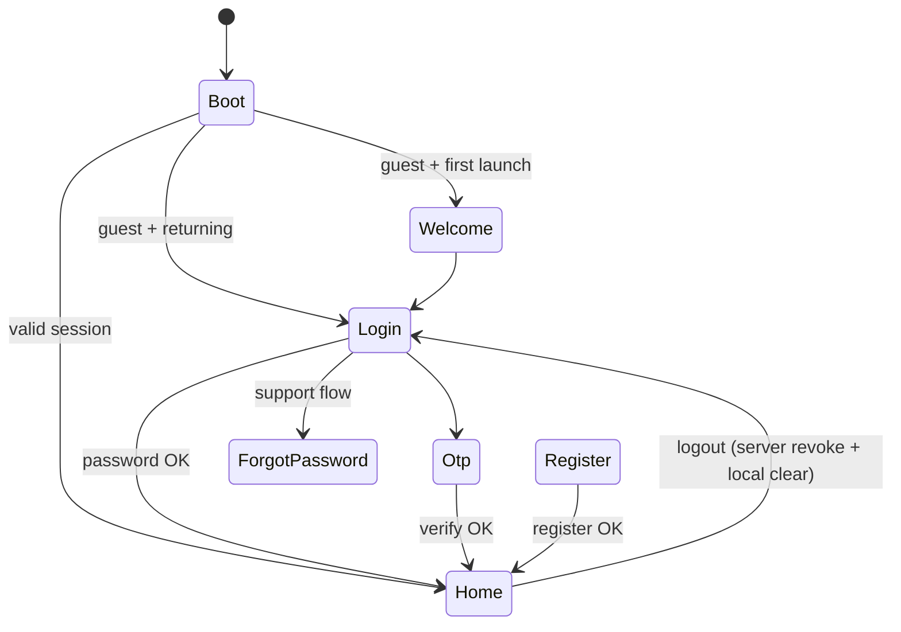

# USER_APP_02 — Auth System

**Project:** PraniDoctor User App (`pranidoctor_user`)  
**Module:** Auth System  
**Status:** COMPLETE  
**Date:** 2026-05-22

---

## Phase 1 — Audit summary

### Already complete

| Area | Status |
|------|--------|
| Welcome, Login, Register, OTP | Production-ready with real `/api/mobile/auth/*` APIs |
| Session storage | `FlutterSecureStorage` + Hive prefs |
| Token refresh | Shared helper (boot + Dio 401) |
| Auto login | Boot session restore + remember-session preference |
| Route guards | go_router redirects for auth/public routes |
| Post-auth routing | `/api/mobile/me` → home or profile setup |
| Forgot password (support) | Support-call UI when no reset API |
| Social login hooks | Stub provider; UI hidden when unavailable |

### Gaps identified

| Priority | Gap | Resolution |
|----------|-----|--------------|
| P0 | No input validation (phone/password/OTP) | Add `AuthValidators` + wire to screens |
| P0 | Logout clears tokens only | Server revoke + local cache invalidation |
| P1 | No `/api/mobile/auth/logout` | Add backend compat route + web proxy |
| P1 | Home/settings use partial sign-out | Unified `performAuthLogout()` |
| P1 | Dead `rememberSessionProvider` | Remove |
| P2 | Reset password screen | Blocked — no backend API |
| P2 | Social OAuth | Blocked — stub until backend/SDK |
| P2 | Bengali l10n | Out of scope (English ready) |
| P2 | Thin integration tests | Expand validator + logout tests |

---

## Phase 2 — Implementation plan

1. **Validation** — `auth_validators.dart`; apply to login/register/OTP
2. **Logout** — `POST /api/mobile/auth/logout` (backend + web proxy + Flutter repo)
3. **Cache cleanup** — auth snapshot, profile caches on sign-out; invalidate `mobileMeProvider`
4. **Unified logout** — `auth_logout.dart` used by settings + home
5. **Forgot password UX** — link to OTP login as account recovery alternative
6. **Tests** — validators + DTO mapping
7. **Docs** — this file

### Out of scope (backend blocked)

- Reset password screen/API
- Social OAuth providers
- Bengali ARB file

---

## API mapping

| Task spec | Production path | Method | Auth |
|-----------|-----------------|--------|------|
| `auth/login` | `/api/mobile/auth/login` | POST | None |
| `auth/register` | `/api/mobile/auth/register` | POST | None |
| `auth/otp` (request) | `/api/mobile/auth/otp/request` | POST | None |
| `auth/verify-otp` | `/api/mobile/auth/otp/verify` | POST | None |
| `auth/refresh` | `/api/mobile/auth/refresh` | POST | Body token |
| **logout** | `/api/mobile/auth/logout` | POST | Bearer |
| `auth/me` | `/api/mobile/me` | GET | Bearer |
| `app/config` | `/api/mobile/app-config` | GET | None |

### Not available

| Feature | Status |
|---------|--------|
| Forgot password API | Use support phone + OTP login alternative |
| Reset password API | No screen until backend exists |
| Social login API | Stub client; buttons hidden |

---

## State flow



---

## Verification

```bash
cd pranidoctor_user
flutter pub get
flutter gen-l10n
dart analyze lib/features/auth
flutter test test/auth/auth_integration_test.dart
```

### Manual checklist

1. First install → Welcome → Login
2. OTP: invalid phone → validation error
3. OTP: send → resend countdown → verify
4. Password login: wrong password → API error banner
5. Register: weak password → validation error
6. Register success → profile setup or home
7. Uncheck “Stay signed in” → cold start → login
8. Sign out → tokens cleared, profile cache cleared, lands on login
9. Forgot password → support call or OTP alternative link
10. 401 on dashboard → sign out → login redirect

---

## Remaining blockers

| Blocker | Risk | Mitigation |
|---------|------|------------|
| No reset-password API | Users cannot self-reset password | Support phone + OTP login path |
| Social OAuth not implemented | No Google/Facebook sign-in | Hidden until backend ready |
| English-only l10n | BN users see English auth strings | Future `app_bn.arb` pass |
| Register ignores device fields in API | Push registered post-auth | `NotificationCoordinator` handles push |

---

## Risks

- **Logout API failure offline:** Local sign-out always proceeds (best-effort server revoke).
- **Cached profile after logout:** Explicit cache delete + provider invalidation prevents stale UI.
- **OTP offline cache:** Resend cooldown may use cached state when offline (intentional UX).
